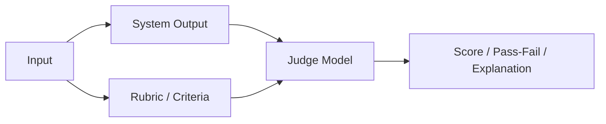

---
tags:
  - evals
  - llm-as-judge
type: note
status: draft
source: "OpenAI Evals Guide · OpenAI Evaluation Best Practices"
parent_note: "[[Evals - MOC]]"
---

# Evals - LLM-as-Judge

## Summary

LLM-as-judge ช่วย scale evaluation ได้เร็ว แต่ต้องระวัง bias, instability, และเกณฑ์ตัดสินที่ไม่ชัด

---

## Scope

- rubric-based judging
- consistency concerns
- pairwise comparison
- calibration
- when human review is still needed

---

## LLM-as-Judge คืออะไร

LLM-as-judge คือการใช้โมเดลอีกตัวหรือ grader model มาประเมิน output ของระบบตาม rubric ที่กำหนด

OpenAI evals docs รองรับ graders หลายแบบ และการนิยาม `testing_criteria` เพื่อให้ grader ประเมิน sample outputs ตามเกณฑ์ที่กำหนด

---

## Rubric-Based Judging

LLM-as-judge จะมีประโยชน์เมื่อ rubric ชัด เช่น:
- groundedness
- harmfulness
- completeness
- style adherence
- pairwise preference

ถ้า rubric คลุมเครือ grader ก็จะผันผวนตาม

หลักการสำคัญ:
- judge ต้องถูกบังคับให้อ่าน criteria ก่อน
- output format ของ judge ควร structured
- pass/fail หรือ score ต้องมีคำอธิบายได้

---

## Pairwise Comparison

pairwise judging ใช้เมื่อ:
- compare prompt A vs B
- compare model A vs B
- compare system version เก่า vs ใหม่

OpenAI best practices ระบุว่าการเปรียบเทียบแบบ pairwise มักช่วยลดปัญหาการ scale absolute scoring บางประเภท

เหมาะกับ:
- subjective quality
- ranking between alternatives
- iterative optimization

---

## Consistency Concerns

LLM-as-judge มีปัญหาสำคัญคือความไม่นิ่ง:
- prompt sensitivity
- order effects
- verbosity bias
- self-preference bias
- inconsistency across runs

ดังนั้นไม่ควรมอง judge output เป็น truth แบบตรงไปตรงมา

---

## Calibration

calibration คือการทำให้ judge เชื่อถือได้มากขึ้น เช่น:
- ใช้ gold examples
- ใช้ anchor samples
- ตรวจ agreement กับ human review
- freeze rubric wording
- ใช้ structured outputs

ถ้าไม่ calibrate:
- score จะดูเนียนแต่ใช้ตัดสินการเปลี่ยนแปลงจริงไม่ได้

---

## เมื่อไร Human Review ยังจำเป็น

human review ยังสำคัญเมื่อ:
- rubric ยังไม่เสถียร
- task ซับซ้อนหรือ high stakes
- ต้องตรวจ nuanced reasoning
- ต้องวัด UX / usefulness เชิงลึก
- judge disagreement สูง

LLM-as-judge ควรถูกมองเป็น accelerator ไม่ใช่ replacement ของ human review ทุกกรณี

---

## Failure Modes

### 1. Judge Bias

grader เอนเอียงไปหา style หรือ verbosity บางแบบ

### 2. Rubric Ambiguity

criteria ไม่ชัด ทำให้คะแนนเหวี่ยง

### 3. Over-Automation

ใช้ judge แทน human review ในงานที่ยังไม่ควร

### 4. Hidden Instability

คะแนนดูนิ่งแต่จริง ๆ เปลี่ยนตาม prompt เล็กน้อย

---

## Design Rules

- ใช้ LLM-as-judge เมื่อ criteria ค่อนข้างชัดแล้ว
- prefer structured grading outputs
- calibrate กับ human judgments เสมอ
- ใช้ pairwise eval เมื่อ absolute scoring ไม่นิ่ง
- อย่าใช้ judge ตัวเดียวตัดสินทุกอย่างโดยไม่มี spot checks

---

## ความสัมพันธ์กับโน้ตอื่น

- [[02 AI Systems/Evals/Core/01 - Success Criteria]] — rubric ต้องเริ่มจาก success criteria
- [[02 AI Systems/Evals/Application/06 - Prompt Evals]] — prompt evals ใช้ judge ได้บ่อย
- [[02 AI Systems/Evals/Application/08 - Agent Evals]] — agent evals มักใช้ judge คู่กับ trace grading
- [[02 AI Systems/RAG/Evaluation/08 - Evaluation]] — groundedness grading ใช้ judge ได้
- [[Evals - MOC]]

---

## Related Notes

- [[02 AI Systems/Evals/Core/01 - Success Criteria]]
- [[Evals - MOC]]

---

## Official References

- OpenAI Evals Guide: https://platform.openai.com/docs/guides/evals
- OpenAI Evaluation Best Practices: https://platform.openai.com/docs/guides/evaluation-best-practices
- OpenAI Evals API Reference: https://platform.openai.com/docs/api-reference/evals
