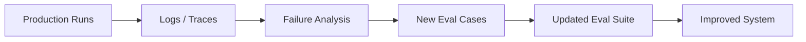

---
tags:
  - evals
  - observability
  - feedbackloops
type: note
status: evergreen
source: "OpenAI Evaluation Best Practices · OpenAI Trace Grading"
parent_note: "[[Evals - MOC]]"
---

# Evals - Observability and Feedback Loops

## Summary

evals ที่ดีไม่ควรจบแค่การรัน benchmark เป็นครั้งคราว แต่ต้องเชื่อมกับ observability และ feedback loops เพื่อให้ระบบเรียนรู้จาก production behavior จริง

---

## Scope

- logs and traces
- production feedback
- trace grading
- eval flywheel
- growing the eval set

---

## ทำไม Observability สำคัญกับ Evals

OpenAI evaluation best practices ระบุชัดว่า:
- log everything
- monitor your app to identify new cases of nondeterminism
- grow the eval set over time

นั่นหมายความว่า eval suite ที่ดีต้องถูก feed จาก production reality ไม่ใช่สร้างครั้งเดียวจากสมมติฐานของทีม

---

## Logs, Traces, and Feedback

สิ่งที่ควรสังเกตในระบบจริง:
- failed outputs
- user dissatisfaction
- strange trajectories
- tool misuse
- latency spikes
- repeated retries

trace-level observability สำคัญมากใน agent systems เพราะ final answer อย่างเดียวไม่พอจะอธิบายว่าเกิดอะไรขึ้น

---

## Trace Grading

OpenAI trace grading อธิบายชัดว่า:
- trace คือ log ของ decisions, tool calls, และ workflow behavior
- graded traces ช่วยบอกว่า agent ทำถูกหรือผิดตรงไหน
- trace evals ช่วย identify regressions และ benchmark workflow-level behavior

นี่สำคัญมากเมื่อระบบมี:
- agents
- tools
- retries
- multi-step workflows

---

## Feedback Loops

feedback loops ที่ดีควรมีอย่างน้อย:

1. เก็บ production signals
2. วิเคราะห์ failure patterns
3. เพิ่ม cases เข้า eval set
4. รัน regression / benchmark ใหม่
5. ปรับ prompt / tool / retrieval / orchestration

นี่คือ eval flywheel ที่ทำให้ระบบดีขึ้นแบบต่อเนื่อง

---

## Production Signals ที่มีค่า

ตัวอย่าง signals:
- thumbs down / user dissatisfaction
- manual escalation
- policy violations
- unsupported claims
- malformed outputs
- tool call errors
- abnormal latency

สิ่งเหล่านี้ไม่ควรถูกมองเป็นแค่ incident แต่ควรถูกแปลงเป็น eval assets ด้วย

---

## Growing the Eval Set

OpenAI best practices แนะนำให้ eval set โตตามระบบจริง  
หลักสำคัญคือ:
- เพิ่ม prior failures
- เพิ่ม new edge cases
- เก็บ adversarial patterns
- keep representative distribution

ถ้าไม่ทำแบบนี้ eval suite จะล้าหลัง product จริงเรื่อย ๆ

---

## Failure Modes

### 1. No Logging Discipline

ไม่มี raw material สำหรับสร้าง eval cases ใหม่

### 2. Observability Without Action

มี logs เยอะ แต่ไม่เคยแปลงเป็น benchmark หรือ regression cases

### 3. No Workflow Visibility

เห็นแต่ final outputs ไม่เห็น trajectory

### 4. Static Eval Suite

ระบบเปลี่ยน แต่ eval set ไม่โต

---

## Design Rules

- log และ trace ให้เพียงพอสำหรับ error analysis
- แปลง production failures เป็น eval cases อย่างสม่ำเสมอ
- ใช้ trace grading กับ workflow/agent systems
- ทำ feedback loop ให้สั้นพอจะ iterate ได้จริง
- อย่าแยก observability ออกจาก evaluation strategy

---

## ความสัมพันธ์กับโน้ตอื่น

- [[02 AI Systems/Evals/Core/05 - Regression Testing]] — feedback loops ควร feed เข้า regression suite
- [[02 AI Systems/Evals/Core/02 - Benchmark Design]] — production failures ควรเพิ่มเข้า benchmark
- [[02 AI Systems/Evals/Application/08 - Agent Evals]] — agent systems ได้ประโยชน์จาก trace observability มาก
- [[02 AI Systems/Evals/Core/03 - LLM-as-Judge]] — judge outputs ควรถูก monitor และ calibrate
- [[Evals - MOC]]

---

## Official References

- OpenAI Evaluation Best Practices: https://platform.openai.com/docs/guides/evaluation-best-practices
- OpenAI Trace Grading: https://platform.openai.com/docs/guides/trace-grading
- OpenAI Agent Evals: https://platform.openai.com/docs/guides/agent-evals
