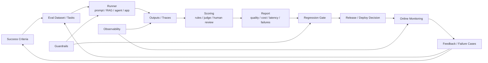

---
tags:
  - evals
  - moc
  - evaluation
type: moc
status: evergreen
source: "vault-local evals hub"
parent_note: "[[Home]]"
---

# Evals - MOC

> โครงความรู้สำหรับการประเมินคุณภาพของ prompts, RAG systems, agents, และ LLM applications

---

## Scope

หมวดนี้ครอบคลุมทั้ง offline evals, online evals, human review, failure analysis, regression detection, และ success criteria

หมวดนี้เป็น canonical home ของ evaluation layer  
ถ้าพูดถึง policy / permission / fallback ให้ไป `Guardrails - MOC` แทน
ถ้าเป็นเรื่อง output restriction, validation, incident response, หรือ approval gate ให้ไป `Guardrails - MOC` ก่อน แล้วค่อยใช้ evals เป็น measurement layer

กติกาการอ่าน:
- ไฟล์ที่มีเลข `01, 02, 03...` คือ core learning path
- ไฟล์ที่ไม่มีเลขคือหัวข้อเสริมหรือหัวข้อที่ยังรอแตกเพิ่ม

---

## Evaluation Lifecycle

ภาพนี้วาง evals เป็น lifecycle ตั้งแต่ criteria, dataset, runner, scoring, regression gate ไปจนถึง monitoring และ feedback loop ไม่ใช่แค่ benchmark ครั้งเดียว จุดเชื่อมสำคัญคือ guardrails ใช้ evals เป็น measurement layer และ observability ทำให้ failure cases กลับมาเป็น regression tests ได้.

---

## Notes Map

- [[02 AI Systems/Evals/Core/01 - Success Criteria|Eval basics and success criteria]]
- [[02 AI Systems/Evals/Core/02 - Benchmark Design|Benchmark design]]
- [[02 AI Systems/Evals/Core/03 - LLM-as-Judge|LLM-as-judge]]
- [[02 AI Systems/Evals/Core/04 - Human Evaluation|Human evaluation]]
- [[02 AI Systems/Evals/Core/05 - Regression Testing|Regression testing]]
- [[02 AI Systems/Evals/Application/06 - Prompt Evals|Prompt evals]]
- [[02 AI Systems/Evals/Application/07 - RAG Evals|RAG evals]]
- [[02 AI Systems/Evals/Application/08 - Agent Evals|Agent evals]]
- [[02 AI Systems/Evals/Application/09 - Multi-Agent Evals|Multi-agent evals]]
- [[02 AI Systems/Evals/Core/09 - Observability and Feedback Loops|Observability and feedback loops]]

---

## Related Notes

- [[01 Foundations/Prompt Engineering/Core/05 - Evaluation และ Failure Modes]]
- [[01 Foundations/Prompt Engineering/Core/06 - Template และ Common Problems]]
- [[01 Foundations/LLM Foundations/Core/05 - ข้อจำกัดและการประเมินผล LLM]]
- [[01 Foundations/LLM Foundations/Core/13 - Evaluation Foundations]]
- [[02 AI Systems/RAG/RAG - MOC]]
- [[02 AI Systems/AI Agent Fundamentals/AI Agent Fundamentals - MOC]]
- [[02 AI Systems/Guardrails/Guardrails - MOC]]
- [[02 AI Systems/Memory Systems/Memory Systems - MOC]]
- [[02 AI Systems/Agent Frameworks/Agent Frameworks - MOC]]
- [[05 Use Cases/Application/Use Cases - Improve Prompt Reliability]]
- [[05 Use Cases/Application/Use Cases - Evaluate an AI Agent]]
- [[04 Synthesis/Bridge/Synthesis - Safety, Reliability, and Evals]]

---

## Learning Path

### 1. Foundations Before Evals

1. [[01 Foundations/Prompt Engineering/Core/05 - Evaluation และ Failure Modes]]
2. [[01 Foundations/LLM Foundations/Core/05 - ข้อจำกัดและการประเมินผล LLM]]
3. [[01 Foundations/LLM Foundations/Core/13 - Evaluation Foundations]]

### 2. Core Eval Concepts

1. [[02 AI Systems/Evals/Core/01 - Success Criteria]]
2. [[02 AI Systems/Evals/Core/02 - Benchmark Design]]
3. [[02 AI Systems/Evals/Core/03 - LLM-as-Judge]]
4. [[02 AI Systems/Evals/Core/04 - Human Evaluation]]
5. [[02 AI Systems/Evals/Core/05 - Regression Testing]]

### 3. Apply Evals to Systems

1. [[02 AI Systems/Evals/Application/06 - Prompt Evals]]
2. [[02 AI Systems/Evals/Application/07 - RAG Evals]]
3. [[02 AI Systems/Evals/Application/08 - Agent Evals]]
4. [[02 AI Systems/Evals/Application/09 - Multi-Agent Evals]]

### 4. Operational Evals

1. [[02 AI Systems/Evals/Core/09 - Observability and Feedback Loops]]

### 5. Cross-System Applications

1. [[02 AI Systems/RAG/RAG - MOC]]
2. [[02 AI Systems/AI Agent Fundamentals/AI Agent Fundamentals - MOC]]
3. [[02 AI Systems/Guardrails/Guardrails - MOC]]
4. [[02 AI Systems/Memory Systems/Memory Systems - MOC]]
5. [[02 AI Systems/Agent Frameworks/Agent Frameworks - MOC]]
6. [[02 AI Systems/Evals/Application/09 - Multi-Agent Evals]]
7. [[05 Use Cases/Application/Use Cases - Evaluate an AI Agent]]

### 6. Use Case

1. [[05 Use Cases/Application/Use Cases - Improve Prompt Reliability]]
2. [[05 Use Cases/Application/Use Cases - Evaluate an AI Agent]]

---

## Implementation Bridge

- [[06 Engineering/README]]
- [[06 Engineering/Evals/Evals - MOC]]
- [[Knowledge Topic Registry]]

## Next Notes To Create

- Multi-agent eval rubrics for handoff correctness and trace quality
