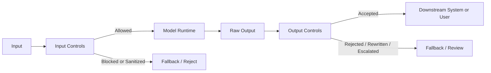
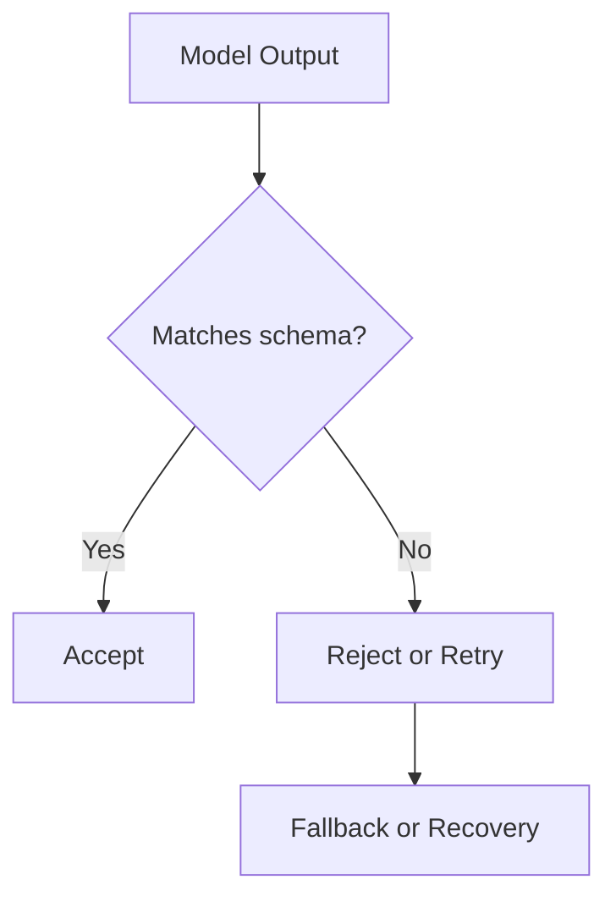
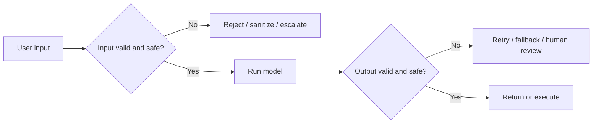

---
tags:
  - guardrails
  - validation
type: note
status: draft
source: "OpenAI Structured Outputs and Moderation Docs · OpenAI Safety Best Practices · Azure AI Content Safety Docs"
parent_note: "[[Guardrails - MOC]]"
---

# Guardrails - Input and Output Controls

## Summary

guardrails ชั้นต้นสุดคือควบคุมสิ่งที่รับเข้าและสิ่งที่ปล่อยออก เพื่อกัน invalid input, unsafe output, prompt attacks, และ format drift ก่อนที่ปัญหาจะไหลไปถึง tools, users, หรือ downstream systems

---

## Scope

- input validation
- output schema enforcement
- content filtering
- fallback responses
- format constraints

---

## ทำไม input/output controls เป็น guardrails ชั้นแรก

ก่อนจะคุม tool safety, permissions, หรือ incident handling ระบบต้องตอบให้ได้ก่อนว่า:
- รับอะไรเข้ามาได้
- รูปแบบไหนถือว่า valid
- อะไรควรถูกบล็อกหรือ redirect
- output แบบไหนถือว่าใช้ต่อได้จริง

OpenAI structured outputs docs เน้นเรื่อง schema adherence สำหรับ output reliability  
OpenAI moderation docs และ safety best practices เน้นการคัดกรอง harmful content และ adversarial input  
Azure AI Content Safety เพิ่มมุมของ:
- content moderation
- prompt attack / document attack detection
- groundedness detection
- task adherence

ดังนั้น input/output controls คือด่านแรกที่แยก:
- valid vs invalid
- safe vs unsafe
- structured vs malformed
- allowed vs disallowed

---

## Input Controls

input controls คือชั้นที่ตรวจ input ก่อนเข้าระบบหลัก

### เป้าหมายหลัก

- กัน malformed input
- กัน unsafe content
- กัน prompt injection / jailbreak attempts
- แยก input ที่ควรไป human review
- normalize input ให้อยู่ในรูปที่ระบบคาดหวัง

### Input Controls ที่พบบ่อย

- basic validation เช่น length, type, required fields
- policy filtering
- moderation
- prompt attack detection
- document attack detection
- allowed-format enforcement

Azure AI Content Safety ระบุชัดว่า Prompt Shields ใช้ตรวจ:
- User Prompt attacks
- Document attacks

นั่นทำให้ input controls ไม่ใช่แค่ regex หรือ schema checks แต่รวมถึง adversarial-input defense ด้วย

---

## Output Controls

output controls คือชั้นที่ตรวจว่า output ของ model “ใช้ต่อได้หรือยัง”

### เป้าหมายหลัก

- กัน unsafe output
- กัน malformed output
- กัน hallucinated structure
- กัน output ที่ทำ downstream พัง
- กัน output ที่ไม่อยู่ใน operational boundary

### Output Controls ที่พบบ่อย

- schema enforcement
- moderation of generated content
- output validation
- groundedness checks
- task adherence checks
- policy-based refusal or fallback

OpenAI structured outputs docs ทำให้เห็นชัดว่าการใช้ JSON schema ไม่ใช่แค่ convenience แต่เป็น guardrail สำหรับ downstream reliability ด้วย

---

## ชั้นของ Input Control

### 1. Syntactic Validation

ตรวจว่า input มาในรูปแบบที่ระบบรองรับหรือไม่ เช่น:
- field ครบไหม
- type ถูกไหม
- length เกิน limit หรือไม่
- attachment format ถูกหรือไม่

ชั้นนี้กันระบบพังจาก input ที่ malformed ก่อนเลย

### 2. Policy and Safety Screening

ตรวจว่า input ผิด policy หรือเสี่ยง harmful content หรือไม่

OpenAI moderation docs และ Azure Content Safety docs รองรับ use case นี้ชัดเจน

### 3. Prompt Attack Screening

ตรวจว่า input พยายาม override instructions หรือบังคับ model ให้หลุดขอบเขตหรือไม่

Azure Prompt Shields ช่วยย้ำว่าต้องมองทั้ง:
- user prompt attacks
- document attacks

### 4. Normalization

ทำ input ให้อยู่ในรูปที่ระบบจัดการง่าย เช่น:
- trimming
- canonicalization
- language routing
- document preprocessing

---

## ชั้นของ Output Control

### 1. Format Guardrails

ชั้นนี้คุมว่า output ต้องอยู่ในโครงที่ downstream รับได้

ตัวอย่าง:
- JSON schema
- enums
- required fields
- no free-form spillover

OpenAI structured outputs docs ระบุชัดเรื่อง schema adherence และ explicit refusals ที่ตรวจจับแบบ programmatic ได้

### 2. Safety Guardrails

ชั้นนี้คุมว่า output ไม่ harmful หรือไม่ละเมิด policy

ตัวอย่าง:
- moderation on generated content
- refusal for disallowed content
- redaction

### 3. Quality and Grounding Guardrails

ชั้นนี้คุมว่า output มีความน่าเชื่อถือพอไหม

ตัวอย่าง:
- groundedness detection
- citation checks
- evidence presence
- task adherence

Azure AI Content Safety overview ระบุ groundedness detection และ task adherence เป็นความสามารถแยกชัดเจน

---

## Structured Outputs เป็น Guardrail

structured outputs ไม่ใช่แค่ formatting feature แต่เป็น output guardrail แบบหนึ่ง

มันช่วยเรื่อง:
- type safety
- schema reliability
- explicit refusals
- simpler downstream parsing

ถ้า output จะถูกส่งต่อไป:
- tool calls
- databases
- automations
- UI renderers

การมี schema enforcement จะลด failure propagation ได้มาก

---

## Moderation เป็น Guardrail

moderation คุมทั้ง input และ output ได้

OpenAI moderation docs ระบุว่า moderation endpoint ใช้ตรวจ text และ image content เพื่อดูว่า potentially harmful หรือไม่  
OpenAI safety best practices ก็แนะนำให้ใช้ moderation ร่วมกับ human oversight และ adversarial testing

moderation เหมาะกับ:
- public user inputs
- generated user-facing outputs
- multimodal applications

แต่ moderation ไม่ได้แทน:
- schema validation
- prompt attack detection
- groundedness checks

ดังนั้น moderation เป็นหนึ่งใน controls ไม่ใช่ control เดียว

---

## Attack-Aware Controls

input/output controls ที่ดีต้องแยก:
- content ที่ harmful
- content ที่ adversarial
- output ที่ไม่ grounded
- actions ที่ไม่สอดคล้องกับ task

ถ้าต้องการดูเรื่องนี้แบบเฉพาะทาง ให้ดู [[Guardrails - Prompt Injection and Content Attacks]] ซึ่งแยก:
- user prompt attacks vs document attacks
- groundedness
- task adherence
- downstream blocking / escalation

---

## Common Control Patterns

### Pattern 1: Validate -> Run -> Validate

- ตรวจ input ก่อน
- รัน model
- ตรวจ output หลัง

เป็น pattern พื้นฐานที่สุดและควรมีแทบทุกระบบ

### Pattern 2: Block -> Rewrite -> Retry

ใช้เมื่อ input หรือ output เกือบใช้ได้แต่ต้อง sanitize ก่อน

### Pattern 3: Reject -> Fallback

ใช้เมื่อไม่ควรดำเนินการต่อ เช่น unsafe request หรือ malformed output สำคัญ

### Pattern 4: Escalate -> Human Review

ใช้ในงานเสี่ยงสูงหรือกรณี confidence ต่ำ

---

## Failure Modes

### 1. Validate Only Inputs

กัน input ดี แต่ปล่อย malformed หรือ unsafe outputs ออกไป

### 2. Validate Only Structure

ได้ JSON สวย แต่เนื้อหายัง harmful หรือ hallucinated

### 3. Treat Moderation as Complete Guardrail

moderation ผ่าน แต่ยังมี prompt attack, groundedness issue, หรือ task misuse

### 4. Overblocking

controls เข้มเกินไปจน usability พัง

### 5. Underblocking

controls อ่อนเกินไปจน unsafe content หรือ malformed actions หลุดออกไป

### 6. Missing Document Attack Defense

กันเฉพาะ user prompt แต่ไม่กัน adversarial documents

---

## Design Rules

- แยก input controls กับ output controls ให้ชัด
- ใช้หลายชั้นร่วมกัน: validation, moderation, attack screening, schema enforcement
- อย่าคิดว่า schema correctness = semantic correctness
- อย่าคิดว่า moderation = complete safety
- ถ้าระบบใช้ documents หรือ RAG ให้คิดเรื่อง document attacks ตั้งแต่ต้น
- ถ้า output ไปต่อ tool หรือ automation ต้องมี output contract ชัด

---

## ความสัมพันธ์กับโน้ตอื่น

- [[01 Foundations/Prompt Engineering/07 - Structured Generation และ Output Formats]] — output contracts และ schema enforcement
- [[Guardrails - Prompt Injection and Content Attacks]] — adversarial inputs, document attacks, groundedness, และ task adherence
- [[02 AI Systems/Guardrails/Core/03 - Tool Safety]] — output ที่จะไปเรียก tools ต้องมีกติกาเพิ่ม
- [[02 AI Systems/Guardrails/Core/05 - Fallback Policies]] — เมื่อ controls ไม่ผ่านควรไปทางไหน
- [[02 AI Systems/RAG/Core/07 - Grounding and Citation]] — groundedness และ evidence checks
- [[02 AI Systems/Evals/Application/06 - Prompt Evals]] — ใช้ evals ทดสอบ controls
- [[Guardrails - MOC]]

---

## Related Notes

- [[01 Foundations/Prompt Engineering/07 - Structured Generation และ Output Formats]]
- [[Guardrails - Prompt Injection and Content Attacks]]
- [[02 AI Systems/RAG/Core/07 - Grounding and Citation]]
- [[Guardrails - MOC]]

---

## Official References

- OpenAI - Structured Outputs: https://platform.openai.com/docs/guides/structured-outputs
- OpenAI - Moderation: https://platform.openai.com/docs/guides/moderation
- OpenAI - Safety Best Practices: https://platform.openai.com/docs/guides/safety-best-practices
- Azure AI Content Safety Overview: https://learn.microsoft.com/en-us/azure/ai-services/content-safety/overview
- Azure AI Content Safety - Prompt Shields: https://learn.microsoft.com/en-us/azure/ai-services/content-safety/concepts/jailbreak-detection
