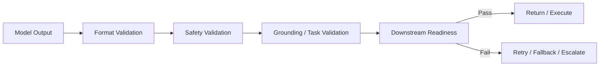
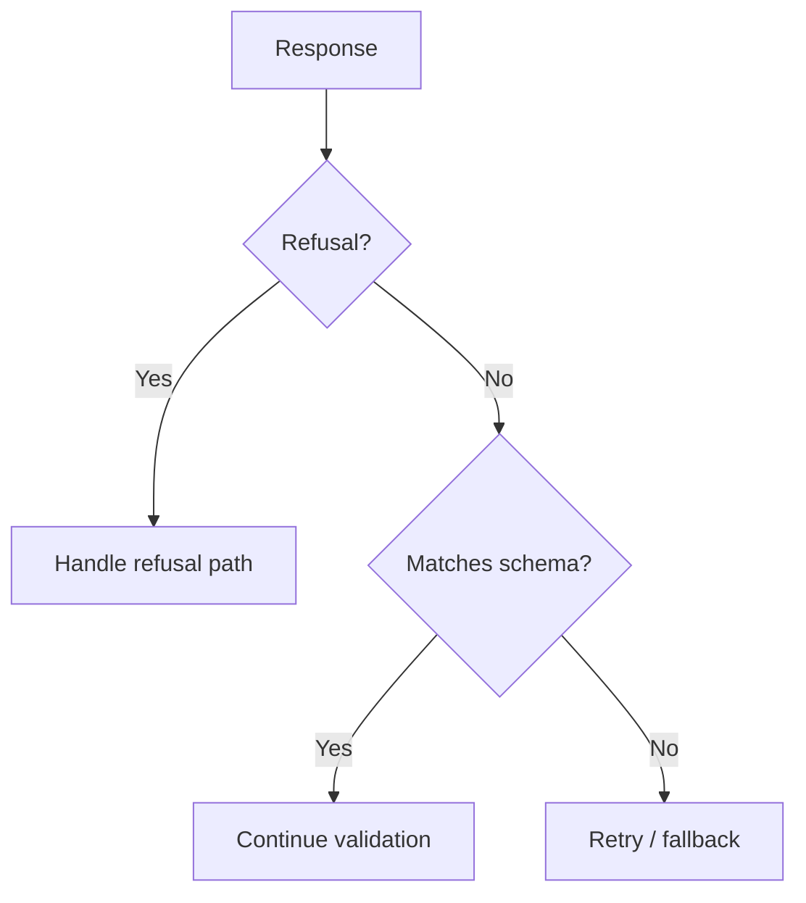

---
tags:
  - guardrails
  - validation
  - outputs
type: note
status: draft
source: "OpenAI Structured Outputs Docs · OpenAI Safety Best Practices · Azure AI Content Safety Groundedness Docs"
parent_note: "[[Guardrails - MOC]]"
---

# Guardrails - Output Validation

## Summary

output validation คือชั้นตรวจสอบว่าผลลัพธ์ของ model “พร้อมใช้จริงหรือยัง” ไม่ใช่แค่ parse ได้ แต่ต้องผ่านทั้งเรื่องโครงสร้าง ความสมบูรณ์ ความปลอดภัย และความน่าเชื่อถือก่อนส่งต่อให้ user, tool, หรือระบบ downstream

---

## Scope

- schema validation
- semantic validation
- groundedness checks
- refusal handling
- downstream readiness

---

## ทำไม output validation ต้องแยกเป็นโน้ตเฉพาะ

structured outputs ช่วยเรื่อง schema adherence แต่ไม่เพียงพอสำหรับทุก use case  
OpenAI docs ระบุชัดว่า Structured Outputs ช่วยเรื่อง:
- reliable type-safety
- explicit refusals
- simpler downstream parsing

แต่ OpenAI docs ก็ระบุด้วยว่า structured outputs ยัง “contain mistakes” ได้  
Azure groundedness detection docs ก็ชี้ว่า response อาจยังไม่ grounded แม้จะดูเป็นระเบียบและตอบตรง task

ดังนั้น output validation ต้องมองอย่างน้อย 4 ชั้น:
- format correctness
- semantic correctness
- policy safety
- downstream readiness

---

## ชั้นของ Output Validation

### 1. Format Validation

ตรวจว่า output:
- parse ได้
- match schema
- required fields ครบ
- enums / types ถูก

ชั้นนี้คือฐานสุดและควรมีเมื่อ output ไปสู่:
- tools
- APIs
- workflows
- storage

### 2. Safety Validation

ตรวจว่า output:
- ไม่ละเมิด policy
- ไม่ harmful
- ไม่มี content ที่ควรถูก refuse หรือ redact

### 3. Grounding and Task Validation

ตรวจว่า output:
- grounded กับแหล่งข้อมูลหรือไม่
- ทำตาม task ที่กำหนดหรือไม่
- ไม่ hallucinate beyond evidence

Azure AI Content Safety ระบุทั้ง groundedness detection และ task adherence ซึ่งชี้ชัดว่าความ “ถูก format” กับความ “ควรใช้จริง” เป็นคนละเรื่อง

### 4. Downstream Readiness

ตรวจว่า output:
- พร้อม execute หรือไม่
- ต้อง human review ก่อนหรือไม่
- ต้อง fallback หรือ retry หรือไม่

---

## Structured Outputs ไม่เท่ากับ Output Validation ทั้งหมด

OpenAI Structured Outputs ช่วยคุม schema ได้ดีมาก แต่ไม่ได้การันตีว่า:
- เนื้อหาข้างในถูก
- ข้อมูล grounded
- action ปลอดภัย
- policy ผ่าน

ดังนั้นระบบที่ดีควรมอง structured outputs เป็น “ชั้นแรก” ของ output validation ไม่ใช่ทั้งหมด

---

## Refusals ก็เป็นส่วนหนึ่งของ Output Validation

OpenAI docs ระบุว่าเมื่อใช้ Structured Outputs กับ user-generated input อาจมี `refusal` field โผล่มาแทน schema response ปกติ

แปลว่า validation ที่ดีต้องรองรับ 2 path:
- valid structured answer
- explicit refusal path

ถ้าระบบ assume ว่าทุก output ต้องเข้า schema อย่างเดียว จะพังตอนเจอ valid refusal

---

## Semantic Validation

แม้ schema ถูก ก็ยังอาจมี semantic errors ได้ เช่น:
- value technically valid but wrong for the situation
- field ครบแต่ meaning ผิด
- action type ถูกแต่ target ผิด

semantic validation มักใช้:
- business rules
- policy rules
- cross-field checks
- bounded domain logic

ตัวอย่าง:
- date format ถูก แต่ end date < start date
- action เป็น `delete` ถูก schema แต่ target ไม่อยู่ใน allowed scope
- answer มี citation field แต่ cite document ที่ไม่เกี่ยว

---

## Groundedness Validation

สำหรับ systems ที่ใช้ retrieval, documents, หรือ citations  
output validation ควรมี groundedness check ด้วย

Azure groundedness detection docs ระบุชัดว่ามันช่วยตรวจว่าคำตอบอยู่บน source material ที่ให้มาหรือไม่

นี่สำคัญสำหรับ:
- RAG
- summarization
- evidence-based answers
- enterprise assistants

ถ้า groundedness ต่ำ อาจต้อง:
- abstain
- retry with narrower context
- ask user for clarification
- escalate

---

## Task Adherence

บาง output ปลอดภัยและ grounded แต่ยัง “ไม่ตรง task”

ตัวอย่าง:
- ผู้ใช้ขอ table แต่ระบบตอบ essay
- ผู้ใช้ขอ compare options แต่ระบบสรุปด้านเดียว
- task เป็น extraction แต่ output กลายเป็น commentary

Azure AI Content Safety overview ระบุ task adherence เป็น capability แยก ซึ่งช่วยย้ำว่า “doing the right task” เป็น validation dimension ของมันเอง

---

## Output Validation Patterns

### Pattern 1: Parse -> Validate -> Use

เหมาะกับ structured outputs ทั่วไป

### Pattern 2: Validate -> Retry with Constraints

ใช้เมื่อ output fail เพราะ format or minor semantic issue

### Pattern 3: Validate -> Refuse / Abstain

ใช้เมื่อ groundedness ต่ำหรือ safety ไม่ผ่าน

### Pattern 4: Validate -> Human Review

ใช้กับ high-impact outputs หรือ ambiguous cases

---

## Failure Modes

### 1. Validate Only JSON Shape

schema ผ่าน แต่เนื้อหายังผิด

### 2. Ignore Refusal Path

ระบบพังเมื่อ model ปฏิเสธอย่างถูกต้อง

### 3. No Grounding Checks

output ดูดีแต่ fabricate

### 4. No Task-Adherence Checks

output ปลอดภัยแต่ไม่ตอบโจทย์

### 5. Downstream Executes Too Early

ยังไม่ผ่าน validation ครบแต่ถูกส่งต่อไป tool หรือ automation แล้ว

---

## Design Rules

- treat schema validation as necessary but not sufficient
- รองรับ refusal เป็น valid output path
- แยก format, safety, grounding, และ task checks ออกจากกัน
- ถ้า output มีผลต่อ state change ให้ validate เข้มกว่า user-facing text ทั่วไป
- ผูก output validation เข้ากับ fallback policy เสมอ

---

## ความสัมพันธ์กับโน้ตอื่น

- [[02 AI Systems/Guardrails/Core/01 - Input and Output Controls]] — guardrails ชั้นแรกของ output path
- [[01 Foundations/Prompt Engineering/07 - Structured Generation และ Output Formats]] — schema และ structured outputs
- [[02 AI Systems/RAG/Core/07 - Grounding and Citation]] — groundedness และ citations
- [[02 AI Systems/Guardrails/Core/05 - Fallback Policies]] — เมื่อ validation ไม่ผ่านควรทำอะไรต่อ
- [[02 AI Systems/Evals/Application/06 - Prompt Evals]] — ทดสอบ output validation paths
- [[Guardrails - MOC]]

---

## Related Notes

- [[01 Foundations/Prompt Engineering/07 - Structured Generation และ Output Formats]]
- [[02 AI Systems/RAG/Core/07 - Grounding and Citation]]
- [[Guardrails - MOC]]

---

## Official References

- OpenAI - Structured Outputs: https://platform.openai.com/docs/guides/structured-outputs
- OpenAI - Safety Best Practices: https://platform.openai.com/docs/guides/safety-best-practices
- Azure AI Content Safety - Groundedness Detection: https://learn.microsoft.com/en-us/azure/ai-services/content-safety/concepts/groundedness
- Azure AI Content Safety Overview: https://learn.microsoft.com/en-us/azure/ai-services/content-safety/overview
