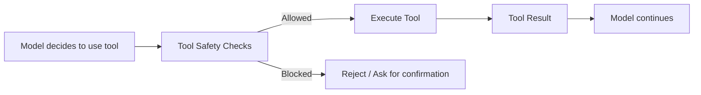
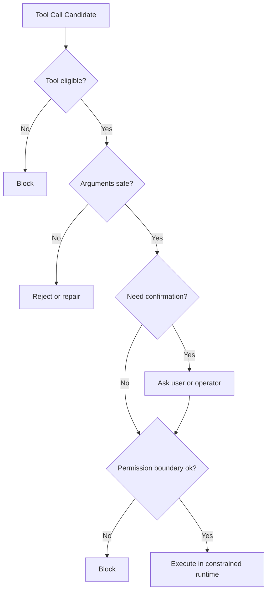
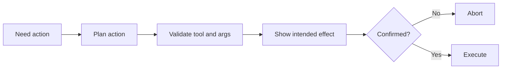

---
tags:
  - guardrails
  - tools
  - safety
type: note
status: evergreen
source: "OpenAI Tools and Function Calling Docs · OpenAI Safety Best Practices · Anthropic Tool Use Docs · MCP Authorization and Consent Concepts"
parent_note: "[[Guardrails - MOC]]"
---

# Guardrails - ความปลอดภัยในการใช้ Tools

## Summary

tool use เป็นจุดเสี่ยงสูงสุดจุดหนึ่งของ agent เพราะ output ของโมเดลสามารถกลายเป็น action จริงได้ ดังนั้น tool safety ต้องคุมทั้งการเลือก tool, arguments, permission boundary, confirmation flow, และ execution environment

---

## Scope

- allowlists / denylists
- confirmation gates
- parameter validation
- irreversible actions
- sandboxing and permissions

---

## ทำไม tool safety สำคัญ

input/output controls คุมสิ่งที่ model “พูด” แต่ tool safety คุมสิ่งที่ model “ทำ”

เมื่อ model ใช้ tools ได้ มันอาจ:
- อ่านข้อมูล
- เขียนข้อมูล
- เรียก API ภายนอก
- execute code
- trigger side effects

OpenAI tool docs แสดงให้เห็นว่าระบบสามารถใช้:
- function calling
- file search
- web search
- remote MCP

Anthropic tool use docs และ MCP security/authorization concepts ก็ชี้คล้ายกันว่าเมื่อ model มี action surface ความเสี่ยงจะขยับจาก “bad text” ไปสู่ “bad actions”

---

## ความเสี่ยงหลักของ tool use

### 1. Wrong Tool Selection

model เลือก tool ผิดกับ intent ของ task

### 2. Unsafe Arguments

tool ถูกตัว แต่ arguments ผิด, เกินขอบเขต, หรืออันตราย

### 3. Irreversible Actions

tool ทำ action ที่ยกเลิกไม่ได้ เช่น delete, purchase, publish, transfer

### 4. Over-Broad Permissions

tool มีสิทธิ์มากเกินความจำเป็น

### 5. Prompt Injection via Tool Inputs

model ถูกโน้มน้าวจาก untrusted content ให้ใช้ tool ผิดวัตถุประสงค์

### 6. Hidden Side Effects

tool ดูเหมือน read-only แต่จริง ๆ มี write effect หรือ external impact

---

## ชั้นของ Tool Safety

### 1. Tool Eligibility

ต้องกำหนดก่อนว่า task แบบไหน “มีสิทธิ์” ใช้ tool อะไรได้บ้าง

ตัวอย่าง:
- read-only assistant ใช้ search tools ได้ แต่ห้าม mutation tools
- task ที่ไม่เกี่ยวกับเงิน ห้าม payment tools
- task ที่ไม่มี trusted evidence ห้าม write tools

หลักการ:
- least privilege
- task-scoped tool access
- explicit allowed tools

### 2. Parameter Safety

แม้เลือก tool ถูก แต่ arguments ก็ยังอันตรายได้

ตัวอย่าง:
- path traversal
- dangerous shell commands
- overly broad search scope
- unsafe URLs
- invalid IDs or targets

parameter safety จึงต้องมี:
- schema validation
- enums / bounds
- argument normalization
- semantic checks against policy

### 3. Confirmation Gates

บาง action ไม่ควร execute อัตโนมัติแม้ model ตั้งใจถูก

ควรมี confirmation หรือ approval สำหรับ:
- destructive actions
- financial actions
- external publication
- sending messages/emails
- privilege escalation

OpenAI safety best practices รองรับแนวคิด human-in-the-loop สำหรับ high-impact actions

### 4. Permission Boundaries

tool safety ไม่ใช่แค่ prompt-level rule แต่ต้องมี real permission boundary

ตัวอย่าง:
- sandboxing
- API scopes
- per-tool credentials
- role-based access
- network restrictions

MCP และ system integrations ที่ดีจึงต้องให้ “runtime boundary” ไม่ใช่เชื่อใจ model อย่างเดียว

### 5. Execution Containment

ต่อให้มี permission ถูกต้อง ก็ยังควรคุม execution environment

ตัวอย่าง:
- sandbox execution
- rate limits
- timeouts
- allowed domains
- file system boundaries

---

## Allowlists, Denylists, and Tool Policies

### Allowlists

ใช้สำหรับกำหนด:
- allowed tools
- allowed actions
- allowed argument values
- allowed destinations/domains

เหมาะกับ:
- production systems
- high-trust workflows
- enterprise settings

### Denylists

ใช้ห้ามบาง actions หรือ arguments

ข้อจำกัด:
- มักพลาด edge cases
- ตาม adversarial behavior ไม่ทัน

> Design rule: tool safety ควร default ไปทาง allowlists มากกว่า denylists ถ้าระบบมีผลกระทบจริง

---

## Read-Only vs Write-Capable Tools

หนึ่งในแนวคิดสำคัญสุดคือแยก tool ตาม risk profile

### Read-Only Tools

ตัวอย่าง:
- search
- retrieval
- inspection
- listing metadata

ความเสี่ยง:
- data exposure
- prompt injection through returned content

### Write-Capable Tools

ตัวอย่าง:
- create/update/delete
- send message
- purchase
- deploy
- run code with side effects

ความเสี่ยง:
- irreversible state change
- financial loss
- security incident

ดังนั้น write-capable tools ควรมี control เข้มกว่า read-only tools เสมอ

---

## Tool Results ก็เป็น attack surface

tool safety ไม่ได้จบตอน “เรียก tool ได้ไหม” แต่ต้องคุม output ของ tool ด้วย

เหตุผล:
- tool output อาจมาจาก untrusted source
- retrieved documents อาจมี prompt injection
- external APIs อาจส่ง content ที่ชี้นำ model

ดังนั้น tool results ควรถูกมองเป็น untrusted input to the next step  
นี่เชื่อมตรงกับ document attacks และ input/output controls

---

## Common Safety Patterns

### Pattern 1: Read First, Act Later

ให้ model gather evidence ก่อน แล้วค่อย propose action

### Pattern 2: Plan -> Show -> Confirm -> Execute

เหมาะกับ high-impact actions

### Pattern 3: Dual Control

ให้ model หนึ่งตัว propose action และอีกชั้นตรวจ policy หรือ require operator approval

### Pattern 4: Dry Run Before Real Run

แสดง intended effect ก่อน execute จริง

---

## Failure Modes

### 1. Trust the Model Too Much

เชื่อว่า model จะไม่เรียก tool อันตรายเอง

### 2. Validate Only JSON Shape

arguments ผ่าน schema แต่ยัง dangerous ในเชิง semantics

### 3. No Confirmation for Irreversible Actions

ระบบทำ destructive action อัตโนมัติ

### 4. Shared Broad Credentials

ทุก tools ใช้ credential เดียวสิทธิ์กว้างเกินไป

### 5. Tool Result Injection

tool output มี content ที่ชี้นำ model ต่อโดยไม่มี screening

### 6. Read/Write Boundary Confusion

คิดว่า tool เป็น read-only แต่มี hidden side effects

---

## Design Rules

- แยก read-only และ write-capable tools ให้ชัด
- ใช้ allowlists และ explicit policies ต่อ tool class
- validate ทั้ง structure และ semantics ของ arguments
- high-impact actions ควรมี confirmation gate
- ใช้ real permission boundaries ไม่ใช่พึ่ง prompt อย่างเดียว
- มอง tool outputs เป็น untrusted input เสมอ

---

## ความสัมพันธ์กับโน้ตอื่น

- [[02 AI Systems/MCP/Security/05 - Security, Consent และ Authorization]] — ขอบเขตสิทธิ์และ consent
- [[02 AI Systems/Guardrails/Core/01 - Input and Output Controls]] — tool inputs และ tool results ต้องผ่าน controls
- [[02 AI Systems/Guardrails/Operations/04 - Permission Models]] — permission layer เชิงระบบ
- [[02 AI Systems/Guardrails/Core/05 - Fallback Policies]] — เมื่อ tool call ไม่ปลอดภัยควร fallback ยังไง
- [[02 AI Systems/MCP/14 - Tools: การออกแบบและทำงาน]] — runtime ของ tool use
- [[Guardrails - MOC]]

---

## Related Notes

- [[02 AI Systems/MCP/Security/05 - Security, Consent และ Authorization]]
- [[02 AI Systems/MCP/14 - Tools: การออกแบบและทำงาน]]
- [[Guardrails - MOC]]

---

## Official References

- OpenAI - Using Tools: https://platform.openai.com/docs/guides/tools
- OpenAI - Function Calling: https://platform.openai.com/docs/guides/function-calling
- OpenAI - Safety Best Practices: https://platform.openai.com/docs/guides/safety-best-practices
- Anthropic - Tool Use Overview: https://docs.anthropic.com/en/docs/build-with-claude/tool-use
- Model Context Protocol - Authorization: https://modelcontextprotocol.io/specification/2025-03-26/basic/authorization
- Model Context Protocol - Security and Trust & Safety: https://modelcontextprotocol.io/specification/2025-03-26/basic/security_best_practices
