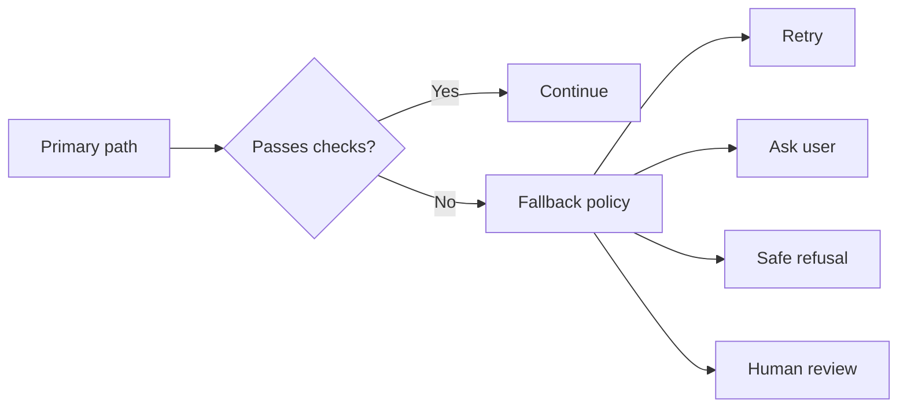
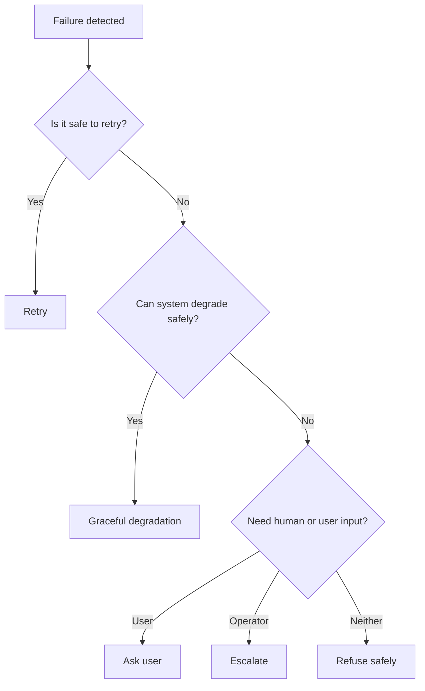

---
tags:
  - guardrails
  - fallback
type: note
status: evergreen
source: "OpenAI Safety Best Practices · OpenAI Evals and Trace Grading Docs · Azure AI Content Safety Docs"
parent_note: "[[02 AI Systems/Guardrails/Guardrails - MOC|Guardrails - MOC]]"
---

# Guardrails - Fallback Policies

## Summary

ระบบที่เชื่อถือได้ต้องกำหนด fallback ชัดเจนเมื่อ model, retrieval, tool call, หรือ validation ล้มเหลว เพื่อให้ failure ถูกจำกัดวง ไม่ลามเป็น unsafe action หรือ broken user experience

---

## Scope

- retry policies
- degrade gracefully
- abstain / ask user
- safe defaults
- escalation paths

---

## ทำไม fallback policy สำคัญ

guardrails ไม่ได้มีหน้าที่แค่ “บล็อก” แต่ต้องบอกด้วยว่าเมื่อไม่ผ่าน guardrail แล้วระบบควรทำอะไรต่อ

ตัวอย่าง:
- schema ไม่ผ่าน
- moderation ติดธง
- retrieval ไม่มั่นใจ
- tool call ถูกบล็อก
- groundedness ต่ำ

ถ้าไม่มี fallback policy ระบบจะ:
- พังเงียบ
- เดาสุ่มต่อ
- หรือ execute action แบบไม่ปลอดภัย

---

## ประเภทของ Fallback

### 1. Retry

ใช้เมื่อ failure อาจแก้ได้ในรอบถัดไป เช่น:
- malformed structured output
- transient tool error
- timeout

### 2. Degrade Gracefully

ลด capability ลงแต่ยังให้บริการได้ เช่น:
- ตอบแบบ text-only แทน tool action
- ใช้ retrieval แบบง่ายกว่า
- ใช้ cached result

### 3. Abstain or Refuse

ใช้เมื่อระบบไม่ควรเดาต่อ เช่น:
- groundedness ต่ำ
- safety risk สูง
- permission ไม่พอ

### 4. Ask User for Clarification

ใช้เมื่อขาดข้อมูลสำคัญหรือขอบเขต action ไม่ชัด

### 5. Escalate to Human Review

ใช้กับ high-impact, ambiguous, หรือ policy-sensitive cases

---

## Fallback ตาม Failure Type

### Output Format Failure

เหมาะกับ:
- retry with stricter constraints
- regenerate with reduced temperature
- return safe structured refusal

### Tool Failure

เหมาะกับ:
- retry if transient
- switch to read-only path
- ask user before alternate action

### Retrieval Failure

เหมาะกับ:
- broaden or reformulate query
- ask clarifying question
- abstain if grounding required

### Safety Failure

เหมาะกับ:
- refuse
- sanitize
- escalate

### Permission Failure

เหมาะกับ:
- ask for approval
- present dry-run plan
- stop execution

---

## Safe Defaults

fallback ที่ดีมักมี default ที่ปลอดภัยกว่า path ปกติ

ตัวอย่าง safe defaults:
- no action instead of risky action
- ask before write
- abstain instead of fabricate
- read-only mode instead of mutation mode

OpenAI safety best practices สอดคล้องกับแนวคิดนี้ผ่านการเน้น human oversight และ risk-aware deployment

---

## Retry ต้องมีขอบเขต

retry ไม่ใช่ fallback ที่ปลอดภัยเสมอไป

ถ้าไม่มีขอบเขต อาจเกิด:
- retry loops
- duplicated side effects
- hidden cost growth
- user confusion

ดังนั้น retry policy ควรกำหนด:
- max attempts
- retryable error classes
- backoff strategy
- idempotency conditions

---

## Ask User เป็น fallback ที่สำคัญ

หลายกรณีระบบไม่ควรตัดสินใจเองต่อ

เหมาะกับ:
- ambiguous intent
- risky action
- preference conflict
- missing required context

การถามผู้ใช้ไม่ใช่ failure ของระบบ แต่เป็น guardrail decision ที่ลดความเสี่ยง

---

## Fallback กับ User Experience

fallback ที่ดีต้องไม่ทำให้ระบบ “ปลอดภัยแต่ใช้งานไม่ได้”

จุดสมดุลที่ต้องคิด:
- refuse มากเกินไป = usability ตก
- degrade มากเกินไป = คุณภาพตก
- retry มากเกินไป = latency/cost สูง
- ask user บ่อยเกินไป = friction สูง

ดังนั้น fallback policy ต้องผูกกับ:
- task criticality
- risk level
- user expectations
- operational cost

---

## Common Failure Modes

### 1. No Explicit Fallback

ระบบพังแล้วไม่มี path สำรอง

### 2. Retry Everything

failure ทุกแบบถูก retry แม้ไม่ควร

### 3. Unsafe Retry

retry action ที่มี side effects โดยไม่เช็ก idempotency

### 4. Fabricate Instead of Abstain

retrieval ไม่เจอ แต่ model ยังตอบมั่นใจ

### 5. Fallback Drift

fallback path ไม่ถูก monitor จนคุณภาพแย่กว่าที่คิด

---

## Design Rules

- กำหนด fallback ต่อ failure class ให้ชัด
- ใช้ safe defaults เมื่อ uncertainty สูง
- retry เฉพาะ failure ที่ retry แล้วมีโอกาสดีขึ้น
- high-impact actions ต้องมี stop/ask/escalate path เสมอ
- track ว่าระบบเข้า fallback บ่อยแค่ไหน
- อย่าให้ fallback path ลับจน debug ไม่ได้

---

## ความสัมพันธ์กับโน้ตอื่น

- [[02 AI Systems/Guardrails/Core/01 - Input and Output Controls]] — checks ที่เป็นตัว trigger fallback
- [[02 AI Systems/Guardrails/Core/03 - Tool Safety]] — fallback เมื่อ tool path ไม่ปลอดภัย
- [[02 AI Systems/Guardrails/Operations/06 - Monitoring and Incidents]] — fallback events ต้องถูก monitor
- [[02 AI Systems/Evals/Core/05 - Regression Testing]] — ทดสอบ fallback paths
- [[02 AI Systems/Guardrails/Guardrails - MOC|Guardrails - MOC]]

---

## Related Notes

- [[03 Tools/Claude Code/Workflow/22 - Error Handling]]
- [[02 AI Systems/Evals/Core/05 - Regression Testing]]
- [[02 AI Systems/Guardrails/Guardrails - MOC|Guardrails - MOC]]

---

## Official References

- OpenAI - Safety Best Practices: https://platform.openai.com/docs/guides/safety-best-practices
- OpenAI - Evals Design Guide: https://platform.openai.com/docs/guides/evals-design
- OpenAI - Trace Grading: https://platform.openai.com/docs/guides/trace-grading
- Azure AI Content Safety Overview: https://learn.microsoft.com/en-us/azure/ai-services/content-safety/overview
