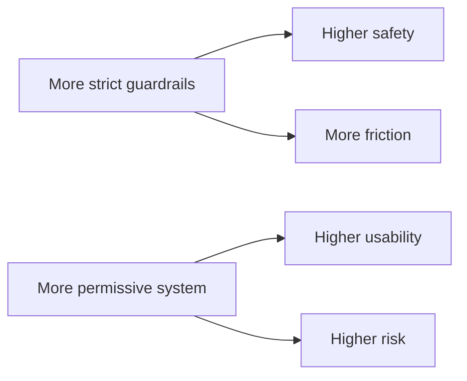
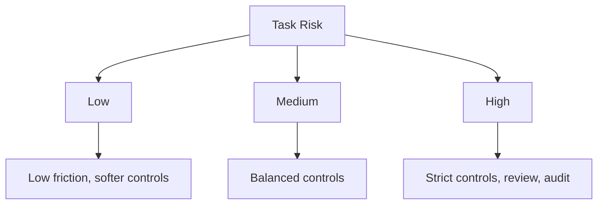

---
tags:
  - guardrails
  - safety
  - tradeoffs
type: note
status: evergreen
source: "OpenAI Safety Best Practices · OpenAI Usage Policies · MCP Security Best Practices · Azure AI Content Safety Docs"
parent_note: "[[Guardrails - MOC]]"
---

# Guardrails - Safety vs Usability Tradeoffs

## Summary

guardrails ที่ดีไม่ใช่ guardrails ที่เข้มที่สุด แต่เป็น guardrails ที่คุมความเสี่ยงได้โดยไม่ทำให้ระบบใช้งานไม่ได้จริง การออกแบบจึงเป็นปัญหาเชิง tradeoff ระหว่าง safety, usefulness, latency, friction, และ operator burden

---

## Scope

- false positives vs false negatives
- friction vs autonomy
- strictness vs flexibility
- risk-based design
- human review tradeoffs

---

## ทำไม tradeoff นี้หลีกเลี่ยงไม่ได้

guardrails ทุกตัวมีราคา:
- moderation เพิ่ม friction
- confirmations เพิ่ม latency
- strict schemas ลด flexibility
- approvals ลด autonomy
- aggressive blocking เพิ่ม false positives

OpenAI safety best practices เน้น human oversight, adversarial testing, และ risk-aware deployment มากกว่าการเสนอว่ามี control เดียวที่ “ดีที่สุด”  
MCP security best practices ก็เอนไปทาง least privilege และ consent ซึ่งปลอดภัยขึ้น แต่ย่อมเพิ่ม friction

ดังนั้นคำถามจริงไม่ใช่ “ควรมี guardrails ไหม” แต่คือ “ควรเข้มแค่ไหนกับ use case นี้”

---

## False Positives vs False Negatives

### False Positive

guardrail บล็อกสิ่งที่จริง ๆ ควรผ่าน

ผลกระทบ:
- user frustration
- reduced utility
- workflow interruption

### False Negative

guardrail ปล่อยสิ่งที่จริง ๆ ควรถูกบล็อก

ผลกระทบ:
- safety incident
- policy breach
- bad downstream action

use case ต่างกันจะรับสองอย่างนี้ไม่เท่ากัน:
- consumer chat app อาจทน false positives ได้บางส่วน
- medical or finance workflows อาจต้องลด false negatives ให้มากที่สุด

---

## Friction vs Autonomy

### เพิ่ม friction ด้วย

- confirmations
- approvals
- user clarifications
- review queues

ข้อดี:
- ลด unsafe actions
- เพิ่ม control

ข้อเสีย:
- flow ขาดตอน
- slower UX
- operator burden เพิ่ม

ระบบที่เน้น autonomy สูงมักต้องลงทุนกับ:
- better policies
- stronger evals
- better observability

ไม่อย่างนั้น autonomy จะแลกมาด้วย risk

---

## Strictness vs Flexibility

### Strict systems

เช่น:
- tight schemas
- narrow allowlists
- aggressive prompt shields
- strong permission boundaries

ข้อดี:
- predictable
- easier to reason about
- safer for automation

ข้อเสีย:
- brittle
- use case coverage แคบ
- hard to adapt to edge cases

### Flexible systems

ข้อดี:
- more natural UX
- better coverage for messy real-world input

ข้อเสีย:
- harder to validate
- more room for unsafe or incorrect behavior

---

## Human Review Tradeoffs

human review ช่วย safety ได้มาก แต่มีต้นทุน:
- latency
- staffing
- consistency issues
- queue backlog

ดังนั้นไม่ควรส่งทุกอย่างไป human review  
ควรใช้กับ:
- high-impact actions
- ambiguous cases
- confidence-low outputs
- policy-sensitive domains

> Design rule: human review ควรเป็น selective safety layer ไม่ใช่ substitute สำหรับ weak system design

---

## Risk-Based Guardrail Design

การตั้งความเข้มของ guardrails ควรอิง risk level ของ task

### Low-Risk

เช่น:
- draft writing
- brainstorming
- low-impact summarization

ควร:
- friction ต่ำ
- flexibility สูง
- soft fallbacks พอ

### Medium-Risk

เช่น:
- enterprise QA
- internal workflow support
- retrieval-based recommendations

ควร:
- stronger output validation
- retrieval grounding
- some confirmation points

### High-Risk

เช่น:
- financial actions
- healthcare advice workflows
- destructive system operations

ควร:
- strict permissions
- approvals
- stronger auditability
- human oversight

---

## Common Tradeoff Knobs

สิ่งที่ปรับได้เพื่อหาจุดสมดุล:
- moderation threshold
- number of confirmations
- tool allowlist breadth
- schema strictness
- escalation threshold
- fallback aggressiveness
- human review threshold

guardrails design ที่ดีมักเป็นเรื่อง “tuning knobs” ไม่ใช่ one-time rule set

---

## Failure Modes

### 1. Optimize Safety Only

ปลอดภัยแต่ใช้งานไม่ได้จริง

### 2. Optimize UX Only

ใช้ง่ายแต่เสี่ยงเกินรับได้

### 3. One Threshold for All Tasks

ใช้ strictness เดียวกับทุก workflow

### 4. Hidden Friction

guardrails trigger บ่อยแต่ไม่มี observability ทำให้ไม่รู้ว่า UX พังตรงไหน

### 5. Human Review as Crutch

ส่งทุกอย่างให้คนตรวจเพราะ system design อ่อน

---

## Design Rules

- calibrate guardrails by task risk, not by aesthetics
- ยอมรับว่า false positives และ false negatives ลดพร้อมกันไม่ได้หมด
- high-impact paths ควรยอม friction มากกว่า low-impact paths
- monitor both safety metrics and usability metrics
- review thresholds และ guardrail aggressiveness เป็นระยะ

---

## ความสัมพันธ์กับโน้ตอื่น

- [[02 AI Systems/Guardrails/Core/01 - Input and Output Controls]] — strictness ของ controls มีผลต่อ UX
- [[02 AI Systems/Guardrails/Core/03 - Tool Safety]] — autonomy vs safety ชัดที่สุดใน tool actions
- [[02 AI Systems/Guardrails/Operations/04 - Permission Models]] — approvals เพิ่ม safety แต่เพิ่ม friction
- [[02 AI Systems/Guardrails/Core/05 - Fallback Policies]] — fallback ที่ปลอดภัยเกินไปอาจลด usefulness
- [[02 AI Systems/Guardrails/Operations/06 - Monitoring and Incidents]] — ต้องวัดทั้ง safety และ usability outcomes
- [[Guardrails - MOC]]

---

## Related Notes

- [[02 AI Systems/Guardrails/Core/03 - Tool Safety]]
- [[02 AI Systems/Guardrails/Operations/04 - Permission Models]]
- [[Guardrails - MOC]]

---

## Official References

- OpenAI - Safety Best Practices: https://platform.openai.com/docs/guides/safety-best-practices
- OpenAI - Usage Policies: https://platform.openai.com/docs/usage-policies
- Azure AI Content Safety Overview: https://learn.microsoft.com/en-us/azure/ai-services/content-safety/overview
- Model Context Protocol - Security Best Practices: https://modelcontextprotocol.io/specification/2025-03-26/basic/security_best_practices
