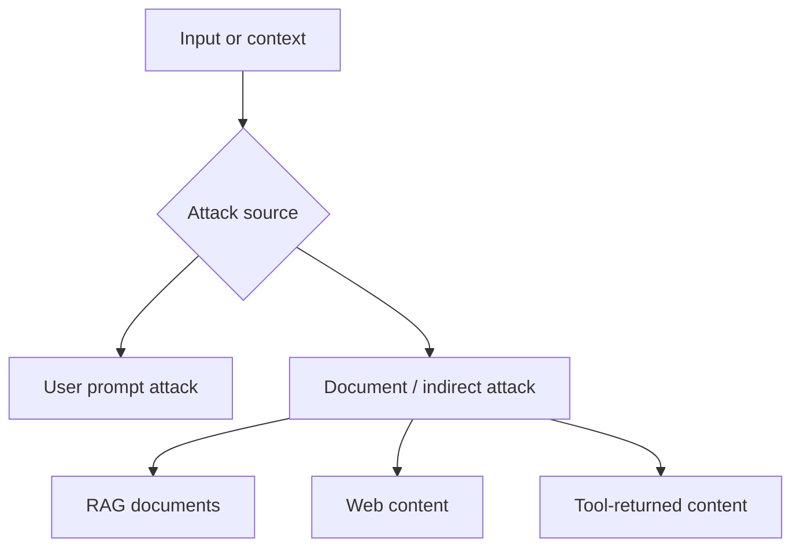
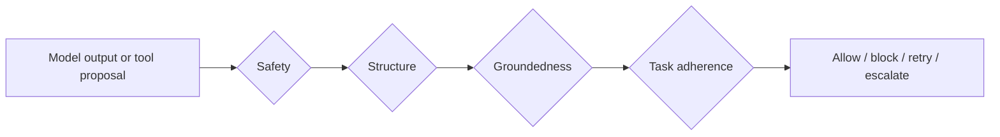

---
tags:
  - guardrails
  - promptinjection
  - attacks
  - groundedness
type: note
status: draft
source: "Microsoft Learn, Azure AI Content Safety, Microsoft Foundry"
parent_note: "[[Guardrails - MOC]]"
---

# Guardrails - Prompt Injection and Content Attacks

> โน้ตเสริมสำหรับอธิบายว่า user prompt attacks, document attacks, groundedness, และ task adherence เชื่อมกันอย่างไรในระบบ guardrails

---

## Summary

guardrails ฝั่ง input/output ไม่ได้เจอแค่ harmful content แต่ยังต้องรับมือ adversarial content ด้วย  
Microsoft แยกไว้ชัดว่าระบบควรพิจารณาอย่างน้อย 4 สัญญาณ:
- user prompt attacks
- document attacks
- groundedness
- task adherence

สี่อย่างนี้สำคัญเพราะ output อาจ:
- ปลอดภัยแต่ไม่ grounded
- structured ถูกแต่ถูก hijack ด้วย injected instructions
- ใช้ tool ถูก syntax แต่ผิด intent ของผู้ใช้

---

## Scope

โน้ตนี้เน้น threat-focused guardrails:
- prompt injection
- indirect/document attacks
- groundedness as evidence alignment
- task adherence as action alignment

ไม่ได้แทน moderation, schema validation, หรือ output validation ทั่วไป แต่เป็นชั้นเสริมที่ใช้จับ adversarial และ misaligned behavior

---

## User Prompt Attacks vs Document Attacks

Microsoft Foundry Prompt Shields แยกชัดว่า attacks มีอย่างน้อย 2 ทางหลัก:

### 1. User prompt attacks

เกิดจากผู้ใช้พยายาม bypass system instructions หรือ safety boundaries โดยตรง

ตัวอย่างเป้าหมาย:
- เปลี่ยนกติกาของระบบ
- บังคับให้ model role-play เป็น persona ใหม่
- ซ่อนคำสั่งผ่าน encoding หรือ conversation mockups

### 2. Document attacks

เกิดจากคำสั่งแฝงใน third-party content เช่น:
- uploaded documents
- emails
- webpages
- tool-returned content

จุดสำคัญคือ attack ไม่ได้มาจากผู้ใช้โดยตรงเสมอไป แต่อาจมาจากข้อมูลที่ระบบนำเข้าเป็น context

---

## Prompt Shields และ Intervention Points

Microsoft ระบุว่า Prompt Shields ใช้ตรวจและ mitigate attacks ที่พยายามควบคุม model behavior ผ่าน adversarial inputs  
จุดสำคัญเชิงสถาปัตย์คือ:
- user prompt attacks ถูกสแกนที่ input intervention point
- document attacks ถูกสแกนได้ทั้งที่ input และ tool response intervention points

ความหมายคือ guardrails ไม่ควรถูกวางแค่หน้าประตูรับ input จาก user แต่ต้องพิจารณา content ที่ไหลกลับมาจาก retrieval และ tools ด้วย

---

## Groundedness คือคนละชั้นกับ Moderation

Azure AI Content Safety อธิบาย groundedness detection ว่าใช้ตรวจว่าข้อความของ LLM grounded อยู่บน source materials ที่ผู้ใช้หรือระบบให้มาหรือไม่

นี่ต่างจาก moderation:
- moderation = harmful หรือไม่
- groundedness = สอดคล้องกับแหล่งข้อมูลหรือไม่

ดังนั้น output อาจ:
- safe แต่ ungrounded
- structured ถูก แต่ไม่ตรงกับ evidence

ในระบบ RAG หรือ enterprise Q&A groundedness จึงเป็น guardrail ชั้นสำคัญ ไม่ใช่แค่ eval metric

---

## Task Adherence คือคนละชั้นกับ Groundedness

Azure AI Content Safety docs อธิบาย task adherence ว่าใช้ตรวจเมื่อ tool use หรือ agent behavior ไม่สอดคล้องกับ user intent หรือ task objective

ตัวอย่างที่ task adherence ช่วยจับ:
- tool invocation ไม่ตรงกับเป้าหมายผู้ใช้
- tool input หรือ tool output ผิดบริบท
- response ขัดกับ customer input หรือ instructions

ความต่างเชิงระบบ:
- groundedness = output ตรงกับ source หรือไม่
- task adherence = action หรือ response ตรงกับงานที่ควรทำหรือไม่

---

## Attack-Aware Output Control

output guardrail ที่ดีจึงอาจต้องดู 4 มิติพร้อมกัน:
- safety
- structure
- groundedness
- task alignment

ระบบที่มีแค่ moderation หรือ schema validation มักยังไม่พอสำหรับ agentic systems

---

## Design Rules

- แยก harmful content detection ออกจาก adversarial content detection
- สแกนทั้ง user inputs และ retrieved/tool-returned content
- อย่าใช้ groundedness แทน task adherence หรือกลับกัน
- ถ้าระบบ execute actions ได้ ให้มีสัญญาณสำหรับ block / escalate เมื่อ task alignment ต่ำ
- ในระบบ RAG และ agentic workflows ให้คิดว่า `context ก็เป็น attack surface`

---

## Related Notes

- [[01 - Input and Output Controls]]
- [[02 - Output Validation]]
- [[03 - Tool Safety]]
- [[02 AI Systems/RAG/Core/07 - Grounding and Citation|RAG - Grounding and Citation]]
- [[02 AI Systems/Evals/Application/07 - RAG Evals|Evals - RAG Evals]]

---

## Official References

- Azure AI Content Safety Overview  
  https://learn.microsoft.com/en-us/azure/ai-services/content-safety/overview
- Prompt Shields in Microsoft Foundry  
  https://learn.microsoft.com/en-in/azure/ai-services/openai/concepts/content-filter-prompt-shields
- Groundedness detection in Azure AI Content Safety  
  https://learn.microsoft.com/en-us/azure/ai-services/content-safety/concepts/groundedness
- Task Adherence in Azure AI Content Safety  
  https://learn.microsoft.com/en-us/azure/ai-services/content-safety/concepts/task-adherence
