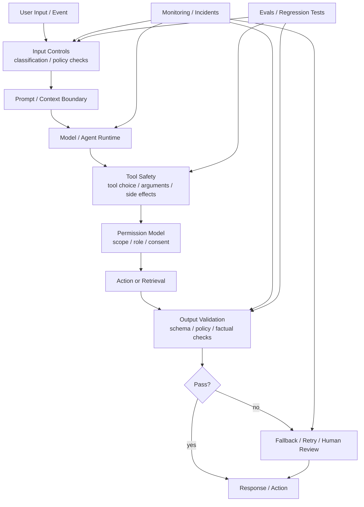

---
tags:
  - guardrails
  - moc
  - safety
type: moc
status: evergreen
source: ""
parent_note: "[[Home]]"
---

# Guardrails - MOC

> โครงความรู้สำหรับการควบคุมความเสี่ยง ความน่าเชื่อถือ และข้อจำกัดของ AI systems

---

## Scope

หมวดนี้รวมการออกแบบข้อจำกัด, policy enforcement, validation, fallback behavior, permission control, monitoring, และ incident handling

หมวดนี้เป็น canonical home ของ control layer และ safety boundaries  
ถ้าพูดถึง measurement / regression / eval ให้ไป `Evals - MOC` แทน
ถ้าเป็นความหมายของ success criteria, benchmark design, judge, หรือ regression suite ให้ไป `Evals - MOC` ก่อน แล้วค่อยย้อนกลับมาอ่าน guardrail implications

กติกาการอ่าน:
- ไฟล์ที่มีเลข `01, 02, 03...` คือ core learning path
- ไฟล์ที่ไม่มีเลขคือหัวข้อเสริมเชิง policy หรือ advanced topics

---

## Guardrails Control Stack

ภาพนี้แสดง guardrails เป็น control layer หลายจุด ไม่ใช่ filter ตัวเดียวท้ายระบบ จุดสำคัญคือ permission, tool safety, validation, fallback, monitoring, และ evals ต้องเชื่อมกันเพื่อให้ production system คุมความเสี่ยงได้จริง.

---

## Notes Map

- [[02 AI Systems/Guardrails/Core/01 - Input and Output Controls|Input and output controls]]
- [[02 AI Systems/Guardrails/Core/Guardrails - Prompt Injection and Content Attacks|Prompt injection and content attacks]]
- [[02 AI Systems/Guardrails/Core/02 - Output Validation|Output validation]]
- [[02 AI Systems/Guardrails/Core/03 - Tool Safety|Tool safety]]
- [[02 AI Systems/Guardrails/Operations/04 - Permission Models|Permission models]]
- [[02 AI Systems/Guardrails/Core/05 - Fallback Policies|Fallback and retry policies]]
- [[02 AI Systems/Guardrails/Operations/06 - Monitoring and Incidents|Monitoring and incident response]]
- [[02 AI Systems/Guardrails/Core/07 - Safety vs Usability Tradeoffs|Safety vs usability tradeoffs]]

---

## Related Notes

- [[02 AI Systems/AI Agent Fundamentals/Reference/10 - Risks และ Best Practices]]
- [[02 AI Systems/MCP/Security/05 - Security, Consent และ Authorization]]
- [[03 Tools/Claude Code/Workflow/22 - Error Handling]]
- [[03 Tools/Claude Code/Workflow/24 - Best Practices & Checklist]]
- [[01 Foundations/LLM Foundations/Core/05 - ข้อจำกัดและการประเมินผล LLM]]
- [[01 Foundations/Context Windows/Core/02 - การบริหารและ Context Engineering]]
- [[05 Use Cases/Application/Use Cases - Design Guardrails for Tool Use]]
- [[02 AI Systems/Evals/Evals - MOC]]
- [[04 Synthesis/Bridge/Synthesis - Safety, Reliability, and Evals]]

---

## Learning Path

### 1. Foundations Before Guardrails

1. [[01 Foundations/LLM Foundations/Core/05 - ข้อจำกัดและการประเมินผล LLM]]
2. [[01 Foundations/Prompt Engineering/Core/07 - Structured Generation และ Output Formats]]
3. [[02 AI Systems/AI Agent Fundamentals/Reference/10 - Risks และ Best Practices]]

### 2. Core Control Layers

1. [[02 AI Systems/Guardrails/Core/01 - Input and Output Controls]]
2. [[02 AI Systems/Guardrails/Core/Guardrails - Prompt Injection and Content Attacks]]
3. [[02 AI Systems/Guardrails/Core/02 - Output Validation]]
4. [[02 AI Systems/Guardrails/Core/03 - Tool Safety]]

### 3. Policy and Runtime Boundaries

1. [[02 AI Systems/Guardrails/Operations/04 - Permission Models]]
2. [[02 AI Systems/Guardrails/Core/05 - Fallback Policies]]

### 4. Operations and Tradeoffs

1. [[02 AI Systems/Guardrails/Operations/06 - Monitoring and Incidents]]
2. [[02 AI Systems/Guardrails/Core/07 - Safety vs Usability Tradeoffs]]
3. [[05 Use Cases/Application/Use Cases - Design Guardrails for Tool Use]]

---

## Implementation Bridge

- [[06 Engineering/README]]
- [[06 Engineering/Guardrails/Guardrails - MOC]]
- [[Knowledge Topic Registry]]

---

## Next Notes To Create

- Guardrails - Human Review Thresholds
- Guardrails - Policy Layers Across the LLM Stack
