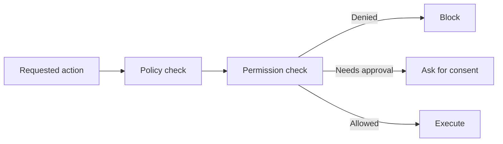
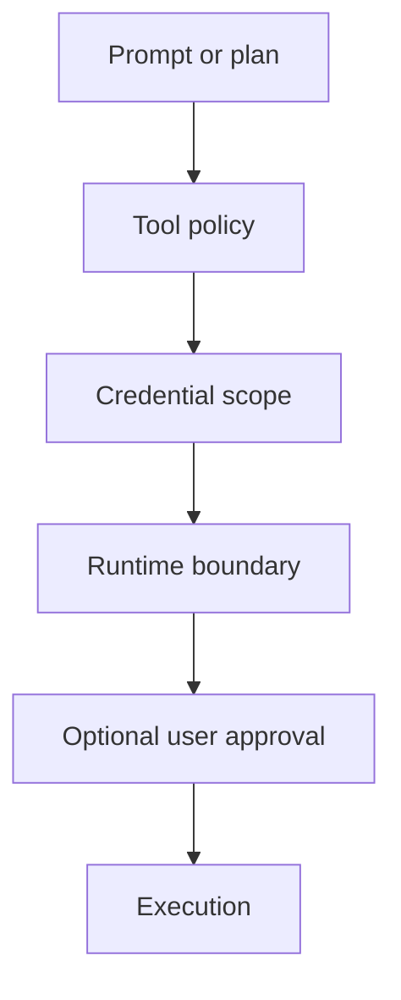

---
tags:
  - guardrails
  - permissions
type: note
status: evergreen
source: "MCP Authorization and Security Best Practices · OpenAI Safety Best Practices"
parent_note: "[[Guardrails - MOC]]"
---

# Guardrails - Permission Models

## Summary

permission model เป็น guardrail เชิงระบบที่คุมว่า action ไหนทำได้อัตโนมัติ, action ไหนต้องขออนุมัติ, และ action ไหนห้ามทำ โดยไม่พึ่งความตั้งใจของ model อย่างเดียว

---

## Scope

- role-based permissions
- scoped tool access
- consent and approvals
- auditability
- default-deny design

---

## ทำไม permission model สำคัญ

tool safety คุมว่า “ควรใช้ tool นี้ไหม” แต่ permission model คุมว่า “ถึง model อยากใช้ ก็มีสิทธิ์ใช้หรือไม่”

MCP authorization concepts และ security best practices เน้นเรื่อง:
- explicit authorization
- consent
- scoped access
- least privilege

ดังนั้น permission model คือ runtime boundary ที่บังคับใช้จริง ไม่ใช่แค่ policy บน prompt

---

## หลักการสำคัญ

### 1. Least Privilege

ให้สิทธิ์เท่าที่จำเป็นกับ task นั้น

### 2. Default Deny

ถ้าไม่รู้ว่าควรอนุญาตหรือไม่ ให้ปฏิเสธไว้ก่อน

### 3. Explicit Consent

action ที่มีผลกระทบจริงควรต้องมี consent หรือ approval ชัดเจน

### 4. Scoped Access

สิทธิ์ต้องผูกกับ scope เช่น:
- user
- workspace
- tool class
- environment

### 5. Auditability

ต้องตอบย้อนหลังได้ว่า:
- ใครขอ action
- อนุมัติโดยใคร
- execute เมื่อไร
- ภายใต้สิทธิ์อะไร

---

## รูปแบบของ Permission Models

### Role-Based

สิทธิ์ผูกกับ role เช่น:
- viewer
- operator
- admin

ข้อดี:
- เข้าใจง่าย
- กำกับได้ระดับองค์กร

ข้อจำกัด:
- อาจกว้างเกิน task จริง

### Capability-Based

สิทธิ์ผูกกับ capability เฉพาะ เช่น:
- read files
- send email
- deploy service

ข้อดี:
- ละเอียดกว่า
- เข้ากับ tool systems ดี

### Scope-Based

สิทธิ์ผูกกับขอบเขต เช่น:
- โฟลเดอร์นี้
- project นี้
- domain นี้

ข้อดี:
- กัน overreach ได้ดี

### Approval-Based

สิทธิ์สุดท้ายขึ้นกับ human approval หรือ policy gate

เหมาะกับ:
- destructive actions
- financial actions
- publication
- privilege escalation

---

## Consent และ Approval Gates

ไม่ใช่ทุก action ต้องขอทุกครั้ง แต่บาง action ควรบังคับ approval เสมอ

ตัวอย่าง:
- delete / overwrite
- external messaging
- purchases
- production deploy
- data export

OpenAI safety best practices รองรับ human review สำหรับ high-stakes actions  
MCP authorization concepts ก็เน้น explicit authorization เป็นแกนสำคัญ

---

## Permission Boundaries ที่ดีควรอยู่ตรงไหน

permission model ที่ดีไม่ควรอยู่แค่ใน prompt หรือ app logic อย่างเดียว แต่ควรอยู่หลายชั้น:

- tool registry
- API credentials and scopes
- environment permissions
- runtime sandbox
- user approval layer

> Design rule: ถ้าสิทธิ์ถูก enforce ได้แค่ใน natural-language instruction นั่นยังไม่ใช่ permission model ที่พอสำหรับระบบจริง

---

## Read Permissions vs Write Permissions

ควรแยกให้ชัด

### Read Permissions

คุม:
- what data can be seen
- from where
- under which identity

### Write Permissions

คุม:
- what state can change
- which targets are mutable
- whether action is reversible

write permissions ควรเข้มกว่า read permissions เกือบเสมอ

---

## Common Failure Modes

### 1. Broad Shared Permissions

ทุก tool ใช้ credential เดียวสิทธิ์กว้างเกินไป

### 2. Prompt-Level Permission Only

ห้ามไว้ใน system prompt แต่ runtime จริงยังทำได้หมด

### 3. Missing Approval Gate

action สำคัญ execute อัตโนมัติโดยไม่มี consent

### 4. Scope Confusion

สิทธิ์ไม่ผูกกับ project/user/environment ชัดเจน

### 5. No Audit Trail

ย้อนดูไม่ได้ว่า action เกิดขึ้นได้อย่างไร

---

## Design Rules

- ใช้ default deny สำหรับ actions ที่มีผลกระทบ
- แยก read, write, and admin capabilities
- bind permissions กับ scope จริง ไม่ใช่ role กว้างอย่างเดียว
- high-impact actions ต้องมี approval or confirmation
- credential scopes และ runtime permissions ต้อง enforce ได้จริง
- บันทึก audit trail สำหรับ actions สำคัญ

---

## ความสัมพันธ์กับโน้ตอื่น

- [[02 AI Systems/MCP/Security/05 - Security, Consent และ Authorization]] — authorization และ consent ในระบบ tool/server
- [[02 AI Systems/Guardrails/Core/03 - Tool Safety]] — tool safety ต้องมี permission boundary รองรับ
- [[02 AI Systems/Guardrails/Core/01 - Input and Output Controls]] — controls ก่อนเข้าสู่ action layer
- [[02 AI Systems/Guardrails/Operations/06 - Monitoring and Incidents]] — audit และ incident response
- [[Guardrails - MOC]]

---

## Related Notes

- [[02 AI Systems/MCP/Security/05 - Security, Consent และ Authorization]]
- [[02 AI Systems/Guardrails/Core/03 - Tool Safety]]
- [[Guardrails - MOC]]

---

## Official References

- Model Context Protocol - Authorization: https://modelcontextprotocol.io/specification/2025-03-26/basic/authorization
- Model Context Protocol - Security Best Practices: https://modelcontextprotocol.io/specification/2025-03-26/basic/security_best_practices
- OpenAI - Safety Best Practices: https://platform.openai.com/docs/guides/safety-best-practices
