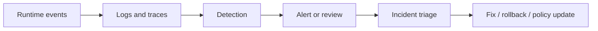
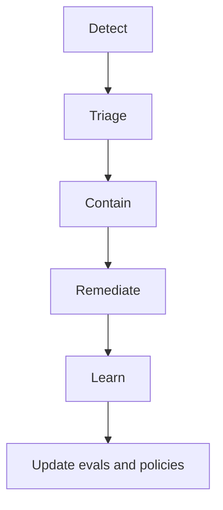

---
tags:
  - guardrails
  - monitoring
  - incidents
type: note
status: draft
source: "OpenAI Safety Best Practices · OpenAI Trace Grading and Evals Docs · Azure AI Content Safety Docs · MCP Security Best Practices"
parent_note: "[[Guardrails - MOC]]"
---

# Guardrails - Monitoring and Incidents

## Summary

guardrails ที่ไม่มี monitoring จะรู้ปัญหาช้าเกินไป ระบบจริงต้องมีการเก็บสัญญาณ, review, alerting, และ incident response flow ที่ชัด เพื่อจับทั้ง safety failures และ reliability regressions ให้ทัน

---

## Scope

- logging
- alerting
- incident triage
- feedback loops
- rollback / disable strategies

---

## ทำไม monitoring เป็นส่วนของ guardrails

guardrails ที่ดีไม่ได้จบตอนออกแบบ policy แต่ต้องตอบได้ว่า:
- policy นี้ทำงานจริงไหม
- ถูก bypass หรือไม่
- false positive / false negative สูงไหม
- ปัญหาเกิดกับ user ไหน, tool ไหน, path ไหน

OpenAI trace grading และ evals docs ชี้ให้เห็นว่าการประเมิน trace/runtime behavior มีบทบาทสำคัญในการจับความผิดพลาดของ agent systems  
Azure AI Content Safety docs ก็ชี้ว่าระบบความปลอดภัยต้องมีการตรวจจับและจัดการ signal ระหว่างการใช้งาน

ดังนั้น monitoring คือชั้นสังเกตการณ์ของ guardrails

---

## สิ่งที่ควร monitor

### 1. Input Safety Signals

- moderation flags
- prompt attack detections
- blocked inputs
- document attack detections

### 2. Output Safety Signals

- unsafe output flags
- schema failures
- groundedness issues
- task-adherence failures

### 3. Tool Safety Signals

- blocked tool calls
- denied permissions
- confirmation-gated actions
- unexpected side-effect attempts

### 4. Fallback Signals

- retry rates
- abstain/refusal rates
- degrade-to-safe-mode frequency
- escalation frequency

### 5. Memory and Retrieval Signals

- no-recall when expected
- wrong-recall patterns
- ungrounded answers
- citation failures

---

## Logging and Trace Design

monitoring ที่ดีต้องเก็บ trace ที่ตอบคำถามย้อนหลังได้ เช่น:
- input อะไรเข้ามา
- model ตัดสินใจอะไร
- tool ไหนถูกเรียก
- guardrail ไหน trigger
- fallback ไหนถูกใช้
- final outcome เป็นอะไร

OpenAI trace grading docs ทำให้เห็นความสำคัญของ trace-level evaluation ต่อระบบ agent และ tool use

จุดสำคัญ:
- logs ต้องพอ debug ได้
- แต่ต้องไม่เก็บข้อมูลเกินจำเป็น
- ต้องรู้ว่าข้อมูลไหน sensitive

---

## Detection Modes

### Rule-Based Detection

เช่น:
- blocked categories
- schema violation
- permission denied

### Model-Based Detection

เช่น:
- safety classifiers
- groundedness detection
- task adherence checks

### Human Review

ใช้กับกรณี:
- high-risk
- high-ambiguity
- policy-sensitive incidents

---

## Incident Lifecycle

### 1. Detect

พบ signal ผิดปกติจาก logs, alerts, evals, หรือ user reports

### 2. Triage

ตอบให้ได้ว่า:
- severity เท่าไร
- กระทบใครบ้าง
- เกิดใน path ไหน
- เกิดซ้ำไหม

### 3. Contain

เช่น:
- disable tool
- tighten threshold
- force fallback
- switch to read-only mode

### 4. Remediate

แก้ root cause:
- policy update
- permission change
- schema change
- prompt/tool update

### 5. Learn

เปลี่ยน incident ให้เป็น:
- new eval case
- new alert
- new guardrail rule

---

## Alerting

ไม่ใช่ทุก signal ควรเป็น alert

alert ควรใช้กับ:
- high-severity safety events
- repeated permission bypass attempts
- spike in malformed outputs
- spike in fallback or abstain rates
- sudden increase in tool failures

ถ้า alerting ไวเกินไปจะเกิด alert fatigue  
ถ้าอ่อนเกินไปจะจับ incident ช้า

---

## Rollback and Kill Switches

guardrails operations ควรมีความสามารถลดความเสี่ยงเร็ว เช่น:
- disable specific tool
- disable specific model path
- force safe fallback mode
- turn off write-capable actions

ระบบที่ไม่มี kill switch มักต้องรอ deploy แก้ ซึ่งช้าเกินไปสำหรับ incident จริง

---

## Feedback Loops

incident ที่ดีไม่ควรจบที่ “ปิดเคส” แต่ต้องย้อนกลับไปพัฒนาระบบ

feedback loops ที่ดีควรทำให้:
- incident -> new eval case
- failure pattern -> new guardrail rule
- alert spike -> threshold tuning
- repeated manual review -> automation candidate

นี่คือจุดเชื่อมระหว่าง guardrails กับ evals และ observability โดยตรง

---

## Common Failure Modes

### 1. No Visibility

guardrails มีแต่ไม่รู้ว่า trigger บ่อยแค่ไหน

### 2. Logging Too Little

ย้อนเหตุการณ์ไม่ได้

### 3. Logging Too Much

privacy risk และ signal-to-noise แย่

### 4. No Incident Path

จับปัญหาได้แต่ไม่มี owner หรือ response flow

### 5. No Learning Loop

incident เดิมเกิดซ้ำเพราะไม่เปลี่ยนเป็น eval หรือ rule ใหม่

---

## Design Rules

- log ให้พอ trace decision chain ได้
- monitor ทั้ง quality, safety, and fallback signals
- กำหนด severity และ incident owner ชัด
- high-risk systems ควรมี containment actions ที่ trigger ได้เร็ว
- เปลี่ยน incidents เป็น regression tests และ eval cases
- อย่าแยก guardrails ออกจาก observability stack

---

## ความสัมพันธ์กับโน้ตอื่น

- [[02 AI Systems/Guardrails/Core/01 - Input and Output Controls]] — source ของ many safety signals
- [[02 AI Systems/Guardrails/Core/03 - Tool Safety]] — tool incidents และ policy breaches
- [[02 AI Systems/Guardrails/Core/05 - Fallback Policies]] — fallback rates เป็น monitoring signal สำคัญ
- [[02 AI Systems/Evals/Core/09 - Observability and Feedback Loops]] — feedback loop ระดับระบบ
- [[02 AI Systems/Evals/Core/05 - Regression Testing]] — incidents ควรกลายเป็น regression tests
- [[Guardrails - MOC]]

---

## Related Notes

- [[02 AI Systems/Evals/Core/09 - Observability and Feedback Loops]]
- [[02 AI Systems/Evals/Core/05 - Regression Testing]]
- [[Guardrails - MOC]]

---

## Official References

- OpenAI - Safety Best Practices: https://platform.openai.com/docs/guides/safety-best-practices
- OpenAI - Trace Grading: https://platform.openai.com/docs/guides/trace-grading
- OpenAI - Evals Design Guide: https://platform.openai.com/docs/guides/evals-design
- Azure AI Content Safety Overview: https://learn.microsoft.com/en-us/azure/ai-services/content-safety/overview
- Model Context Protocol - Security Best Practices: https://modelcontextprotocol.io/specification/2025-03-26/basic/security_best_practices
