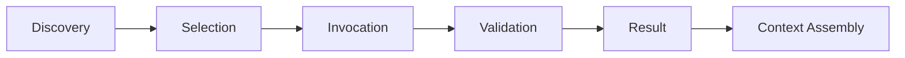

---
tags:
  - mcp
  - tools
  - bridge
type: note
status: draft
source: "MCP Official Docs · Anthropic Tool Use Overview · HuggingFace Agents Course"
parent_note: "[[02 AI Systems/MCP/MCP - MOC|MCP - MOC]]"
created: "2026-04-23"
updated: ""
---

# Tools: การออกแบบและทำงาน

> recreated จาก MCP official docs + Anthropic + HuggingFace (ชื่อไฟล์เดิมมี colon ซึ่ง Windows ไม่รองรับ)
> bridge note เชื่อม MCP tools กับ agent fundamentals

---

## Tool คืออะไรใน Context ของ Agent

tool คือ function ที่ agent เรียกใช้เพื่อทำ action กับ external system — ไม่ใช่ model capability แต่เป็น harness capability ที่ model เข้าถึงผ่าน protocol

ใน MCP, tools เป็น 1 ใน 3 server primitives (tools, resources, prompts) ที่ server expose ให้ model เรียกใช้

---

## Tool Lifecycle

| Phase | กลไก | ใครทำ |
|---|---|---|
| Discovery | `tools/list` — model เห็น tools ที่มี | server expose, client relay |
| Selection | model เลือก tool ตาม context | model |
| Invocation | `tools/call` พร้อม arguments | client ส่งไป server |
| Validation | ตรวจ input/output, permission check | harness (permission system, hooks) |
| Result | content กลับเข้า context | server → client → model |
| Context Assembly | result ถูกประกอบเข้า prompt | harness |

---

## Tool Design Principles

จาก Anthropic Tool Use Overview และ MCP docs:

- **ชื่อชัดเจน** — model เลือก tool จากชื่อและ description
- **Schema ครบ** — inputSchema ต้องกำหนด parameters ชัด
- **Side effects ระบุ** — tool ที่เปลี่ยน state ต้องแยกจาก read-only
- **Error handling** — แยก protocol errors (JSON-RPC) จาก execution errors (isError)
- **Security** — validate inputs, implement access controls, rate limit

---

## Tools ใน Harness

tools เป็น harness component ที่สำคัญ:
- harness กำหนดว่า model เห็น tools อะไร (tool pool assembly)
- harness กำหนดว่า tool call ต้องผ่าน permission gate ไหม
- harness กำหนดว่า tool result ถูก budget/compact อย่างไร

→ ดูเพิ่มที่ [[02 AI Systems/AI Agent Fundamentals/Core/08 - Harness Engineering|Harness Engineering]]
→ ดูเพิ่มที่ [[03 Tools/Claude Code/Core/26 - Extensibility Mechanisms|Extensibility Mechanisms]] สำหรับ tool pool assembly ของ Claude Code

---

## ความสัมพันธ์กับโน้ตอื่น

- [[02 AI Systems/MCP/Core/03 - Core Primitives_ Tools, Resources, Prompts|Core Primitives]] — tools เป็น 1 ใน 3 primitives
- [[02 AI Systems/MCP/Core/02 - Architecture_ Host, Client, Server|Architecture]] — tools อยู่ใน server layer
- [[02 AI Systems/AI Agent Fundamentals/Core/08 - Harness Engineering|Harness Engineering]] — tools เป็น harness component
- [[02 AI Systems/Guardrails/Core/03 - Tool Safety|Tool Safety]] — safety controls สำหรับ tools
- [[02 AI Systems/Agent Frameworks/Core/04 - Tool Orchestration|Tool Orchestration]] — orchestration ของ tools ใน frameworks
- [[02 AI Systems/MCP/MCP - MOC|MCP - MOC]]

---

## Official References

- MCP Tools: https://modelcontextprotocol.io/docs/concepts/tools
- Anthropic Tool Use: https://docs.anthropic.com/en/docs/agents-and-tools/tool-use/overview
