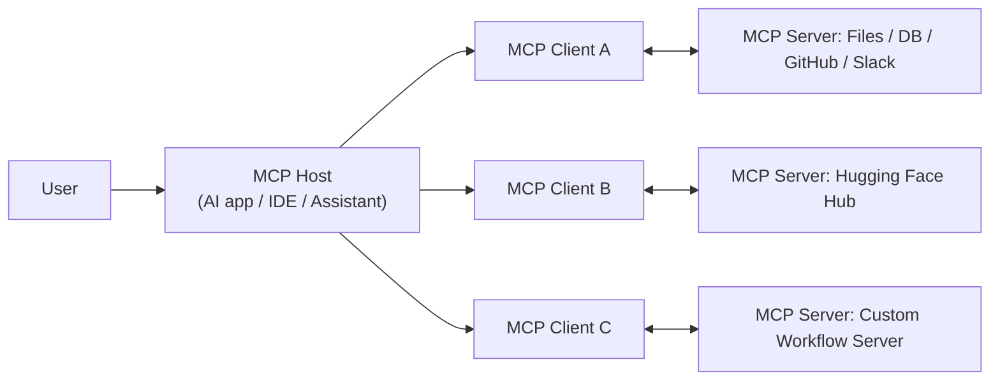
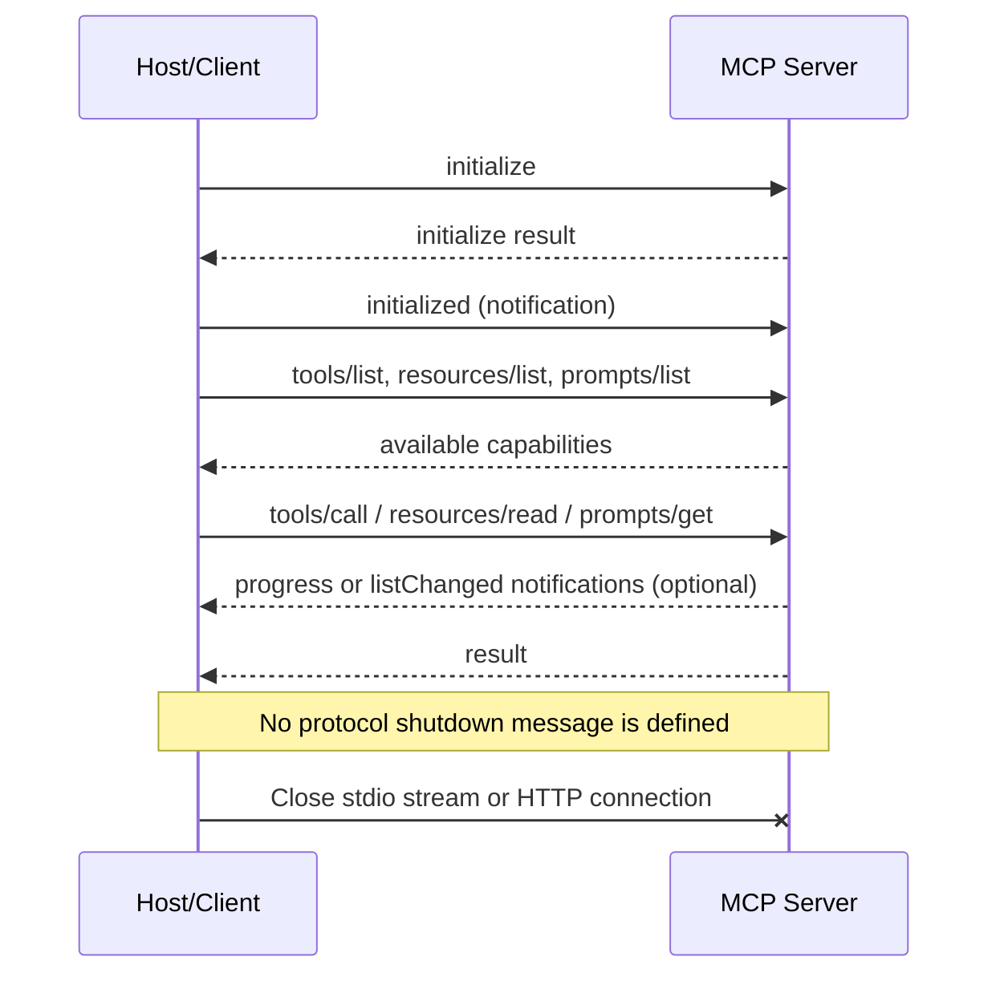

---
tags:
  - mcp
  - architecture
  - host
  - client
  - server
  - jsonrpc
type: note
status: evergreen
source: "MCP/MCP_Knowledge_Base.md"
parent_note: "[[MCP - MOC]]"
---

# Architecture: Host, Client, Server


---

## Participants

| Role | คืออะไร | ตัวอย่าง |
|---|---|---|
| **Host** | แอป AI ที่ผู้ใช้ใช้งานโดยตรง | AI desktop app, IDE, coding assistant, custom chat app |
| **Client** | ส่วนย่อยภายใน host ที่ maintain การเชื่อมต่อ 1:1 กับ MCP server หนึ่งตัว | connector ภายใน Claude Code |
| **Server** | โปรแกรมหรือ service ที่ expose capabilities ผ่าน MCP | Files server, GitHub server, Slack server |

**หลักสำคัญ:**
- 1 host → หลาย clients
- 1 client → 1 server
- 1 host จึงเชื่อมหลาย servers พร้อมกันได้

---

## Architecture Overview



**Data layer**: ใช้ JSON-RPC 2.0 กำหนด message structure, lifecycle, primitives, notifications, utilities
**Transport layer**: กำหนดวิธีรับส่ง message จริง — stdio หรือ Streamable HTTP

---

## Transport มาตรฐาน 2 แบบ

### stdio
เหมาะกับ local server:
- client launch server เป็น subprocess
- server อ่าน stdin / เขียน stdout / ใช้ stderr สำหรับ logging
- เหมาะกับ local tools, filesystem access, IDE integrations

### Streamable HTTP
เหมาะกับ remote server:
- ใช้ HTTP transport, รองรับ streaming
- เหมาะกับ SaaS-style MCP server, multi-client remote access, hosted integrations

**เลือก transport:**
- `stdio` → server อยู่เครื่องเดียวกับ host, เน้น local
- `Streamable HTTP` → deploy ให้หลาย clients ใช้ผ่าน network

---

## Session Lifecycle

MCP session มี 3 ช่วง:

### 1. Initialization
1. Client ส่ง `initialize` → ตกลง protocol version, แลก capabilities, ส่งข้อมูล implementation
2. Client ส่ง `initialized` notification เพื่อยืนยัน

### 2. Operation
- Capability discovery: `tools/list`, `resources/list`, `prompts/list`
- Capability execution: `tools/call`, `resources/read`, `prompts/get`
- Notifications: progress, list changed

### 3. Shutdown
- ปิด connection และ cleanup state อย่างมีระเบียบ



---

## Message Format (JSON-RPC 2.0)

MCP ใช้ JSON-RPC 2.0 เป็น data layer — message 3 แบบ:
- `Request` — ส่งคำขอ
- `Response` — ตอบกลับ
- `Notification` — แจ้งโดยไม่ต้องการ response

ตัวอย่าง Request:
```json
{
  "jsonrpc": "2.0",
  "id": 1,
  "method": "tools/call",
  "params": {
    "name": "get_weather",
    "arguments": { "location": "Bangkok" }
  }
}
```

---

## Versioning

- Version ใช้รูปแบบ `YYYY-MM-DD`
- เปลี่ยน version เมื่อมี backward incompatible changes
- Current spec (ณ วันที่ข้อมูล): `2025-11-25`

แนวทาง: รองรับ version negotiation ตอน `initialize`, เช็ก SDK ให้ทันกับ protocol revision

---

## ดูต่อ

- [[03 - Core Primitives: Tools, Resources, Prompts]] — ความสามารถฝั่ง server
- [[04 - Client Features: Sampling, Roots, Elicitation]] — ความสามารถฝั่ง client
- [[MCP - MOC]]
