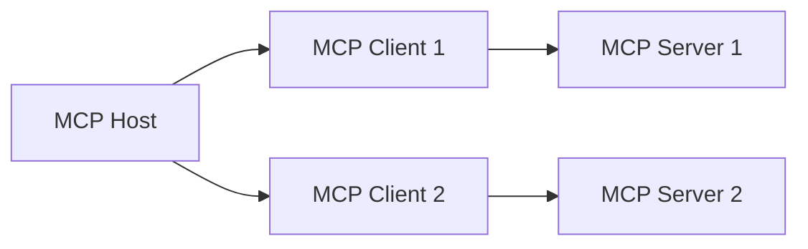

---
tags:
  - mcp
  - architecture
  - protocol
type: note
status: draft
source: "MCP Official Docs - modelcontextprotocol.io"
parent_note: "[[02 AI Systems/MCP/MCP - MOC|MCP - MOC]]"
created: "2026-04-23"
updated: ""
---

# Architecture: Host, Client, Server

> recreated จาก MCP official docs (ชื่อไฟล์เดิมมี colon ซึ่ง Windows ไม่รองรับ)

---

## Participants

MCP ใช้ client-server architecture ที่มี 3 participants:

| Participant | หน้าที่ | ตัวอย่าง |
|---|---|---|
| **MCP Host** | AI application ที่ coordinate และจัดการ MCP clients | Claude Code, Claude Desktop, VS Code |
| **MCP Client** | component ที่ maintain connection กับ MCP server 1 ตัว | สร้างโดย host, 1 client ต่อ 1 server |
| **MCP Server** | program ที่ provide context ให้ MCP clients | filesystem server, Sentry server, database server |

host สร้าง client ใหม่สำหรับแต่ละ server ที่เชื่อมต่อ — ไม่ใช่ client เดียวเชื่อมหลาย servers

---

## 2 Layers

MCP แบ่งเป็น 2 ชั้น:

### Data Layer (inner)

JSON-RPC 2.0 based protocol ที่กำหนด:
- **Lifecycle management** — initialization, capability negotiation, termination
- **Server features** — tools, resources, prompts (server → client)
- **Client features** — sampling, elicitation, logging (client → server)
- **Utility features** — notifications, progress tracking

### Transport Layer (outer)

กลไกการสื่อสารระหว่าง client กับ server:

| Transport | กลไก | เหมาะกับ |
|---|---|---|
| **Stdio** | standard input/output streams | local processes, ไม่มี network overhead |
| **Streamable HTTP** | HTTP POST + optional SSE | remote servers, รองรับ OAuth/bearer tokens |

transport layer abstract communication details ออกจาก data layer — JSON-RPC 2.0 format เดียวกันทุก transport

---

## Lifecycle

MCP เป็น stateful protocol ที่ต้องมี lifecycle management:

1. **Initialize** — client ส่ง `initialize` request พร้อม capabilities ที่รองรับ
2. **Capability Negotiation** — server ตอบกลับด้วย capabilities ของตัวเอง
3. **Operation** — client และ server แลกเปลี่ยน requests/responses/notifications
4. **Termination** — ปิด connection

---

## Local vs Remote Servers

| ประเภท | Transport | ตัวอย่าง |
|---|---|---|
| **Local** | Stdio | filesystem server รันบนเครื่องเดียวกับ host |
| **Remote** | Streamable HTTP | Sentry server รันบน Sentry platform |

local server มักรับ 1 client ส่วน remote server รับหลาย clients ได้

---

## ความสัมพันธ์กับโน้ตอื่น

- [[02 AI Systems/MCP/Core/01 - MCP คืออะไรและแก้ปัญหาอะไร|MCP คืออะไร]] — problem framing
- [[02 AI Systems/MCP/Core/03 - Core Primitives_ Tools, Resources, Prompts|Core Primitives]] — server features
- [[02 AI Systems/MCP/Client/04 - Client Features_ Sampling, Roots, Elicitation|Client Features]] — client features
- [[02 AI Systems/MCP/Security/05 - Security, Consent และ Authorization|Security]] — consent model
- [[02 AI Systems/MCP/MCP - MOC|MCP - MOC]]

---

## Official References

- MCP Architecture: https://modelcontextprotocol.io/docs/concepts/architecture
