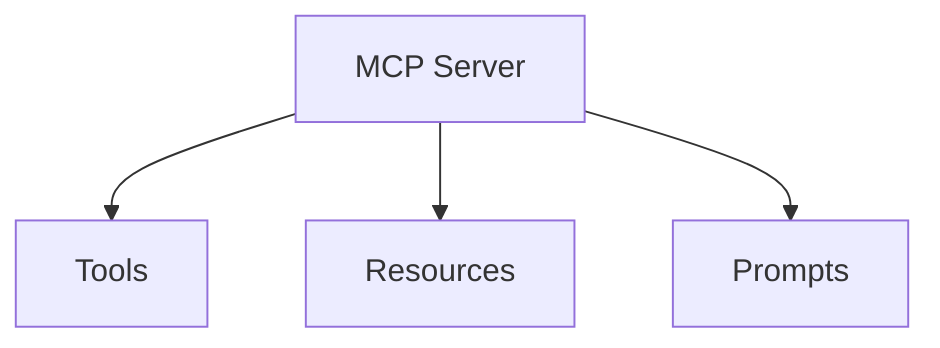

---
tags:
  - mcp
  - tools
  - resources
  - prompts
  - primitives
type: note
status: draft
source: "MCP Official Docs - modelcontextprotocol.io"
parent_note: "[[02 AI Systems/MCP/MCP - MOC|MCP - MOC]]"
created: "2026-04-23"
updated: ""
---

# Core Primitives: Tools, Resources, Prompts

> recreated จาก MCP official docs (ชื่อไฟล์เดิมมี colon ซึ่ง Windows ไม่รองรับ)

---

## 3 Server Primitives

MCP servers expose 3 core primitives ให้ clients:

| Primitive | ลักษณะ | หน้าที่ | ตัวอย่าง |
|---|---|---|---|
| **Tools** | model-controlled, executable | actions ที่ model เรียกใช้ได้ | query database, call API, file operations |
| **Resources** | application-driven, read-only | context data สำหรับ model | file contents, database schemas, API responses |
| **Prompts** | user-controlled, templates | reusable interaction templates | system prompts, few-shot examples |

### Discovery Pattern

ทุก primitive ใช้ pattern เดียวกัน:
- `*/list` — ค้นหา primitives ที่มี (รองรับ pagination)
- `*/get` หรือ `*/read` — ดึงข้อมูล
- `tools/call` — execute tool (เฉพาะ tools)

listings เป็น dynamic — server สามารถเปลี่ยน primitives ที่ expose ได้ระหว่าง session

---

## Tools

tools เป็น executable functions ที่ model เรียกใช้ได้:

- model ค้นพบ tools ผ่าน `tools/list`
- model เรียกใช้ผ่าน `tools/call` พร้อม arguments
- server ตอบกลับด้วย content (text, image, audio, resource links)

### Tool Definition

| Field | หน้าที่ |
|---|---|
| `name` | unique identifier |
| `title` | human-readable name (optional) |
| `description` | อธิบาย functionality |
| `inputSchema` | JSON Schema สำหรับ parameters |
| `outputSchema` | JSON Schema สำหรับ structured output (optional) |
| `annotations` | metadata เกี่ยวกับ behavior |

### Tool Results

results มีได้หลายรูปแบบ:
- **Text content** — ข้อความ
- **Image/Audio content** — base64-encoded media
- **Resource links** — URI ที่ client ดึงเพิ่มได้
- **Embedded resources** — resource data ฝังใน result
- **Structured content** — JSON object ตาม outputSchema

### Error Handling

2 ระดับ:
- **Protocol errors** — JSON-RPC errors (unknown tool, invalid arguments)
- **Tool execution errors** — `isError: true` ใน result (API failures, business logic errors)

---

## Resources

resources เป็น read-only data sources:

- application ค้นพบผ่าน `resources/list`
- application อ่านผ่าน `resources/read`
- รองรับ subscriptions สำหรับ real-time updates

### Resource Definition

| Field | หน้าที่ |
|---|---|
| `uri` | unique identifier (file://, https://, git://, custom) |
| `name` | ชื่อ resource |
| `title` | human-readable name (optional) |
| `description` | อธิบาย (optional) |
| `mimeType` | MIME type (optional) |
| `annotations` | audience, priority, lastModified |

### Resource Templates

parameterized resources ผ่าน URI templates — ช่วยให้ server expose resources แบบ dynamic

---

## Prompts

prompts เป็น reusable templates สำหรับ model interactions:

- ค้นพบผ่าน `prompts/list`
- ดึงผ่าน `prompts/get`
- ใช้เป็น system prompts, few-shot examples, workflow templates

---

## Security Considerations

- servers ต้อง validate tool inputs ทั้งหมด
- ต้อง implement access controls และ rate limiting
- clients ควร prompt user confirmation สำหรับ sensitive operations
- clients ควร validate tool results ก่อนส่งให้ model
- resource URIs ต้อง validate ก่อน access

---

## ความสัมพันธ์กับโน้ตอื่น

- [[02 AI Systems/MCP/Core/02 - Architecture_ Host, Client, Server|Architecture]] — protocol structure
- [[02 AI Systems/MCP/Client/04 - Client Features_ Sampling, Roots, Elicitation|Client Features]] — client-side primitives
- [[02 AI Systems/MCP/Security/05 - Security, Consent และ Authorization|Security]] — consent model
- [[02 AI Systems/AI Agent Fundamentals/Core/08 - Harness Engineering|Harness Engineering]] — tools เป็น harness component
- [[02 AI Systems/Guardrails/Core/03 - Tool Safety|Tool Safety]] — safety controls สำหรับ tool execution
- [[02 AI Systems/MCP/MCP - MOC|MCP - MOC]]

---

## Official References

- MCP Tools: https://modelcontextprotocol.io/docs/concepts/tools
- MCP Resources: https://modelcontextprotocol.io/docs/concepts/resources
- MCP Prompts: https://modelcontextprotocol.io/docs/concepts/prompts
