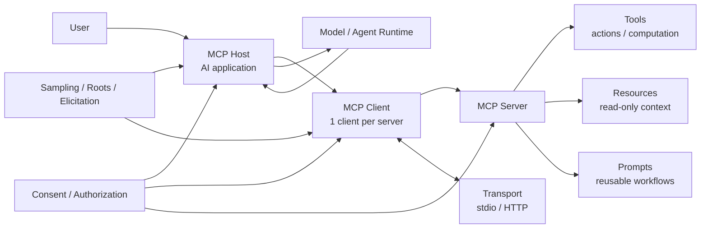

---
tags:
  - mcp
  - moc
  - protocol
type: moc
status: evergreen
source: ""
parent_note: "[[Home]]"
---
# MCP - MOC

> แหล่งความรู้รวมทุกหัวข้อเกี่ยวกับ Model Context Protocol
> Sources: Hugging Face MCP Course · MCP Official Docs (modelcontextprotocol.io) · MCP Specification


---

## Scope

หมวดนี้ครอบ problem framing ของ MCP, architecture ระหว่าง host/client/server, core primitives, capabilities ฝั่ง client, security/consent, และทิศทาง implementation สำหรับการเชื่อม tools เข้ากับ LLM applications

กติกาการอ่าน:
- ไฟล์ที่มีเลข `01, 02, 03...` คือ core learning path ของหมวดนี้
- ลำดับด้านล่างเรียงจาก problem framing -> architecture -> primitives -> client capabilities -> security -> implementation

---

## MCP System Map



ภาพนี้วาง MCP เป็น protocol boundary ระหว่าง AI application กับ external capability provider โดยแยก host, client, server, primitives, transport, และ security/consent ออกจากกัน เพื่อไม่ให้สับสนระหว่าง agent architecture กับ integration protocol.

---

## Notes Map

- [[01 - MCP คืออะไรและแก้ปัญหาอะไร]] — นิยาม, M×N problem, ขอบเขต protocol
- [[02 - Architecture_ Host, Client, Server]] — participants, layering, transport (stdio/HTTP), lifecycle, JSON-RPC
- [[03 - Core Primitives_ Tools, Resources, Prompts]] — ความสามารถฝั่ง server, ฟีเจอร์เสริม, capability matrix
- [[04 - Client Features_ Sampling, Roots, Elicitation]] — ความสามารถฝั่ง client, logging
- [[05 - Security, Consent และ Authorization]] — consent, authorization, security checklist
- [[06 Engineering/Recipes/Recipe - HuggingFace MCP Course และ Implementation Guide]] — Course Units 0–3.1, Gradio MCP, Implementation Blueprint, When to use/not use MCP

---

## Related Notes

- [[02 AI Systems/AI Agent Fundamentals/AI Agent Fundamentals - MOC|AI Agent Fundamentals]] — MCP คือ protocol layer สำหรับเชื่อม tools เข้ากับ agents
- [[01 Foundations/LLM Foundations/LLM Foundations - MOC|LLM Foundations]] — Host ใน MCP คือ LLM application; Tools ทำงานบนผลลัพธ์ของ LLM inference
- [[01 Foundations/Prompt Engineering/Prompt Engineering - MOC|Prompt Engineering]] — MCP Prompts (server feature) เป็น reusable prompt templates ที่ server ส่งให้ host
- [[03 Tools/Claude Code/Core/26 - Extensibility Mechanisms|Claude Code Extensibility]] — MCP เป็น 1 ใน 4 extensibility mechanisms ของ Claude Code (context cost สูงสุด)

---

## Learning Path

### 1. Foundations Before MCP

1. [[02 AI Systems/MCP/Bridge/14 - Tools_ การออกแบบและทำงาน]]
2. [[04 Synthesis/Bridge/Synthesis - Weights, Context, Retrieval และ Tools]]

### 2. Core MCP Concepts

1. [[01 - MCP คืออะไรและแก้ปัญหาอะไร]]
2. [[02 - Architecture_ Host, Client, Server]]
3. [[03 - Core Primitives_ Tools, Resources, Prompts]]
4. [[04 - Client Features_ Sampling, Roots, Elicitation]]
5. [[05 - Security, Consent และ Authorization]]

### 3. Practical Orientation

1. [[06 Engineering/Recipes/Recipe - HuggingFace MCP Course และ Implementation Guide]]

---

## Quick Reference

```
Host    = แอป AI ที่ผู้ใช้งาน
Client  = connector ภายใน host (1 client : 1 server)
Server  = บริการที่ expose capabilities
Tools   = action/computation (side effects, ต้อง consent)
Resources = read-only context (lower risk)
Prompts = reusable template/workflow
```

## Implementation Bridge

- [[06 Engineering/README]]
- [[06 Engineering/MCP/MCP - MOC]]
- [[Knowledge Topic Registry]]
