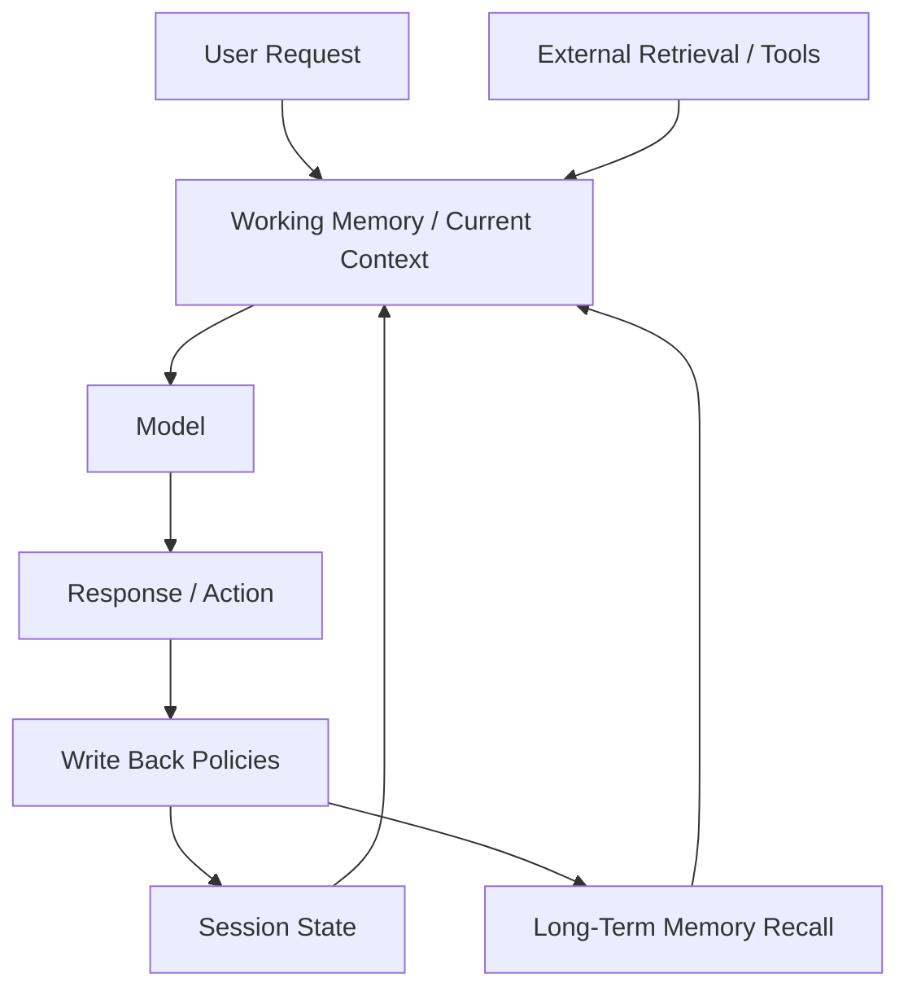
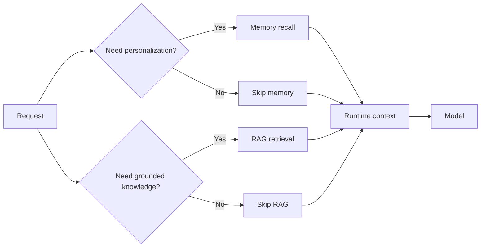

---
tags:
  - memory
  - agents
  - patterns
type: note
status: evergreen
source: "Microsoft Foundry Memory Docs · Google ADK Sessions and Memory Docs · OpenAI Conversation State and File Search Docs"
parent_note: "[[Memory Systems - MOC]]"
---

# Memory Systems - Agent Memory Patterns

## Summary

agent systems ที่ใช้งานจริงมักใช้ memory หลายชั้นร่วมกัน เช่น working memory ใน context, session state, episodic logs, semantic memory stores, และ external retrieval จาก corpus หรือ tools

---

## Scope

- short-term vs long-term memory
- memory-augmented agents
- checkpoints and resumability
- retrieval policies
- orchestration implications

---

## ทำไม agent ต้องมีหลายชั้นของ memory

ไม่มี memory layer เดียวที่ตอบทุกอย่างได้พร้อมกัน

- `working memory` ดีสำหรับ reasoning ใน turn ปัจจุบัน
- `session state` ดีสำหรับ continuity ภายใน thread
- `long-term memory` ดีสำหรับ personalization และ durable knowledge
- `external retrieval` ดีสำหรับ source-grounded knowledge และ corpus search

Microsoft Foundry, Google ADK, และ OpenAI docs เมื่ออ่านรวมกันจะเห็น pattern เดียวกันคือ:
- runtime context อย่างเดียวไม่พอ
- session continuity อย่างเดียวไม่พอ
- external retrieval อย่างเดียวก็ไม่เท่ากับ memory

ดังนั้น agent memory patterns คือวิธีประกอบหลาย layer เข้าด้วยกันให้เหมาะกับงาน

---

## Pattern 1: Context-Only Agent

pattern ที่ง่ายที่สุดคือใช้เฉพาะ working memory ใน turn ปัจจุบัน

องค์ประกอบ:
- current prompt
- recent chat history
- current tool outputs

เหมาะกับ:
- short tasks
- single-turn or short-thread assistants
- low-complexity workflows

ข้อดี:
- simple
- trace ง่าย
- ไม่มี memory privacy burden เพิ่ม

ข้อจำกัด:
- continuity อ่อน
- ข้าม session ไม่ได้
- context โตเร็ว

pattern นี้ใกล้กับสิ่งที่ Anthropic อธิบายเรื่อง context as working memory มากที่สุด

---

## Pattern 2: Session-State Agent

Google ADK แยก `Session` และ `State` ชัดเจน ทำให้เห็น pattern ที่สองคือใช้ stateful session เป็นชั้นต่อจาก working memory

องค์ประกอบ:
- current context
- thread-level state
- resumable conversation object or thread

เหมาะกับ:
- multi-turn assistants
- support workflows
- agents ที่ต้อง maintain state ของ task ใน thread เดียว

ข้อดี:
- continuity ภายใน thread ดีขึ้น
- resume execution ได้ดีขึ้น

ข้อจำกัด:
- ยังไม่ใช่ long-term memory จริง
- ถ้าขยายไปหลาย threads/users จะเริ่มจำกัด

---

## Pattern 3: Semantic Memory Agent

pattern นี้เพิ่ม long-term memory ที่เป็น distilled facts หรือ preferences

องค์ประกอบ:
- context + session state
- semantic memory store
- retrieval policy สำหรับ profile/fact recall

เหมาะกับ:
- personalization
- agents ที่ต้องจำ user preferences
- systems ที่ต้อง carry stable facts across sessions

ตัวอย่างสิ่งที่มักถูกเก็บ:
- preferred output style
- durable user settings
- stable entity facts
- summaries distilled from many interactions

Microsoft Foundry long-term memory types และ Azure Cosmos agentic memories สอดคล้องกับ pattern นี้มากที่สุด

---

## Pattern 4: Episodic Memory Agent

pattern นี้เพิ่มความสามารถในการอ้างอิง past episodes หรือ trajectories

องค์ประกอบ:
- context + session state
- episodic store of prior interactions or task runs
- retrieval by similarity, time, or task structure

เหมาะกับ:
- reflection
- debugging
- retry from past failures
- resume partially completed plans

ข้อดี:
- ช่วย planning ได้ดี
- ช่วยให้ agent เรียนจากประสบการณ์เดิม

ข้อจำกัด:
- noisy ถ้าเก็บ raw logs ทั้งหมด
- retrieval ยากกว่า semantic memory

---

## Pattern 5: Memory + RAG Agent

pattern นี้แยกชัดระหว่าง:
- memory ของผู้ใช้หรือระบบ
- external corpus retrieval เพื่อ grounding

OpenAI file search docs ช่วยให้เห็น external retrieval pattern ชัดเจน ว่า model สามารถใช้ tool เพื่อค้นใน vector store ได้  
ในเชิงสถาปัตย์ จึงเกิด pattern ที่ทั้ง memory recall และ RAG retrieval ทำงานคู่กัน

### Memory ใช้สำหรับ

- personalization
- continuity
- prior interactions

### RAG ใช้สำหรับ

- external evidence
- updatable knowledge
- citations and grounding

---

## Pattern 6: Procedural Memory Agent

pattern นี้เพิ่ม reusable methods เข้าไปใน runtime

องค์ประกอบ:
- instructions or policies
- reusable workflows
- task-specific playbooks
- skill libraries

เหมาะกับ:
- recurring task classes
- enterprise workflows
- tool-heavy agents

ในหลายระบบ procedural memory อาจไม่ได้เก็บใน memory database โดยตรง แต่ไปอยู่ใน:
- instructions
- tools registry
- workflow engine
- framework skill abstraction

ดังนั้น procedural memory มักเป็นสะพานระหว่าง memory systems กับ agent frameworks

---

## Pattern 7: Checkpoint and Resumability Pattern

บางระบบไม่ใช่แค่ “จำอะไร” แต่ต้อง “กลับมาทำต่อจากตรงเดิม”

pattern นี้มักรวม:
- session state
- checkpointed execution state
- partial outputs
- tool progress

เหมาะกับ:
- long-running agents
- multi-step orchestration
- human approval checkpoints

นี่เป็นจุดเชื่อมตรงระหว่าง memory systems กับ runtime frameworks

---

## Policy Implications by Pattern

### Context-Only

- read policy เบา
- write policy แทบไม่มี

### Session-State

- ต้องมี state lifecycle
- ต้องคุม thread boundaries

### Semantic Memory

- ต้องมี consolidation
- ต้องคุม staleness และ scope

### Episodic Memory

- ต้องมี salience filter
- ต้องคุม retrieval noise

### Memory + RAG

- ต้องแยก retrieval intent สองแบบ
- ต้องกัน memory recall ไปกลบ grounded evidence

### Procedural Memory

- ต้อง validate methods
- ต้อง version reusable procedures

---

## Choosing a Pattern

### ใช้ Context-Only เมื่อ

- งานสั้น
- continuity ไม่สำคัญ
- ต้องการ simplicity สูงสุด

### เพิ่ม Session State เมื่อ

- มี multi-turn workflows
- ต้อง resume in-thread tasks

### เพิ่ม Semantic Memory เมื่อ

- ต้องจำ user preferences หรือ durable facts

### เพิ่ม Episodic Memory เมื่อ

- task มีการลองผิดลองถูก
- past attempts มีค่าต่ออนาคต

### เพิ่ม RAG ควบคู่ เมื่อ

- ต้องการ grounded answers จาก corpus

### เพิ่ม Procedural Memory เมื่อ

- งานมีวิธีทำซ้ำได้
- ต้องการ reusable task strategies

---

## Failure Modes

### 1. Use One Pattern for Every Task

พยายามใช้ pattern เดียวครอบทุกงานจนระบบแข็งหรือ noisy

### 2. Confuse Memory with Retrieval

ใช้ RAG แทน personalization memory หรือใช้ memory แทน source-grounded retrieval

### 3. Persist Too Early

เขียนสิ่งที่ยังไม่ stable ลง long-term memory

### 4. Missing Checkpoint Layer

ระบบต้อง resume ได้ แต่มีแค่ semantic memory ทำให้กลับมาทำงานต่อไม่ถูก

### 5. Over-Personalization

memory recall แทรกทุกที่จนตอบเอนตามประวัติผู้ใช้เกินเหตุ

---

## Design Rules

- เริ่มจาก pattern ที่ง่ายที่สุดก่อน
- เพิ่ม memory layer เมื่อมี use case รองรับจริง
- แยก session continuity, memory recall, และ corpus retrieval ออกจากกัน
- อย่าออกแบบ memory จาก storage มุมเดียว ต้องออกแบบจาก task pattern ด้วย
- ถ้าระบบมี long-running execution ให้คิด checkpoint/resumability แยกจาก semantic memory

---

## ความสัมพันธ์กับโน้ตอื่น

- [[02 AI Systems/Memory Systems/Core/01 - Working Memory vs Long-Term Memory]] — โครง memory ชั้นหลัก
- [[02 AI Systems/Memory Systems/Core/02 - Episodic vs Semantic vs Procedural Memory]] — taxonomy ของ long-term memory
- [[02 AI Systems/Memory Systems/Core/03 - Memory Read and Write Policies]] — control plane ของ memory
- [[02 AI Systems/Agent Frameworks/Core/03 - State and Memory]] — state/memory ใน frameworks
- [[02 AI Systems/RAG/RAG - MOC]] — external retrieval ที่มักทำงานคู่กับ memory
- [[02 AI Systems/AI Agent Fundamentals/05 - วงจร Perceive-Think-Act-Check]] — agent loop ที่ memory เข้าไปเสริม

---

## Related Notes

- [[02 AI Systems/AI Agent Fundamentals/05 - วงจร Perceive-Think-Act-Check]]
- [[02 AI Systems/Agent Frameworks/Core/03 - State and Memory]]
- [[02 AI Systems/RAG/RAG - MOC]]
- [[Memory Systems - MOC]]

---

## Official References

- Microsoft Foundry - What is Memory?: https://learn.microsoft.com/en-us/azure/ai-foundry/agents/concepts/agent-memory?view=foundry
- Microsoft Foundry - Create and Use Memory: https://learn.microsoft.com/en-us/azure/ai-foundry/agents/how-to/memory-usage?view=foundry
- Google ADK - Session, State, and Memory: https://google.github.io/adk-docs/sessions/
- Google ADK - Memory: https://google.github.io/adk-docs/sessions/memory/
- OpenAI - Conversation State: https://platform.openai.com/docs/guides/conversation-state?api-mode=responses
- OpenAI - File Search: https://platform.openai.com/docs/guides/tools-file-search
