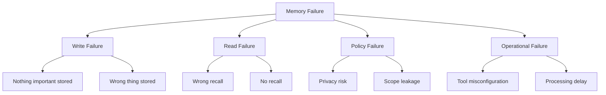
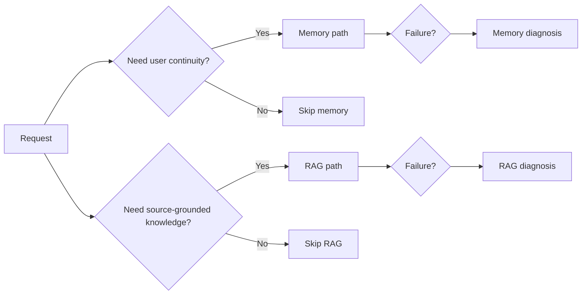

---
tags:
  - memory
  - failures
type: note
status: draft
source: "Microsoft Foundry Memory Docs · Azure Cosmos Agentic Memories Docs · Google ADK Memory Docs · OpenAI Conversation State and File Search Docs"
parent_note: "[[Memory Systems - MOC]]"
---

# Memory Systems - Memory Failure Modes

## Summary

memory system พลาดได้ทั้งจากการจำมากเกินไป, จำน้อยเกินไป, จำผิด, ดึงกลับมาผิดเวลา, หรือจัดการ scope และ privacy ผิดจนระบบตอบเพี้ยนหรือเสี่ยงด้านความปลอดภัย

---

## Scope

- stale memory
- wrong recall
- privacy leaks
- duplication
- over-personalization

---

## ทำไม memory failures สำคัญ

ยิ่งระบบมี memory layer มากขึ้น ความผิดพลาดก็จะซ่อนลึกขึ้น:
- user อาจไม่รู้ว่าคำตอบเพี้ยนเพราะ memory recall
- operator อาจคิดว่าปัญหาอยู่ที่ model ทั้งที่จริงอยู่ที่ retrieval หรือ scope
- stale memory อาจดู “สมเหตุสมผล” จนจับยาก

Microsoft Foundry memory docs และ troubleshooting pages ชี้ failure modes ที่เป็น operational failures โดยตรง เช่น:
- memory search ไม่เจอเพราะ scope ไม่ตรง
- memory ไม่ถูกอัปเดตเพราะ processing delay
- agent ไม่ใช้ memory เพราะ memory tool config ผิด

นี่ทำให้ memory failures ไม่ใช่แค่ quality issue แต่เป็นทั้ง:
- architecture issue
- policy issue
- operational issue
- safety issue

---

## 1. Under-Memory

ระบบจำสิ่งที่ควรจำไม่พอ

ตัวอย่าง:
- ผู้ใช้ย้ำ preference หลายครั้งแต่ไม่ถูกเขียนลง memory
- successful workflow ไม่ถูกสกัดเป็น reusable procedure
- long-term continuity ไม่เกิดแม้ใช้งานหลาย session

ผลกระทบ:
- agent ดูเหมือนไม่เรียนรู้อะไร
- personalization ไม่เกิด
- user experience ไม่ต่อเนื่อง

สาเหตุที่พบบ่อย:
- write triggers เข้มเกินไป
- update pipeline ช้า
- ไม่มี consolidation step

---

## 2. Over-Memory

ระบบเขียนทุกอย่างลง memory จน memory layer กลายเป็น noisy archive

ตัวอย่าง:
- raw conversations ทั้งหมดถูกเก็บแบบไม่กรอง
- one-off requests ถูกมองเป็น persistent preference
- temporary context ถูก promote เป็น long-term memory

ผลกระทบ:
- retrieval noisy
- context ถูก memory ที่ไม่เกี่ยวกลบ
- cost เพิ่ม

สาเหตุที่พบบ่อย:
- ไม่มี salience policy
- append-only mindset
- แยก memory type ไม่ชัด

---

## 3. Wrong Recall

ระบบ recall memory ที่ไม่เกี่ยวกับ request ปัจจุบัน

ตัวอย่าง:
- ดึง preference เก่าที่ไม่เกี่ยวกับงานนี้
- ดึง episode จากคนละบริบทมาใช้
- inject procedural hint ที่ไม่เหมาะกับ task ปัจจุบัน

ผลกระทบ:
- answer เพี้ยน
- over-personalization
- reasoning เบี่ยง

สาเหตุที่พบบ่อย:
- retrieval ranking ไม่ดี
- query formation ไม่ดี
- memory types ปนกัน

---

## 4. No Recall When Needed

memory มีอยู่แต่ระบบไม่ดึงกลับมาในเวลาที่ควร

Microsoft Foundry troubleshooting ระบุกรณี memory search returns no results เมื่อ `scope` ไม่ตรง และกรณี agent response doesn’t use stored memory เมื่อ memory tool config ไม่ถูก

ตัวอย่าง:
- user preference ถูกเก็บแล้วแต่ไม่ถูก recall
- memory store ถูก populate แล้วแต่ agent ไม่ query
- มี memory แต่ retrieval trigger ไม่ทำงาน

ผลกระทบ:
- continuity ดูหายไป
- operator สับสนว่า memory ใช้งานได้จริงไหม

---

## 5. Stale Memory

memory เคยถูกต้อง แต่ไม่ตรงกับโลกปัจจุบันแล้ว

ตัวอย่าง:
- profile facts เปลี่ยนแล้วแต่ store ยังเป็นค่าเดิม
- workflow เก่าถูกใช้กับระบบใหม่
- semantic memory เคยถูกสรุปผิดและไม่ถูกแก้

ผลกระทบ:
- answer ดูมั่นใจแต่ผิด
- personalization กลายเป็น mis-personalization
- procedural memory นำไปสู่การกระทำผิดขั้นตอน

stale memory เป็น failure ที่อันตรายเพราะดู “มีเหตุผล” มากกว่าข้อมูลที่หายไปเฉย ๆ

---

## 6. Scope Leakage

memory ถูกเรียกข้ามขอบเขตที่ไม่ควร

ตัวอย่าง:
- user A เห็น memory ของ user B
- thread หนึ่งไปดึง memory ของอีก thread
- project-scoped memory ถูกใช้ใน workspace อื่น

Microsoft Foundry docs เน้นเรื่อง `scope` ชัดเจน และ troubleshooting ก็ชี้ว่าการใช้ scope ไม่ตรงกันทำให้ทั้ง search miss และ recall ผิดบริบทได้

ผลกระทบ:
- privacy breach
- wrong personalization
- compliance risk

---

## 7. Duplication and Drift

memory เดียวกันถูกเก็บหลายแบบจน conflict กันเอง

ตัวอย่าง:
- มีทั้ง raw episode, summary, และ profile fact ที่ไม่ตรงกัน
- preference ถูกเก็บหลาย record พร้อมค่าไม่เหมือนกัน
- procedural memory หลายเวอร์ชันปะปนกัน

ผลกระทบ:
- retrieval ranking สับสน
- consolidation ยากขึ้น
- traceability แย่ลง

---

## 8. Tooling and Processing Failures

บางครั้งปัญหาไม่ได้อยู่ที่ policy แต่เป็น implementation/runtime

ตัวอย่างจาก Microsoft troubleshooting:
- memory updates are debounced or still processing
- memory search returns no results
- agent definition ไม่มี `memory_search` tool
- identity/authorization ไม่ถูกต้อง

ผลกระทบ:
- system ดูเหมือน “จำไม่ได้” ทั้งที่จริง config ผิด
- debug ยากถ้าไม่มี observability

---

## 9. Over-Personalization

ระบบใช้ user memory มากเกินไปจนทุกคำตอบถูกดึงเข้าหาบุคคลมากเกินจำเป็น

ตัวอย่าง:
- ทุก request ถูก bias ด้วย style preference แม้ไม่เกี่ยว
- prior interactions ไปกดทับ fresh evidence จาก RAG
- system assume user intent จากอดีตมากไป

ผลกระทบ:
- answer แคบลง
- grounding แย่ลง
- user trust ลดลง

---

## 10. Memory vs RAG Confusion

ระบบไม่แยก memory layer ออกจาก external retrieval

ตัวอย่าง:
- ใช้ memory แทน source-grounded corpus
- ใช้ RAG corpus แทน user-specific memory
- ไม่รู้ว่าปัญหาอยู่ที่ memory recall หรือ document retrieval

ผลกระทบ:
- diagnosis ยาก
- citation trust ไม่ชัด
- architecture โตแบบมั่ว

---

## Diagnosing Memory Failures

เวลาระบบตอบเพี้ยน ควรถามตามลำดับนี้:

1. ข้อมูลที่ควรจำถูกเขียนจริงไหม
2. ถูกเขียนใน scope ที่ถูกไหม
3. retrieval trigger ทำงานไหม
4. ดึง memory type ที่ถูกไหม
5. memory สดพอไหม
6. memory ไปกลบ grounded evidence หรือไม่

ถ้าไม่มี observability ระบบจะชี้สาเหตุผิดไปที่ model quality ได้ง่าย

---

## การประเมิน memory failures

memory failures ควรถูก eval หลายชั้น:

- write quality
- recall precision
- recall coverage
- stale memory rate
- scope safety
- personalization usefulness

นี่คือจุดเชื่อมตรงกับ `Evals` และ `Guardrails`

---

## Design Rules

- อย่า treat memory เป็น black box
- instrument write, consolidation, read, and delete paths
- define scope และ retention ชัดตั้งแต่ต้น
- แยก diagnosis ของ memory recall ออกจาก RAG retrieval
- ทดสอบทั้ง no-recall และ wrong-recall cases
- ถ้ามี personalization ให้มี guardrails กัน over-personalization

---

## ความสัมพันธ์กับโน้ตอื่น

- [[02 AI Systems/Memory Systems/Core/03 - Memory Read and Write Policies]] — ต้นเหตุของ failure ส่วนใหญ่
- [[02 AI Systems/Memory Systems/Application/04 - Agent Memory Patterns]] — patterns ที่ failure เกิดใน runtime
- [[02 AI Systems/Guardrails/Guardrails - MOC]] — privacy, scope, retention, safety
- [[02 AI Systems/Evals/Evals - MOC]] — วิธีประเมิน failure เหล่านี้
- [[02 AI Systems/RAG/RAG - MOC]] — แยก memory failures ออกจาก retrieval failures

---

## Related Notes

- [[02 AI Systems/Guardrails/Guardrails - MOC]]
- [[02 AI Systems/Evals/Evals - MOC]]
- [[02 AI Systems/RAG/RAG - MOC]]
- [[Memory Systems - MOC]]

---

## Official References

- Microsoft Foundry - What is Memory?: https://learn.microsoft.com/en-us/azure/ai-foundry/agents/concepts/agent-memory?view=foundry
- Microsoft Foundry - Create and Use Memory: https://learn.microsoft.com/en-us/azure/ai-foundry/agents/how-to/memory-usage?view=foundry
- Azure AI Foundry Agent Service FAQ: https://learn.microsoft.com/en-us/azure/ai-services/agents/faq
- Azure Cosmos DB - Agent memories in Azure Cosmos DB for NoSQL: https://learn.microsoft.com/en-us/azure/cosmos-db/gen-ai/agentic-memories
- Google ADK - Session, State, and Memory: https://google.github.io/adk-docs/sessions/
- Google ADK - Memory: https://google.github.io/adk-docs/sessions/memory/
- OpenAI - Conversation State: https://platform.openai.com/docs/guides/conversation-state?api-mode=responses
- OpenAI - File Search: https://platform.openai.com/docs/guides/tools-file-search
