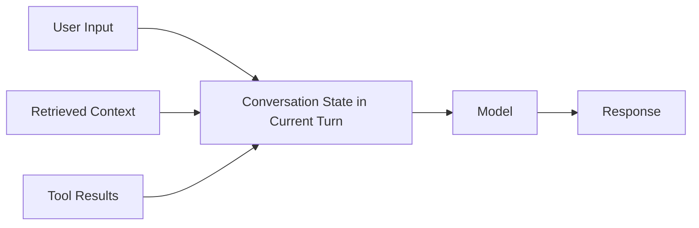
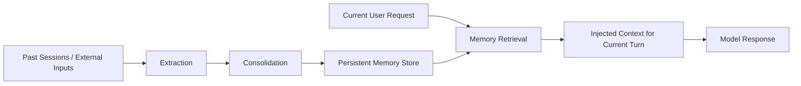
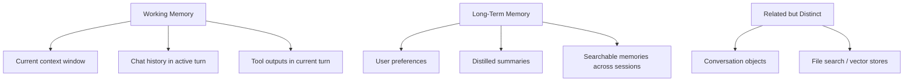

---
tags:
  - memory
  - workingmemory
  - longtermmemory
type: note
status: evergreen
source: "Anthropic Context Windows Docs · OpenAI Conversation State and File Search Docs · Microsoft Foundry Memory Docs · Google ADK Sessions and Memory Docs"
parent_note: "[[Memory Systems - MOC]]"
---

# Memory Systems - Working Memory vs Long-Term Memory

## Summary

working memory คือข้อมูลที่ model เห็นใน context ของรอบปัจจุบัน ส่วน long-term memory คือข้อมูลที่ถูกเก็บและเรียกกลับมาใช้นอก context ของรอบนั้น เพื่อรองรับ continuity ข้ามรอบหรือข้าม session

---

## Scope

- context as working memory
- persistent memory outside the active turn
- session state vs memory
- memory retrieval
- design tradeoffs

---

## Working Memory คืออะไร

Anthropic อธิบาย `context window` ว่าเป็น “working memory” ของโมเดลระหว่างการสร้างคำตอบ นี่คือข้อมูลทั้งหมดที่ model มองเห็นและอ้างอิงได้ใน request นั้น

ในเชิงระบบ working memory จึงรวมสิ่งอย่าง:
- current user query
- chat history ที่ยังถูกส่งอยู่ใน request
- retrieved context ที่ถูกแนบเข้ามา
- tool outputs ที่ถูกป้อนกลับเข้า context
- session state ที่ runtime เลือก inject เข้ามาในรอบนั้น

ลักษณะสำคัญ:
- อยู่ใน runtime context
- จำกัดด้วย context window
- เปลี่ยนได้ทุก turn
- ไม่ใช่ durable storage

---

## Long-Term Memory คืออะไร

Microsoft Foundry อธิบาย memory ว่าเป็น persistent knowledge retained by an agent across sessions และแยกจาก short-term memory ของ session ปัจจุบันอย่างชัดเจน  
Google ADK ก็แยก `Session`/`State` ออกจาก `MemoryService` โดยมอง memory เป็น searchable, cross-session information

ดังนั้นในกรอบของ vault นี้ long-term memory คือข้อมูลที่:
- อยู่ใน persistent store
- ถูกสกัดหรือจัดรูปจาก interactions เดิมหรือแหล่งอื่น
- ถูกเรียกกลับมาตาม retrieval policy
- ใช้เพื่อ continuity ข้าม session, thread, device, หรือ workflow

องค์ประกอบที่พบบ่อย:
- persistent store
- extraction logic
- consolidation logic
- retrieval policy
- identity or scope model

## Session State ไม่เท่ากับ Long-Term Memory

OpenAI docs อธิบายว่าแต่ละ text generation request เป็นอิสระจากกันโดยธรรมชาติ แต่สามารถทำให้มี continuity ได้โดย:
- ส่ง conversation history เดิมกลับเข้า request
- ใช้ persistent conversation objects
- ใช้ external knowledge เช่น file search / vector stores

Google ADK ก็แยก:
- `Session` = current conversation thread
- `State` = temporary data within that session
- `Memory` = searchable information ข้ามหลาย sessions

ดังนั้น session state กับ long-term memory มีหน้าที่ต่างกัน:
- session state ช่วยคุมบริบทของบทสนทนาปัจจุบัน
- long-term memory ช่วยดึงสิ่งที่ควรอยู่ข้ามบทสนทนากลับมา

---

## ความต่างเชิงระบบ

### Working Memory

เหมาะกับ:
- immediate context
- current task state
- local tool outputs
- near-term reasoning

ข้อจำกัด:
- หายเมื่อ request จบหรือหลุดจาก active context
- ตึงตาม context budget
- ถ้ายัดข้อมูลมากเกินไป cost และ latency จะโต

### Long-Term Memory

เหมาะกับ:
- user preferences
- recurring facts
- durable knowledge distilled from prior interactions
- continuity across sessions

ข้อจำกัด:
- ต้องมี retrieval policy
- ต้องคิดเรื่อง staleness และ privacy
- ต้องมี write/consolidation strategy
- ต้องออกแบบ identity/scope ให้ชัด

---

## ภาพรวมจาก Official Docs

### Anthropic

- `context window` คือ working memory ของ model
- สิ่งที่ model เห็นใน turn ปัจจุบันถูกจำกัดด้วย context budget

### OpenAI

- แต่ละ request โดยธรรมชาติเป็นอิสระ
- continuity ทำได้ผ่าน conversation state และ persistent conversation objects
- external knowledge/file search แยกออกจาก conversation state

### Microsoft Foundry

- แยก short-term memory ของ session ออกจาก long-term memory ที่ retained across sessions
- long-term memory ต้องมี extraction, consolidation, retrieval

### Google ADK

- แยก `Session`, `State`, และ `MemoryService`
- `MemoryService` เป็น long-term knowledge store ที่ ingest จาก session และ search กลับมาใช้ได้

---

## Memory Retrieval

long-term memory จะมีประโยชน์ก็ต่อเมื่อเรียกกลับมาใช้ถูกเวลา  
ดังนั้น memory system ที่ดีต้องตอบ 2 คำถาม:

1. อะไรควรถูกเขียนเก็บ
2. เมื่อไรควรถูกดึงกลับมา

Microsoft Foundry และ Google ADK ต่างชี้คล้ายกันว่า memory layer ต้องมี retrieval step ชัดเจน ไม่ใช่แค่เก็บข้อมูลไว้เฉย ๆ  
OpenAI docs ก็แยก external knowledge tools ออกมาให้ agent เรียกใช้ระหว่าง workflow

เชิงสถาปัตย์ memory retrieval จึงใกล้กับ retrieval systems แต่ไม่เท่ากับ RAG เสมอไป:
- memory retrieval มักเน้น user-specific หรือ session-derived knowledge
- RAG มักเน้น curated corpus หรือ external documents

> Design inference: ในระบบจริง memory กับ RAG มักอยู่ใน retrieval family เดียวกัน แต่มี write policy, trust model, และ scope ต่างกัน

---

## Working Memory ไม่ใช่ Long-Term Memory

ข้อสับสนที่พบบ่อย:
- มี chat history ยาว = มี memory
- context ใหญ่ = long-term memory
- มี conversation object = มี long-term memory เสมอ

จริง ๆ แล้ว:
- context window เป็น working memory
- conversation state ช่วย persist thread ได้ แต่ยังไม่เท่ากับ distilled long-term memory โดยอัตโนมัติ
- long-term memory ต้องมี persistent store และ retrieval policy

ดังนั้นการ “ยัดทุกอย่างไว้ใน context” ไม่ใช่ memory architecture ระยะยาวที่ดี

---

## Design Tradeoffs

> Architectural inference: trade-offs ส่วนนี้เป็นกรอบออกแบบที่สรุปจาก official docs หลายแหล่งร่วมกัน

### ใช้ Working Memory มาก

ข้อดี:
- simple
- ไม่ต้องมี memory store
- trace ง่าย

ข้อจำกัด:
- จำกัดด้วย context window
- ข้าม session ไม่ได้
- cost/latency โตตามบริบท

### ใช้ Long-Term Memory มาก

ข้อดี:
- continuity ข้าม sessions
- personalization
- persistent state

ข้อจำกัด:
- ซับซ้อนขึ้น
- ต้องคิด write/read policies
- ต้องระวัง stale memory และ privacy

---

## Failure Modes

### 1. Treat Context as Durable Memory

หวังให้ chat history อย่างเดียวแก้ปัญหา continuity ระยะยาว

### 2. Store Too Much

เขียนทุกอย่างลง long-term memory จน retrieval noisy

### 3. Wrong Recall

ดึง memory ที่ไม่เกี่ยวกลับมาแล้วทำให้ answer เพี้ยน

### 4. Stale Memory

memory เก่าแต่ยังถูกเชื่อว่าเป็นปัจจุบัน

### 5. Privacy Risk

เก็บข้อมูลเกินจำเป็นหรือไม่มี retention policy

### 6. Scope Mismatch

retrieve memory ผิด user, ผิด thread, หรือผิด identity scope

---

## Design Rules

- ใช้ context เป็น working memory ไม่ใช่ durable memory
- ใช้ long-term memory เมื่อมี continuity ข้าม sessions จริง
- แยก `session state`, `conversation persistence`, และ `long-term memory` ออกจากกันให้ชัด
- แยก storage, consolidation, และ retrieval policies ให้ชัด
- อย่าเขียนทุก interaction ลง memory โดยอัตโนมัติเสมอไป
- วัดความคุ้มค่าของ memory ด้วย quality, privacy, cost, และ complexity พร้อมกัน

---

## ความสัมพันธ์กับโน้ตอื่น

- [[01 Foundations/Context Windows/Core/01 - Context Window คืออะไร]] — working memory ของ model
- [[04 Synthesis/Bridge/Synthesis - Memory in Agents]] — ภาพรวม memory types
- [[02 AI Systems/Memory Systems/Core/02 - Episodic vs Semantic vs Procedural Memory]] — ประเภทของ long-term memory
- [[02 AI Systems/Memory Systems/Core/03 - Memory Read and Write Policies]] — นโยบายของ memory systems
- [[02 AI Systems/Agent Frameworks/Core/03 - State and Memory]] — memory ใน frameworks
- [[02 AI Systems/RAG/RAG - MOC]] — long-term knowledge retrieval บางแบบเชื่อมกับ RAG
- [[Memory Systems - MOC]]

---

## Related Notes

- [[04 Synthesis/Bridge/Synthesis - Memory in Agents]]
- [[01 Foundations/Context Windows/Core/01 - Context Window คืออะไร]]
- [[Memory Systems - MOC]]

---

## Official References

- Anthropic - Context Windows: https://docs.anthropic.com/en/docs/build-with-claude/context-windows
- OpenAI - Conversation State: https://platform.openai.com/docs/guides/conversation-state?api-mode=responses
- OpenAI - File Search: https://platform.openai.com/docs/guides/tools-file-search
- Microsoft Foundry - What is Memory?: https://learn.microsoft.com/en-us/azure/ai-foundry/agents/concepts/agent-memory?view=foundry
- Microsoft Foundry - Create and Use Memory: https://learn.microsoft.com/en-us/azure/ai-foundry/agents/how-to/memory-usage?view=foundry
- Google ADK - Session, State, and Memory: https://google.github.io/adk-docs/sessions/
- Google ADK - Memory: https://google.github.io/adk-docs/sessions/memory/
