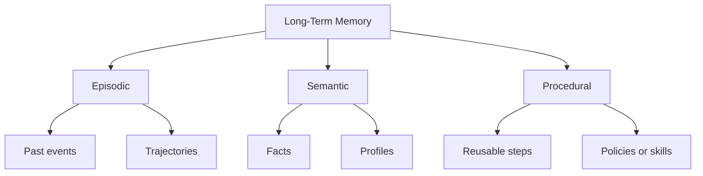
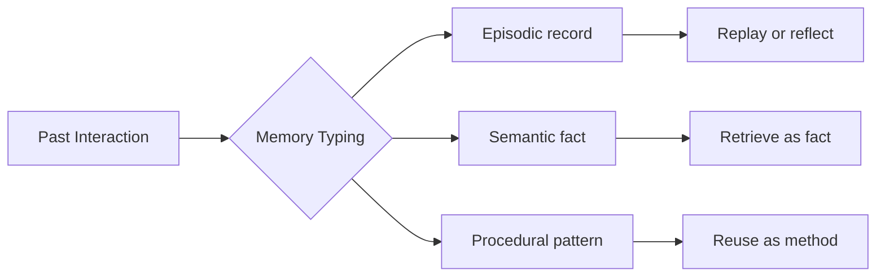

---
tags:
  - memory
  - episodic
  - semantic
  - procedural
type: note
status: evergreen
source: "Microsoft Foundry Memory Docs · Azure Cosmos Agentic Memories Docs · Google ADK Memory Docs · Primary Research on Agent Memory"
parent_note: "[[Memory Systems - MOC]]"
---

# Memory Systems - Episodic vs Semantic vs Procedural Memory

## Summary

memory ของ agent ไม่ได้มีแบบเดียว ควรแยกให้ออกระหว่าง event history, facts, และ reusable procedures เพราะแต่ละแบบมี schema, retrieval policy, และ failure mode ต่างกัน

---

## Scope

- episodic memory
- semantic memory
- procedural memory
- storage implications
- retrieval implications

---

## ทำไมต้องแยก memory types

Microsoft Foundry แยก short-term memory ออกจาก long-term memory และระบุว่า long-term memory ต้องมีการ extract, consolidate, และ retrieve  
Azure Cosmos agentic memories article ก็อธิบายว่า short-term memory มักครอบ recent context ส่วน long-term memory ใช้เก็บ prior facts, interactions, และ experiences

ในเชิงสถาปัตย์ การแยก long-term memory ออกเป็น `episodic`, `semantic`, และ `procedural` ช่วยให้ตอบคำถามได้ชัดขึ้นว่า:
- agent กำลังเรียก “เหตุการณ์เดิม”
- agent กำลังเรียก “ข้อเท็จจริงที่สกัดแล้ว”
- agent กำลังเรียก “วิธีทำงานที่ใช้ซ้ำได้”

> Research framing: taxonomy แบบ episodic / semantic / procedural เป็นกรอบที่ใช้บ่อยในงานวิจัย agent memory มากกว่าจะเป็น taxonomy มาตรฐานเดียวจาก vendor docs ชุดเดียว

---

## Episodic Memory

episodic memory คือ memory ของ “เหตุการณ์” หรือ “ประสบการณ์ที่เกิดขึ้น”  
ในระบบ agent มักอยู่ในรูป:
- prior conversation episodes
- task trajectories
- tool call sequences
- observations with temporal order
- success/failure cases tied to a specific context

Azure Cosmos article ใช้คำว่า agent memories include prior interactions and experiences ซึ่งสอดคล้องกับแนวคิด episodic memory  
งานอย่าง REMem และ AriGraph ก็ใช้กรอบ episodic memory กับ event histories ที่ต้องรักษาลำดับเวลาและความเชื่อมโยงของเหตุการณ์

episodic memory เหมาะกับงานอย่าง:
- recalling similar past attempts
- debugging failed trajectories
- resuming partially completed tasks
- reflecting on what happened in a previous run

ข้อดี:
- เก็บบริบทของเหตุการณ์จริง
- มีประโยชน์ต่อ planning และ reflection

ข้อจำกัด:
- noisy ง่ายถ้าเก็บทั้ง transcript ดิบ
- retrieval ต้องสนใจ time, task, และ similarity พร้อมกัน
- สับสนกับ long chat history ได้ง่าย

---

## Semantic Memory

semantic memory คือ memory ของ “ข้อเท็จจริงที่สกัดแล้ว”  
ในระบบ agent มักอยู่ในรูป:
- user profile facts
- entity records
- stable preferences
- normalized knowledge distilled from many interactions
- summaries or facts extracted from past sessions

Microsoft Foundry ระบุ long-term memory types ที่ใกล้กับ semantic memory ชัดที่สุดคือ:
- user profile memory
- chat summary memory

นั่นทำให้ semantic memory ในเชิงระบบมักมีลักษณะ:
- distilled
- normalized
- less tied to one single event
- easier to retrieve by meaning or entity

semantic memory เหมาะกับงานอย่าง:
- personalization
- fact recall
- persistent user preferences
- entity-centric knowledge

ข้อดี:
- compact กว่า raw episode logs
- reuse ง่ายในหลาย sessions
- retrieval เสถียรกว่า episodic logs ในหลายกรณี

ข้อจำกัด:
- อาจสูญเสียบริบทของเหตุการณ์ต้นทาง
- distillation ผิดแล้วจะกลายเป็น stale or incorrect fact

---

## Procedural Memory

procedural memory คือ memory ของ “วิธีทำ” หรือ reusable procedures  
ในระบบ agent มักอยู่ในรูป:
- reusable workflows
- policies
- tool-use heuristics
- skills
- action templates
- strategies distilled from successful prior runs

ต่างจาก semantic memory ตรงที่ procedural memory ไม่ได้ตอบว่า “อะไรจริง” แต่ตอบว่า “ควรทำอย่างไร”

ในงานวิจัย agent memory หลายชิ้น procedural memory ถูกใช้เพื่อแทน:
- successful plans
- abstracted action patterns
- reusable instructions for future tasks

ในระบบ production จริง procedural memory มักไม่ได้อยู่ใน memory store แบบเดียวกับ semantic memory เสมอไป แต่ไปอยู่ใน:
- system instructions
- skill libraries
- tool selection policies
- workflow definitions

---

## เปรียบเทียบแบบสั้น

| ประเภท | เก็บอะไร | ตัวอย่าง | retrieval key ที่พบบ่อย |
|---|---|---|---|
| Episodic | events / trajectories | prior task run, tool trace, conversation episode | task similarity, time, situation |
| Semantic | distilled facts | user preference, entity fact, profile memory | entity, meaning, profile relevance |
| Procedural | reusable methods | step patterns, policies, workflows, skills | task type, goal, action pattern |

---

## Storage Implications

### Episodic

มักเก็บเป็น:
- logs
- trajectories
- event graphs
- timestamped records

จุดสำคัญ:
- ต้องรักษาลำดับเวลา
- ต้องมี metadata เรื่อง task, outcome, tools, environment

### Semantic

มักเก็บเป็น:
- profiles
- summaries
- fact tables
- entity-centric records

จุดสำคัญ:
- ต้องมี consolidation และ conflict resolution
- ควรมี freshness policy

### Procedural

มักเก็บเป็น:
- templates
- playbooks
- skills
- policy fragments

จุดสำคัญ:
- ต้องมี validation ว่าวิธีนั้นยังใช้ได้
- ควรแยก reusable policy ออกจาก one-off episode

---

## Retrieval Implications

episodic, semantic, และ procedural memory ไม่ควรใช้ retrieval strategy เดียวกันเสมอไป

### Episodic retrieval

มักถามหา:
- เคยเกิดเหตุการณ์คล้ายกันไหม
- เคยลองวิธีนี้แล้วผลเป็นอย่างไร

ต้องการ:
- similarity + temporal structure
- sometimes multi-hop over event history

### Semantic retrieval

มักถามหา:
- ผู้ใช้ชอบอะไร
- fact นี้เกี่ยวกับ entity ไหน

ต้องการ:
- dense retrieval, keyword/entity lookup, or profile lookup

### Procedural retrieval

มักถามหา:
- งานแบบนี้ควรทำเป็นขั้นตอนอย่างไร
- policy ไหนเหมาะกับสถานการณ์นี้

ต้องการ:
- mapping จาก task type ไป reusable action pattern

> Design inference: ถ้า retrieval layer ไม่แยก memory types เลย ระบบมักดึง facts, episodes, และ procedures มาปนกันจนทำให้ context noisy และ reasoning เพี้ยน

---

## ในระบบ agent จริง มัก map อย่างไร

### Episodic memory มักใกล้กับ

- execution traces
- observation logs
- past task runs
- chat episodes

### Semantic memory มักใกล้กับ

- user profile memory
- summary memory
- entity memory
- preference stores

### Procedural memory มักใกล้กับ

- prompt fragments
- policies
- tools playbooks
- reusable skills
- framework-level workflows

ดังนั้น memory architecture ที่ดีมักไม่ได้มี “ฐานข้อมูล memory เดียว” แต่มีหลายชั้นหรือหลาย schemas

---

## Failure Modes

### 1. Collapse Everything into Semantic Memory

สรุปทุกอย่างเป็น facts จนสูญเสีย event context และวิธีทำ

### 2. Treat Raw Logs as Complete Memory

เก็บ episodic logs ทั้งหมดโดยไม่ distill ทำให้ retrieval noisy

### 3. Lose Procedure Reuse

มี facts และ logs เยอะ แต่ไม่มีการสกัด reusable methods

### 4. Wrong Memory Type for the Task

คำถามต้องการ “how to” แต่ระบบดึง fact  
หรือคำถามต้องการ “what happened” แต่ระบบดึง summary fact

### 5. Stale Semantic Memory

facts ถูกสกัดไว้แล้วแต่ไม่ถูกอัปเดตเมื่อโลกเปลี่ยน

---

## Design Rules

- แยก memory record types ให้ชัดตั้งแต่ schema level
- อย่าใช้ retrieval policy เดียวกับทุก memory type
- episodic memory ควรเก็บ outcome และ time context
- semantic memory ควรมี consolidation และ conflict handling
- procedural memory ควรถูก validate และ versioned
- ถ้าระบบยังเล็ก เริ่มจาก episodic + semantic ก่อน แล้วค่อยเพิ่ม procedural layer

---

## ความสัมพันธ์กับโน้ตอื่น

- [[02 AI Systems/Memory Systems/Core/01 - Working Memory vs Long-Term Memory]] — memory ชั้นหลักก่อนแยก subtype
- [[02 AI Systems/Memory Systems/Core/03 - Memory Read and Write Policies]] — นโยบายการเขียนและเรียก memory
- [[02 AI Systems/Memory Systems/Application/04 - Agent Memory Patterns]] — การประกอบ memory หลายชั้นในระบบจริง
- [[02 AI Systems/RAG/Core/04 - Query Transformation]] — retrieval policy บางส่วนคล้าย memory recall
- [[02 AI Systems/RAG/Core/07 - Grounding and Citation]] — semantic memory ไม่ควรถูกใช้แทน citation-grounded retrieval เสมอไป
- [[04 Synthesis/Synthesis - Memory in Agents]] — ภาพรวม memory types

---

## Related Notes

- [[04 Synthesis/Synthesis - Memory in Agents]]
- [[02 AI Systems/Memory Systems/Core/01 - Working Memory vs Long-Term Memory]]
- [[02 AI Systems/Memory Systems/Core/03 - Memory Read and Write Policies]]
- [[02 AI Systems/Memory Systems/Application/04 - Agent Memory Patterns]]
- [[Memory Systems - MOC]]

---

## Official References

- Microsoft Foundry - What is Memory?: https://learn.microsoft.com/en-us/azure/ai-foundry/agents/concepts/agent-memory?view=foundry
- Azure Cosmos DB - Agent memories in Azure Cosmos DB for NoSQL: https://learn.microsoft.com/en-us/azure/cosmos-db/gen-ai/agentic-memories
- Google ADK - Session, State, and Memory: https://google.github.io/adk-docs/sessions/
- Google ADK - Memory: https://google.github.io/adk-docs/sessions/memory/
- AriGraph: Learning Knowledge Graph World Models with Episodic Memory for LLM Agents: https://openreview.net/forum?id=7MctQtmhuo
- REMem: Reasoning with Episodic Memory in Language Agent: https://openreview.net/forum?id=fugnQxbvMm
- Unifying Dynamic Tool Creation and Cross-Task Experience Sharing through Cognitive Memory Architecture: https://openreview.net/forum?id=JnwClln80Q
