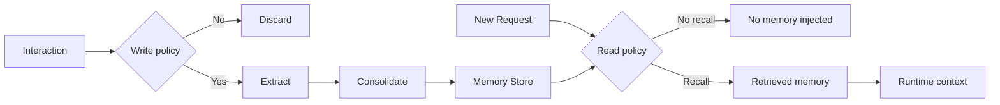
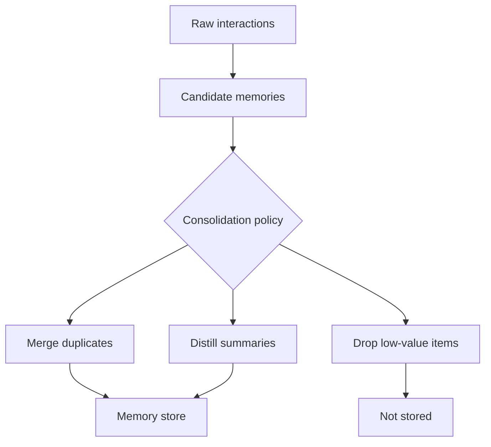

---
tags:
  - memory
  - policy
  - readwrite
type: note
status: draft
source: "Microsoft Foundry Memory Docs · Azure Cosmos Agentic Memories Docs · Google ADK Memory Docs · OpenAI Conversation State and File Search Docs"
parent_note: "[[Memory Systems - MOC]]"
---

# Memory Systems - Memory Read and Write Policies

## Summary

memory system ที่ดีไม่ได้มีแค่ที่เก็บ แต่ต้องมีกติกาว่าเมื่อไรควรอ่าน, เมื่อไรควรเขียน, อะไรควรถูกสรุป, และอะไรไม่ควรถูกบันทึกเลย

---

## Scope

- write triggers
- retrieval triggers
- salience
- privacy and retention
- policy mistakes

---

## ทำไม memory policy สำคัญ

Microsoft Foundry อธิบาย memory เป็นระบบที่มี extraction, consolidation, และ retrieval ชัดเจน นั่นหมายความว่า memory ไม่ใช่แค่ “เปิดแล้วจำ” แต่เป็น pipeline ที่ต้องมีนโยบายควบคุม  
Azure Cosmos agentic memories ก็พูดถึงการสร้าง agentic memory จาก interactions เดิม, profile, และ facts เพื่อให้เรียกใช้ภายหลัง  
Google ADK แยก `Session`, `State`, และ `MemoryService` ทำให้เห็นชัดว่าการอ่าน/เขียน memory เป็น layer เพิ่มจาก session runtime

ดังนั้น read/write policies คือ control plane ของ memory system:
- อะไรมีสิทธิ์ถูกเขียนลง memory
- เขียนในรูปแบบใด
- เมื่อไรควรถูกเรียกกลับมา
- เมื่อไรไม่ควรเรียก
- ข้อมูลใดต้องหมดอายุหรือถูกลบ

---

## Write Policies

write policy คือกติกาว่า interaction แบบไหนควรกลายเป็น memory

### สิ่งที่มักควรเขียน

- stable user preferences
- durable profile facts
- successful reusable summaries
- important task outcomes
- verified facts derived from repeated evidence

### สิ่งที่ไม่ควรเขียนแบบอัตโนมัติ

- transient small talk
- one-off context ที่ไม่น่าจะใช้ซ้ำ
- sensitive data ที่ไม่มี justification ชัด
- low-confidence model guesses
- raw traces ทุกอย่างแบบไม่กลั่นกรอง

### Write Triggers ที่พบบ่อย

- explicit user preference
- repeated mention over time
- successful completion with reusable value
- high-salience event
- manual approval by user or operator

> Design inference: ถ้าระบบไม่มี write policy ที่เข้มพอ long-term memory จะค่อย ๆ กลายเป็น noisy transcript store แทนที่จะเป็น usable memory layer

---

## Salience และ Memory Value

ไม่ใช่ทุกข้อมูลมีค่าพอจะถูกจำ  
policy ที่ดีจึงต้องมีแนวคิดเรื่อง salience หรือ memory value

คำถามหลัก:
- ข้อมูลนี้มีโอกาสถูกใช้ซ้ำไหม
- มีผลต่อ personalization ไหม
- มีผลต่อ success ของ task ในอนาคตไหม
- stable พอจะเก็บหรือยัง
- เก็บแล้วมี privacy risk หรือไม่

ตัวอย่าง:
- “ผู้ใช้ชอบคำอธิบายแบบมี diagram” = น่าจำ
- “วันนี้ขอให้สรุปสั้น ๆ” = อาจเป็น session preference ไม่ใช่ long-term preference
- “เคยล้มเหลวเพราะ API quota หมด” = อาจมีค่าแบบ episodic memory

---

## Consolidation Policies

การเขียน memory ที่ดีไม่ใช่แค่ append ข้อมูล แต่ต้องมี consolidation

Microsoft Foundry ใช้คำว่า consolidation โดยตรง ซึ่งสื่อว่าระบบควร:
- merge ข้อมูลซ้ำ
- distill สิ่งสำคัญ
- reconcile conflicting claims
- upgrade raw observations ไปเป็น usable memory records

ตัวอย่าง consolidation:
- รวมหลาย interaction เป็น user preference เดียว
- สรุปหลายเหตุการณ์เป็น semantic fact
- แยก successful pattern ออกมาเป็น procedural memory

---

## Read Policies

read policy คือกติกาว่าเมื่อไรควร retrieve memory กลับมาใน runtime

### คำถามหลักของ read policy

1. คำขอนี้ต้องอาศัย continuity ไหม
2. ต้องดึง memory type ไหน
3. ต้องดึงมากแค่ไหน
4. ต้อง inject เข้าบริบทตรงไหน

### Retrieval Triggers ที่พบบ่อย

- user-specific request
- follow-up on prior work
- planning over long tasks
- personalization-sensitive interactions
- resume or continue task

### ไม่ควรดึง memory เมื่อ

- request เป็นเรื่องใหม่ที่ไม่ต้องการ personalization
- memory candidate ต่ำความเชื่อมั่น
- memory นั้นอาจ bias คำตอบโดยไม่จำเป็น
- cost ของ recall สูงกว่าประโยชน์

OpenAI docs ช่วยคั่นให้เห็นว่าการจัดการ conversation state กับ external retrieval เป็นคนละ concern  
ดังนั้น read policy ต้องตัดสินใจทั้ง:
- จะใช้แค่ active conversation state
- จะ recall long-term memory เพิ่ม
- จะใช้ external corpus retrieval แบบ RAG เพิ่มอีกหรือไม่

---

## Policy by Memory Type

### Episodic Memory

write เมื่อ:
- event มีผลลัพธ์สำคัญ
- failure/success นั้นมีโอกาสถูกนำมาใช้ซ้ำ

read เมื่อ:
- current task คล้าย past task
- ต้องการ reflection หรือ resume execution

### Semantic Memory

write เมื่อ:
- fact stable พอ
- preference ถูกยืนยันซ้ำ
- summary distilled แล้ว

read เมื่อ:
- current request ต้องอาศัย profile, facts, or preferences

### Procedural Memory

write เมื่อ:
- workflow หรือ strategy มี evidence ว่า reusable
- operator อนุมัติ pattern นั้น

read เมื่อ:
- เจอ task type เดิม
- ต้องการ reusable method ไม่ใช่ fact

---

## Privacy, Retention, and Scope

memory policy ที่ดีต้องคุมไม่ใช่แค่ “คุณภาพ” แต่รวมถึง:
- privacy
- retention
- scope
- deletion

Azure AI Foundry FAQ และ memory docs ทำให้เห็นว่าระบบ stateful จะมีข้อมูล persist อยู่จนกว่าจะลบ  
ดังนั้น policy ควรตอบอย่างน้อย:
- เก็บนานแค่ไหน
- ใครเป็นเจ้าของ memory record
- scope เป็นระดับ user, thread, project, หรือ workspace
- user ขอให้ลบได้หรือไม่

### Scope Rules ที่พบบ่อย

- thread-scoped memory
- user-scoped memory
- workspace-scoped memory
- app-scoped memory

ถ้า scope ไม่ชัด จะเกิด recall ผิดคนหรือผิดบริบทได้ง่าย

---

## Memory Read vs RAG Read

memory read กับ RAG read คล้ายกันตรงที่เป็น retrieval แต่มี intent ต่างกัน  
ถ้าต้องการดูเรื่องนี้แบบเฉพาะทาง ให้ดู [[06 - Memory Retrieval vs RAG]] ซึ่งแยก:
- continuity vs groundedness
- memory recall triggers vs document retrieval triggers
- เมื่อไรควรใช้ memory, RAG, หรือทั้งสองแบบร่วมกัน

---

## Failure Modes

### 1. Overwrite by Noise

เขียนทุก interaction ลง memory จนของสำคัญถูกกลบ

### 2. Underwrite

ไม่เขียนสิ่งที่ควรจำ ทำให้ continuity ไม่เกิด

### 3. Wrong Recall Timing

ดึง memory ตอนที่ไม่ควรดึง ทำให้ answer bias หรือ overfit กับ user history

### 4. Type Confusion

เอา episodic logs มาใช้แทน semantic facts  
หรือเอา procedural hints มาใช้เหมือนข้อเท็จจริง

### 5. Scope Leakage

recall ข้าม user หรือข้าม thread โดยไม่ตั้งใจ

### 6. Retention Drift

memory ค้างอยู่นานเกินความจำเป็นจน stale หรือเสี่ยงด้าน privacy

---

## Design Rules

- แยก write, consolidate, read, delete policies ออกจากกัน
- define scope ตั้งแต่ต้น: user, thread, workspace, หรือ task
- อย่า append memory แบบดิบทุกครั้งโดยไม่มี salience filter
- ใช้ consolidation เพื่อแปลง raw interaction เป็น usable memory
- แยก memory recall ออกจาก document retrieval ทางความคิดและทาง implementation
- วัด policy จากทั้ง quality, privacy, latency, และ operator control

---

## ความสัมพันธ์กับโน้ตอื่น

- [[02 AI Systems/Memory Systems/Core/01 - Working Memory vs Long-Term Memory]] — โครง memory ชั้นหลัก
- [[02 AI Systems/Memory Systems/Core/02 - Episodic vs Semantic vs Procedural Memory]] — memory types ที่ policy ต้องรองรับ
- [[02 AI Systems/Memory Systems/Core/06 - Memory Retrieval vs RAG]] — แยก continuity retrieval ออกจาก document retrieval
- [[02 AI Systems/Memory Systems/Application/04 - Agent Memory Patterns]] — การประกอบ memory หลายชั้นในระบบจริง
- [[02 AI Systems/Memory Systems/Application/05 - Memory Failure Modes]] — failure modes ในระดับระบบ
- [[02 AI Systems/Guardrails/Guardrails - MOC]] — policy และ privacy เชื่อมกับ guardrails
- [[02 AI Systems/RAG/RAG - MOC]] — memory read vs RAG retrieval

---

## Related Notes

- [[06 - Memory Retrieval vs RAG]]
- [[02 AI Systems/Guardrails/Guardrails - MOC]]
- [[02 AI Systems/RAG/RAG - MOC]]
- [[Memory Systems - MOC]]

---

## Official References

- Microsoft Foundry - What is Memory?: https://learn.microsoft.com/en-us/azure/ai-foundry/agents/concepts/agent-memory?view=foundry
- Microsoft Foundry - Create and Use Memory: https://learn.microsoft.com/en-us/azure/ai-foundry/agents/how-to/memory-usage?view=foundry
- Azure Cosmos DB - Agent memories in Azure Cosmos DB for NoSQL: https://learn.microsoft.com/en-us/azure/cosmos-db/gen-ai/agentic-memories
- Azure AI Foundry Agent Service FAQ: https://learn.microsoft.com/en-us/azure/ai-services/agents/faq
- Google ADK - Session, State, and Memory: https://google.github.io/adk-docs/sessions/
- Google ADK - Memory: https://google.github.io/adk-docs/sessions/memory/
- OpenAI - Conversation State: https://platform.openai.com/docs/guides/conversation-state?api-mode=responses
- OpenAI - File Search: https://platform.openai.com/docs/guides/tools-file-search
