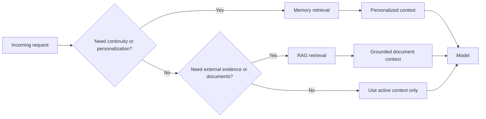

---
tags:
  - memory
  - rag
  - retrieval
  - comparison
type: note
status: draft
source: "Google ADK, Microsoft Learn, OpenAI Docs"
parent_note: "[[Memory Systems - MOC]]"
---

# Memory Retrieval vs RAG

> โน้ตเสริมสำหรับแยกให้ชัดว่า memory retrieval กับ RAG retrieval คล้ายกันตรงไหน ต่างกันตรงไหน และควรเลือกใช้อย่างไรในระบบจริง

---

## Summary

memory retrieval กับ RAG retrieval ต่างก็เป็น retrieval layer แต่ intent ไม่เหมือนกัน

- memory retrieval เน้น continuity, personalization, และ prior interactions
- RAG retrieval เน้น external knowledge, grounding, และ evidence

ดังนั้นระบบที่ดีไม่ควรมองสองอย่างนี้เป็นสิ่งเดียวกัน แม้จะใช้ primitive คล้ายกัน

---

## Scope

โน้ตนี้เน้นความต่างเชิงสถาปัตย์ของ:
- memory recall
- document retrieval แบบ RAG
- กรณีที่ใช้ทั้งสองแบบร่วมกัน

ไม่ได้ลงรายละเอียดเรื่อง embedding internals หรือ RAG pipeline ลึกทั้งหมด

---

## Memory Retrieval เน้น Continuity

Google ADK แยก `Session` / `State` ออกจาก `Memory` ชัดเจน โดย memory ถูกใช้เป็น searchable layer สำหรับข้อมูลจาก prior interactions หรือ prior sessions

Azure Cosmos DB agentic memories ก็อธิบายในทิศทางเดียวกันว่า agent memory ใช้ persist และ recall prior facts, interactions, และ experiences เพื่อช่วยให้ agent reason, plan, และ act ได้ต่อเนื่องขึ้น

ดังนั้น memory retrieval มักเน้น:
- user-specific continuity
- stable preferences
- prior interactions
- learned patterns หรือ reusable procedures

---

## RAG Retrieval เน้น Grounding

OpenAI file search และ retrieval-oriented tools วาง retrieval ไว้เพื่อดึงข้อมูลภายนอกเข้ามาเป็น evidence หรือ source-grounded context

RAG retrieval มักเน้น:
- external corpus
- documents, chunks, files
- factual support
- citations หรือ evidence traceability

ดังนั้น RAG read ไม่ได้มีเป้าหมายหลักเพื่อ “จำผู้ใช้” แต่เพื่อ “ดึงข้อมูลที่เกี่ยวข้องและเชื่อถือได้” เข้าสู่ context

---

## Query Intent ต่างกัน

หลักคิดง่าย ๆ:
- ถ้าต้องการ `who/what happened before` -> memory
- ถ้าต้องการ `what do the sources say` -> RAG
- ถ้าต้องการทั้ง continuity และ evidence -> ใช้ร่วมกัน

---

## เมื่อไรควรใช้ Memory

ใช้ memory retrieval เมื่อ:
- request ต้องอาศัย prior interactions
- ต้องการ personalization
- งานมี continuity ข้ามหลาย sessions
- ต้อง recall learned preferences, summaries, หรือ reusable procedures

---

## เมื่อไรควรใช้ RAG

ใช้ RAG retrieval เมื่อ:
- ต้องตอบจาก external corpus
- ต้องการ source-grounded answers
- ต้องการ citations หรือ evidence
- ข้อมูลเปลี่ยนแปลงได้ และไม่ควรถูกเก็บเป็น long-term memory ตรง ๆ

---

## เมื่อไรควรใช้ทั้งสองแบบร่วมกัน

บางงานต้องใช้ทั้ง:
- memory เพื่อรู้ว่า “ผู้ใช้นี้คือใคร / เคยทำอะไร / ชอบอะไร”
- RAG เพื่อรู้ว่า “เอกสารหรือ knowledge base ปัจจุบันบอกอะไร”

ตัวอย่าง:
- support agent ที่ต้องจำบริบทลูกค้า และดึง policy ล่าสุด
- research copilot ที่จำ thesis/user goals และดึง papers ที่เกี่ยวข้อง
- coding agent ที่จำ project conventions และดึง docs/source files เพิ่ม

---

## Failure Modes ถ้าสับสนสองอย่างนี้

- ใช้ memory แทน external evidence จนคำตอบไม่ grounded
- ใช้ RAG แทน personalization จน continuity หาย
- ดึงทั้งสองแบบทุกครั้งจน context overload
- เก็บข้อมูล volatile ลง memory ทั้งที่ควรดึงจาก corpus ทุกครั้ง

---

## Design Rules

- แยก continuity concerns ออกจาก grounding concerns
- ถามก่อนเสมอว่า request นี้ต้องการ `memory`, `RAG`, หรือ `both`
- อย่าเก็บ external corpus facts ทั้งหมดลง memory โดยไม่มีเหตุผล
- ถ้าต้องการ citations หรือ evidence traceability ให้เอนมาทาง RAG
- ถ้าต้องการ user continuity หรือ personalization ให้เอนมาทาง memory

---

## Related Notes

- [[03 - Memory Read and Write Policies]]
- [[01 - Working Memory vs Long-Term Memory]]
- [[02 AI Systems/RAG/RAG - MOC|RAG - MOC]]
- [[04 Synthesis/Synthesis - Memory vs RAG vs Context]]

---

## Official References

- Google ADK: Sessions  
  https://google.github.io/adk-docs/sessions/
- Google ADK: Memory  
  https://google.github.io/adk-docs/sessions/memory/
- Azure Cosmos DB: Agent memories  
  https://learn.microsoft.com/en-us/azure/cosmos-db/gen-ai/agentic-memories
- OpenAI: File Search  
  https://platform.openai.com/docs/guides/tools/file-search
