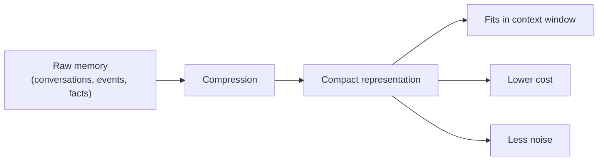

---
tags:
  - memory
  - compression
  - summarization
  - context
  - agents
type: note
status: evergreen
source: "vault-local synthesis จาก Memory Systems, Context Windows, และ LLM Foundations notes"
parent_note: "[[02 AI Systems/Memory Systems/Memory Systems - MOC|Memory Systems - MOC]]"
created: "2026-04-23"
updated: "2026-04-23"
---

# Memory Compression and Summarization

---

## ขอบเขตของโน้ตนี้

โน้ตนี้ตอบคำถามว่า:
- ทำไม memory ต้อง compress
- เทคนิค compression และ summarization หลักมีอะไรบ้าง
- trade-off ระหว่าง compression กับ information loss คืออะไร
- ควรเลือกเทคนิคไหนตามสถานการณ์

โน้ตนี้เน้น **memory-level compression** ไม่ใช่ model-level compression (quantization, pruning)
ส่วน model compression ให้ดู [[01 Foundations/LLM Foundations/Core/16 - Model Compression และ Inference Optimization]]

---

## ทำไมต้อง Compress Memory

ปัญหาหลัก:
- **Context window มีจำกัด** — ยิ่ง conversation ยาว ยิ่งใส่ memory ดิบทั้งหมดไม่ได้
- **Cost ตาม tokens** — memory ที่ยาวเกินเพิ่ม cost โดยไม่จำเป็น
- **Noise dilution** — memory เก่าที่ไม่เกี่ยวข้องทำให้ model สับสน
- **Latency** — context ยาวเพิ่ม prefill time



---

## เทคนิคหลัก

### 1. Conversation Summarization

สรุป conversation history เป็นย่อหน้าสั้น ๆ:
- ใช้ LLM สรุป conversation ที่ผ่านมาเป็น summary
- เก็บ summary แทน raw messages
- อาจทำแบบ rolling — สรุปทุก N turns แล้วเก็บ summary ต่อ

| แนวทาง | กลไก | ข้อดี | ข้อเสีย |
|---|---|---|---|
| **One-time summary** | สรุปครั้งเดียวเมื่อ conversation ยาวเกิน threshold | ง่าย | สูญเสีย detail |
| **Rolling summary** | สรุปทุก N turns แล้ว append เข้า running summary | balance ดีกว่า | summary อาจ drift |
| **Hierarchical summary** | สรุปเป็นชั้น (turn → session → topic) | เก็บ detail ได้หลายระดับ | ซับซ้อน |

### 2. Entity / Fact Extraction

แทนที่จะสรุปเป็น prose ให้ extract structured facts:
- ดึง entities, preferences, decisions ออกจาก conversation
- เก็บเป็น key-value pairs หรือ structured records
- inject กลับเข้า context เมื่อ relevant

ตัวอย่าง:
```text
Raw: "ผมชอบกาแฟดำ ไม่ใส่น้ำตาล แพ้ถั่ว"
Extracted: {preference: "black coffee, no sugar", allergy: "nuts"}
```

### 3. Selective Forgetting / Eviction

ไม่ compress แต่เลือกทิ้ง:
- ลบ memory ที่เก่าเกิน threshold (time-based eviction)
- ลบ memory ที่ไม่เคยถูก recall (access-based eviction)
- ลบ memory ที่ salience score ต่ำ

### 4. Embedding-Based Compression

แปลง memory เป็น embeddings แล้ว retrieve เฉพาะที่เกี่ยวข้อง:
- ไม่ต้องใส่ memory ทั้งหมดใน context
- ใช้ similarity search ดึงเฉพาะ memory ที่ relevant กับ query ปัจจุบัน
- เป็นจุดเชื่อมระหว่าง memory กับ RAG

→ ดูเพิ่มที่ [[02 AI Systems/Memory Systems/Core/06 - Memory Retrieval vs RAG]]

---

## Trade-offs

| ประเด็น | Compression มาก | Compression น้อย |
|---|---|---|
| Context usage | ต่ำ | สูง |
| Information loss | สูง | ต่ำ |
| Cost | ต่ำ | สูง |
| Detail preservation | ต่ำ | สูง |
| Noise | ต่ำ | อาจสูง |

**ไม่มี compression ที่ดีที่สุดสำหรับทุกกรณี** — ต้องเลือกตาม:
- ความสำคัญของ detail (medical vs casual chat)
- ความยาวของ session (short task vs long-running agent)
- budget constraints (cost per token)

---

## Compression ใน Agent Systems

ใน agent ที่ทำงานยาว compression สำคัญเป็นพิเศษ:
- **Session memory** — สรุป conversation ก่อนหน้าเมื่อ context เต็ม
- **Cross-session memory** — extract facts/preferences เก็บใน long-term store
- **Task memory** — สรุป intermediate results ของ subtasks ที่เสร็จแล้ว

ตัวอย่าง: Claude Code ใช้ context compaction pipeline ที่สรุป conversation เมื่อ context window ใกล้เต็ม

→ ดูเพิ่มที่ [[03 Tools/Claude Code/Core/25 - Context Compaction Pipeline]]

---

## อย่าสับสน: Memory Compression vs Model Compression

| ประเด็น | Memory Compression | Model Compression |
|---|---|---|
| Compress อะไร | conversation history, facts, events | model weights |
| เป้าหมาย | ลด context usage | ลด model size / inference cost |
| เทคนิค | summarization, extraction, eviction | quantization, pruning, distillation |
| เมื่อไร | runtime, ทุก session | ก่อน deploy |

---

## ความสัมพันธ์กับโน้ตอื่น

- [[02 AI Systems/Memory Systems/Core/01 - Working Memory vs Long-Term Memory]] — working memory คือ target หลักของ compression
- [[02 AI Systems/Memory Systems/Core/03 - Memory Read and Write Policies]] — write policy กำหนดว่าอะไรถูก compress ก่อนเขียน
- [[02 AI Systems/Memory Systems/Core/06 - Memory Retrieval vs RAG]] — embedding-based compression เชื่อมกับ retrieval
- [[02 AI Systems/Memory Systems/Application/05 - Memory Failure Modes]] — compression ที่แย่เป็น failure mode
- [[01 Foundations/Context Windows/Core/01 - Context Window คืออะไร]] — context budget เป็นเหตุผลหลักที่ต้อง compress
- [[01 Foundations/Context Windows/Core/02 - การบริหารและ Context Engineering]] — compression เป็นส่วนหนึ่งของ context engineering
- [[02 AI Systems/Memory Systems/Memory Systems - MOC|Memory Systems - MOC]]

---

## References

- Anthropic, Context windows documentation
  https://docs.anthropic.com/en/docs/build-with-claude/context-windows
- OpenAI, Conversation state management
  https://platform.openai.com/docs/guides/conversation-state
- LangChain, Conversation summary memory
  https://python.langchain.com/docs/modules/memory/types/summary
