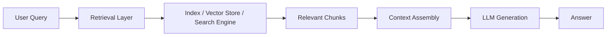
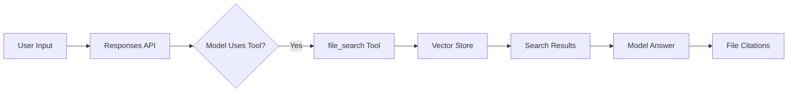
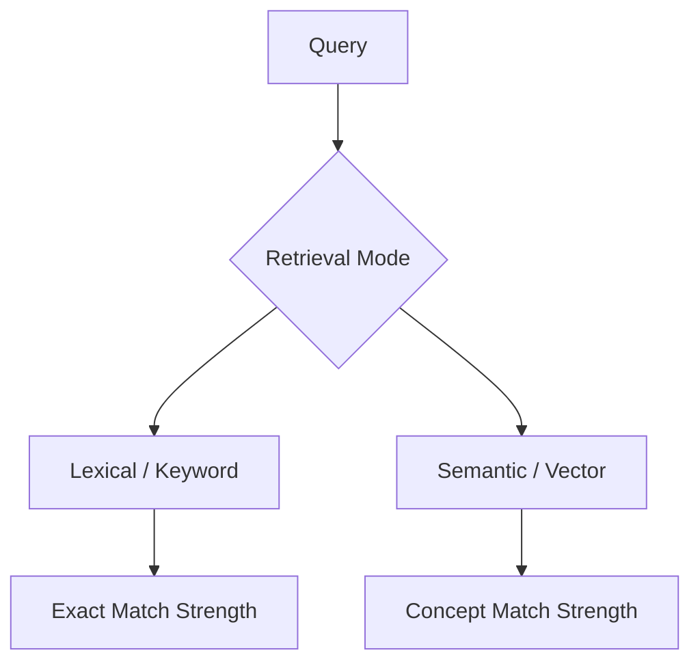
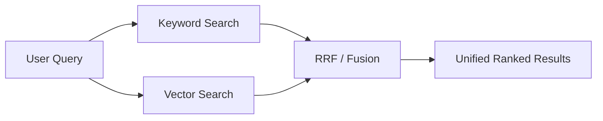

---
tags:
  - rag
  - retrieval
type: note
status: evergreen
source: "OpenAI Retrieval & File Search Docs · Google Vertex AI RAG Engine Docs · Microsoft Learn (Azure AI Search)"
parent_note: "[[02 AI Systems/RAG/RAG - MOC|RAG - MOC]]"
---

# RAG - Retrieval Basics

## Summary

หัวใจของ RAG คือการหาข้อมูลที่เกี่ยวข้องจริงก่อนประกอบเข้า prompt

---

## Scope

- retrieval คืออะไร
- lexical vs semantic retrieval
- top-k retrieval
- recall vs precision
- retrieval failure modes

---

## Retrieval อยู่ตรงไหนในสถาปัตยกรรม RAG

ในเชิงระบบ retrieval คือชั้นที่รับ query ของผู้ใช้ แล้วดึงข้อมูลจาก knowledge base หรือ vector store เพื่อส่งต่อให้ generation layer

ตามเอกสารของ Google Vertex AI RAG Engine, ลำดับหลักของ RAG คือ:
- data ingestion
- data transformation / chunking
- embedding
- indexing
- retrieval
- generation

ฝั่ง OpenAI อธิบาย retrieval เป็น semantic search บน vector stores และอธิบาย file search ว่าเป็น tool ที่ช่วยให้โมเดลค้นข้อมูลจากไฟล์ก่อนตอบ
ฝั่ง Microsoft อธิบายว่าระบบ RAG และ generative search ที่ดีมักอาศัยทั้ง vector search, full-text search, และ hybrid retrieval

สรุปสั้น:
- retrieval ไม่ใช่ generation
- retrieval ไม่ใช่ embedding model
- retrieval คือชั้นที่ตัดสินว่า "จะเอา context อะไร" เข้าสู่ model

---

## Retrieval Contract

retrieval layer ที่ดีควรทำ 4 อย่างให้ชัด:

1. รับ query ในรูปที่ระบบเข้าใจ
2. ค้นหาข้อมูลจาก index หรือ knowledge base
3. จัดอันดับผลลัพธ์ที่เกี่ยวข้อง
4. ส่งผลลัพธ์ในรูปที่ downstream layer ใช้งานต่อได้

ในทางปฏิบัติ contract นี้มักมีองค์ประกอบเช่น:
- `query`
- ขอบเขตการค้นหา เช่น corpus, vector store, index
- จำนวนผลลัพธ์ เช่น `k`, `top`
- filters หรือ metadata constraints
- ranking / reranking options

OpenAI docs รองรับแนวคิดนี้ผ่าน `vector_stores.search`, `filters`, และ `ranking_options`
Microsoft Learn อธิบาย query constructs สำหรับ vector, keyword, และ hybrid search
Google RAG Engine อธิบาย retrieval เป็นชั้นหนึ่งของ pipeline ที่ค้นข้อมูลจาก corpus ก่อนส่งต่อให้ generation

---

## OpenAI Retrieval และ File Search

ใน OpenAI stack มี 2 primitive ที่ควรแยกกัน:

### 1. Vector Store Search

`vector_stores.search` คือ API สำหรับค้น vector store โดยตรง
เหมาะเมื่อ application ต้องควบคุม retrieval เอง เช่น:
- กำหนด query หลายแบบ
- ใส่ `filters` จาก application policy
- กำหนด `max_num_results`
- ใช้ `ranking_options`
- ขอผลลัพธ์ chunks, scores, และ file origin เพื่อ debug หรือ assemble context เอง

ผลเชิงสถาปัตย์:
- application เป็นเจ้าของ retrieval orchestration
- ระบบสามารถ log, eval, rerank, และ assemble เองได้ละเอียด
- เหมาะกับ production RAG ที่ต้องควบคุม policy หรือ permission boundary ชัด

### 2. `file_search` Tool

`file_search` คือ hosted tool ใน Responses API ที่ให้โมเดลค้นไฟล์จาก vector stores ก่อนตอบ
OpenAI ระบุว่า tool นี้ค้นได้ทั้ง semantic และ keyword search บน knowledge base ที่ upload ไว้

ผลเชิงสถาปัตย์:
- model สามารถเรียก retrieval เป็น tool ระหว่าง response generation
- application ส่ง `vector_store_ids` ให้ tool
- tool call คืน output item แบบ `file_search_call`
- assistant message สามารถมี `file_citation` annotations

หลักคิด:
- ถ้าต้องการ hosted retrieval ที่ผูกกับ model tool use ให้ใช้ `file_search`
- ถ้าต้องการควบคุม retrieval/assembly เอง ให้ใช้ vector store search โดยตรง
- ทั้งสองกรณีต้องออกแบบ vector store, chunking, metadata, และ filtering ให้ดีตั้งแต่ ingestion

---

## Lexical vs Semantic Retrieval

retrieval แบบหลักมีอย่างน้อย 2 แนว:

### 1. Lexical Retrieval

อาศัยการ match คำหรือ token โดยตรง
เหมาะกับ:
- exact keywords
- product codes
- dates
- names
- jargon ที่ต้อง match ตรง

Microsoft ระบุชัดว่า keyword search มีจุดแข็งด้าน precision และ exact matching ในบางโดเมน

### 2. Semantic Retrieval

อาศัย embeddings หรือ vector similarity เพื่อหาความหมายที่ใกล้กัน แม้ไม่มีคำตรงกัน
OpenAI เรียกสิ่งนี้ตรง ๆ ว่า semantic search บน vector stores
เหมาะกับ:
- paraphrases
- natural language questions
- conceptual similarity
- multilingual similarity ในบางระบบ

หลักคิด:
- lexical retrieval เด่นเรื่อง precision บางชนิด
- semantic retrieval เด่นเรื่อง recall เชิงความหมาย
- production systems จำนวนมากจึงใช้ร่วมกัน

---

## Hybrid Retrieval

Microsoft Learn อธิบาย hybrid search ว่าเป็น query เดียวที่รัน full-text search และ vector search แบบขนาน แล้วรวมผลด้วย Reciprocal Rank Fusion (RRF)

นี่คือ pattern ที่สำคัญมากสำหรับ RAG เพราะ:
- keyword search ช่วยจับ exact matches
- vector search ช่วยจับ semantic matches
- ranking fusion ช่วยลด blind spots ของแต่ละฝั่ง

เชิงสถาปัตย์:
- ถ้า knowledge base มี entity names, IDs, dates, และ jargon เยอะ hybrid retrieval มักคุ้มกว่า vector-only
- ถ้าระบบเน้น free-form semantic Q&A อย่างเดียว vector-first อาจง่ายกว่า
- ถ้าต้อง optimize relevance จริง retrieval layer มักต้องมีทั้ง lexical, semantic, และ reranking

---

## Top-k, Recall, Precision

retrieval ต้องบาลานซ์ coverage กับ noise

### top-k

คือจำนวนผลลัพธ์ที่ retrieval layer ส่งออกมาในรอบแรก
ถ้า `k` ต่ำเกินไป อาจพลาด evidence สำคัญ
ถ้า `k` สูงเกินไป อาจเพิ่ม noise และทำให้ context assembly เปลืองงบ

### recall

คือความสามารถในการดึงข้อมูลที่เกี่ยวข้องให้ “ครบพอ”
ถ้า recall ต่ำ generation layer จะไม่มี evidence ที่ควรมี

### precision

คือสัดส่วนของผลลัพธ์ที่ดึงมาแล้ว “เกี่ยวข้องจริง”
ถ้า precision ต่ำ ระบบจะยัดข้อมูลเกินความจำเป็นเข้า context

Azure แนะนำ workable hybrid patterns ที่ให้เริ่มจากค่าพอดีแล้ว tune ทีละน้อย แทนการดัน recall สูงสุดตั้งแต่แรก เพราะ retrieval ที่ coverage สูงเกินไปไม่ได้แปลว่าจะให้ผลลัพธ์ปลายทางดีขึ้นเสมอ

---

## Metadata Filtering

retrieval ที่ดีไม่ได้พึ่ง similarity อย่างเดียว
หลายระบบรองรับ filtering ก่อนหรือระหว่าง search เช่น:
- เอกสารประเภทใด
- ช่วงเวลาใด
- region ใด
- tenant ใด
- source ใด

OpenAI รองรับ `filters` บน vector store file attributes
Microsoft รองรับ filtered vector search และ hybrid queries ที่มี filters

ผลเชิงสถาปัตย์:
- filtering ช่วยลด search space
- filtering ช่วยเพิ่ม precision
- filtering สำคัญมากเมื่อ knowledge base โตหรือมีหลายโดเมนใน index เดียว
- filtering ไม่เท่ากับ authorization ต้องใช้ร่วมกับ permission check ฝั่ง application

---

## Ranking และ Query Controls

OpenAI vector store search มี controls ที่เป็น retrieval knobs สำคัญ:
- `max_num_results` จำกัดจำนวนผลลัพธ์ที่คืน
- `filters` จำกัดผลตาม file attributes
- `ranking_options` ปรับพฤติกรรม ranking
- `rewrite_query` ให้ระบบ rewrite natural language query สำหรับ vector search

ข้อควรระวัง:
- query rewrite อาจช่วย recall แต่ต้อง eval ว่าไม่เปลี่ยน intent
- ranking options เป็น retrieval control ไม่ใช่ guarantee ว่าคำตอบสุดท้าย grounded
- ถ้าใช้ `file_search` ต้องแยก log ของ tool call, annotations, และ final answer เพื่อ debug citation flow

## Retrieval Failure Modes

retrieval พลาดได้หลายแบบ:

### 1. Missed Evidence

มีข้อมูลที่เกี่ยวข้องอยู่ใน index แต่หาไม่เจอ
มักเกิดจาก:
- chunking ไม่ดี
- embedding mismatch
- query formulation ไม่ดี
- top-k ต่ำเกินไป

### 2. Noisy Retrieval

ดึงข้อมูลเยอะ แต่ไม่เกี่ยวพอ
ผลคือ context assembly ยัด noise เข้า model

### 3. Over-Reliance on Semantic Similarity

semantic search อย่างเดียวอาจพลาด exact matches ที่ keyword search หาได้ดีกว่า

### 4. Bad Scope

ไม่มี filters หรือ corpus boundaries ที่ดี
ทำให้ query วิ่งข้ามโดเมนแล้วดึงเอกสารผิดชุด

### 5. Ranking Problems

หา relevant chunk เจอ แต่ rank ต่ำเกินไปจนไม่ถูกเลือกเข้ารอบสุดท้าย

---

## Retrieval vs Reranking vs Context Assembly

3 ชั้นนี้ต้องไม่สับสนกัน:

- retrieval = หา candidate set
- reranking = จัดลำดับ candidate ให้ดีขึ้น
- context assembly = ตัดสินว่าจะเอาอะไรเข้าพร้อมลำดับใดใน prompt

ถ้า retrieval layer อ่อน ต่อให้ generation เก่งก็แก้ยาก
ถ้า retrieval ใช้ได้แต่ context assembly แย่ คำตอบก็ยังผิดได้

ดังนั้นเวลาระบบ RAG ตอบผิด ต้องแยกให้ออกว่า:
- หาไม่เจอ
- หาเจอแต่ rank ผิด
- rank ดีแล้วแต่ประกอบ context ผิด

---

## Design Rules

- อย่าคิดว่า retrieval = vector search อย่างเดียว
- เริ่มจาก retrieval contract ที่ชัดก่อนเลือกเครื่องมือ
- ถ้ามี exact identifiers เยอะ ให้พิจารณา hybrid retrieval
- ใช้ filters เมื่อ corpus มีหลาย domain หรือหลาย time ranges
- tune `k` ตาม downstream context budget ไม่ใช่ตาม retrieval metric อย่างเดียว
- แยกปัญหา retrieval ออกจาก generation ทุกครั้งที่ debug RAG

---

## ความสัมพันธ์กับโน้ตอื่น

- [[01 Foundations/LLM Foundations/Core/04 - Inference, Context และ RAG]] — ภาพรวม RAG runtime
- [[01 Foundations/LLM Foundations/Core/10 - Embeddings และ Semantic Similarity]] — semantic retrieval foundations
- [[04 Synthesis/Bridge/Synthesis - Weights, Context, Retrieval และ Tools]] — retrieval อยู่ตรงไหนใน stack
- [[02 AI Systems/RAG/Retrieval/03 - Embeddings and Vector Databases]] — index, vectors, metadata filtering
- [[02 AI Systems/RAG/Retrieval/RAG - Multi-Source Retrieval]] — retrieval จากหลาย source และการ merge/dedup
- [[02 AI Systems/RAG/Retrieval/RAG - Metadata Filtering and Permission-Aware Retrieval]] — filtering, authorization, และ permission-aware retrieval
- [[02 AI Systems/RAG/Retrieval/05 - Reranking]] — ranking layer หลัง retrieval
- [[02 AI Systems/RAG/Core/06 - Context Assembly]] — การประกอบ evidence เข้าสู่ prompt
- [[02 AI Systems/RAG/Evaluation/08 - Evaluation]] — วิธีแยก retrieval failures ออกจาก generation failures
- [[02 AI Systems/RAG/RAG - MOC|RAG - MOC]]

---

## Related Notes

- [[01 Foundations/LLM Foundations/Core/04 - Inference, Context และ RAG]]
- [[01 Foundations/LLM Foundations/Core/10 - Embeddings และ Semantic Similarity]]
- [[04 Synthesis/Bridge/Synthesis - Weights, Context, Retrieval และ Tools]]
- [[02 AI Systems/RAG/RAG - MOC|RAG - MOC]]

---

## Official References

- OpenAI Retrieval Guide: https://platform.openai.com/docs/guides/retrieval
- OpenAI File Search Guide: https://platform.openai.com/docs/guides/tools-file-search
- Google Vertex AI RAG Engine Overview: https://cloud.google.com/vertex-ai/generative-ai/docs/rag-engine/rag-overview
- Microsoft Learn - Hybrid Search Overview: https://learn.microsoft.com/en-us/azure/search/hybrid-search-overview
- Microsoft Learn - Create a Hybrid Query: https://learn.microsoft.com/en-us/azure/search/hybrid-search-how-to-query
- Microsoft Learn - Vector Search Overview: https://learn.microsoft.com/en-us/azure/search/vector-search-overview
