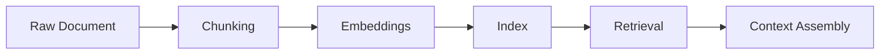
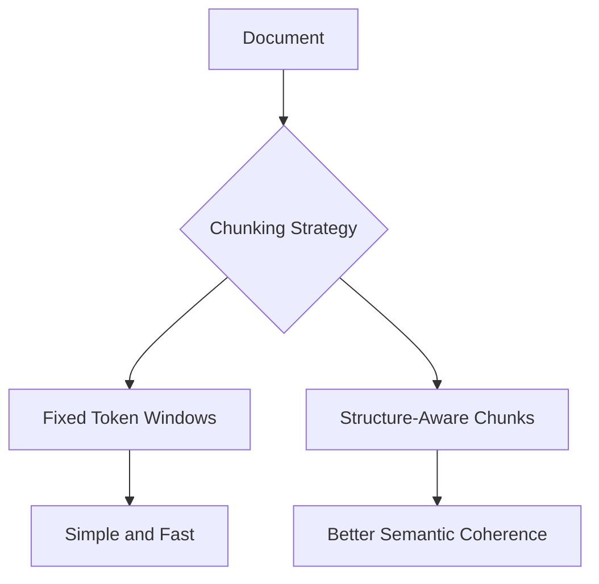

---
tags:
  - rag
  - chunking
type: note
status: draft
source: "OpenAI Retrieval Docs · Microsoft Learn (Azure AI Search Chunking)"
parent_note: "[[RAG - MOC]]"
---

# RAG - Chunking Strategies

## Summary

chunking เป็นตัวกำหนดหน่วยข้อมูลที่จะค้นคืนและส่งเข้า context ถ้า chunk ใหญ่เกินจะ noisy ถ้าเล็กเกินจะเสียความหมาย

---

## Scope

- fixed-size chunking
- semantic chunking
- overlap
- parent-child chunking
- chunking tradeoffs

---

## Chunking อยู่ตรงไหนใน RAG

chunking เป็นขั้นระหว่างเอกสารต้นฉบับกับ embedding/indexing  
OpenAI retrieval docs ระบุชัดว่าไฟล์ที่เข้า vector store จะถูก chunked, embedded, และ indexed  
Microsoft Learn ฝั่ง Azure AI Search อธิบายว่าการ chunk ตาม document layout หรือ structure ช่วยให้ generative retrieval มี relevance ที่ดีขึ้น

ดังนั้น chunking เป็นตัวกำหนดว่า retrieval layer จะ “เห็นเอกสารเป็นหน่วยแบบไหน”

---

## Fixed-Size Chunking

fixed-size chunking คือการแบ่งตามจำนวน token หรือจำนวนตัวอักษรที่กำหนดไว้ล่วงหน้า  
OpenAI vector store API รองรับ `chunking_strategy` และมีพารามิเตอร์สำคัญอย่าง:
- `max_chunk_size_tokens`
- `chunk_overlap_tokens`

ข้อดี:
- เริ่มได้เร็ว
- predictable
- เหมาะกับระบบที่ต้องการ simplicity

ข้อจำกัด:
- อาจตัดกลาง argument หรือ heading
- ไม่รับรู้โครงสร้างของเอกสาร
- relevance ของแต่ละ chunk ไม่สม่ำเสมอ

---

## Semantic หรือ Structure-Aware Chunking

Microsoft Learn แนะนำการแบ่งตาม document layout เช่น:
- headings
- sections
- paragraphs
- document structure

แนวนี้เหมาะกับ:
- policy docs
- manuals
- technical documentation
- long-form reports

หลักคิด:
- fixed-size ดีสำหรับ baseline
- structure-aware ดีเมื่อคุณภาพเริ่มตันหรือเอกสารมี layout ชัด

---

## Overlap

overlap คือส่วนที่ซ้ำกันระหว่าง chunk ที่อยู่ติดกัน  
OpenAI docs รองรับ `chunk_overlap_tokens` โดยตรง

ข้อดี:
- ลดปัญหาข้อมูลสำคัญถูกตัดคร่อม boundary
- ช่วยให้บริบทต่อเนื่องขึ้น

ข้อแลก:
- เพิ่ม storage
- เพิ่ม duplicate candidates
- อาจเพิ่ม noise ถ้ามากเกินไป

เชิงสถาปัตย์:
- overlap ต่ำเกินไป = missed evidence
- overlap สูงเกินไป = redundant retrieval

---

## Parent-Child Chunking

pattern นี้ใช้ chunk สองระดับ:
- child chunks สำหรับ retrieval ที่แม่น
- parent chunks หรือ section blocks สำหรับส่งเข้า context ที่กว้างขึ้น

แนวคิดนี้ช่วยแก้ trade-off หลัก:
- chunk เล็กดีต่อ retrieval
- chunk ใหญ่ดีต่อ generation

จึงมักใช้ retrieval จาก child แล้ว assemble parent หรือ larger section ตามมาภายหลัง

---

## Chunk Size ไม่ได้มีคำตอบเดียว

chunk ใหญ่ขึ้น:
- coverage ต่อ chunk สูงขึ้น
- แต่ precision ของ retrieval อาจลดลง

chunk เล็กลง:
- match query ได้เฉียบขึ้น
- แต่เสี่ยงเสียความหมายและการสังเคราะห์ข้ามประโยค

สิ่งที่ต้องคิดร่วมกัน:
- question style
- top-k
- context budget
- reranking
- assembly policy

---

## Failure Modes

### 1. Overly Large Chunks

retrieval ได้ก้อนใหญ่แต่ noisy และกิน budget มาก

### 2. Overly Small Chunks

retrieval แม่นแต่ generation ขาด context ต่อเนื่อง

### 3. Boundary Breaks

ตัดกลาง table, list, argument chain, หรือ section logic

### 4. Blind Chunking

ไม่สน heading หรือ structure ของเอกสารเลย

### 5. Chunk/Query Mismatch

granularity ของ chunk ไม่ตรงกับประเภทคำถามจริง

---

## Design Rules

- เริ่มจาก baseline ที่ simple ได้ แต่ต้อง eval เร็ว
- คิด chunking คู่กับ embeddings, retrieval, และ assembly เสมอ
- ถ้าเอกสารมี structure ชัด ให้ลอง structure-aware chunking
- ใช้ overlap เท่าที่จำเป็น
- ถ้ามีคำถามหลาย granularities ให้พิจารณา parent-child chunking

---

## ความสัมพันธ์กับโน้ตอื่น

- [[02 AI Systems/RAG/Core/01 - Retrieval Basics]] — chunking กำหนด quality ของ candidates
- [[02 AI Systems/RAG/Retrieval/03 - Embeddings and Vector Databases]] — chunk shape มีผลต่อ embeddings
- [[02 AI Systems/RAG/Core/06 - Context Assembly]] — chunking มีผลต่อ assembly policy
- [[02 AI Systems/RAG/Retrieval/05 - Reranking]] — reranking ทำงานบน chunk candidates
- [[02 AI Systems/RAG/Evaluation/08 - Evaluation]] — chunking variants ต้อง eval แบบ controlled
- [[RAG - MOC]]

---

## Related Notes

- [[01 Foundations/Context Windows/Context Windows - MOC]]
- [[RAG - MOC]]

---

## Official References

- OpenAI Retrieval Guide: https://platform.openai.com/docs/guides/retrieval
- OpenAI Vector Store API Reference: https://platform.openai.com/docs/api-reference/vector-stores/create
- Microsoft Learn - Chunk and Vectorize by Document Layout: https://learn.microsoft.com/en-us/azure/search/search-how-to-semantic-chunking
