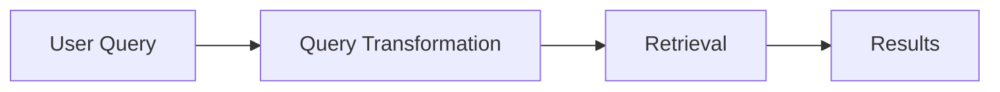
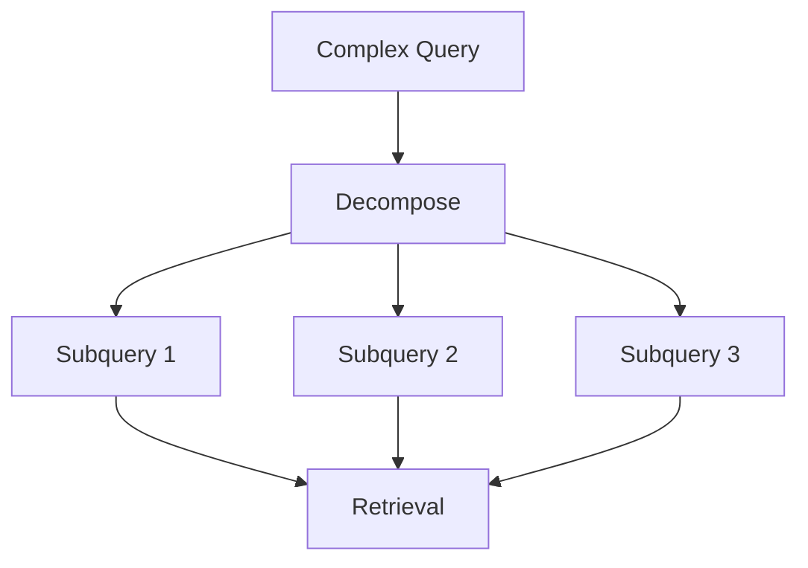

---
tags:
  - rag
  - retrieval
  - querytransformation
type: note
status: evergreen
source: "OpenAI Retrieval Docs · Microsoft Learn Query Rewrite"
parent_note: "[[RAG - MOC]]"
---

# RAG - Query Transformation

## Summary

query transformation คือการแปลงคำถามของผู้ใช้ให้อยู่ในรูปที่ retrieval system ทำงานได้ดีขึ้น เช่น query rewriting, expansion, decomposition, หรือ normalization

---

## Scope

- query rewriting
- query expansion
- decomposition
- normalization
- transformation failure modes

---

## Query Transformation อยู่ตรงไหนใน RAG

retrieval ไม่ได้เริ่มที่ index อย่างเดียว แต่มักเริ่มที่ “query shaping”

OpenAI retrieval docs รองรับ `rewrite_query=true` เพื่อให้ระบบ rewrite query อัตโนมัติสำหรับ semantic search  
Microsoft Learn อธิบาย query rewriting ว่าเป็นการสร้าง alternative queries เพื่อปรับผลลัพธ์ให้ดีขึ้น เช่นแก้ typo และเพิ่ม synonyms

---

## Query Rewriting

query rewriting คือการแปลงคำถามให้ retrieval-friendly มากขึ้น โดยยังรักษา intent เดิม

ตัวอย่างจาก OpenAI docs:
- original: “I'd like to know the height of the main office building.”
- rewritten: `primary office building height`

ประโยชน์:
- ลด verbosity
- ตัดคำที่ไม่จำเป็น
- ทำ keyword signal ให้คมขึ้น
- ช่วย semantic search เข้าใจ retrieval intent ชัดขึ้น

---

## Query Expansion

query expansion คือการเพิ่มคำหรือ variants เข้าไป เช่น:
- synonyms
- abbreviations
- product aliases
- domain terms

Microsoft query rewriting docs ชี้ชัดว่าการ rewrite อาจเพิ่มคำหรือ terms เพื่อช่วย ranking

เหมาะกับ:
- enterprise search
- domains ที่มี jargon หลายแบบ
- users ที่ถามแบบกว้างหรือไม่ใช้ศัพท์ในเอกสารตรง ๆ

---

## Query Decomposition

คำถามซับซ้อนบางแบบไม่ควรถูก retrieval เป็น query เดียว  
ควรแตกเป็น subqueries เช่น:
- เงื่อนไขหลายชั้น
- multi-hop questions
- compare/contrast questions

นี่เป็นสะพานไปสู่ agentic RAG เพราะ decomposition มักมาพร้อม orchestration

---

## Query Normalization

normalization คือการปรับ query ให้อยู่ในรูป consistent ขึ้น เช่น:
- lowercasing
- typo correction
- date normalization
- acronym expansion

นี่สำคัญโดยเฉพาะใน hybrid retrieval ที่ keyword side sensitive กับ lexical form มากกว่า vector side

---

## เมื่อไรควรใช้ Query Transformation

ควรใช้เมื่อ:
- user queries ยาวหรือคลุมเครือ
- มี typo หรือ variability สูง
- domain มี synonyms เยอะ
- single-shot retrieval ให้ผลลัพธ์ไม่เสถียร

อาจยังไม่จำเป็นเมื่อ:
- query patterns ตรงและสั้น
- corpus เล็ก
- search UX มี controlled input อยู่แล้ว

---

## Failure Modes

### 1. Intent Drift

rewrite แล้วหลุดจากเจตนาของผู้ใช้

### 2. Over-Expansion

เพิ่ม terms เยอะเกินไปจน noise สูงขึ้น

### 3. Wrong Decomposition

แตก query ผิด ทำให้ retrieval coverage แย่ลง

### 4. Hidden Complexity

pipeline ซับซ้อนขึ้นแต่ debug ยาก

### 5. Inconsistent Behavior

query ใกล้กันแต่ transform ออกมาต่างมาก ทำให้ result ไม่นิ่ง

---

## Design Rules

- ใช้ rewriting เพื่อช่วย retrieval ไม่ใช่เปลี่ยนคำถามของผู้ใช้
- log rewritten query หรือ transformed query เมื่อเป็นไปได้
- วัดผลด้วย downstream answer quality ไม่ใช่ดู transformed query อย่างเดียว
- ถ้าเริ่มจาก simple RAG ให้ใช้ rewrite ก่อน decomposition
- ถ้า query ซับซ้อนจริงค่อยขยับไป multi-query หรือ agentic patterns

---

## ความสัมพันธ์กับโน้ตอื่น

- [[02 AI Systems/RAG/Core/01 - Retrieval Basics]] — query transformation ช่วย retrieval quality
- [[02 AI Systems/RAG/Retrieval/RAG - Hybrid Retrieval]] — transformed queries อาจช่วยทั้ง keyword และ vector side
- [[02 AI Systems/RAG/Core/RAG - Agentic RAG]] — decomposition เป็นสะพานไปสู่ agentic retrieval
- [[02 AI Systems/RAG/Evaluation/08 - Evaluation]] — ต้อง eval impact ของ rewriting/decomposition
- [[RAG - MOC]]

---

## Official References

- OpenAI Retrieval Guide: https://platform.openai.com/docs/guides/retrieval
- Microsoft Learn - Rewrite Queries with Semantic Ranker: https://learn.microsoft.com/en-us/azure/search/semantic-how-to-query-rewrite
