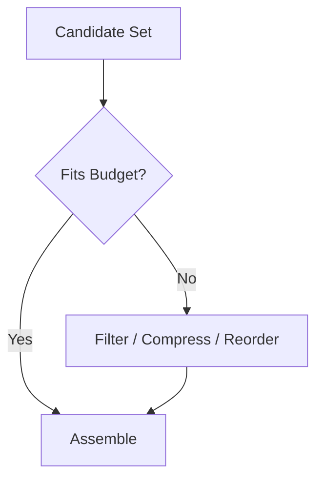

---
tags:
  - rag
  - context
  - assembly
type: note
status: draft
source: "OpenAI Retrieval Docs · Microsoft Learn (Azure AI Search Semantic Ranking)"
parent_note: "[[RAG - MOC]]"
---

# RAG - Context Assembly

## Summary

retrieval ที่ดีไม่พอ ถ้าประกอบ context ไม่ดี ระบบก็ยังตอบพลาดได้เพราะลำดับ, noise, และ truncation มีผลกับ generation มาก

---

## Scope

- document selection
- ordering
- deduplication
- prompt insertion patterns
- context budget allocation

---

## Context Assembly คืออะไร

retrieval หา candidate set มาให้ แต่ context assembly เป็นชั้นที่ตัดสินว่าอะไรจะได้ “เข้าพร้อม prompt จริง”

แยกให้ออก:
- retrieval = หาให้เจอ
- reranking = จัดอันดับใหม่
- context assembly = เลือก, เรียง, บีบอัด, และจัดวาง

---

## Document Selection

selection คือการเลือกจาก candidate set ว่าอะไรควรเข้า final context

สิ่งที่ควรพิจารณา:
- relevance
- diversity
- redundancy
- source authority
- freshness
- citation traceability

หลักเชิงระบบ:
- อย่าเอาทุก chunk ที่ retrieval คืนมาเข้า prompt
- optimize สำหรับ evidence quality ต่อ token

---

## Ordering

ลำดับของ evidence มีผลต่อ salience และ readability

patterns ที่พบบ่อย:
- relevance-first
- source-grouped
- query-grouped
- chronology-aware

Microsoft semantic ranking reinforce แนวคิดว่าการจัดลำดับก่อนส่งต่อมีผลต่อ final relevance อย่างมาก

---

## Deduplication

retrieval หลายแบบ โดยเฉพาะ hybrid retrieval และ overlap-based chunking มักให้ chunk ซ้ำหรือคล้ายกันมาก

ถ้าไม่ dedup:
- เปลือง context
- ลด diversity
- เพิ่ม noise

dedup จึงเป็นส่วนหนึ่งของ assembly ไม่ใช่เรื่อง optional

---

## Prompt Insertion Patterns

รูปแบบที่พบบ่อย:

### 1. Evidence Block

แยก retrieved evidence ออกเป็น block ชัดเจนก่อนคำถาม

### 2. Source-Grouped Block

group evidence ตามเอกสารเพื่อให้ citation ง่าย

### 3. Query-Grouped Block

ถ้าเป็น multi-query หรือ agentic RAG อาจแยกตาม subquery

### 4. Evidence + Metadata

เก็บ:
- source id
- section
- page
- score

ไว้กับแต่ละ chunk เพื่อรองรับ citations และ debugging

---

## Context Budget Allocation

assembly ต้องทำงานภายใต้ budget จริง:
- context window
- output reserve
- latency
- cost

ดังนั้น assembly policy ต้องรู้ว่า:
- final top-k เท่าไร
- เมื่อไรต้อง drop redundancy
- เมื่อไรต้อง compress
- เมื่อไรต้อง stop adding context

---

## Compression

compression ช่วยให้ evidence เข้า budget ได้ง่ายขึ้น แต่มี risk:
- ลด fidelity
- ซ่อน nuance
- ทำให้ citation trace ยากขึ้น

หลักคิด:
- ถ้า use case ต้องการ grounding สูง ให้ prefer verbatim evidence
- ถ้าต้องการ synthesis ระดับสูง อาจใช้ compressed context ได้ แต่ต้องรู้ว่าเป็น trade-off

---

## Failure Modes

### 1. Redundant Context

chunk ซ้ำกันหลายชิ้นเปลือง budget

### 2. Broken Ordering

evidence ถูก แต่ถูกวางลำดับไม่ดี

### 3. Over-Compression

ย่อจน evidence fidelity หาย

### 4. Lost Source Trace

ไม่มี metadata พอสำหรับ cite หรือ debug

### 5. Selection Bias

เลือก candidate แคบเกินไปจน coverage หาย

---

## Design Rules

- มอง assembly เป็นคนละชั้นจาก retrieval
- optimize for evidence quality per token
- ทำ dedup เป็น default
- ถ้าต้อง cite กลับ ต้องทำ citation-aware assembly
- วัด assembly policy แยกจาก retrieval metrics

---

## ความสัมพันธ์กับโน้ตอื่น

- [[02 AI Systems/RAG/Core/01 - Retrieval Basics]] — retrieval ส่ง candidate set มาให้
- [[02 AI Systems/RAG/Core/02 - Chunking Strategies]] — chunking มีผลต่อ assembly quality
- [[02 AI Systems/RAG/Retrieval/05 - Reranking]] — reranking มาก่อน assembly
- [[02 AI Systems/RAG/Core/RAG - Agentic RAG]] — agentic systems อาจมีหลาย assembly stages
- [[02 AI Systems/RAG/Evaluation/08 - Evaluation]] — ต้องแยก assembly failures ออกจาก retrieval failures
- [[01 Foundations/Context Windows/02 - การบริหารและ Context Engineering]] — context budget และ layout
- [[RAG - MOC]]

---

## Related Notes

- [[01 Foundations/Context Windows/Context Windows - MOC]]
- [[RAG - MOC]]

---

## Official References

- OpenAI Retrieval Guide: https://platform.openai.com/docs/guides/retrieval
- OpenAI File Search Guide: https://platform.openai.com/docs/guides/tools-file-search
- Microsoft Learn - Semantic Ranking Overview: https://learn.microsoft.com/en-us/azure/search/semantic-ranking
- Microsoft Learn - Add Semantic Ranking to Queries: https://learn.microsoft.com/en-us/azure/search/semantic-how-to-query-request
