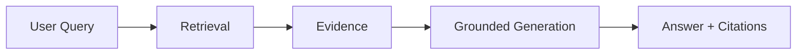
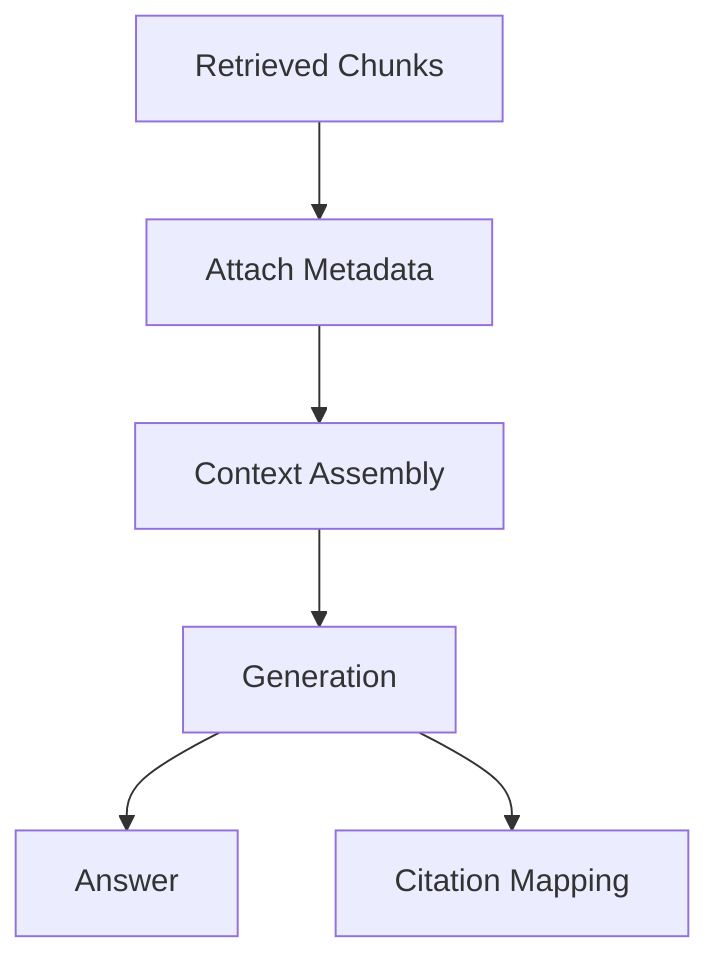

---
tags:
  - rag
  - grounding
  - citation
type: note
status: draft
source: "Google Cloud Grounding Docs · OpenAI Retrieval Docs"
parent_note: "[[RAG - MOC]]"
---

# RAG - Grounding and Citation

## Summary

RAG ที่ดีไม่ได้แค่ “ตอบได้” แต่ต้องตอบโดยอิงกับหลักฐานที่ retrieval ดึงมา และถ้าเป็นไปได้ควรชี้กลับไปยัง source ได้อย่างชัดเจน

---

## Scope

- grounded answer คืออะไร
- citation quality
- evidence traceability
- answer vs evidence mismatch
- grounding failure modes

---

## Grounding คืออะไร

grounding คือการทำให้คำตอบอิงอยู่กับข้อมูลที่ retrieval มา ไม่ใช่ปล่อยให้ model เติมจาก prior knowledge หรือเดาเอง

Google Cloud อธิบาย groundedness ว่าเป็นระดับที่ response สอดคล้องกับ facts ที่ถูกให้มาใน prompt หรือ RAG context  
OpenAI retrieval docs ก็ reinforce แนวทางเดียวกันผ่านการ synthesize response จาก search results ที่ดึงมาจาก vector store ก่อน

---

## Citation คืออะไรในระบบ RAG

citation คือกลไกที่ชี้ว่า answer มาจาก source ใดหรือ evidence ชุดใด  
ในเชิงระบบ citation ช่วย 3 เรื่อง:

- traceability
- trust
- debugging

ถ้าระบบมี citation ที่ดี คุณจะตอบคำถามต่อไปนี้ได้:
- claim นี้มาจาก source ไหน
- evidence นี้อยู่ใน chunk ไหน
- answer ใช้หลักฐานตรงกับที่ cite หรือไม่

---

## Evidence Traceability

traceability ต้องถูกออกแบบตั้งแต่ retrieval และ assembly ไม่ใช่รอค่อยแก้ตอน output

สิ่งที่ควรเก็บ:
- file or document id
- chunk id
- page / section metadata
- source title
- retrieval score หรือ rank

ถ้าไม่มี traceability:
- cite ยาก
- audit ยาก
- debug ยาก
- user trust ลดลง

---

## Citation-Aware Pipeline

แนวคิดสำคัญคือ:
- evidence ต้องพก metadata มาแต่ต้น
- assembly ต้องไม่ทำ metadata หาย
- generation layer ควรรับ context ที่ยัง trace กลับได้

---

## Grounded Answer vs Fluent Answer

answer ที่เขียนดีไม่จำเป็นต้อง grounded  
answer ที่ grounded ไม่จำเป็นต้องตอบครบหรืออ่านลื่นที่สุด

จึงควรแยก 2 มิตินี้ออกจากกัน:
- groundedness
- answer quality / usefulness

Google docs ฝั่ง grounding และ evaluation ทำให้ distinction นี้ชัดมาก โดยแยก support / groundedness ออกจาก quality dimensions อื่น

---

## Failure Modes

### 1. Unsupported Claims

answer มีข้อมูลที่ไม่อยู่ใน evidence

### 2. Citation Drift

cite source ผิด chunk หรือผิด document

### 3. Evidence-Answer Mismatch

มี evidence ถูกต้องอยู่ แต่ answer สรุปผิด

### 4. Lost Traceability

pipeline ตัด metadata ทิ้งระหว่าง assembly หรือ compression

### 5. Over-Compression

ย่อ evidence มากเกินไปจน grounding quality ลดลง

---

## Design Rules

- อย่าคิดว่า groundedness = answer quality
- ออกแบบ metadata และ source IDs ตั้งแต่ retrieval layer
- ถ้า use case สำคัญต่อความน่าเชื่อถือ ให้ citation เป็น output contract ส่วนหนึ่ง
- เวลาบีบอัด context ต้องระวังไม่ให้ evidence trace หาย
- eval grounding แยกจาก eval usefulness เสมอ

---

## ความสัมพันธ์กับโน้ตอื่น

- [[02 AI Systems/RAG/Core/01 - Retrieval Basics]] — grounding เริ่มจาก retrieval quality
- [[02 AI Systems/RAG/Core/06 - Context Assembly]] — assembly ต้องรักษา source trace
- [[02 AI Systems/RAG/Evaluation/08 - Evaluation]] — groundedness และ citation quality เป็นมิติ eval สำคัญ
- [[02 AI Systems/RAG/Core/RAG - Agentic RAG]] — agentic systems ต้อง trace หลาย retrieval steps ได้
- [[RAG - MOC]]

---

## Official References

- Google Cloud - Ground responses using RAG: https://cloud.google.com/vertex-ai/generative-ai/docs/grounding/ground-responses-using-rag
- Google Cloud - Check grounding with RAG: https://cloud.google.com/generative-ai-app-builder/docs/check-grounding
- OpenAI Retrieval Guide: https://platform.openai.com/docs/guides/retrieval
- OpenAI File Search Guide: https://platform.openai.com/docs/guides/tools-file-search
