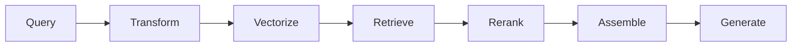

---
tags:
  - rag
  - cost
  - latency
type: note
status: draft
source: "OpenAI Retrieval Docs · Microsoft Learn Azure AI Search"
parent_note: "[[RAG - MOC]]"
---

# RAG - Cost and Latency Tradeoffs

## Summary

RAG ไม่ได้ optimize แค่ answer quality แต่ต้อง optimize cost และ latency ของทั้ง pipeline ตั้งแต่ ingestion ไปจนถึง generation

---

## Scope

- ingestion cost
- storage cost
- retrieval latency
- reranking cost
- end-to-end tradeoffs

---

## Cost เกิดที่ชั้นไหนบ้าง

RAG มีต้นทุนหลายชั้น:

1. ingestion
2. embeddings
3. storage / index
4. retrieval serving
5. reranking
6. generation

OpenAI retrieval docs ระบุ pricing ของ vector stores ตาม storage used  
Azure vector search overview ระบุว่า vector search feature ไม่มีค่าเพิ่มที่ระดับ service feature แต่ embedding generation หรือ AI enrichment อาจมีค่าใช้จ่ายจาก model/provider ที่เกี่ยวข้อง

---

## Latency เกิดที่ชั้นไหนบ้าง

latency มักมาจาก:
- query transformation
- query vectorization
- retrieval
- reranking
- context assembly
- final generation

ดังนั้น answer ที่ช้าไม่ได้แปลว่า model ช้าเสมอไป

---

## Ingestion vs Query-Time Trade-off

RAG มักย้ายต้นทุนบางส่วนจาก query time ไปอยู่ ingestion time

ตัวอย่าง:
- chunking ละเอียดขึ้น → ingest cost สูงขึ้น
- metadata enrichment มากขึ้น → ingest cost สูงขึ้น
- แต่ query quality และ filtering ดีขึ้น

GraphRAG หรือ structure-aware pipelines จะชัดเรื่องนี้มาก:
- ingest หนักขึ้น
- query side อาจฉลาดขึ้น

---

## Storage Trade-offs

storage cost เพิ่มตาม:
- จำนวน chunks
- overlap
- vector dimensions
- metadata richness
- retention policy

OpenAI docs ระบุว่า vector store billing ผูกกับ parsed chunks และ embeddings ที่เก็บ  
จึงแปลว่า:
- chunk เล็กและ overlap สูงมาก อาจทำให้ storage พุ่ง
- metadata และ multi-index strategies ก็มีผลต่อ footprint

---

## Retrieval Quality vs Latency

สิ่งที่มักเพิ่ม quality แต่เพิ่ม latency ด้วย:
- hybrid retrieval
- reranking
- query rewriting
- iterative / agentic retrieval
- larger candidate sets

สิ่งที่ช่วยลด latency แต่มี trade-off:
- top-k ต่ำลง
- simpler retrieval
- no reranker
- smaller chunks / fewer candidates

---

## End-to-End Trade-offs

### 1. Better Recall vs Faster Response

candidate เยอะขึ้นช่วย coverage แต่เพิ่ม latency และ noise

### 2. Better Precision vs More Computation

reranking ช่วย precision แต่เพิ่ม compute

### 3. Better Grounding vs Bigger Context

ยัด evidence เยอะขึ้นอาจช่วย grounding แต่เพิ่ม cost ของ generation

### 4. Better Traceability vs More Metadata

metadata เยอะขึ้นช่วย debugging และ citations แต่เพิ่ม storage/complexity

---

## Cost Controls

แนวทางควบคุม cost ที่พบบ่อย:
- จำกัด index scope
- ใช้ metadata filters เพื่อลด search space
- จำกัด top-k
- ใช้ reranking เฉพาะ query classes ที่จำเป็น
- ตั้ง retention / expiration policy สำหรับ vector stores
- tune chunking ให้พอดี ไม่ละเอียดเกินเหตุ

OpenAI vector store docs รองรับ expiration policy  
Azure cost management docs reinforce แนวคิดการวางงบ, monitoring, และ capacity planning

---

## Latency Controls

แนวทางลด latency:
- ลด query transformation ที่ไม่จำเป็น
- ใช้ simpler retrieval สำหรับ easy queries
- rerank เฉพาะตอนที่ candidate set noisy จริง
- จำกัด context assembly size
- แยก routing ระหว่าง simple RAG กับ advanced RAG

---

## Failure Modes

### 1. Over-Engineered RAG

เพิ่มทุกชั้นจนได้ quality นิดเดียวแต่ cost/latency พุ่ง

### 2. Hidden Storage Growth

chunking + overlap + metadata ทำให้ vector footprint โตโดยไม่รู้ตัว

### 3. Retrieval Cheap, Generation Expensive

ประหยัดฝั่ง retrieval แต่ปล่อยให้ context ใหญ่มากจน generation cost สูง

### 4. One-Size-Fits-All Pipeline

ใช้ pipeline เดียวกับทุก query ทั้งที่บาง query ง่ายมาก

---

## Design Rules

- วัด end-to-end ไม่ใช่เฉพาะ retrieval quality
- optimize cost และ latency ตาม query class
- คิด ingestion, storage, retrieval, generation เป็นงบเดียวกัน
- ถ้า corpus โตเร็ว ต้อง monitor storage footprint ตั้งแต่ต้น
- agentic / graph / hybrid patterns ควรเปิดเมื่อ use case คุ้มจริง

---

## ความสัมพันธ์กับโน้ตอื่น

- [[02 AI Systems/RAG/Core/01 - Retrieval Basics]] — top-k และ retrieval mode มีผลต่อ latency
- [[02 AI Systems/RAG/Core/02 - Chunking Strategies]] — chunking มีผลต่อ storage และ quality
- [[02 AI Systems/RAG/Retrieval/03 - Embeddings and Vector Databases]] — vector storage และ index choices
- [[02 AI Systems/RAG/Retrieval/05 - Reranking]] — precision vs latency trade-off
- [[02 AI Systems/RAG/Core/RAG - Agentic RAG]] — agentic patterns เพิ่ม orchestration cost
- [[02 AI Systems/RAG/Evaluation/08 - Evaluation]] — operational metrics ต้องอยู่ใน eval
- [[RAG - MOC]]

---

## Official References

- OpenAI Retrieval Guide: https://platform.openai.com/docs/guides/retrieval
- OpenAI Vector Store API Reference: https://platform.openai.com/docs/api-reference/vector-stores/create
- Microsoft Learn - Vector Search Overview: https://learn.microsoft.com/en-us/azure/search/vector-search-overview
- Microsoft Learn - What is Azure AI Search?: https://learn.microsoft.com/en-us/azure/search/search-what-is-azure-search
- Microsoft Learn - Plan and Manage Costs: https://learn.microsoft.com/en-us/azure/search/search-sku-manage-costs
