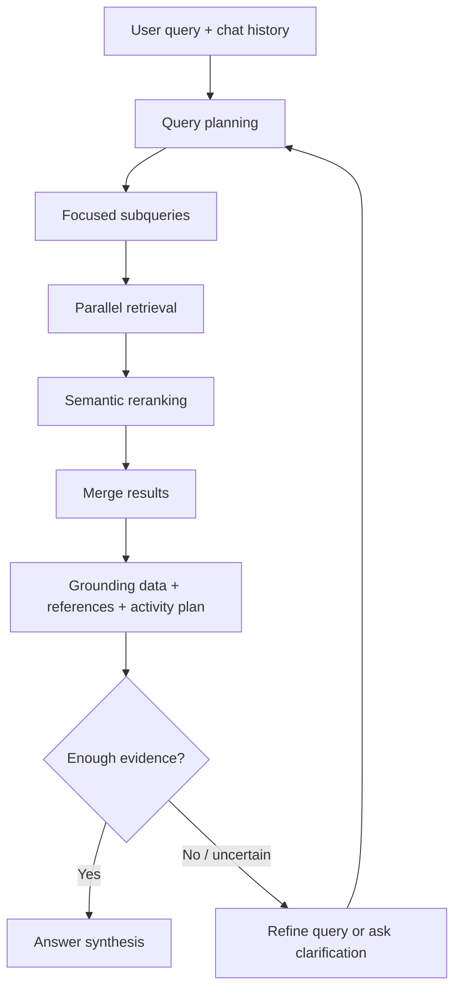

---
tags:
  - rag
  - agenticrag
  - retrieval
  - planning
type: note
status: evergreen
source: "Microsoft Learn - Agentic retrieval in Azure AI Search · Microsoft Learn - Agentic retrieval quickstart"
parent_note: "[[02 AI Systems/RAG/RAG - MOC|RAG - MOC]]"
created: "2026-04-18"
updated: "2026-04-18"
---

# Agentic RAG - Planning and Retrieval Loop

## Summary

Agentic RAG เพิ่ม planning loop เข้าไปใน retrieval layer  
แทนที่จะส่ง query เดียวไป search engine ระบบจะวิเคราะห์ information need, แตก query เป็น subqueries, execute หลาย retrieval calls, rerank, รวม grounding data, และส่ง trace กลับให้ downstream agent หรือ chat app

Microsoft Learn ใช้คำว่า `agentic retrieval` สำหรับ multi-query pipeline ที่ออกแบบมาให้ chat apps, copilots, และ agent workflows ใช้เป็น knowledge layer

---

## Core Loop

หมายเหตุ: Microsoft implementation ที่อ้างอิงในรอบนี้ทำ query planning เป็น automated step ภายใน knowledge base และไม่ customizable ใน pipeline นั้น แต่ concept เชิงสถาปัตย์ยังใช้เป็น pattern สำหรับระบบ agentic RAG อื่นได้

---

## Loop Stages

### 1. Workflow Initiation

application เรียก knowledge layer ด้วย user query และอาจส่ง conversation history เข้าไปด้วย

จุดออกแบบ:
- request นี้ต้องใช้ retrieval หรือไม่
- history ใดควรเข้ามาช่วย query planning
- permission context ของ user คืออะไร

### 2. Query Planning

LLM วิเคราะห์ query และ chat thread เพื่อหา information need ที่แท้จริง  
ถ้าคำถามมีหลาย asks หรือหลาย constraints ระบบแตกเป็น focused subqueries

### 3. Query Execution

subqueries ถูกส่งไปยัง knowledge sources  
Microsoft ระบุว่าแต่ละ subquery สามารถเป็น keyword, vector, หรือ hybrid search และรันพร้อมกันได้

จุดออกแบบ:
- source ไหนควรถูก query
- ต้องใช้ filters หรือ scoring profiles ไหม
- query เป็น hybrid หรือ pure vector
- ต้อง preserve references ตั้งแต่ retrieval หรือไม่

### 4. Reranking and Selection

แต่ละ subquery ผ่าน semantic reranking เพื่อ promote matches ที่เกี่ยวข้องที่สุด

จุดออกแบบ:
- rerank top-k เท่าไร
- merge results ข้าม subqueries อย่างไร
- dedup chunks หรือ documents อย่างไร
- จะรักษา diversity ระหว่าง subtopics อย่างไร

### 5. Unified Grounding Response

ผลลัพธ์ถูกประกอบเป็น response ที่ downstream LLM หรือ agent ใช้ต่อได้

Microsoft ระบุ output สำคัญ 3 ส่วน:
- grounding data สำหรับ conversation turn ถัดไป
- reference data สำหรับตรวจ source content
- activity plan / execution details ที่แสดง query execution steps

### 6. Answer Synthesis

application อาจใช้ grounding data ไปให้ LLM ตอบ หรือให้ retrieval layer synthesize answer พร้อม citations

จุดออกแบบ:
- answer synthesis อยู่ใน retrieval layer หรือ application layer
- citations ต้อง mapping ถึง source chunks ได้แค่ไหน
- activity trace ต้องโชว์ให้ user หรือเก็บไว้ debug เท่านั้น

---

## Agentic Retrieval ไม่เท่ากับ Agent ตอบเองทั้งหมด

ใน Microsoft architecture, agentic retrieval เป็น knowledge layer ที่ผลิต grounding data, references, และ activity trace ให้ application หรือ agent ใช้ต่อ  
มันไม่จำเป็นต้องเป็น full autonomous agent ที่ทำ arbitrary tools ทุกชนิด

| Pattern | Control Center | Output หลัก |
|---|---|---|
| Classic RAG | application routing | retrieved chunks |
| Agentic retrieval | retrieval knowledge base + LLM query planning | grounding data + references + activity |
| Full agent + RAG | agent runtime | actions, tool calls, final response |

---

## Stopping Criteria

agentic RAG ต้องมีเกณฑ์หยุด ไม่อย่างนั้น cost และ latency จะบาน

ควรหยุดเมื่อ:
- subqueries ครอบคลุม asks หลักแล้ว
- retrieved evidence สนับสนุน answer ได้เพียงพอ
- reranked results ไม่มี evidence ใหม่เพิ่ม
- retrieval budget หมด
- source ที่เหลือไม่มีสิทธิ์หรือไม่น่าเชื่อถือพอ

ควรถาม clarification เมื่อ:
- query กว้างเกินไป
- source ที่เกี่ยวข้องมีหลาย interpretation
- evidence ขัดแย้งกันและไม่มี source authority ชัด

---

## Retrieval Budget

| Budget | ใช้คุม |
|---|---|
| max subqueries | query planning ไม่แตกเกินจำเป็น |
| max sources | ไม่ยิงทุก source โดยไม่จำเป็น |
| max chunks per subquery | จำกัด reranking/context cost |
| max reasoning effort | คุม latency และ planning cost |
| max answer tokens | คุม synthesis cost |
| timeout | กัน retrieval loop ยาวเกิน |

Microsoft ระบุว่า agentic retrieval มี cost/latency เพิ่มจาก LLM query planning, semantic reranking, และ token-based billing จึงต้องคิด budget ตั้งแต่ design

---

## Observability Requirements

agentic RAG ต้อง trace ได้มากกว่า classic RAG:

- original query
- chat history ที่ใช้ใน planning
- generated subqueries
- sources ที่ถูก query
- retrieval mode ต่อ subquery
- reranker scores
- selected chunks / references
- activity plan หรือ execution details
- answer synthesis decision

ถ้าไม่มี trace เหล่านี้ เวลาคำตอบผิดจะไม่รู้ว่าพลาดที่ planning, retrieval, reranking, context assembly, หรือ generation

---

## Failure Modes

### 1. Bad Query Planning

LLM แตก query ไม่ตรง information need หรือพลาด constraint สำคัญ

### 2. Over-Decomposition

แตกคำถามมากเกินไปจน retrieve noise เพิ่ม

### 3. Under-Decomposition

ไม่แตกคำถามที่ควรแตก ทำให้ retrieve ไม่ครอบคลุมหลาย asks

### 4. Parallel Noise

หลาย subqueries ดึงข้อมูลมามากขึ้น แต่ไม่เพิ่ม evidence ที่ใช้ตอบจริง

### 5. Reranking Bottleneck

semantic reranking เพิ่มคุณภาพแต่กลายเป็น latency/cost hotspot

### 6. Reference Drift

answer อ้าง reference ที่ retrieve มา แต่ claim ไม่ตรงกับ evidence หรือข้าม source context

---

## Design Rules

- ใช้ agentic retrieval เมื่อ query ซับซ้อนหรือ conversational จริง
- อย่าใช้ agentic loop เพื่อแทนการออกแบบ chunking / index / metadata ที่ดี
- query plan และ activity trace ต้องเก็บได้
- แยก eval ของ planning, retrieval, reranking, grounding, และ answer synthesis
- permission / security trimming ต้องเกิดก่อน evidence ถูกใช้ตอบ
- ถ้า latency สำคัญมาก ให้เริ่มจาก classic hybrid RAG แล้วค่อยเพิ่ม agentic routing เฉพาะ query ยาก

---

## ความสัมพันธ์กับโน้ตอื่น

- [[02 AI Systems/RAG/Core/RAG - Agentic RAG]]
- [[02 AI Systems/RAG/Retrieval/RAG - Query Routing and Retrieval Strategy]]
- [[02 AI Systems/RAG/Core/04 - Query Transformation]]
- [[02 AI Systems/RAG/Retrieval/05 - Reranking]]
- [[02 AI Systems/RAG/Evaluation/08 - Evaluation]]
- [[02 AI Systems/RAG/Core/09 - Cost and Latency Tradeoffs]]
- [[02 AI Systems/AI Agent Fundamentals/Core/05 - วงจร Perceive-Think-Act-Check]]
- [[02 AI Systems/Agent Frameworks/Core/04 - Tool Orchestration]]

---

## Official References

- Microsoft Learn - Agentic retrieval in Azure AI Search: https://learn.microsoft.com/en-us/azure/search/agentic-retrieval-overview
- Microsoft Learn - Quickstart: Agentic Retrieval: https://learn.microsoft.com/en-us/azure/search/search-get-started-agentic-retrieval
