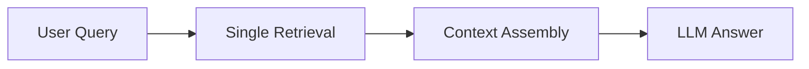
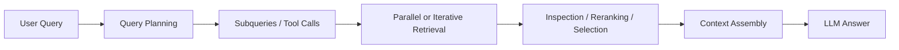

---
tags:
  - rag
  - agenticrag
  - agents
type: note
status: evergreen
source: "Microsoft Learn (Agentic Retrieval) · OpenAI Agents Docs"
parent_note: "[[02 AI Systems/RAG/RAG - MOC|RAG - MOC]]"
---

# RAG - Agentic RAG

## Summary

Agentic RAG คือ retrieval แบบมี planning และ iterative steps

พูดง่าย ๆ:
- classic RAG = retrieve once, generate once
- agentic RAG = plan, retrieve, inspect, possibly retrieve again, then answer

---

## Agentic RAG ต่างจาก Classic RAG อย่างไร

classic RAG แบบพื้นฐานมักมี pipeline สั้น:

agentic RAG เพิ่ม reasoning และ orchestration:

Microsoft Learn ใช้คำว่า **agentic retrieval** สำหรับ multi-query pipeline ที่ LLM ช่วยแตก complex query เป็น subqueries, รันแบบขนาน, rerank, และรวมผลเป็น response เดียว

---

## องค์ประกอบสำคัญ

Agentic RAG มักมีส่วนเพิ่มจาก basic RAG ดังนี้:

1. query planning
2. subquery decomposition
3. retrieval over multiple sources
4. optional tool use
5. iterative refinement
6. answer synthesis พร้อม references

OpenAI Agents docs วางภาพรวมของ agents ว่าเป็น systems ที่เชื่อม:
- models
- tools
- knowledge
- logic

---

## รูปแบบที่พบบ่อย

### 1. Multi-Query RAG

แตกคำถามยากเป็นคำถามย่อย  
เหมาะกับ compound questions หรือคำถามที่มีหลาย constraints

### 2. Tool-Augmented Retrieval

agent เลือกว่าจะใช้:
- vector search
- keyword search
- graph search
- web / enterprise source อื่น

### 3. Iterative Retrieval

retrieve รอบแรกก่อน  
ถ้าหลักฐานยังไม่พอ agent จึงทำ retrieval เพิ่ม

### 4. Plan-then-Retrieve

วิเคราะห์ความต้องการข้อมูลก่อน แล้วค่อยตัดสินใจว่าต้องค้นจาก source ไหน

---

## Agentic Retrieval ของ Microsoft

Microsoft Learn อธิบาย agentic retrieval ว่า:
- ใช้ LLM แตก query ซับซ้อนเป็น subqueries
- รัน subqueries แบบขนาน
- ใช้ semantic reranking
- รวมผลเป็น unified response
- รองรับ chat history เป็น input

เชิงสถาปัตย์ ข้อได้เปรียบคือ:
- recall ดีขึ้นกับคำถามซับซ้อน
- รองรับ multi-constraint questions ดีขึ้น
- สามารถคืนทั้ง grounding data, references, และ execution trace ได้

ข้อแลกเปลี่ยนคือ:
- latency เพิ่ม
- cost เพิ่ม
- control และ observability ต้องดีขึ้น

---

## เมื่อไรควรใช้ Agentic RAG

ควรใช้เมื่อ:
- คำถามซับซ้อนและมีหลายเงื่อนไข
- corpus ใหญ่และมีหลายแหล่ง
- single retrieval มักพลาด coverage
- ต้องการ trace ว่าค้นหาอะไรไปบ้าง
- retrieval strategy ต้อง adapt ตาม query

อาจยังไม่จำเป็นเมื่อ:
- use case เป็น FAQ ง่าย ๆ
- คำถามสั้นและตรง
- latency budget ต่ำมาก
- retrieval ธรรมดายังไม่ถูก tune ให้ดี

---

## Failure Modes

### 1. Over-Reasoning

ระบบใช้ planning เกินจำเป็นกับคำถามง่าย ๆ ทำให้ช้าและแพง

### 2. Bad Decomposition

แตก subqueries ผิด ทำให้ coverage แย่ลงแทนที่จะดีขึ้น

### 3. Tool Routing Errors

เลือก retrieval tool ผิดชนิดหรือผิด source

### 4. Iteration Drift

retrieval หลายรอบพาระบบออกนอกโจทย์เดิม

### 5. Hard-to-Debug Pipelines

เมื่อ retrieval, planning, reranking, และ synthesis ซ้อนกันมาก การวิเคราะห์ปัญหาจะยากขึ้น

---

## Agentic RAG vs Agent + RAG

สองอย่างนี้ใกล้กันแต่ไม่เหมือนกัน:

- `agentic RAG` = retrieval layer เองมี planning และ orchestration
- `agent + RAG` = ระบบ agent ใช้ RAG เป็นหนึ่งใน tools หรือหนึ่งใน steps

บางระบบเป็นทั้งสองอย่างพร้อมกัน

ตัวอย่าง:
- agent planner เลือก query decomposition
- retrieval stack มี hybrid search และ reranking
- agent ตัดสินใจว่าพอแล้วหรือควร retrieve อีกรอบ

---

## Design Rules

- อย่าเริ่มด้วย agentic RAG ถ้า classic RAG ยังไม่เสถียร
- เพิ่ม planning เมื่อ query complexity เรียกร้องจริง
- แยก metrics ของ planning, retrieval, reranking, และ answer synthesis ออกจากกัน
- เก็บ traces หรือ query plans เพื่อให้ debug ได้
- จำกัด iteration และ tool budget ให้ชัด

---

## ความสัมพันธ์กับโน้ตอื่น

- [[02 AI Systems/RAG/Core/01 - Retrieval Basics]] — retrieval layer พื้นฐาน
- [[02 AI Systems/RAG/Retrieval/RAG - Hybrid Retrieval]] — multi-query systems มักใช้ hybrid retrieval
- [[02 AI Systems/RAG/Retrieval/RAG - Knowledge Graph RAG]] — agentic systems อาจเลือก graph retrieval เป็นหนึ่งใน tools
- [[02 AI Systems/RAG/Evaluation/08 - Evaluation]] — agentic RAG ต้องมี eval แยกชั้น
- [[02 AI Systems/AI Agent Fundamentals/Core/04 - สถาปัตยกรรม Agent: Model + Tools + Orchestration]] — orchestration layer ของ agents
- [[02 AI Systems/Agent Frameworks/Agent Frameworks - MOC]] — framework-level runtime, state, และ orchestration tradeoffs
- [[02 AI Systems/MCP/Bridge/14 - Tools: การออกแบบและทำงาน]] — retrieval เป็น tool ได้
- [[02 AI Systems/MCP/MCP - MOC]] — agentic retrieval บางระบบอาจ expose ผ่าน protocol/tool layer
- [[02 AI Systems/RAG/RAG - MOC|RAG - MOC]]

---

## Official References

- Microsoft Learn - Agentic Retrieval Overview: https://learn.microsoft.com/en-us/azure/search/search-agentic-retrieval-concept
- Microsoft Learn - Agentic Retrieval Quickstart: https://learn.microsoft.com/en-us/azure/search/search-get-started-agentic-retrieval
- OpenAI Agents Guide: https://platform.openai.com/docs/guides/agents
