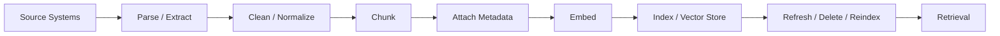

---
tags:
  - rag
  - ingestion
  - indexing
type: note
status: evergreen
source: "OpenAI Retrieval Docs · Microsoft Learn Azure AI Search · AWS Bedrock Knowledge Bases · vault-local architectural inference"
parent_note: "[[02 AI Systems/RAG/RAG - MOC|RAG - MOC]]"
created: "2026-04-19"
updated: "2026-04-19"
---

# RAG - Ingestion and Indexing Pipeline

## Summary

retrieval quality เริ่มก่อน query-time ตั้งแต่ source ถูก parse, clean, chunk, enrich metadata, embed, และ index

ถ้า ingestion pipeline แย่ retrieval layer จะเจอปัญหาแม้ใช้ vector database, reranker, หรือ model ที่ดีแล้วก็ตาม

---

## Scope

- source selection
- parsing and cleaning
- chunking
- metadata enrichment
- embedding
- indexing
- refresh, delete, expiration, และ reindex
- ingestion failure modes

---

## Pipeline ภาพรวม

OpenAI vector stores ทำให้เห็น managed ingestion pattern ชัด: ไฟล์ที่ผูกกับ vector store จะถูก parse, chunk, embed, และ index เพื่อใช้กับ retrieval หรือ `file_search`

Azure AI Search และ AWS Bedrock Knowledge Bases ก็มี pattern เดียวกันในระดับสถาปัตย์: ก่อน retrieve ต้องมี corpus ที่ถูกเตรียม, transformed, indexed, และผูก metadata ไว้ให้ค้นได้

---

## Source Selection

ก่อน ingest ต้องตอบให้ได้ว่า source ไหนเป็น source of truth

คำถามหลัก:
- source นี้ official หรือ user-provided
- source มี owner หรือ team รับผิดชอบไหม
- source เปลี่ยนบ่อยแค่ไหน
- source มี access control หรือ tenant boundary ไหม
- source มี duplicate กับ source อื่นหรือไม่

ข้อควรระวัง:
- ingest ทุกอย่างเข้าดัชนีเดียวทำให้ retrieval noisy และ permission control ยาก
- source ที่ไม่มี owner ทำให้ stale data แก้ยาก
- source trust ต้องเป็น metadata ไม่ใช่ความทรงจำของทีม

---

## Parse และ Clean

parsing คือแปลง source ให้เป็นข้อความหรือ structure ที่นำไป chunk/index ได้

สิ่งที่ต้องรักษา:
- headings
- tables
- lists
- page numbers หรือ section ids
- code blocks
- document title และ source path

cleaning ไม่ได้แปลว่าลบทุกอย่างที่ดูรก แต่คือ normalize ให้ retrieval ใช้งานได้:
- remove boilerplate ที่ซ้ำทุกหน้า
- normalize whitespace
- preserve semantic boundaries
- แยก content ออกจาก navigation chrome
- เก็บ metadata ที่จำเป็นต่อ citation และ permission

failure สำคัญคือ parse แล้วเสีย structure เช่น table หาย, heading ขาด, หรือ code block ถูก flatten จนความหมายผิด

---

## Chunk

chunking เป็นจุดที่เอกสารถูกแปลงเป็น retrieval units

ต้องตัดสินใจ:
- fixed-size หรือ structure-aware
- chunk size
- overlap
- parent-child strategy
- special handling สำหรับ tables, code, policy clauses

design inference:
- chunk เล็กช่วย retrieval precision แต่เสี่ยง context ขาด
- chunk ใหญ่ช่วย answer synthesis แต่เพิ่ม noise
- chunking strategy เปลี่ยนเมื่อไร ควรถือว่า index migration ไม่ใช่ prompt tweak

---

## Metadata Enrichment

metadata คือ control surface ของ retrieval

ควร enrich ตั้งแต่ ingest:
- source id
- document id
- chunk id
- title
- section / page
- created / updated time
- source system
- tenant / workspace
- owner team
- access group
- document type
- version
- trust level

metadata ใช้กับ:
- filters
- permission-aware retrieval
- source routing
- deduplication
- citation
- observability
- reindex planning

ถ้า metadata ไม่ครบตั้งแต่ ingest ระบบมักต้องแก้ยากภายหลัง เพราะ index ไม่มี field ให้ filter หรือ trace

---

## Embed

embedding คือการสร้าง vector representation ของ chunk หรือ document unit

สิ่งที่ต้องคุม:
- embedding model
- vector dimensions
- language / domain coverage
- preprocessing consistency
- retry และ idempotency
- cost ของ batch embedding

ข้อสำคัญ:
- query embeddings และ document embeddings ต้องอยู่ใน compatible vector space
- เปลี่ยน embedding model มักต้อง re-embed และ reindex
- embedding failure ต้องไม่ทำให้ index มี partial state ที่ debug ไม่ได้

---

## Index

indexing คือการนำ chunks, vectors, metadata, และ source references เข้า retrieval backend

backend อาจเป็น:
- OpenAI vector stores
- Azure AI Search
- AWS Bedrock Knowledge Bases
- vector database
- search engine
- hybrid search backend

indexing ต้องดูแล:
- idempotent upsert
- duplicate detection
- metadata schema
- filterable fields
- searchable fields
- versioning
- deletion semantics
- retention / expiration policy

---

## Refresh, Delete, Reindex

RAG index ต้องมี lifecycle ไม่ใช่ build ครั้งเดียวแล้วจบ

### Refresh

ใช้เมื่อ source เปลี่ยนและต้อง update chunks / metadata / embeddings

### Delete

ใช้เมื่อ source ถูกลบ, หมดอายุ, หรือ user ไม่มีสิทธิ์ให้ใช้ต่อ
delete สำคัญมากกับ privacy และ compliance เพราะ stale chunks อาจยังตอบได้แม้ source หายไปแล้ว

### Reindex

ใช้เมื่อเปลี่ยน:
- chunking strategy
- embedding model
- metadata schema
- parser
- access control mapping
- source trust policy

### Expiration

บางระบบ เช่น OpenAI vector stores รองรับ expiration policy เพื่อควบคุม retention และ storage footprint

---

## Ingestion Observability

ควร log และ monitor:
- source count
- parse success / failure
- chunk count ต่อ document
- average chunk size
- metadata completeness
- embedding failures
- index upsert failures
- duplicate rate
- stale document count
- delete propagation lag
- storage footprint

observability ฝั่ง ingest ช่วยอธิบาย retrieval failures เช่น:
- หาไม่เจอเพราะยังไม่ได้ ingest
- หาเจอแต่ metadata ผิด
- cite ผิดเพราะ source id หาย
- ตอบข้อมูลเก่าเพราะ refresh ล้มเหลว

---

## Failure Modes

### 1. Stale Index

source เปลี่ยนแล้ว index ไม่ refresh ทำให้คำตอบอ้างข้อมูลเก่า

### 2. Duplicate Chunks

source ซ้ำหรือ overlap สูงเกิน ทำให้ retrieval คืน evidence ซ้ำและลด diversity

### 3. Bad Metadata

metadata ผิดหรือไม่ครบ ทำให้ filters, permissions, routing, และ citation พัง

### 4. Parser Loss

parser ทำ heading, table, code block, หรือ page reference หาย

### 5. Embedding Mismatch

ใช้ embedding model หรือ preprocessing ไม่สอดคล้องกันระหว่าง document และ query

### 6. Partial Indexing

บาง chunks สำเร็จ บาง chunks ล้มเหลว แต่ระบบไม่รู้ว่า index อยู่ใน state ไหน

### 7. Delete Gap

source ถูกลบหรือ revoke permission แล้ว แต่ chunks ยังอยู่ใน index

### 8. Reindex Drift

เปลี่ยน chunking หรือ metadata schema แล้วมี index เก่าและใหม่ปนกันโดยไม่มี version boundary

---

## Design Rules

- treat ingestion เป็น production pipeline ไม่ใช่ one-off script
- เก็บ source id, chunk id, metadata, และ version ตั้งแต่ต้น
- ทำ ingestion ให้ idempotent และ observable
- design metadata schema ก่อนเริ่ม index จริง
- เปลี่ยน chunking, embedding model, หรือ metadata schema ต้องมี reindex plan
- delete และ permission revocation ต้อง propagate ถึง index
- eval retrieval หลัง ingestion change ทุกครั้ง

---

## ความสัมพันธ์กับโน้ตอื่น

- [[02 AI Systems/RAG/Core/02 - Chunking Strategies]] — chunking เป็น ingestion decision
- [[02 AI Systems/RAG/Retrieval/03 - Embeddings and Vector Databases]] — indexing และ embeddings เป็น retrieval infrastructure
- [[02 AI Systems/RAG/Retrieval/RAG - Metadata Filtering and Permission-Aware Retrieval]] — metadata และ permission ต้องมาจาก ingestion
- [[02 AI Systems/RAG/Core/09 - Cost and Latency Tradeoffs]] — ingestion, storage, และ reindex มีต้นทุน
- [[02 AI Systems/RAG/Core/06 - Context Assembly]] — citation ต้องพึ่ง source metadata จาก ingest
- [[02 AI Systems/RAG/Evaluation/08 - Evaluation]] — ingestion changes ต้องมี regression eval
- [[06 Engineering/RAG/Recipe - Build a RAG Pipeline]] — implementation checklist
- [[02 AI Systems/RAG/RAG - MOC|RAG - MOC]]

---

## Official References

- OpenAI Retrieval Guide: https://platform.openai.com/docs/guides/retrieval
- OpenAI Vector Store API Reference: https://platform.openai.com/docs/api-reference/vector-stores
- Microsoft Learn - Retrieval-augmented generation in Azure AI Search: https://learn.microsoft.com/en-us/azure/search/retrieval-augmented-generation-overview
- Microsoft Learn - Vector Search Overview: https://learn.microsoft.com/en-us/azure/search/vector-search-overview
- AWS Bedrock - Retrieve information from Knowledge Bases: https://docs.aws.amazon.com/bedrock/latest/userguide/kb-how-retrieval.html
