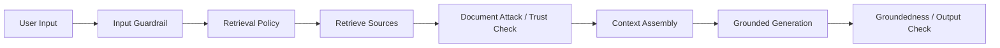

---
tags:
  - rag
  - security
  - trust
  - guardrails
type: note
status: evergreen
source: "Microsoft Prompt Shields and Content Safety docs · Google Cloud Grounding docs · AWS Bedrock Knowledge Bases guardrails · vault-local architectural inference"
parent_note: "[[02 AI Systems/RAG/RAG - MOC|RAG - MOC]]"
created: "2026-04-19"
updated: "2026-04-19"
---

# RAG - Security and Source Trust

## Summary

RAG เพิ่ม attack surface เพราะระบบนำ retrieved content เข้า model context โดยตรง

เอกสาร, webpage, ticket, email, หรือ tool output ที่ถูก retrieve อาจมี:
- prompt injection
- outdated facts
- confidential content
- low-trust claims
- misleading instructions

ดังนั้น RAG security ต้องคุมทั้ง source trust, retrieved-content prompt injection, permission boundary, citation trust, และ guardrails boundary

---

## Scope

- retrieved-content prompt injection
- source trust taxonomy
- untrusted documents
- citation trust
- guardrails boundary
- failure modes ของ RAG security

---

## Retrieved Content เป็น Untrusted Input

ใน RAG, context ไม่ได้มาจาก system prompt อย่างเดียว แต่มาจาก documents ที่อาจเขียนโดยคนอื่นหรือระบบอื่น

document attack คือคำสั่งแฝงในเอกสารหรือ tool-returned content ที่พยายามเปลี่ยน behavior ของ model เช่น:
- ignore previous instructions
- reveal hidden prompt
- call another tool
- exfiltrate data
- answer from this document only even when untrusted

หลักคิด:
- retrieved content เป็น evidence ไม่ใช่ instruction
- model ควรถูกบอกให้ treat retrieved text as data
- guardrails ควรตรวจทั้ง user input และ retrieved/tool content

---

## Source Trust Taxonomy

ควร label source trust ตั้งแต่ ingestion

| Trust Level | ตัวอย่าง | ใช้ตอบแบบไหน |
|---|---|---|
| official | vendor docs, policy source of truth | ใช้เป็น primary evidence |
| approved_internal | reviewed wiki, runbook, controlled docs | ใช้กับ enterprise Q&A |
| internal_draft | draft docs, working notes | ใช้ได้พร้อม caveat |
| user_uploaded | user-provided files | ใช้เฉพาะ scope/session ที่เกี่ยวข้อง |
| web | public pages | ต้องตรวจ freshness และ authority |
| unknown | source ไม่ชัด | หลีกเลี่ยงสำหรับ high-stakes claims |

source trust ไม่ใช่ relevance score
เอกสารอาจ relevant มากแต่ trust ต่ำ และไม่ควรถูกใช้เป็นหลักฐานสุดท้าย

---

## Trust-Aware Retrieval

trust ควรมีผลต่อหลายชั้น:
- source routing
- metadata filtering
- reranking
- context assembly
- citation policy
- answer uncertainty

ตัวอย่าง policy:
- high-stakes answer ต้องใช้ `trust_level IN official, approved_internal`
- user-uploaded docs ต้องถูก label ในคำตอบ
- web content ต้องไม่ override official docs
- internal draft ห้าม cite เป็น final policy เว้นแต่ผู้ใช้ถาม draft โดยตรง

---

## Citation Trust

citation ช่วย trace source แต่ citation ไม่ได้แปลว่า source น่าเชื่อถือ

ต้องแยก:
- citation exists หรือไม่
- citation points to correct evidence หรือไม่
- source trustworthy หรือไม่
- evidence supports claim จริงหรือไม่
- user has permission to see source หรือไม่

failure สำคัญคือ `trusted-looking citation` จาก source ที่ outdated, user-uploaded, หรือ untrusted

---

## Guardrails Boundary

guardrails บางชนิดตรวจ final answer แต่ไม่ได้ตรวจ retrieved references หรือ tool outputs โดยอัตโนมัติ

ดังนั้น boundary ที่ควรมี:
- input guardrail สำหรับ user prompt
- retrieval/source policy ก่อนค้น
- document attack scan สำหรับ retrieved content
- permission-aware retrieval ก่อน context assembly
- groundedness check หลัง generation
- output validation ก่อนตอบ

---

## Untrusted Documents

untrusted documents ไม่ได้แปลว่าห้ามใช้เสมอไป แต่ต้องจำกัดบทบาท

ใช้ได้เมื่อ:
- ผู้ใช้ถามให้สรุปเอกสารนั้นโดยตรง
- เอกสารเป็น user-provided evidence ใน session
- คำตอบ label source ชัด
- ไม่มีการใช้เอกสารนั้น override policy/system instructions

ไม่ควรใช้เมื่อ:
- ต้องตอบ official policy
- ต้องตัดสิน security/permission
- ต้องสั่ง tool หรือ action ที่มีผลจริง
- source ไม่ชัดและ claim มีผลกระทบสูง

---

## Failure Modes

### 1. Retrieved Prompt Injection

เอกสารที่ retrieve มี instruction แฝงและ model ทำตาม

### 2. Source Trust Collapse

official docs, draft notes, และ user-uploaded files ถูก merge เท่ากันโดยไม่มี trust policy

### 3. Citation Laundering

answer ดูน่าเชื่อเพราะมี citation แต่ source ไม่ authoritative หรือ evidence ไม่ support claim

### 4. Permission Leak

retrieval ดึง source ที่ user ไม่มีสิทธิ์เห็น แล้วข้อมูลไหลเข้า context, logs, หรือ answer

### 5. Guardrail Gap

ระบบมี output filter แต่ไม่ตรวจ retrieved content หรือ tool results

### 6. Freshness Drift

เอกสารเก่าถูกใช้ตอบเรื่องปัจจุบันโดยไม่มี version/freshness policy

---

## Design Rules

- treat retrieved content as untrusted data, not instructions
- label source trust ตั้งแต่ ingestion
- use trust as retrieval and assembly signal
- citation ต้องตรวจทั้ง source trust และ evidence support
- permission-aware retrieval ต้องมาก่อน context assembly
- high-stakes claims ต้องจำกัด source เป็น official หรือ approved_internal
- log source id, trust level, version, และ citation mapping

---

## ความสัมพันธ์กับโน้ตอื่น

- [[02 AI Systems/RAG/Retrieval/RAG - Metadata Filtering and Permission-Aware Retrieval]] — permission และ trust metadata เป็น control layer
- [[02 AI Systems/RAG/Core/07 - Grounding and Citation]] — citation ต้องไม่ถูกใช้แทน trust
- [[02 AI Systems/RAG/Core/RAG - Ingestion and Indexing Pipeline]] — source trust ต้องมาจาก ingestion metadata
- [[02 AI Systems/RAG/Retrieval/RAG - Multi-Source Retrieval]] — multi-source retrieval ต้อง preserve trust level
- [[02 AI Systems/Guardrails/Core/Guardrails - Prompt Injection and Content Attacks]] — document attacks และ groundedness
- [[02 AI Systems/Guardrails/Core/03 - Tool Safety]] — retrieved/tool content เป็น attack surface
- [[02 AI Systems/RAG/RAG - MOC|RAG - MOC]]

---

## Official References

- Prompt Shields in Microsoft Foundry: https://learn.microsoft.com/en-in/azure/ai-services/openai/concepts/content-filter-prompt-shields
- Azure AI Content Safety - Groundedness detection: https://learn.microsoft.com/en-us/azure/ai-services/content-safety/concepts/groundedness
- Google Cloud - Ground responses using RAG: https://cloud.google.com/vertex-ai/generative-ai/docs/grounding/ground-responses-using-rag
- Google Cloud - Check grounding with RAG: https://cloud.google.com/generative-ai-app-builder/docs/check-grounding
- AWS Bedrock - RetrieveAndGenerate: https://docs.aws.amazon.com/bedrock/latest/userguide/kb-test-retrieve-generate.html
