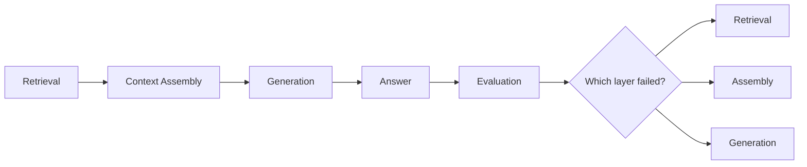
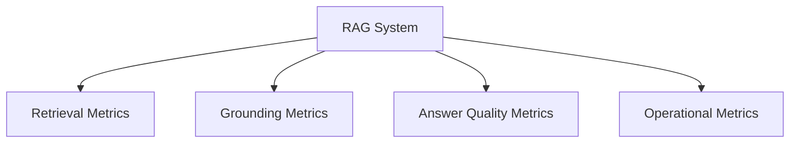

---
tags:
  - rag
  - evaluation
  - evals
type: note
status: draft
source: "OpenAI Retrieval Docs · Google Vertex AI Grounding / Evaluation Docs · Microsoft Learn"
parent_note: "[[RAG - MOC]]"
---

# RAG - Evaluation

## Summary

RAG eval ต้องแยกให้ออกว่า retrieval พลาด, context assembly พลาด, หรือ generation พลาด ไม่เช่นนั้นจะแก้ผิดชั้น

---

## Scope

- retrieval metrics
- answer quality metrics
- grounding / citation quality
- offline vs online eval
- failure slicing

---

## ทำไม RAG Evaluation ต้องแยกเป็นชั้น

RAG เป็นระบบหลายชั้น:
- retrieval
- ranking / selection
- context assembly
- generation

ดังนั้น answer ที่ผิดไม่ได้แปลว่า retrieval ผิดเสมอไป  
OpenAI retrieval docs ชี้ลำดับ “retrieve first, then synthesize”  
Google docs ฝั่ง grounding และ evaluation ชี้ชัดว่าควรแยก groundedness ออกจาก text quality

ถ้าไม่แยกชั้น:
- จะแก้ผิด component
- tuning ไม่ตรงจุด
- cost เพิ่มโดยไม่ได้คุณภาพเพิ่มจริง

---

## Evaluation Layers

### 1. Retrieval Evaluation

ถามว่า:
- หา evidence ที่ควรเจอหรือไม่
- candidate set ดีพอหรือไม่
- relevant chunks อยู่ใน top-k หรือไม่

metrics / criteria ที่ใช้บ่อย:
- recall@k
- precision@k
- hit rate
- ranking quality

### 2. Context Evaluation

ถามว่า:
- chunks ที่ retrieval ส่งมาถูกคัดเลือกดีหรือยัง
- context ที่เข้า model มี noise มากไปไหม
- ลำดับของ context ช่วยหรือทำร้าย answer quality ไหม

### 3. Answer Evaluation

ถามว่า:
- คำตอบถูกไหม
- grounded ไหม
- cite หลักฐานได้ไหม
- ตรงคำถามไหม

---

## Groundedness และ Citation Quality

Google ระบุชัดใน `Check grounding with RAG` ว่า groundedness คือระดับที่ answer candidate สอดคล้องกับ facts ที่ retrieval มา และ API ของ Google ให้:
- support score
- citations supporting each claim

นี่ทำให้ groundedness เป็น metric แยกจาก “ภาษาอ่านดีไหม” หรือ “ตอบไหลลื่นไหม”

สิ่งที่ควรแยกให้ออก:
- answer อาจเขียนดีแต่ไม่ grounded
- answer อาจ grounded แต่ไม่ตอบคำถามครบ
- answer อาจ cite sources แต่เลือก citation ไม่ตรง claim

---

## Offline vs Online Evaluation

### Offline Eval

ใช้ dataset หรือ test set ที่เตรียมไว้  
เหมาะกับ:
- tuning retrieval strategy
- compare chunking variants
- compare embedding models
- compare prompts / context assembly methods

### Online Eval

ใช้ production traces, user feedback, หรือ live sampling  
เหมาะกับ:
- detect drift
- ดู failure distribution จริง
- วัด latency/cost/quality balance

OpenAI agent evals และ Vertex AI evaluation service ช่วย reinforce แนวคิดนี้ว่าระบบควรมี evaluation flywheel ต่อเนื่อง ไม่ใช่ตรวจครั้งเดียวแล้วจบ

---

## Failure Slicing

RAG eval ที่ดีต้อง slice failures ตามชนิด ไม่ใช่รวมคะแนนเดียว

ตัวอย่าง slices:
- exact lookup questions
- long-form synthesis questions
- multi-hop questions
- date-sensitive questions
- acronym / entity questions
- multilingual questions

ถ้าไม่ slice:
- hybrid retrieval อาจดูไม่ต่างจาก vector-only ในภาพรวม
- แต่พอดูเฉพาะ entity-heavy questions จะต่างมาก

---

## Evaluation Dimensions ที่สำคัญ

### Retrieval Quality

- relevant evidence found or not
- top-k coverage
- ranking quality

### Grounding Quality

- ทุก claim มี support หรือไม่
- citation ตรง claim หรือไม่

### Answer Utility

- relevance
- completeness
- helpfulness

### Operational Quality

- latency
- cost
- stability across runs

Vertex AI evaluation docs อธิบายว่าการกำหนด evaluation goal และ metrics ต้องเริ่มจาก criteria ก่อน แล้วค่อยเลือก metric ที่เหมาะ

---

## Example Evaluation Matrix

ตัวอย่างการมองแบบ matrix:

| ชั้น | คำถามที่ต้องตอบ |
|---|---|
| Retrieval | หา evidence ที่ควรหาเจอหรือไม่ |
| Grounding | คำตอบอิงกับ facts ที่ดึงมาจริงหรือไม่ |
| Answer | คำตอบตอบโจทย์และมีประโยชน์หรือไม่ |
| Operations | latency และ cost อยู่ในงบหรือไม่ |

---

## Failure Attribution

ปัญหาคลาสสิก:

### 1. Retrieval Miss

ไม่มี evidence ที่ควรมีใน candidate set

### 2. Ranking / Selection Error

retrieval หาเจอ แต่ result ที่ดีหลุด top-k หรือไม่ถูก assemble

### 3. Context Overload

retrieval ได้มาถูก แต่ยัดเยอะเกินจน model สับสน

### 4. Generation Hallucination

context ถูกแล้ว แต่ generation เติมเกิน facts

### 5. Citation Error

answer ถูกบางส่วน แต่ cite ไม่ตรง

---

## Design Rules

- แยก eval ของ retrieval, grounding, และ answer quality ออกจากกัน
- groundedness เป็นคนละมิติจาก text quality
- slice evaluation set ตาม question type
- วัด latency และ cost คู่กับ quality ทุกครั้ง
- ถ้าจะ compare systems ให้ compare ทั้ง pipeline ไม่ใช่ metric เดียว

---

## ความสัมพันธ์กับโน้ตอื่น

- [[01 Foundations/LLM Foundations/13 - Evaluation Foundations]] — evaluation foundations ระดับกว้าง
- [[02 AI Systems/Evals/Evals - MOC]] — หมวด evals หลักของระบบ AI
- [[02 AI Systems/RAG/Core/01 - Retrieval Basics]] — retrieval metrics ต้องเริ่มจาก retrieval layer
- [[02 AI Systems/RAG/Retrieval/RAG - Hybrid Retrieval]] — hybrid retrieval ต้อง eval แยกเป็น slices
- [[02 AI Systems/RAG/Core/RAG - Agentic RAG]] — agentic RAG ต้องวัด planning กับ retrieval เพิ่ม
- [[02 AI Systems/RAG/Core/06 - Context Assembly]] — assembly quality มีผลต่อ answer quality
- [[RAG - MOC]]

---

## Related Notes

- [[02 AI Systems/Evals/Evals - MOC]]
- [[RAG - MOC]]

---

## Official References

- OpenAI Retrieval Guide: https://platform.openai.com/docs/guides/retrieval
- OpenAI Agent Evals Guide: https://platform.openai.com/docs/guides/agent-evals
- Google Cloud - Ground responses using RAG: https://cloud.google.com/vertex-ai/generative-ai/docs/grounding/ground-responses-using-rag
- Google Cloud - Check grounding with RAG: https://cloud.google.com/generative-ai-app-builder/docs/check-grounding
- Google Cloud - Gen AI evaluation service overview: https://cloud.google.com/vertex-ai/generative-ai/docs/models/evaluation-overview
- Google Cloud - Define your evaluation metrics: https://cloud.google.com/vertex-ai/generative-ai/docs/models/determine-eval
