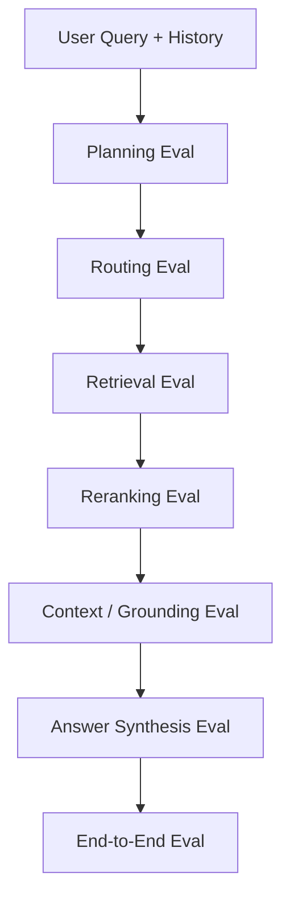

---
tags:
  - rag
  - agenticrag
  - evaluation
  - failuremodes
type: note
status: evergreen
source: "Microsoft Learn Agentic Retrieval · OpenAI Agent Evals Guide · Google Cloud Grounding and Evaluation Docs · vault-local architectural inference"
parent_note: "[[02 AI Systems/RAG/RAG - MOC|RAG - MOC]]"
created: "2026-04-19"
updated: "2026-04-19"
---

# Agentic RAG - Evaluation and Failure Modes

## Summary

agentic RAG ต้อง eval มากกว่า answer สุดท้าย เพราะระบบมี planning, source routing, retrieval, reranking, grounding, และ synthesis หลายชั้น

ถ้าคำตอบผิด ต้องตอบให้ได้ว่าพลาดที่:
- plan ผิด
- route ผิด source
- retrieve ไม่เจอ
- rerank ผิด
- assemble context ผิด
- synthesize answer ผิด
- citation drift

---

## Scope

- planning eval
- routing eval
- retrieval eval
- reranking eval
- grounding eval
- answer synthesis eval
- agentic failure modes

---

## Evaluation Stack

classic RAG eval มักเริ่มที่ retrieval + answer quality
agentic RAG ต้องเพิ่ม eval ของ decision process ระหว่างทาง

---

## Planning Evaluation

ถามว่า planner เข้าใจ information need หรือไม่

criteria:
- แตก subqueries ครบ asks หลักไหม
- preserve constraints เช่น date, product, tenant, version ไหม
- ไม่เพิ่ม assumption ที่ผู้ใช้ไม่ได้ถามไหม
- ใช้ chat history อย่างพอดีไหม
- มี stopping / clarification decision ที่เหมาะไหม

failure examples:
- bad decomposition
- over-decomposition
- under-decomposition
- missing constraint
- query drift จาก conversation history

---

## Routing Evaluation

ถามว่า query plan ถูกส่งไป source และ retrieval mode ที่เหมาะไหม

criteria:
- source ถูกต้อง
- retrieval mode เหมาะ เช่น keyword/vector/hybrid/graph/structured
- permission filters ถูก apply
- trust/freshness requirement ถูกใช้
- ไม่ยิง source เกินจำเป็น

failure examples:
- wrong tool/source
- missing permission filter
- over-routing
- under-routing
- routing ไป source ที่ trust ต่ำทั้งที่มี official source

---

## Retrieval and Reranking Evaluation

retrieval eval ยังใช้ metrics แบบ RAG ปกติได้ แต่ต้อง slice ตาม subquery และ source

ควรวัด:
- recall@k ต่อ subquery
- hit rate ต่อ source
- precision@k หลัง merge
- diversity หลัง dedup
- reranking quality หลังรวม multi-source results
- evidence coverage เทียบกับ asks หลัก

failure examples:
- over-retrieval
- parallel noise
- source dominance
- missing evidence
- reranker เห็น forbidden evidence
- relevant evidence rank ต่ำจนไม่เข้า context

---

## Grounding and Synthesis Evaluation

ถามว่า final answer ใช้ evidence ที่ถูกต้องไหม

criteria:
- ทุก claim สำคัญมี support
- citation ตรง claim
- answer ไม่ข้ามจาก evidence หนึ่งไป claim อีกอย่าง
- uncertainty ถูกสื่อเมื่อ evidence ไม่พอ
- conflicting evidence ถูกจัดการตาม source authority

failure examples:
- reference drift
- citation mismatch
- unsupported synthesis
- answer จาก low-trust source โดยไม่ label
- context overload ทำให้ model สรุปผิด

---

## Trace Evaluation

agentic RAG ควร eval trace ด้วย ไม่ใช่แค่ final answer

trace ที่ควรตรวจ:
- generated subqueries
- sources queried
- filters used
- tool calls
- retrieved result ids
- reranker scores
- selected context ids
- citations
- stopping decision

ถ้าไม่มี trace จะ debug ไม่ได้ว่า failure เกิดจาก planning, retrieval, หรือ generation

---

## Failure Mode Taxonomy

| Failure | ชั้นที่พลาด | ผลกระทบ |
|---|---|---|
| Bad decomposition | planning | retrieve ไม่ครอบคลุมโจทย์ |
| Wrong tool/source | routing | evidence ผิด domain |
| Missing filters | routing / retrieval | data exposure หรือ cross-scope evidence |
| Over-retrieval | retrieval | latency สูงและ context noisy |
| Under-retrieval | retrieval | evidence ไม่พอ |
| Bad merge/dedup | retrieval assembly | duplicate หรือ source dominance |
| Rerank inversion | reranking | evidence ดีตกอันดับ |
| Reference drift | grounding | cite ไม่ตรง claim |
| Loop drift | orchestration | retrieval ออกนอกโจทย์ |
| Premature stop | stopping | answer ทั้งที่ evidence ยังไม่พอ |

---

## Eval Dataset Design

agentic RAG eval set ควรมี:
- single-hop questions
- multi-hop questions
- multi-source questions
- exact identifier questions
- date/version-sensitive questions
- permission-scoped questions
- conflicting-source questions
- unanswerable questions
- prompt injection in retrieved docs
- long conversation follow-ups

คำถามเดียวควรมี expected artifacts มากกว่า final answer:
- expected subqueries
- expected source classes
- expected evidence ids
- expected citations
- expected refusal / uncertainty เมื่อ evidence ไม่พอ

---

## Operational Metrics

ต้องวัดคู่กับ quality:
- number of subqueries
- number of sources queried
- retrieval latency per source
- reranking latency
- total tool calls
- context tokens
- answer tokens
- cost per query class
- clarification rate
- no-answer rate

agentic RAG ที่ quality ดีขึ้นเล็กน้อยแต่ cost/latency เพิ่มมาก อาจไม่คุ้มสำหรับทุก query class

---

## Design Rules

- eval trace, not only final answer
- แยก planning, routing, retrieval, reranking, grounding, และ synthesis metrics
- slice eval ตาม query complexity และ source type
- include permission-scoped และ unanswerable cases
- track cost/latency ต่อ query class
- ใช้ failure taxonomy เพื่อแก้ component ที่ผิด ไม่ใช่ tune prompt รวม ๆ

---

## ความสัมพันธ์กับโน้ตอื่น

- [[02 AI Systems/RAG/Core/RAG - Agentic RAG]] — ภาพรวม agentic RAG
- [[02 AI Systems/RAG/Core/Agentic RAG - Planning and Retrieval Loop]] — loop ที่ต้อง eval
- [[02 AI Systems/RAG/Evaluation/08 - Evaluation]] — RAG eval พื้นฐาน
- [[02 AI Systems/RAG/Retrieval/RAG - Query Routing and Retrieval Strategy]] — routing eval
- [[02 AI Systems/RAG/Retrieval/RAG - Multi-Source Retrieval]] — multi-source eval และ merge failures
- [[02 AI Systems/RAG/Retrieval/RAG - Metadata Filtering and Permission-Aware Retrieval]] — permission-scoped eval
- [[02 AI Systems/RAG/Core/07 - Grounding and Citation]] — grounding และ citation quality
- [[02 AI Systems/RAG/RAG - MOC|RAG - MOC]]

---

## Official References

- Microsoft Learn - Agentic Retrieval Overview: https://learn.microsoft.com/en-us/azure/search/search-agentic-retrieval-concept
- Microsoft Learn - Quickstart: Agentic Retrieval: https://learn.microsoft.com/en-us/azure/search/search-get-started-agentic-retrieval
- OpenAI Agent Evals Guide: https://platform.openai.com/docs/guides/agent-evals
- Google Cloud - Gen AI evaluation service overview: https://cloud.google.com/vertex-ai/generative-ai/docs/models/evaluation-overview
- Google Cloud - Check grounding with RAG: https://cloud.google.com/generative-ai-app-builder/docs/check-grounding
