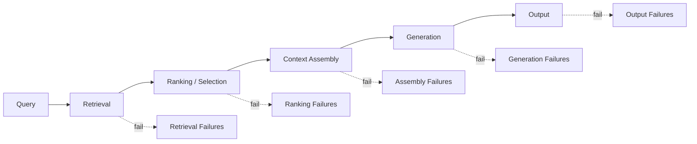
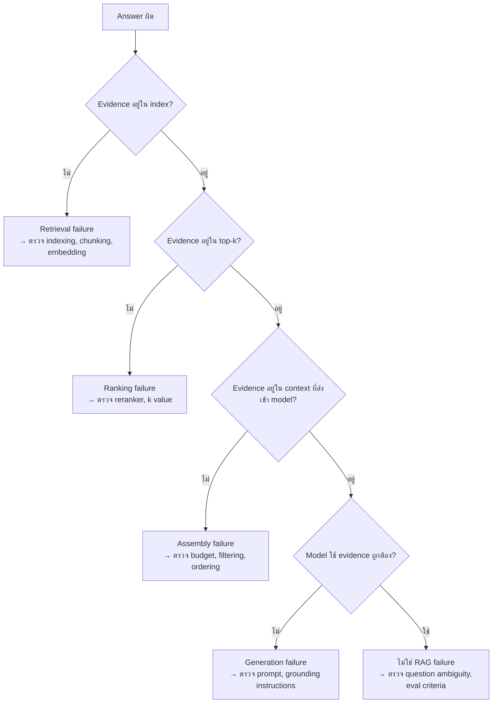

---
tags:
  - rag
  - failure-modes
  - evaluation
  - taxonomy
type: note
status: draft
source: "vault-local synthesis จาก RAG Evaluation, Guardrails, และ Evals notes · Google Cloud RAG Docs · OpenAI Retrieval Docs"
parent_note: "[[02 AI Systems/RAG/RAG - MOC|RAG - MOC]]"
created: "2026-04-23"
updated: "2026-04-23"
---

# RAG - Failure Modes Taxonomy

---

## ขอบเขตของโน้ตนี้

โน้ตนี้จัดหมวดหมู่ failure modes ของ RAG systems อย่างเป็นระบบ เพื่อให้:
- debug ได้ตรงชั้นที่ผิด
- ออกแบบ eval ได้ครอบคลุม
- วาง guardrails ได้ตรงจุด

โน้ตนี้เป็น **taxonomy reference** ไม่ใช่ eval guide
ส่วนวิธีวัดและ eval design ให้ดู [[02 AI Systems/RAG/Evaluation/08 - Evaluation]]

---

## ทำไมต้องมี Taxonomy

RAG มีหลายชั้น — ถ้าไม่แยก failure ตามชั้น จะแก้ผิดจุด:

---

## Layer 1: Retrieval Failures

ปัญหาที่เกิดก่อน ranking — ระบบหา evidence ไม่เจอหรือเจอผิด

| Failure Mode | อธิบาย | สาเหตุที่พบบ่อย |
|---|---|---|
| **Missing recall** | evidence ที่ควรเจอไม่อยู่ใน candidate set | embedding model ไม่ capture semantic ที่ต้องการ, chunking ตัดข้อมูลสำคัญออก |
| **Vocabulary mismatch** | query ใช้คำต่างจาก document | ไม่มี query expansion, ไม่มี hybrid retrieval |
| **Index staleness** | ข้อมูลใน index เก่ากว่าความจริง | ไม่มี re-indexing pipeline |
| **Wrong index** | query ถูก route ไปผิด index/collection | routing logic ผิด, ไม่มี query routing |
| **Permission leak** | ดึง documents ที่ user ไม่ควรเห็น | ไม่มี permission-aware filtering |

→ ดูเพิ่มที่ [[02 AI Systems/RAG/Core/01 - Retrieval Basics]]
→ ดูเพิ่มที่ [[02 AI Systems/RAG/Retrieval/RAG - Metadata Filtering and Permission-Aware Retrieval]]

---

## Layer 2: Ranking / Selection Failures

ปัญหาหลัง retrieval — evidence มีอยู่แต่ไม่ถูกเลือก

| Failure Mode | อธิบาย | สาเหตุที่พบบ่อย |
|---|---|---|
| **Relevant chunk buried** | chunk ที่ดีอยู่นอก top-k | k ต่ำเกินไป, reranker ไม่ดี |
| **Reranker bias** | reranker ให้คะแนนสูงกับ chunk ที่ยาว/ซ้ำ ไม่ใช่ chunk ที่ relevant | reranker ไม่ได้ train บน domain นี้ |
| **Duplicate dominance** | chunks ซ้ำกันหลายตัวกิน top-k slots | ไม่มี deduplication |

→ ดูเพิ่มที่ [[02 AI Systems/RAG/Retrieval/05 - Reranking]]

---

## Layer 3: Context Assembly Failures

ปัญหาตอนประกอบ context ก่อนส่งเข้า model

| Failure Mode | อธิบาย | สาเหตุที่พบบ่อย |
|---|---|---|
| **Context overload** | ยัด chunks มากเกินจน model สับสน | ไม่มี budget control, ไม่มี relevance threshold |
| **Context starvation** | ใส่ chunks น้อยเกินจน model ไม่มี evidence พอ | k ต่ำเกินไป, threshold สูงเกินไป |
| **Order sensitivity** | ลำดับ chunks มีผลต่อ answer แต่ไม่ได้จัดลำดับ | ไม่มี ordering strategy |
| **Chunk boundary cut** | ข้อมูลสำคัญถูกตัดตรง chunk boundary | chunking strategy ไม่ดี, ไม่มี overlap |
| **Mixed relevance** | บาง chunks relevant บาง chunks ไม่ — model ไม่รู้จะเชื่ออันไหน | ไม่มี relevance filtering หลัง retrieval |

→ ดูเพิ่มที่ [[02 AI Systems/RAG/Core/06 - Context Assembly]]

---

## Layer 4: Generation Failures

ปัญหาที่ model สร้าง answer ผิดแม้ context ถูก

| Failure Mode | อธิบาย | สาเหตุที่พบบ่อย |
|---|---|---|
| **Hallucination despite evidence** | model เติมข้อมูลเกิน evidence ที่ให้ | model tendency, prompt ไม่ constrain พอ |
| **Ignoring evidence** | model ตอบจาก parametric knowledge แทน context | evidence อยู่ท้าย context (lost in the middle), prompt ไม่เน้นให้ใช้ context |
| **Partial grounding** | บาง claims grounded บาง claims ไม่ | model mix parametric + retrieved knowledge |
| **Wrong citation** | cite source ผิด claim | model สับสนระหว่าง chunks |
| **Refusal to answer** | model ปฏิเสธทั้งที่มี evidence เพียงพอ | safety guardrails เข้มเกินไป |

→ ดูเพิ่มที่ [[02 AI Systems/RAG/Core/07 - Grounding and Citation]]

---

## Layer 5: Output / System-Level Failures

ปัญหาที่ไม่ได้เกิดจากชั้นใดชั้นหนึ่ง แต่เป็นระดับระบบ

| Failure Mode | อธิบาย | สาเหตุที่พบบ่อย |
|---|---|---|
| **Latency spike** | response ช้าเกินยอมรับ | retrieval ช้า, context ยาวเกิน, model ใหญ่เกิน |
| **Cost explosion** | cost ต่อ query สูงเกินงบ | ดึง chunks มากเกิน, model แพง, ไม่มี caching |
| **Inconsistency across runs** | คำตอบเปลี่ยนทุกครั้งที่ถาม | temperature สูง, retrieval ไม่ deterministic |
| **Cascading failure** | error ใน retrieval ทำให้ทั้ง pipeline พัง | ไม่มี fallback, ไม่มี graceful degradation |

---

## Failure Attribution Decision Tree

---

## เชื่อมกับ Eval Design

failure taxonomy นี้ควรใช้เป็นฐานในการออกแบบ eval:
- แต่ละ layer ควรมี eval metrics แยก
- test set ควร slice ตาม failure type
- regression tests ควรครอบคลุมทุก layer

→ ดูเพิ่มที่ [[02 AI Systems/RAG/Evaluation/08 - Evaluation]] สำหรับ eval design
→ ดูเพิ่มที่ [[02 AI Systems/Evals/Application/07 - RAG Evals]] สำหรับ eval patterns

---

## ความสัมพันธ์กับโน้ตอื่น

- [[02 AI Systems/RAG/Evaluation/08 - Evaluation]] — eval design ที่ใช้ taxonomy นี้
- [[02 AI Systems/RAG/Evaluation/Agentic RAG - Evaluation and Failure Modes]] — failure modes เฉพาะ agentic RAG
- [[02 AI Systems/RAG/Core/01 - Retrieval Basics]] — retrieval layer
- [[02 AI Systems/RAG/Retrieval/05 - Reranking]] — ranking layer
- [[02 AI Systems/RAG/Core/06 - Context Assembly]] — assembly layer
- [[02 AI Systems/RAG/Core/07 - Grounding and Citation]] — generation/grounding layer
- [[02 AI Systems/RAG/Core/RAG - Security and Source Trust]] — permission-related failures
- [[02 AI Systems/Guardrails/Guardrails - MOC|Guardrails - MOC]] — guardrails สำหรับ RAG failures
- [[02 AI Systems/Evals/Application/07 - RAG Evals]] — eval patterns สำหรับ RAG
- [[02 AI Systems/RAG/RAG - MOC|RAG - MOC]]

---

## References

- Google Cloud, Ground responses using RAG
  https://cloud.google.com/vertex-ai/generative-ai/docs/grounding/ground-responses-using-rag
- OpenAI, Retrieval Guide
  https://platform.openai.com/docs/guides/retrieval
- Google Cloud, Gen AI evaluation service overview
  https://cloud.google.com/vertex-ai/generative-ai/docs/models/evaluation-overview
