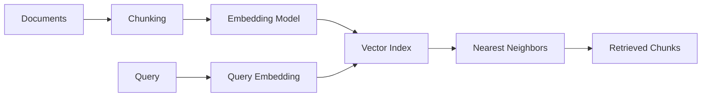
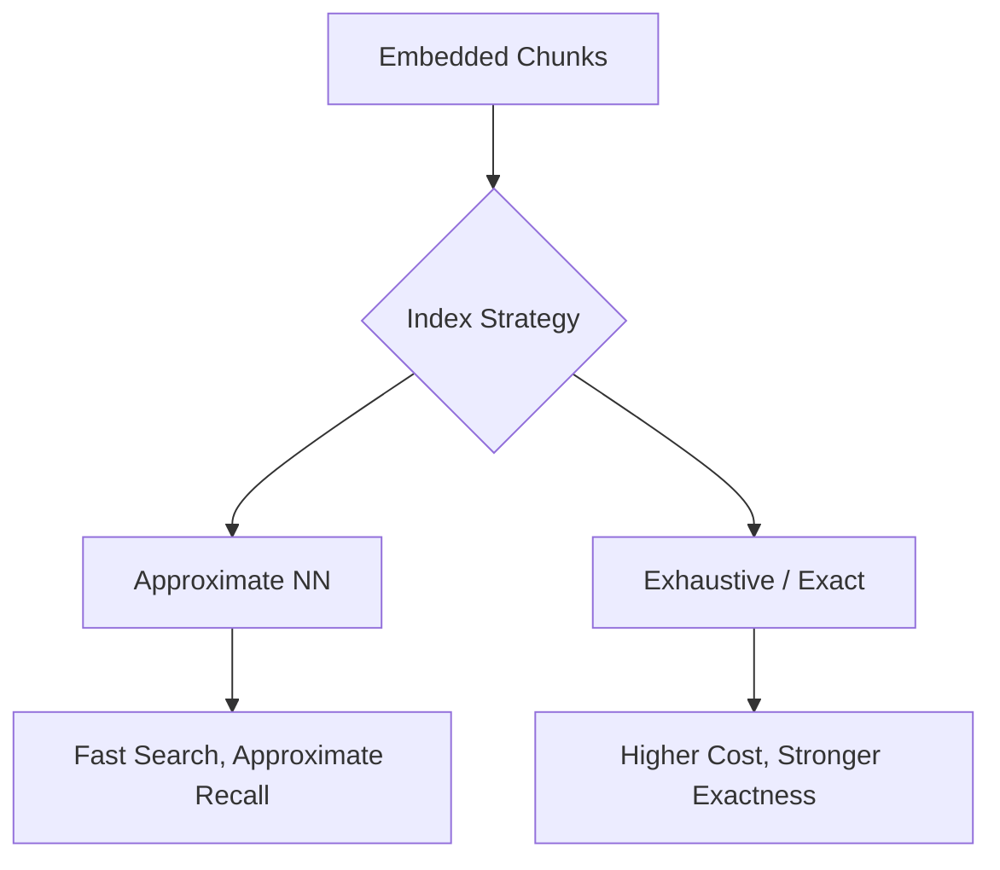

---
tags:
  - rag
  - embeddings
  - vector-db
type: note
status: evergreen
source: "OpenAI Retrieval Docs · Azure AI Search Vector Search Docs"
parent_note: "[[02 AI Systems/RAG/RAG - MOC|RAG - MOC]]"
---

# RAG - Embeddings and Vector Databases

## Summary

embedding model และ vector index มีผลโดยตรงต่อคุณภาพ retrieval, latency, cost, และการ scale ระบบ RAG

---

## Scope

- embeddings คืออะไร
- vector similarity search
- index structures
- metadata filtering
- tradeoffs ระหว่าง quality กับ speed

---

## Embeddings อยู่ตรงไหนใน RAG Pipeline

embeddings เป็นตัวแปลงข้อความหรือข้อมูลอื่นให้เป็นเวกเตอร์เชิงตัวเลข เพื่อให้ระบบ retrieval ค้นหาด้วย semantic similarity ได้

OpenAI อธิบาย retrieval ว่าใช้ vector stores เป็น container ของไฟล์ที่ถูก chunk, embed, และ index แล้ว  
Azure AI Search อธิบาย vector search ว่าต้องมี 3 ขั้นหลัก:
- สร้าง embeddings
- สร้าง vector index
- รัน vector queries

ดังนั้น embeddings ไม่ใช่ retrieval ทั้งหมด แต่เป็น representation layer สำหรับ semantic search

---

## Embedding Model Contract

embedding model ที่ใช้ใน RAG ควรถูกมองเป็น contract ระหว่าง:
- documents
- queries
- index
- downstream ranking

สิ่งที่ต้องสอดคล้องกัน:
- vector space เดียวกันหรือ compatible scheme
- dimension ของ vectors
- preprocessing / chunking assumptions
- language coverage
- modality coverage

ถ้า contract นี้ไม่ชัด ระบบจะเจอปัญหาเช่น:
- query embedding กับ document embedding ไม่สอดคล้องกัน
- dimension mismatch
- multilingual recall แย่
- chunk boundaries ไม่สอดคล้องกับ retrieval intent

---

## Vector Stores และ Vector Databases

OpenAI docs อธิบาย `vector_store` ว่าเป็น container ของ processed files ที่ใช้กับ retrieval และ file search  
Azure AI Search อธิบายตัวเองได้ทั้งในบทบาท search engine และ vector database สำหรับ grounding data

ในเชิงสถาปัตย์ vector store / vector database มักรับผิดชอบ:
- เก็บ vectors
- เก็บ metadata
- รองรับ nearest neighbor search
- รองรับ filtering
- บางระบบรองรับ hybrid retrieval และ integrated vectorization

สิ่งที่ต้องตัดสินใจเวลาเลือก:
- managed vs self-managed
- vector only vs hybrid search engine
- ingestion model
- filtering support
- operational cost

---

## Similarity Search และ kNN

Azure อธิบาย vector search ว่าทำงานด้วย nearest neighbors เพื่อหาผลลัพธ์ที่ใกล้ query vector ที่สุด  
ผลลัพธ์มักคืนเป็น `k` nearest neighbors

สิ่งที่เกี่ยวข้องในทางปฏิบัติ:
- `k`
- similarity function
- approximate vs exact search
- index algorithm

ผลกระทบ:
- `k` สูงขึ้นเพิ่ม recall แต่เพิ่ม noise
- exact search แม่นกว่าแต่แพงกว่า
- approximate search มักเร็วกว่าและ scale ได้ดีกว่า

---

## Index Structures และ ANN

Azure AI Search ระบุรองรับโหมดที่สัมพันธ์กับ approximate nearest neighbor เช่น HNSW และ exhaustive KNN ในบาง workflow  
ประเด็นสำคัญคือ vector retrieval ใน production มักไม่ใช้ brute-force search ตลอด เพราะ latency จะสูงเกินไปเมื่อข้อมูลโต

เชิงสถาปัตย์ index structure มีผลต่อ:
- latency
- memory usage
- recall approximation
- cost of updates

หลักคิด:
- corpus เล็กอาจไม่ต้อง optimize index มาก
- corpus โตหรือ query volume สูงมักต้องใช้ ANN
- choice ของ index ต้องสอดคล้องกับ SLA ไม่ใช่ดู quality อย่างเดียว

---

## Metadata Filtering

vector similarity อย่างเดียวมักไม่พอในระบบจริง  
OpenAI vector store search รองรับ `filters` บน attributes  
Azure รองรับ filtered vector search และอธิบายว่าฟิลเตอร์ช่วยจำกัดผลลัพธ์ตาม text/numeric fields

metadata filtering มีประโยชน์มากเมื่อ:
- corpus มีหลาย tenants
- ต้องจำกัดตามเวลา
- ต้องจำกัดตาม document type
- ต้องใช้ security boundaries
- knowledge base มีหลาย domains

ตัวอย่าง metadata:
- `source_type`
- `team`
- `region`
- `created_at`
- `product`

---

## Ingestion Modes

จาก official docs มีอย่างน้อย 2 แนว:

### 1. Hosted / Managed Processing

เช่น OpenAI vector stores ที่ upload ไฟล์แล้วระบบจัดการ chunking, embedding, indexing ให้  
หรือ Azure AI Search integrated vectorization ใน indexer pipeline

ข้อดี:
- เริ่มเร็ว
- ลด engineering overhead

ข้อแลก:
- custom control น้อยลง

### 2. External Processing

สร้าง embeddings เอง, chunk เอง, แล้ว push vectors เข้า index

ข้อดี:
- custom control สูง
- ปรับ strategy เองได้มาก

ข้อแลก:
- complexity และ maintenance สูงขึ้น

---

## Cost, Latency, Quality Trade-offs

### Cost

ต้นทุนมักมาจาก:
- embedding generation
- vector storage
- query serving
- reranking / downstream generation

OpenAI retrieval docs ระบุ pricing ฝั่ง vector stores ตาม storage used  
Azure ระบุ vector search ไม่คิดค่าเพิ่มที่ feature level แต่ embedding generation และ AI enrichment อาจมีค่าใช้จ่ายจาก provider อื่น

### Latency

latency ได้ผลจาก:
- query vectorization
- search/index strategy
- filters
- reranking
- top-k size

### Quality

quality ผูกกับ:
- embedding model choice
- chunk quality
- vector index tuning
- filters
- reranking

---

## Failure Modes

### 1. Wrong Embedding Model

embedding model ไม่เหมาะกับ task หรือ language ทำให้ semantic retrieval แย่

### 2. Dimension / Schema Mismatch

vector fields, query vectors, หรือ pipeline ไม่สอดคล้องกัน

### 3. Missing Metadata Strategy

ไม่มี filters ทำให้ knowledge base ใหญ่เกินและ noisy

### 4. Poor Chunk Semantics

แม้ vector DB ดี แต่ chunking ผิดทำให้ vectors แทนความหมายได้ไม่ดี

### 5. Index Chosen for the Wrong Constraint

เลือกระบบเพราะ scale แต่ use case จริงต้องการ exactness หรือ fast updates มากกว่า

---

## Design Rules

- เลือก embedding model ตาม task ไม่ใช่ตามความนิยมอย่างเดียว
- คิด `embedding + chunking + index + filters` เป็นระบบเดียว
- อย่ามอง vector DB เป็นแค่ storage layer มันคือ retrieval infrastructure
- ถ้าระบบมีหลายโดเมน ต้องออกแบบ metadata filtering ตั้งแต่ต้น
- managed vector stores เหมาะกับการเริ่มเร็ว แต่ควรชัดว่าจุดไหนต้อง custom control

---

## ความสัมพันธ์กับโน้ตอื่น

- [[01 Foundations/LLM Foundations/Core/10 - Embeddings และ Semantic Similarity]] — foundations ของ embeddings
- [[01 Foundations/LLM Foundations/Core/14 - Vector Representations และ Similarity Search]] — foundations ของ vectors, similarity metrics, และ vector search
- [[02 AI Systems/RAG/Core/01 - Retrieval Basics]] — retrieval layer พื้นฐาน
- [[02 AI Systems/RAG/Retrieval/RAG - Hybrid Retrieval]] — ผสาน vector retrieval กับ keyword retrieval
- [[02 AI Systems/RAG/Retrieval/05 - Reranking]] — ชั้นถัดจาก vector retrieval
- [[02 AI Systems/RAG/Core/02 - Chunking Strategies]] — chunk quality มีผลต่อ embedding quality
- [[02 AI Systems/RAG/Evaluation/08 - Evaluation]] — ต้องแยก eval ของ retrieval infrastructure ออกจาก answer quality
- [[02 AI Systems/RAG/RAG - MOC|RAG - MOC]]

---

## Related Notes

- [[02 AI Systems/RAG/Core/01 - Retrieval Basics]]
- [[01 Foundations/LLM Foundations/Core/10 - Embeddings และ Semantic Similarity]]
- [[01 Foundations/LLM Foundations/Core/14 - Vector Representations และ Similarity Search]]
- [[02 AI Systems/RAG/RAG - MOC|RAG - MOC]]

---

## Official References

- OpenAI Retrieval Guide: https://platform.openai.com/docs/guides/retrieval
- OpenAI Vector Store Search API: https://platform.openai.com/docs/api-reference/vector-stores/search
- OpenAI File Search Guide: https://platform.openai.com/docs/guides/tools-file-search
- Microsoft Learn - Vector Search Overview: https://learn.microsoft.com/en-us/azure/search/vector-search-overview
- Microsoft Learn - Hybrid Search Overview: https://learn.microsoft.com/en-us/azure/search/hybrid-search-overview
