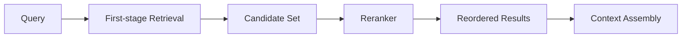
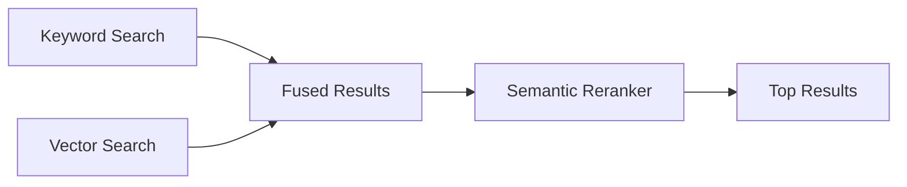

---
tags:
  - rag
  - reranking
type: note
status: draft
source: "Microsoft Learn (Azure AI Search Semantic Ranking) · OpenAI Retrieval Docs"
parent_note: "[[RAG - MOC]]"
---

# RAG - Reranking

## Summary

reranking เป็นชั้นคัดเอกสารรอบสองเพื่อเพิ่ม precision ก่อนประกอบ context เหมาะเมื่อ recall ดีแล้วแต่ผลลัพธ์ยัง noisy

---

## Scope

- first-stage retrieval vs reranking
- precision gains
- cross-encoder style reranking
- latency tradeoffs
- when reranking is worth it

---

## Reranking คืออะไร

retrieval มักถูกออกแบบให้ “หาให้เจอให้กว้างพอ”  
reranking คือชั้นจัดอันดับรอบสองที่รับ candidate set มา reorder ให้ตรง intent มากขึ้น

---

## First-Stage Retrieval vs Reranking

### First-Stage Retrieval

เน้น:
- coverage
- speed
- candidate generation

มักใช้:
- BM25 / keyword search
- vector search
- hybrid retrieval

### Reranking

เน้น:
- better ordering
- intent alignment
- precision ของ top results

Microsoft Learn ระบุชัดว่า semantic ranker เป็น L2 ranking layer ที่ทำงานบน results ที่ถูกดึงมาก่อนแล้ว ไม่ได้ค้น corpus ใหม่ตั้งแต่ต้น

---

## Semantic Reranking

Azure semantic ranker ใช้ language understanding models เพื่อ rescoring results  
บทบาทของมันคือ promote results ที่ semantic ใกล้ intent มากกว่า

ข้อสำคัญ:
- reranking ไม่แทน retrieval
- reranking ไม่สร้าง evidence ใหม่
- reranking ทำงานได้ดีเมื่อ candidate set ดีพออยู่แล้ว

---

## Cross-Encoder Style Reranking

ในเชิงสถาปัตย์ reranking หลายแบบมีแนวคิดคล้าย cross-encoder:
- อ่าน query และ document pair ร่วมกัน
- ประเมิน relevance แบบ pairwise หรือ scoring-based

ถึงแม้ docs ของ Microsoft จะ framing เป็น semantic ranking feature มากกว่า model architecture detail แต่หลักคิดสำคัญคือ:
- reranker มอง query + candidate ร่วมกันละเอียดกว่า first-stage retrieval
- จึงได้ ranking quality ดีขึ้น แต่แลกด้วย latency สูงขึ้น

---

## Reranking กับ Hybrid Retrieval

pattern ที่พบบ่อยใน production:

นี่เป็นเหตุผลว่าทำไม hybrid retrieval กับ reranking มักมาคู่กัน:
- retrieval ช่วย coverage
- reranking ช่วย precision เชิง intent

---

## Latency Trade-offs

reranking เพิ่ม:
- latency
- compute
- complexity

แต่ช่วย:
- ลด noise ก่อนเข้า prompt
- เพิ่ม relevance ของ top results
- ลดภาระ context assembly

ดังนั้นควรใช้เมื่อ:
- retrieval มี recall ดีแล้วแต่ top results ยัง noisy
- corpus ใหญ่พอจน ordering มีผลมาก
- use case มีคุณค่าเพียงพอจะแลก latency

---

## Failure Modes

### 1. Bad Candidate Set

ถ้า retrieval หาเอกสารสำคัญไม่เจอ reranker ก็ช่วยไม่ได้

### 2. Wrong Input Fields

field ที่ส่งให้ reranker ไม่ descriptive พอ

### 3. Over-Reliance on Reranking

คาดหวังให้ reranker แก้ปัญหา retrieval ทั้งหมด

### 4. Latency Blow-Up

reranking หนักเกินไปเมื่อ query volume สูง

### 5. Wrong Evaluation Target

ดูแต่ ranking quality แต่ไม่ดู final answer quality

---

## When Reranking Is Worth It

คุ้มเมื่อ:
- top-k retrieval ยัง noisy
- hybrid retrieval เริ่มซับซ้อน
- corpus ใหญ่
- answer quality sensitive ต่อ ordering มาก

อาจยังไม่คุ้มเมื่อ:
- corpus เล็ก
- query ง่าย
- latency budget ต่ำมาก
- retrieval baseline ยังไม่ดีพอ

---

## Design Rules

- ใช้ reranking หลัง retrieval ไม่ใช่แทน retrieval
- candidate set ต้องกว้างพอให้ reranker มีตัวเลือก
- วัด downstream quality ไม่ใช่ดู reranker score อย่างเดียว
- budget latency ของ reranking ให้ชัด
- ถ้า query ง่ายและ corpus เล็ก อาจยังไม่ต้องรีบเพิ่ม reranking

---

## ความสัมพันธ์กับโน้ตอื่น

- [[02 AI Systems/RAG/Core/01 - Retrieval Basics]] — retrieval เป็น first-stage
- [[02 AI Systems/RAG/Retrieval/RAG - Hybrid Retrieval]] — reranking มักมาหลัง fusion
- [[02 AI Systems/RAG/Core/06 - Context Assembly]] — reranked results ถูกส่งต่อเข้า assembly
- [[02 AI Systems/RAG/Evaluation/08 - Evaluation]] — ต้องวัด reranking แยกจาก retrieval
- [[RAG - MOC]]

---

## Related Notes

- [[02 AI Systems/RAG/Core/01 - Retrieval Basics]]
- [[RAG - MOC]]

---

## Official References

- Microsoft Learn - Semantic Ranking Overview: https://learn.microsoft.com/en-us/azure/search/semantic-ranking
- Microsoft Learn - Add Semantic Ranking to Queries: https://learn.microsoft.com/en-us/azure/search/semantic-how-to-query-request
- Microsoft Learn - Configure Semantic Ranker: https://learn.microsoft.com/en-us/azure/search/semantic-how-to-configure
- OpenAI Retrieval Guide: https://platform.openai.com/docs/guides/retrieval
