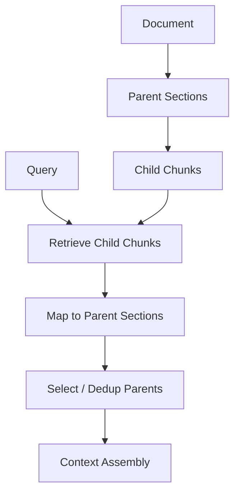

---
tags:
  - rag
  - retrieval
  - hierarchical
type: note
status: evergreen
source: "LangChain ParentDocumentRetriever docs · Microsoft Learn Azure AI Search chunking docs · vault-local architectural inference"
parent_note: "[[02 AI Systems/RAG/RAG - MOC|RAG - MOC]]"
created: "2026-04-19"
updated: "2026-04-19"
---

# RAG - Hierarchical and Parent-Child Retrieval

## Summary

hierarchical retrieval ใช้โครงสร้างหลายระดับของเอกสาร เช่น document, section, page, paragraph, chunk เพื่อแก้ trade-off ระหว่าง retrieval precision กับ context completeness

parent-child retrieval เป็น pattern สำคัญ:
- child chunks ใช้ค้นให้แม่น
- parent blocks ใช้ส่งเข้า context เพื่อให้ model มีบริบทพอ

---

## Scope

- document hierarchy
- parent-child chunks
- small-to-large retrieval
- section-aware retrieval
- long-document RAG
- failure modes ของ hierarchical retrieval

---

## ปัญหาที่ Pattern นี้แก้

chunk เล็กและ chunk ใหญ่มี trade-off:

| Chunk | ข้อดี | ข้อเสีย |
|---|---|---|
| เล็ก | match query ได้เฉียบ | ขาดบริบทต่อเนื่อง |
| ใหญ่ | มีบริบทครบกว่า | noisy และกิน context budget |

hierarchical retrieval จึงแยก "หน่วยค้น" ออกจาก "หน่วยอ่าน":
- ค้นจาก child chunk
- expand เป็น parent section/document
- assemble เฉพาะส่วนที่จำเป็น

---

## Parent-Child Pattern

ตัวอย่าง:
- child = paragraph หรือ 300-token chunk
- parent = section หรือ page
- retrieval = vector search บน child
- context = parent section พร้อม highlighted child evidence

---

## เมื่อไรควรใช้

เหมาะกับ:
- technical documentation
- policy documents
- legal / compliance docs
- long reports
- codebase docs
- API docs ที่มี heading structure
- documents ที่คำตอบต้องใช้บริบทก่อน/หลัง chunk

อาจไม่คุ้มเมื่อ:
- corpus เป็น FAQ สั้น ๆ
- chunk เดี่ยวตอบคำถามได้ดีอยู่แล้ว
- context budget เล็กมากและ parent blocks ใหญ่เกิน
- ingestion pipeline ยัง preserve structure ไม่ได้

---

## Hierarchy Design

ต้องออกแบบ levels ให้ชัด:

| Level | ใช้ทำอะไร |
|---|---|
| Corpus | ขอบเขต source หรือ tenant |
| Document | source identity และ citation |
| Section | semantic unit หลัก |
| Page | citation / PDF trace |
| Chunk | retrieval unit |
| Sentence / span | evidence highlighting |

metadata ที่ควรเก็บ:
- `document_id`
- `parent_id`
- `section_id`
- `chunk_id`
- `heading_path`
- `page_number`
- `chunk_order`
- `source_url`

---

## Retrieval Variants

### 1. Small-to-Large Retrieval

ค้นจาก chunk เล็ก แล้ว expand เป็น parent ใหญ่ขึ้น

### 2. Section-First Retrieval

ค้นจาก section summary ก่อน แล้วค่อย drill down เป็น chunks

### 3. Multi-Level Retrieval

ค้นหลายระดับพร้อมกัน เช่น document title, section headings, child chunks

### 4. Parent Summary + Child Evidence

ใช้ parent summary เพื่อ route และใช้ child evidence เพื่อ ground answer

---

## Context Assembly

hierarchical retrieval ต้องระวังไม่ให้ parent expansion ทำให้ context ใหญ่เกิน

assembly policy ที่ใช้ได้:
- include parent heading path
- include only parent section ที่มี child hit
- include neighboring chunks เฉพาะเมื่อจำเป็น
- dedup parent sections เมื่อ child hits หลายตัวอยู่ใน parent เดียวกัน
- preserve child hit spans สำหรับ citation

---

## Failure Modes

### 1. Parent Too Large

child hit แม่น แต่ parent ที่ expand ใหญ่จน noise เยอะ

### 2. Parent Too Small

parent ไม่ให้บริบทพอ ทำให้ answer synthesis ยังขาดข้อมูล

### 3. Broken Hierarchy

parser ไม่รักษา headings, section ids, page numbers หรือ chunk order

### 4. Over-Expansion

ทุก child hit expand เป็น parent จน context budget เต็มเร็ว

### 5. Citation Ambiguity

answer cite parent section แต่ claim มาจาก child span ที่ไม่ถูก preserve

### 6. Stale Parent Mapping

document update แล้ว child-parent mapping ไม่ refresh

---

## Design Rules

- แยก retrieval unit ออกจาก context unit
- preserve hierarchy ตั้งแต่ ingestion
- keep `parent_id`, `chunk_id`, และ `heading_path` เป็น metadata หลัก
- expand parent เฉพาะเมื่อช่วย answer synthesis จริง
- dedup parent blocks ก่อนเข้า context
- citation ต้อง trace ได้ทั้ง parent section และ child evidence
- eval เทียบ chunk-only vs parent-child ด้วย question types ที่ต้องใช้บริบทยาว

---

## ความสัมพันธ์กับโน้ตอื่น

- [[02 AI Systems/RAG/Core/02 - Chunking Strategies]] — parent-child เป็น chunking strategy ขั้นสูง
- [[02 AI Systems/RAG/Core/RAG - Ingestion and Indexing Pipeline]] — hierarchy ต้อง preserve ตั้งแต่ ingest
- [[02 AI Systems/RAG/Core/06 - Context Assembly]] — parent expansion เป็น assembly decision
- [[02 AI Systems/RAG/Core/07 - Grounding and Citation]] — citation ต้องชี้กลับ parent และ child evidence
- [[02 AI Systems/RAG/Retrieval/RAG - Multi-Source Retrieval]] — hierarchical retrieval เป็น source-specific strategy ได้
- [[02 AI Systems/RAG/RAG - MOC|RAG - MOC]]

---

## Official References

- LangChain ParentDocumentRetriever API: https://api.python.langchain.com/en/latest/langchain/retrievers/langchain.retrievers.parent_document_retriever.ParentDocumentRetriever.html
- Microsoft Learn - Chunk and vectorize by document layout: https://learn.microsoft.com/en-us/azure/search/search-how-to-semantic-chunking
