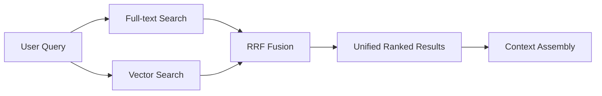
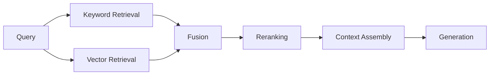

---
tags:
  - rag
  - retrieval
  - hybrid
type: note
status: evergreen
source: "Microsoft Learn (Azure AI Search Hybrid Search) · OpenAI Retrieval Docs"
parent_note: "[[RAG - MOC]]"
---

# RAG - Hybrid Retrieval

## Summary

hybrid retrieval คือการรวม retrieval มากกว่าหนึ่งแนวใน query pipeline เดียว โดยรูปแบบที่พบบ่อยที่สุดคือ `keyword/full-text + vector search`

เป้าหมายคือเก็บข้อดีของทั้งสองฝั่ง:
- exact matching ของ keyword search
- semantic matching ของ vector search

---

## ทำไมต้อง Hybrid Retrieval

vector retrieval อย่างเดียวไม่ได้ดีสุดเสมอไป  
Microsoft Learn ระบุชัดว่า keyword search ยังมีจุดแข็งสำหรับ:
- product codes
- names
- dates
- specialized jargon

ในขณะที่ vector retrieval เด่นเรื่อง semantic similarity และ paraphrases  
ดังนั้น hybrid retrieval จึงเหมาะเมื่อ corpus มีทั้ง:
- text เชิงคำอธิบาย
- exact identifiers
- domain terminology

---

## รูปแบบพื้นฐาน

Azure AI Search อธิบาย hybrid search ว่าเป็น query เดียวที่รัน:
- full-text search
- vector search

จากนั้นรวมผลด้วย `Reciprocal Rank Fusion (RRF)`

สถาปัตยกรรมนี้ทำให้ retrieval layer ไม่ยึดติดกับ signal แบบเดียว มี recall ดีขึ้นในหลายโดเมน และยังรักษา exact precision ใน query บางประเภทได้

---

## Keyword Signal vs Semantic Signal

### Keyword / Full-text

เหมาะกับ:
- exact string matching
- legal clauses ที่ใช้คำเฉพาะ
- version numbers
- IDs
- acronyms

### Vector / Semantic

เหมาะกับ:
- natural language questions
- paraphrases
- conceptual retrieval
- user queries ที่ไม่ใช้ศัพท์ตรงกับเอกสาร

### Hybrid

เหมาะกับ:
- enterprise corpora ที่หลากหลาย
- documentation search
- RAG ที่ต้องการ grounding สูง
- ระบบที่ผู้ใช้ถามได้ทั้งแบบ exact และ natural language

---

## Query-Time Design

hybrid retrieval ไม่ใช่แค่ “เปิดสองระบบพร้อมกัน” แต่ต้องออกแบบ:

1. query formulation
2. weighting / fusion
3. filters
4. downstream top-k

Azure AI Search อธิบาย query hybrid เป็น single request ที่ส่งทั้ง text query และ vector query พร้อมกัน  
OpenAI Retrieval docs ช่วยย้ำฝั่ง semantic retrieval ว่าควรคิดเรื่อง attribute filtering และ ranking options ตั้งแต่ต้น

เชิงสถาปัตย์:
- ถ้า query มี exact identifiers ควรคง keyword signal ไว้
- ถ้า corpus มี metadata ชัด ควรใช้ filters ก่อนลด noise
- ถ้า downstream context budget เล็ก top-k หลัง fusion ต้องระวังมากกว่าการวัด retrieval ล้วน

---

## Fusion ไม่ใช่ขั้นสุดท้าย

แม้ hybrid retrieval จะรวม results ได้ดีขึ้น แต่ยังไม่ใช่ชั้นสุดท้ายของ quality pipeline

ลำดับที่มักพบใน production:

ดังนั้น:
- hybrid retrieval ช่วย candidate generation
- reranking ช่วย re-order
- context assembly ช่วยเลือกสิ่งที่จะเข้าจริงใน prompt

---

## Failure Modes

### 1. Keyword Dominance

ถ้า exact match แรงเกินไป อาจดัน semantic matches ดี ๆ ตกอันดับ

### 2. Semantic Noise

vector retrieval อาจดึงผลที่ “ใกล้ความหมาย” แต่ไม่ตอบคำถามจริง

### 3. Bad Fusion

รวม ranking ได้แต่ไม่ได้ช่วยผลลัพธ์ downstream จริง

### 4. Overfetch

recall ดีขึ้นแต่ส่งผลลัพธ์เยอะเกิน context budget

### 5. Missing Filters

hybrid retrieval บน corpus ใหญ่โดยไม่จำกัด scope มักเพิ่ม noise เร็วมาก

---

## เมื่อไรควรใช้ Hybrid Retrieval

ใช้เมื่อ:
- corpus มีทั้ง prose และ exact identifiers
- ผู้ใช้ถามได้ทั้ง keyword และ natural language
- pure vector retrieval พลาด exact cases บ่อย
- pure keyword retrieval พลาด semantic questions บ่อย

อาจยังไม่จำเป็นเมื่อ:
- corpus เล็กมาก
- query pattern ค่อนข้างสม่ำเสมอ
- ระบบยังอยู่ใน phase แรกที่ต้องการความง่ายก่อน

---

## Design Rules

- อย่าคิดว่า vector-first แปลว่าดีสุดทุกกรณี
- ถ้าโดเมนมี IDs, codes, names, dates ให้พิจารณา hybrid retrieval ตั้งแต่ต้น
- ใช้ filtering และ reranking ร่วมด้วย ไม่ใช่หยุดแค่ fusion
- วัดผล downstream answer quality ไม่ใช่ดู retrieval metrics อย่างเดียว

---

## ความสัมพันธ์กับโน้ตอื่น

- [[02 AI Systems/RAG/Core/01 - Retrieval Basics]] — พื้นฐาน retrieval layer
- [[02 AI Systems/RAG/Retrieval/03 - Embeddings and Vector Databases]] — vector side ของ hybrid pipeline
- [[02 AI Systems/RAG/Retrieval/05 - Reranking]] — ชั้น reranking หลัง fusion
- [[02 AI Systems/RAG/Core/06 - Context Assembly]] — การเลือก context หลัง retrieval
- [[02 AI Systems/RAG/Evaluation/08 - Evaluation]] — วิธีวัด hybrid retrieval
- [[RAG - MOC]]

---

## Official References

- Microsoft Learn - Hybrid Search Overview: https://learn.microsoft.com/en-us/azure/search/hybrid-search-overview
- Microsoft Learn - Create a Hybrid Query: https://learn.microsoft.com/en-us/azure/search/hybrid-search-how-to-query
- Microsoft Learn - Vector Search Overview: https://learn.microsoft.com/en-us/azure/search/vector-search-overview
- OpenAI Retrieval Guide: https://platform.openai.com/docs/guides/retrieval
