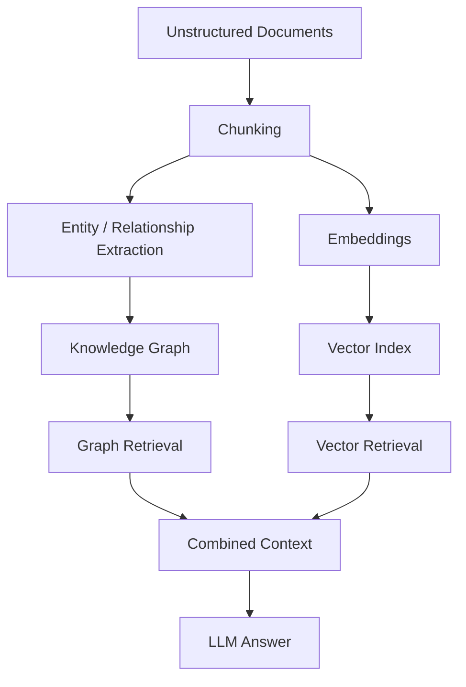
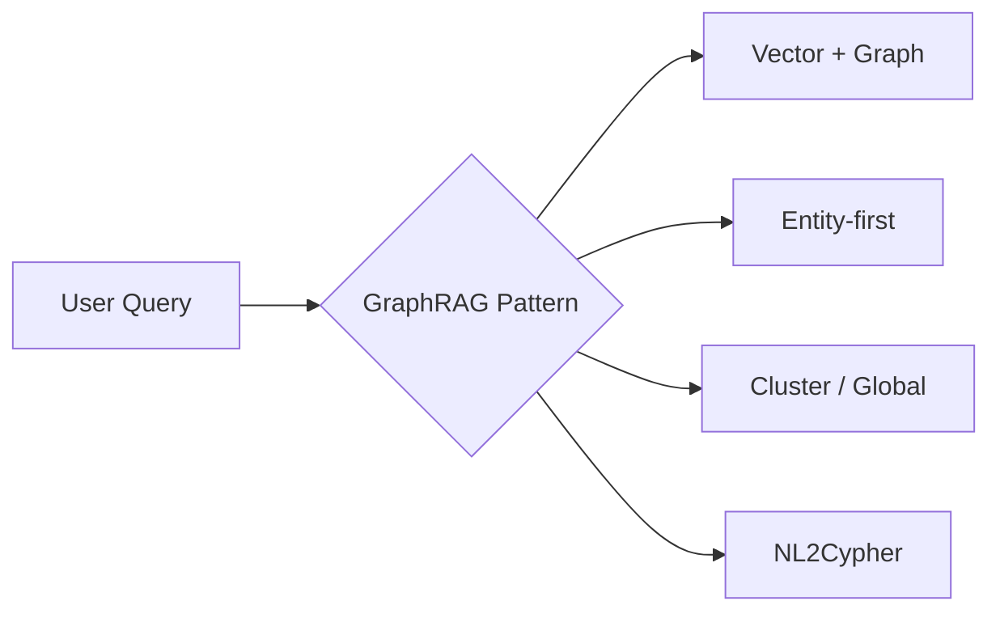

---
tags:
  - rag
  - graphrag
  - knowledgegraph
type: note
status: evergreen
source: "Neo4j GraphRAG Docs · Neo4j GraphAcademy · RAG-Anything (arxiv 2510.12323)"
parent_note: "[[02 AI Systems/RAG/RAG - MOC|RAG - MOC]]"
---

# RAG - Knowledge Graph RAG

## Summary

Knowledge Graph RAG หรือ GraphRAG คือแนวทาง RAG ที่ใช้ graph structures หรือ knowledge graphs ช่วย retrieval เพื่อดึง context ที่ “เชื่อมโยงกัน” ดีกว่า vector retrieval แบบ chunk-only

Neo4j อธิบาย GraphRAG ว่าเป็น RAG architecture ที่ใช้ graph structures ใน retrieval phase เพื่อเพิ่ม answer quality และ explainability

---

## GraphRAG ต่างจาก Vector RAG อย่างไร

vector RAG แบบพื้นฐานมักทำงานกับ:
- documents
- chunks
- embeddings
- similarity search

GraphRAG เพิ่มอีกชั้นคือ:
- entities
- relationships
- clusters
- graph traversal
- schema-aware querying

หลักสำคัญคือ GraphRAG ไม่จำเป็นต้องแทน vector RAG เสมอไป และในหลายระบบมันทำงานร่วมกัน

---

## GraphRAG ช่วยอะไร

ตาม Neo4j GraphRAG docs และ GraphAcademy ข้อดีหลักคือ:

- richer context
- relationship-aware retrieval
- explainability
- support for multi-hop retrieval
- รองรับ query ที่อิงโครงสร้างความสัมพันธ์

ตัวอย่างคำถามที่ GraphRAG มักได้เปรียบ:
- “ใครเกี่ยวข้องกับเหตุการณ์นี้ผ่านคนกลางคนไหนบ้าง”
- “บริการนี้เชื่อมกับระบบอะไรและเจ้าของทีมใด”
- “concept นี้สัมพันธ์กับหัวข้ออื่นอย่างไรในหลายเอกสาร”

---

## Retrieval Patterns ที่พบบ่อย

Neo4j แบ่ง GraphRAG patterns ที่สำคัญไว้หลายแบบ:

### 1. Text-based Retrieval (vector + graph)

เริ่มจาก vector search หา chunks ก่อน  
จากนั้นดึง entities และ relationships ที่เชื่อมกับ chunks เหล่านั้น

### 2. Entity-based Retrieval

เริ่มจาก entity retrieval แล้วค่อยขยายไปหาข้อความ, claims, facts, summaries ที่เกี่ยวข้อง

### 3. Cluster-based / Global Retrieval

ใช้ topic clusters หรือ summaries เพื่อรองรับคำถามเชิงภาพรวม

### 4. NL2Cypher / Graph Query Retrieval

ใช้ schema และ LLM ช่วยแปลงคำถามเป็น graph query เพื่อดึงข้อมูลแบบมีโครงสร้าง

---

## เมื่อไร GraphRAG คุ้ม

GraphRAG คุ้มเมื่อข้อมูลมีลักษณะ:
- มี entities และ relationships ชัด
- ต้องการ multi-hop retrieval
- ต้องการ explainability สูง
- ต้องการเชื่อม facts ข้าม documents
- มี schema หรือ ontology ที่มีความหมาย

อาจยังไม่คุ้มเมื่อ:
- corpus เป็นเอกสารเดี่ยว ๆ และความสัมพันธ์ข้ามเอกสารไม่สำคัญ
- use case เป็น FAQ ง่าย ๆ
- ต้นทุนการสร้าง graph สูงเกินประโยชน์ที่ได้

---

## Graph Construction Cost

GraphRAG ไม่ได้เริ่มที่ retrieval อย่างเดียว แต่เริ่มตั้งแต่ ingestion:
- extraction
- normalization
- entity resolution
- relationship construction
- graph enrichment

นี่คือ trade-off สำคัญ:
- vector RAG เริ่มได้เร็วกว่า
- GraphRAG ลงทุน ingestion หนักกว่า
- แต่ถ้าโดเมนเน้น relationships, explainability, และ traversal การลงทุนนี้อาจคุ้ม

---

## Failure Modes

### 1. Bad Graph Extraction

ถ้า entity หรือ relation extraction ผิด graph ทั้งระบบจะเพี้ยน

### 2. Schema Mismatch

graph มี schema แต่ไม่ตรงกับวิธีถามจริงของผู้ใช้

### 3. Over-Complex Retrieval

ระบบซับซ้อนเกิน use case จน cost และ latency สูงเกินเหตุ

### 4. Stale Graph

documents อัปเดตแล้ว graph ไม่อัปเดตตาม

---

## Design Rules

- อย่าเริ่มด้วย GraphRAG ถ้ายังพิสูจน์ basic retrieval ไม่ผ่าน
- ใช้เมื่อ relationship structure เป็นสาระหลักของคำตอบ
- ออกแบบ graph ingestion ให้ update ได้จริง ไม่ใช่ build ครั้งเดียวแล้วค้าง
- คิดเรื่อง explainability ตั้งแต่ต้น เช่น path, entity trace, source chunk references
- มอง GraphRAG เป็น retrieval upgrade ไม่ใช่แค่ storage choice

---

## Cross-Modal Knowledge Graph

> section นี้สรุปจาก RAG-Anything (arxiv 2510.12323)

GraphRAG แบบดั้งเดิมสร้าง graph จาก text entities เป็นหลัก แต่เอกสารจริงมี entities จากหลาย modalities (images, tables, equations) ที่ text-only extraction จะพลาด

Cross-modal knowledge graph ขยาย GraphRAG ด้วย:

### Multi-Modal Entity Extraction

แปลง elements สำคัญจากทุก modality เป็น graph entities:
- image → entity พร้อม visual description และ spatial metadata
- table → entity พร้อม structured data summary
- equation → entity พร้อม LaTeX representation และ domain mapping
- แต่ละ entity มี semantic annotations และ metadata preservation

### Cross-Modal Relationship Mapping

สร้าง connections ระหว่าง entities ต่าง modality:
- text ที่อ้างถึง figure → relationship ระหว่าง text entity กับ image entity
- table ที่สรุปผลจาก methodology ใน text → relationship ข้าม modality
- ใช้ automated relationship inference algorithms

### Weighted Relationship Scoring

ให้คะแนน relevance ตาม:
- semantic proximity ระหว่าง entities
- contextual significance ภายในโครงสร้างเอกสาร
- ช่วยให้ retrieval เลือก relationships ที่มีน้ำหนักสูงก่อน

### Hierarchical Structure Preservation

รักษาโครงสร้างเอกสารผ่าน "belongs_to" relationship chains:
- section → subsection → paragraph → figure/table
- ช่วยให้ retrieval เข้าใจ context ของ entity ภายในเอกสาร

→ ดูเพิ่มที่ [[02 AI Systems/RAG/Retrieval/RAG - Multimodal RAG|Multimodal RAG]] สำหรับ pipeline เต็ม

---

## ความสัมพันธ์กับโน้ตอื่น

- [[02 AI Systems/RAG/Core/01 - Retrieval Basics]] — retrieval layer พื้นฐาน
- [[02 AI Systems/RAG/Retrieval/RAG - Hybrid Retrieval]] — GraphRAG มักทำงานร่วมกับ hybrid retrieval
- [[02 AI Systems/RAG/Retrieval/RAG - Multi-Source Retrieval]] — graph เป็น retrieval source เฉพาะทาง
- [[02 AI Systems/RAG/Retrieval/RAG - Hierarchical and Parent-Child Retrieval]] — graph และ hierarchy ช่วย retrieval บนเอกสารยาว/relationship-heavy domains
- [[02 AI Systems/RAG/Core/06 - Context Assembly]] — การประกอบ graph-derived evidence เข้าสู่ prompt
- [[02 AI Systems/RAG/Evaluation/08 - Evaluation]] — ต้องวัด graph retrieval แยกจาก generation
- [[02 AI Systems/Agent Frameworks/Core/03 - State and Memory]] — graph memory บางแบบเชื่อมกับ agents ได้
- [[02 AI Systems/RAG/RAG - MOC|RAG - MOC]]
- [[02 AI Systems/RAG/Retrieval/RAG - Multimodal RAG]] — multimodal RAG pipeline ที่ใช้ cross-modal knowledge graph

---

## Official References

- Neo4j GraphRAG Docs: https://neo4j.com/labs/genai-ecosystem/graphrag/
- Neo4j GraphAcademy - GraphRAG: https://graphacademy.neo4j.com/courses/genai-fundamentals/2-rag/4-graphrag/
- Neo4j GraphAcademy - Retrieval-Augmented Generation: https://graphacademy.neo4j.com/courses/genai-workshop-graphrag/2-neo4j-graphrag/1-what-is-rag/
