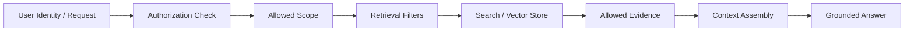
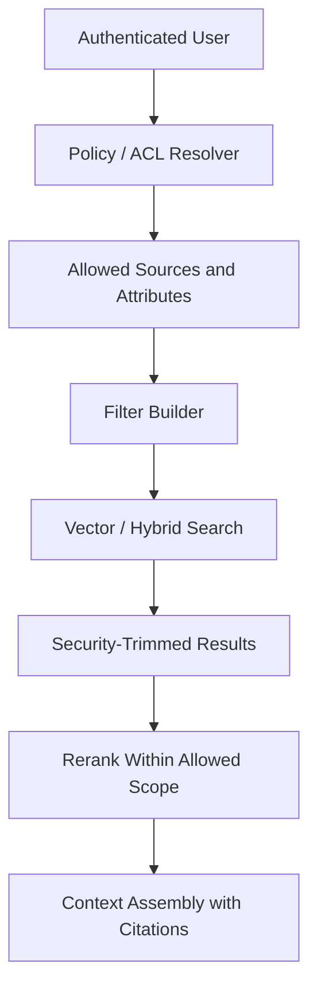

---
tags:
  - rag
  - retrieval
  - metadata
  - permissions
type: note
status: evergreen
source: "OpenAI Retrieval Docs · AWS Bedrock Knowledge Bases metadata filtering · Microsoft Learn Azure AI Search · vault-local architectural inference"
parent_note: "[[02 AI Systems/RAG/RAG - MOC|RAG - MOC]]"
created: "2026-04-19"
updated: "2026-04-19"
---

# RAG - Metadata Filtering and Permission-Aware Retrieval

## Summary

metadata filtering ช่วยให้ retrieval ดึงข้อมูลถูก scope ส่วน permission-aware retrieval ทำให้ระบบไม่ดึงหรือใช้ข้อมูลที่ผู้ใช้ไม่มีสิทธิ์เห็น

สองอย่างนี้เกี่ยวกัน แต่ไม่เหมือนกัน:
- metadata filtering = จำกัด search space ด้วย attributes เช่น product, date, tenant, source type
- permission-aware retrieval = enforce access control ตาม identity, role, tenant, group, policy, หรือ entitlement

ใน production RAG ถ้า retrieval ดึงข้อมูลผิด scope แล้วส่งเข้า context ต่อให้ final answer ไม่ quote ตรง ๆ ก็ถือว่าเกิด data exposure risk แล้ว

---

## Scope

- metadata filters
- permission-aware retrieval
- security trimming
- tenant and source boundaries
- filter placement ใน retrieval pipeline
- failure modes ของ filtering และ authorization

---

## ทำไม Metadata Filtering สำคัญ

vector similarity ไม่รู้เองว่าเอกสารไหนควรถูกใช้ในบริบทใด

metadata filtering ใช้ attributes เพื่อจำกัด candidate set ก่อนหรือระหว่าง retrieval เช่น:
- `tenant_id`
- `user_group`
- `document_type`
- `source_system`
- `product`
- `region`
- `published_at`
- `version`
- `trust_level`

OpenAI vector store search รองรับ `filters` บน file attributes
AWS Bedrock Knowledge Bases มี metadata filtering เพื่อจำกัดผล retrieval
Azure AI Search รองรับ filter expressions ร่วมกับ vector / hybrid search

ผลเชิงระบบ:
- ลด noise
- เพิ่ม precision
- ลด latency ในบางกรณี
- จำกัด retrieval ให้อยู่ใน corpus ที่ถูกต้อง
- ทำให้ citation และ audit trace ชัดขึ้น

---

## Filtering ไม่เท่ากับ Authorization

ข้อผิดพลาดที่พบบ่อยคือคิดว่า filter คือ access control

จริง ๆ แล้ว:
- filter เป็น query constraint
- authorization เป็น security decision
- guardrail เป็น control หลังหรือรอบข้าง model/tool behavior

หลักคิด:
- authorization ต้องกำหนดก่อนว่า user เห็น corpus หรือ document set ใดได้
- retrieval filters ควรถูก derive จาก authorization result
- model ไม่ควรเป็นผู้ตัดสินสิทธิ์จาก natural-language instruction
- prompt-level instruction ว่า "อย่าเปิดเผยข้อมูลลับ" ไม่พอสำหรับ production

---

## Filter Placement

filter วางได้หลายตำแหน่ง แต่แต่ละตำแหน่งมีความหมายต่างกัน

| ตำแหน่ง | ใช้ทำอะไร | ข้อควรระวัง |
|---|---|---|
| Pre-retrieval source routing | เลือก corpus หรือ index ก่อนค้น | routing ผิดทำให้ recall หาย |
| Query-time filters | จำกัด candidates ระหว่าง search | filter แคบเกินทำให้ไม่เจอ evidence |
| Post-retrieval trimming | ตัดผลที่ไม่ควรใช้หลัง search | อาจ retrieve ข้อมูลที่ไม่ควรถูกเห็นมาแล้ว |
| Context assembly policy | เลือก evidence เข้าพร้อม prompt | ไม่ควรใช้แทน authorization |
| Output guardrail | ตรวจคำตอบก่อนส่งผู้ใช้ | ป้องกันชั้นท้าย แต่ไม่แก้ retrieval leak |

สำหรับ permission-aware retrieval ควร prefer security trimming ก่อน evidence เข้าถึง model context
post-hoc output filtering เป็น safety net ได้ แต่ไม่ควรเป็น primary boundary

---

## Metadata Schema Design

metadata ที่ดีต้องออกแบบตั้งแต่ ingestion ไม่ใช่เติมทีหลังเมื่อ retrieval เริ่มพลาด

schema ขั้นต่ำสำหรับ enterprise RAG มักมี:

| Metadata | หน้าที่ |
|---|---|
| `tenant_id` | กัน cross-tenant retrieval |
| `source_system` | แยก Slack, Drive, docs, tickets, wiki |
| `document_type` | policy, runbook, ticket, spec, FAQ |
| `owner_team` | routing และ accountability |
| `access_group` | group-level permission |
| `classification` | public, internal, confidential |
| `created_at` / `updated_at` | freshness และ temporal filtering |
| `version` | กัน reference drift |
| `trust_level` | source trust และ citation policy |

design inference:
- ถ้า metadata ไม่ครบตอน ingest ระบบจะไม่มีข้อมูลพอ enforce filter ตอน query
- ถ้า metadata ไม่ normalize ข้าม source, multi-source retrieval จะ merge/dedup ยากขึ้น
- ถ้า access metadata อยู่คนละระบบ ต้องมี policy resolver ก่อน query

---

## Permission-Aware Retrieval Pattern

pattern ที่ใช้ได้ทั่วไป:

1. authenticate user
2. resolve authorization scope เช่น tenant, role, groups, resource ACLs
3. translate scope เป็น retrieval filters หรือ allowed source set
4. execute retrieval เฉพาะ allowed scope
5. preserve metadata ใน retrieved evidence
6. assemble context เฉพาะ evidence ที่ผ่าน scope
7. log query, filters, source ids, และ permission decision

ข้อสำคัญ:
- reranking ต้องเกิดบน results ที่ผ่าน permission แล้ว
- query rewrite ต้องไม่ขยาย scope เกิน authorization
- agentic retrieval loop ต้อง carry permission context ไปทุก subquery

---

## Common Filter Types

### 1. Tenant Filter

กันข้อมูลของลูกค้าหรือ workspace อื่นปนเข้ามา

ตัวอย่าง:
- `tenant_id = current_user.tenant_id`
- `workspace_id IN allowed_workspaces`

### 2. Role / Group Filter

จำกัดตามกลุ่มหรือ role

ตัวอย่าง:
- `access_group IN user.groups`
- `classification <= user.clearance`

### 3. Source-Type Filter

เลือกเฉพาะ source ที่เหมาะกับ intent

ตัวอย่าง:
- policy questions ใช้ `document_type = policy`
- engineering questions ใช้ `document_type IN runbook, design_doc, incident`

### 4. Time / Freshness Filter

ลด reference drift จากเอกสารเก่า

ตัวอย่าง:
- `updated_at >= cutoff`
- prefer latest version แต่ยัง preserve historical docs ถ้าผู้ใช้ถามอดีต

### 5. Trust Filter

จำกัด source ตามระดับความน่าเชื่อถือ

ตัวอย่าง:
- answer ที่ต้องการ official reference ใช้ `trust_level IN official, approved_internal`
- user-uploaded docs อาจใช้ได้ แต่ต้อง label เป็น untrusted หรือ user-provided evidence

---

## Interaction With Retrieval Strategy

metadata filtering ต้องออกแบบคู่กับ retrieval strategy:

- keyword search ต้องรู้ว่าฟิลด์ใด filterable และ searchable
- vector search ต้อง apply filters โดยไม่ทำให้ recall หายเกินไป
- hybrid retrieval ต้องใช้ filter เดียวกันทั้ง lexical และ vector paths
- graph retrieval ต้อง enforce permission บน nodes และ edges
- agentic RAG ต้อง propagate filters ไปทุก tool call และ subquery

ถ้าใช้ multi-source retrieval:
- source catalog ต้องบอกได้ว่า source ไหนรองรับ filter ประเภทใด
- filter semantics ต้อง normalize เช่น `team`, `owner`, `group`, `space`
- merge/dedup ต้องไม่รวม evidence จาก source ที่ user ไม่มีสิทธิ์

---

## Observability

permission-aware retrieval ต้อง log อย่างน้อย:
- user / session identity แบบ privacy-safe
- authorization scope ที่ resolve ได้
- filters ที่ส่งเข้า retrieval
- source หรือ vector store ที่ค้น
- result ids ที่คืน
- result ids ที่ถูกตัดออกเพราะ permission หรือ policy
- final evidence ids ที่เข้า context

log เหล่านี้ช่วยตอบ:
- ทำไม query นี้ไม่เจอข้อมูล
- ระบบดึงข้อมูลผิด tenant หรือไม่
- filter แคบหรือกว้างเกินไปไหม
- citation มาจาก source ที่ user มีสิทธิ์จริงไหม

---

## Failure Modes

### 1. Cross-Tenant Retrieval

ระบบดึงข้อมูลจาก tenant หรือ workspace อื่น เพราะไม่มี tenant filter หรือ filter ใช้ field ผิด

### 2. Authorization After Retrieval

search ดึงข้อมูลต้องห้ามมาก่อน แล้วค่อยตัดทีหลัง ทำให้ข้อมูลเข้าสู่ logs, traces, reranker, หรือ model context โดยไม่ตั้งใจ

### 3. Filter Too Narrow

filter ถูกต้องเชิง policy แต่แคบเกินจนระบบตอบว่าไม่พบข้อมูล ทั้งที่มี evidence อยู่ใน source ที่ควรใช้

### 4. Filter Too Broad

filter กว้างเกินจนข้อมูลผิด product, region, version, หรือ trust level เข้ามาใน context

### 5. Metadata Drift

เอกสารเปลี่ยนสิทธิ์หรือ owner แล้ว index metadata ไม่ refresh ทำให้ retrieval ใช้ policy เก่า

### 6. Query Rewrite Scope Expansion

query rewrite หรือ agentic planner แตก query ใหม่โดยไม่ carry filters ทำให้ค้นข้าม scope

### 7. Reranker Sees Forbidden Evidence

reranker ได้ candidate ที่ user ไม่มีสิทธิ์เห็น แม้สุดท้ายจะไม่ถูกส่งให้ model ตอบ

---

## Design Rules

- แยก authorization, retrieval filtering, context assembly, และ output guardrails ออกจากกัน
- derive filters จาก permission decision ไม่ใช่ให้ model คิดเอง
- enforce permission ก่อน evidence เข้า model context
- ทำ metadata schema เป็นส่วนหนึ่งของ ingestion pipeline
- propagate permission context ไปทุก retrieval path และ subquery
- log filters และ source ids เพื่อ audit และ debug
- ถ้า filter อาจทำให้ recall หาย ให้ตอบแบบ scoped uncertainty เช่น "ไม่พบในเอกสารที่คุณมีสิทธิ์เข้าถึง"

---

## ความสัมพันธ์กับโน้ตอื่น

- [[02 AI Systems/RAG/Core/01 - Retrieval Basics]] — filtering เป็น retrieval control พื้นฐาน
- [[02 AI Systems/RAG/Retrieval/03 - Embeddings and Vector Databases]] — vector stores ต้องมี metadata และ filters
- [[02 AI Systems/RAG/Retrieval/RAG - Query Routing and Retrieval Strategy]] — routing ต้องใช้ permission context
- [[02 AI Systems/RAG/Core/06 - Context Assembly]] — context ต้องใช้เฉพาะ evidence ที่ผ่าน scope
- [[02 AI Systems/RAG/Core/07 - Grounding and Citation]] — citation ต้อง trace กลับ source ที่ user มีสิทธิ์เห็น
- [[02 AI Systems/Guardrails/Operations/04 - Permission Models]] — permission boundary เชิงระบบ
- [[02 AI Systems/Guardrails/Core/03 - Tool Safety]] — tool outputs และ retrieved documents เป็น untrusted input
- [[02 AI Systems/RAG/RAG - MOC|RAG - MOC]]

---

## Official References

- OpenAI Retrieval Guide: https://platform.openai.com/docs/guides/retrieval
- OpenAI Vector Store Search API: https://platform.openai.com/docs/api-reference/vector-stores/search
- AWS - Knowledge Bases for Amazon Bedrock metadata filtering: https://aws.amazon.com/about-aws/whats-new/2024/03/knowledge-bases-amazon-bedrock-metadata-filtering/
- AWS Bedrock - RetrieveAndGenerate: https://docs.aws.amazon.com/bedrock/latest/userguide/kb-test-retrieve-generate.html
- Microsoft Learn - Retrieval-augmented generation in Azure AI Search: https://learn.microsoft.com/en-us/azure/search/retrieval-augmented-generation-overview
