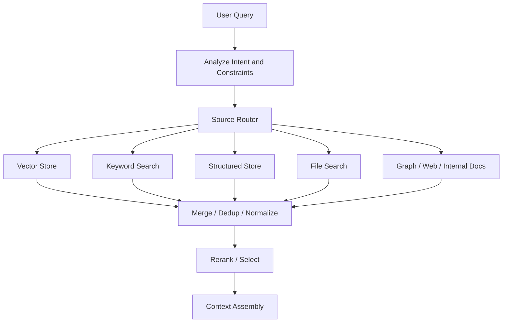

---
tags:
  - rag
  - retrieval
  - multisource
type: note
status: evergreen
source: "Microsoft Learn Azure AI Search · OpenAI Retrieval Docs · AWS Bedrock Knowledge Bases · vault-local architectural inference"
parent_note: "[[02 AI Systems/RAG/RAG - MOC|RAG - MOC]]"
created: "2026-04-19"
updated: "2026-04-19"
---

# RAG - Multi-Source Retrieval

## Summary

multi-source retrieval คือ RAG pattern ที่ค้นข้อมูลจากหลาย knowledge sources แล้วรวม, dedup, rank, และ assemble evidence ให้เป็น context เดียว

ระบบ production มักไม่ได้มีข้อมูลอยู่ใน vector DB เดียว แต่อยู่กระจายใน:
- vector stores
- keyword / full-text search
- structured databases
- file search
- internal docs
- tickets / issues
- web หรือ external docs
- knowledge graphs

---

## Scope

- source catalog
- source routing
- parallel retrieval
- merge and dedup
- score normalization
- permission-aware retrieval
- source-specific failure modes

---

## ทำไมต้อง Multi-Source Retrieval

single index ง่ายกว่า แต่ไม่พอเมื่อ:
- แต่ละ source มี trust level ต่างกัน
- access control ต่างกัน
- update cadence ต่างกัน
- query บางชนิดต้อง exact lookup แต่บางชนิดต้อง semantic search
- structured facts อยู่ใน database แต่ explanations อยู่ใน docs

ตัวอย่าง:
- policy answer ต้องใช้ official docs
- incident analysis ต้องใช้ tickets + runbooks + postmortems
- product Q&A ต้องใช้ docs + changelog + support cases
- engineering assistant ต้องใช้ code search + architecture docs + issue tracker

---

## Source Catalog

multi-source retrieval ต้องมี catalog ที่บอกว่า source แต่ละตัวคืออะไรและใช้เมื่อไร

| Source | เหมาะกับ | ต้องระวัง |
|---|---|---|
| Vector store | semantic docs search | exact identifiers อาจหลุด |
| Keyword search | IDs, names, dates, exact terms | paraphrase recall ต่ำ |
| File search | user/admin-provided document corpora | citation granularity และ permissions |
| Structured store | facts, inventory, transactions | ต้องแปลง query เป็น structured constraints |
| Knowledge graph | relationships, multi-hop, lineage | graph construction cost |
| Web / external docs | freshness, public references | source trust และ prompt injection |
| Internal docs/wiki | organizational knowledge | staleness และ access control |

---

## Routing Pattern

router ต้องพิจารณา:
- intent ของคำถาม
- source authority
- freshness requirement
- permission context
- latency budget
- citation requirement
- fallback path

---

## Merge และ Dedup

เมื่อผลลัพธ์มาจากหลาย source ต้องจัดการ:
- duplicate documents
- near-duplicate chunks
- conflicting versions
- different score scales
- different citation metadata
- different trust levels

merge policy ที่ดีควร preserve:
- source id
- original rank / score
- retrieval path
- document version
- permission scope
- trust level

ถ้า dedup แรงเกินไป อาจทิ้ง evidence สำคัญจาก source ที่ authority สูงกว่า
ถ้า dedup อ่อนเกินไป context จะเต็มด้วย evidence ซ้ำ

---

## Score Normalization

score จาก vector search, keyword search, graph traversal, และ structured lookup เทียบกันตรง ๆ ไม่ได้เสมอ

แนวทางที่ใช้ได้:
- rank-based fusion เช่น RRF
- source-specific thresholds
- reranking หลัง merge
- authority-aware boosting
- freshness-aware boosting

design inference:
- score normalization เป็น policy decision ไม่ใช่คณิตศาสตร์ล้วน
- source authority ควรเป็น signal แยกจาก similarity
- citation priority อาจต่างจาก retrieval rank

---

## Permission และ Trust

multi-source retrieval ต้อง enforce permission ทุก source ก่อนรวมผล

ข้อควรระวัง:
- source A ใช้ group ACL แต่ source B ใช้ tenant id
- web source ไม่มี internal ACL แต่มี trust risk สูงกว่า
- user-uploaded file อาจควรค้นได้เฉพาะ session หรือ workspace นั้น
- structured store อาจมี row-level permissions ที่ vector index ไม่มี

หลักคิด:
- normalize permission context ก่อน query
- อย่า merge evidence ที่ยังไม่ผ่าน security trimming
- source trust ต้องเดินทางไปกับ evidence จนถึง citation

---

## Failure Modes

### 1. Wrong Source Routing

query ถูกส่งไป source ที่ไม่มีข้อมูลจริง หรือพลาด source ที่ควรใช้

### 2. Source Dominance

source หนึ่งให้ผลลัพธ์เยอะหรือ score สูงจนกลบ source ที่ authoritative กว่า

### 3. Permission Mismatch

แต่ละ source ใช้ access model ต่างกัน ทำให้ filter semantics ไม่เท่ากัน

### 4. Duplicate Context

หลาย source มีเอกสารเดียวกันคนละ copy แล้ว context เต็มด้วยข้อมูลซ้ำ

### 5. Reference Drift

ผลจาก source หนึ่งเป็น version เก่า แต่ถูก merge กับ source ใหม่โดยไม่มี version policy

### 6. Trust Collapse

ระบบปน official docs, internal draft, และ user-uploaded docs โดยไม่บอก trust level

---

## Design Rules

- มี source catalog ก่อนทำ multi-source retrieval
- route ตาม intent, permission, freshness, และ trust ไม่ใช่แค่ similarity
- normalize metadata และ permission semantics ข้าม sources
- merge/dedup ต้อง preserve provenance
- rerank หลัง merge เมื่อ score scale ต่างกันมาก
- context assembly ต้อง balance relevance, diversity, authority, และ citation trace
- eval ต้อง slice ตาม source และ source combinations

---

## ความสัมพันธ์กับโน้ตอื่น

- [[02 AI Systems/RAG/Retrieval/RAG - Query Routing and Retrieval Strategy]] — source routing เป็นแกนของ multi-source retrieval
- [[02 AI Systems/RAG/Retrieval/RAG - Metadata Filtering and Permission-Aware Retrieval]] — permission context ต้องข้ามทุก source
- [[02 AI Systems/RAG/Retrieval/RAG - Hybrid Retrieval]] — hybrid retrieval เป็น multi-signal pattern ภายใน source หรือข้าม source
- [[02 AI Systems/RAG/Retrieval/RAG - Knowledge Graph RAG]] — graph เป็น source เฉพาะทางหนึ่ง
- [[02 AI Systems/RAG/Core/06 - Context Assembly]] — merge/dedup ส่งผลต่อ context สุดท้าย
- [[02 AI Systems/RAG/Core/07 - Grounding and Citation]] — citations ต้อง preserve source provenance
- [[02 AI Systems/RAG/RAG - MOC|RAG - MOC]]

---

## Official References

- Microsoft Learn - Retrieval-augmented generation in Azure AI Search: https://learn.microsoft.com/en-us/azure/search/retrieval-augmented-generation-overview
- Microsoft Learn - Hybrid Search Overview: https://learn.microsoft.com/en-us/azure/search/hybrid-search-overview
- OpenAI Retrieval Guide: https://platform.openai.com/docs/guides/retrieval
- OpenAI File Search Guide: https://platform.openai.com/docs/guides/tools-file-search
- AWS Bedrock - Retrieve information from Knowledge Bases: https://docs.aws.amazon.com/bedrock/latest/userguide/kb-how-retrieval.html
