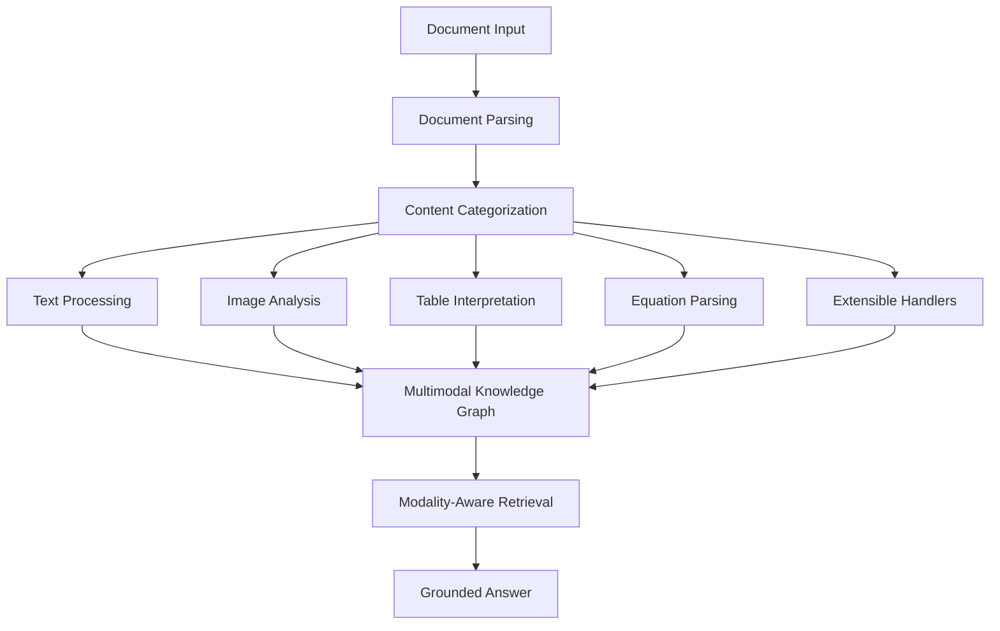

---
tags:
  - rag
  - multimodal
  - retrieval
  - knowledgegraph
type: note
status: draft
source: "RAG-Anything GitHub + arxiv 2510.12323"
parent_note: "[[02 AI Systems/RAG/RAG - MOC|RAG - MOC]]"
created: "2026-04-20"
updated: ""
---

# RAG - Multimodal RAG

## Summary

Multimodal RAG คือ RAG ที่ประมวลผลและ retrieve ข้ามหลาย modalities (text, images, tables, equations, charts) ภายใน pipeline เดียว

เอกสารจริงมักมีเนื้อหาหลากหลาย — diagrams อธิบาย architecture, tables สรุปผลทดลอง, สมการกำหนดความสัมพันธ์ — text-only RAG จะพลาดข้อมูลเหล่านี้ทั้งหมด

---

## ทำไม Text-Only RAG ไม่พอ

| ปัญหา | ตัวอย่าง |
|---|---|
| Images ถูกข้าม | architecture diagram ใน paper ไม่ถูก index |
| Tables สูญหาย | performance comparison table ถูกตัดเป็น text ที่อ่านไม่รู้เรื่อง |
| Equations หาย | สมการสำคัญไม่ถูก parse |
| Cross-modal relationships ขาด | ความสัมพันธ์ระหว่าง figure กับ text ที่อ้างถึงหายไป |

---

## Multimodal RAG Pipeline

pipeline ประกอบด้วย 5 stages หลัก:

### 1. Document Parsing

แยกเอกสารออกเป็น elements ที่มีโครงสร้าง:
- text blocks, visual elements, structured tables, equations, specialized content
- รักษา contextual relationships ระหว่าง elements
- รองรับหลาย format: PDF, Office (DOC/DOCX/PPT/PPTX/XLS/XLSX), images

### 2. Content Categorization and Routing

จำแนกและ route content ไปยัง processing channels ที่เหมาะสมโดยอัตโนมัติ:
- concurrent multi-pipeline architecture สำหรับ throughput
- รักษา document hierarchy และ inter-element relationships

### 3. Modality-Specific Analysis

แต่ละ modality มี analyzer เฉพาะ:

| Analyzer | หน้าที่ |
|---|---|
| **Visual Content** | ใช้ vision model วิเคราะห์ภาพ, สร้าง context-aware captions, extract spatial relationships |
| **Structured Data** | ตีความ tabular data, pattern recognition, ระบุ dependencies ข้าม tables |
| **Mathematical Expression** | parse สมการ, รองรับ LaTeX, mapping เข้ากับ domain knowledge |
| **Extensible Handler** | framework สำหรับ custom content types ผ่าน plugin architecture |

### 4. Multimodal Knowledge Graph Index

สร้าง knowledge graph ที่รวม entities จากทุก modality:
- **Multi-modal entity extraction** — แปลง elements สำคัญจากทุก modality เป็น graph entities พร้อม semantic annotations
- **Cross-modal relationship mapping** — สร้าง connections ระหว่าง text entities กับ multimodal components ผ่าน automated relationship inference
- **Hierarchical structure preservation** — รักษาโครงสร้างเอกสารผ่าน "belongs_to" relationship chains
- **Weighted relationship scoring** — ให้คะแนน relevance ตาม semantic proximity และ contextual significance

→ ดูเพิ่มที่ [[02 AI Systems/RAG/Retrieval/RAG - Knowledge Graph RAG|Knowledge Graph RAG]] สำหรับ GraphRAG พื้นฐาน

### 5. Modality-Aware Retrieval

retrieval ที่คำนึงถึง modality ของ content:
- **Vector-Graph Fusion** — ผสม vector similarity search กับ graph traversal เพื่อ retrieval ที่ครอบคลุมทั้ง semantic embeddings และ structural relationships
- **Modality-Aware Ranking** — ปรับ scoring ตาม content type relevance และ query-specific modality preferences
- **Relational Coherence** — รักษา semantic และ structural relationships ระหว่าง retrieved elements

→ ดูเพิ่มที่ [[02 AI Systems/RAG/Retrieval/RAG - Hybrid Retrieval|Hybrid Retrieval]] สำหรับ vector-graph fusion

---

## VLM-Enhanced Query

เมื่อ retrieved context มี images ระบบสามารถส่งเข้า Vision Language Model (VLM) เพื่อวิเคราะห์ร่วมกับ text:

1. retrieve context ที่เกี่ยวข้อง (อาจมี image paths)
2. โหลดและ encode images เป็น base64
3. ส่งทั้ง text context และ images เข้า VLM
4. VLM วิเคราะห์ร่วมกันเพื่อ comprehensive answer

เป็น pattern ใหม่ของ tool-augmented retrieval ที่ใช้ vision model เป็น tool สำหรับวิเคราะห์ visual content ใน retrieved context

→ ดูเพิ่มที่ [[02 AI Systems/RAG/Core/RAG - Agentic RAG|Agentic RAG]] สำหรับ tool-augmented retrieval patterns

---

## เมื่อไรควรใช้ Multimodal RAG

ควรใช้เมื่อ:
- เอกสารมี mixed content (text + images + tables + equations)
- คำตอบต้องอ้างอิง visual evidence (charts, diagrams)
- domain ที่ tables เป็นข้อมูลหลัก (financial reports, research papers)
- ต้องการ cross-modal relationships (figure ที่ text อ้างถึง)

อาจยังไม่จำเป็นเมื่อ:
- corpus เป็น text-only
- images เป็นแค่ decoration ไม่มี information value
- text-only RAG ให้ผลดีพอแล้ว
- ต้นทุน vision model สูงเกินงบ

---

## Failure Modes

### 1. Bad Document Parsing

parser แยก elements ผิด เช่น table ถูกอ่านเป็น text ธรรมดา

### 2. Poor Visual Analysis

vision model สร้าง captions ที่ไม่ตรงกับเนื้อหาจริงของภาพ

### 3. Cross-Modal Noise

relationship mapping สร้าง connections ที่ไม่มีความหมาย เพิ่ม noise ใน graph

### 4. Modality Mismatch

ranking ให้น้ำหนัก modality ผิด เช่น ดึง table มาตอบคำถามที่ต้องการ text explanation

### 5. Cost Explosion

vision model calls สำหรับทุก image ใน corpus ทำให้ ingestion cost สูงมาก

---

## Design Rules

- เริ่มจาก text-only RAG ให้เสถียรก่อน แล้วค่อยเพิ่ม multimodal
- ประเมินว่า modalities ไหนมี information value จริง ๆ ก่อนลงทุน processing
- ใช้ extensible handler สำหรับ content types ใหม่แทนการ hardcode
- วัด retrieval quality แยกต่อ modality ไม่ใช่รวมเป็นตัวเลขเดียว
- คำนึงถึง ingestion cost ของ vision model เมื่อ corpus มี images เยอะ

---

## ความสัมพันธ์กับโน้ตอื่น

- [[02 AI Systems/RAG/Core/01 - Retrieval Basics]] — retrieval layer พื้นฐาน
- [[02 AI Systems/RAG/Core/02 - Chunking Strategies]] — chunking ต้องคำนึงถึง multimodal elements
- [[02 AI Systems/RAG/Retrieval/RAG - Knowledge Graph RAG]] — cross-modal knowledge graph เป็น extension ของ GraphRAG
- [[02 AI Systems/RAG/Retrieval/RAG - Hybrid Retrieval]] — vector-graph fusion เป็น hybrid retrieval อีกแบบ
- [[02 AI Systems/RAG/Core/RAG - Agentic RAG]] — VLM-enhanced query เป็น pattern ของ tool-augmented retrieval
- [[02 AI Systems/RAG/Core/06 - Context Assembly]] — multimodal context ต้องประกอบต่างจาก text-only
- [[02 AI Systems/RAG/Evaluation/08 - Evaluation]] — ต้องวัดแยกต่อ modality
- [[01 Foundations/LLM Foundations/Core/11 - Multimodal Foundations]] — พื้นฐาน multimodal models
- [[02 AI Systems/RAG/RAG - MOC|RAG - MOC]]

---

## References

- RAG-Anything GitHub: https://github.com/HKUDS/RAG-Anything
- RAG-Anything Paper: https://arxiv.org/abs/2510.12323
