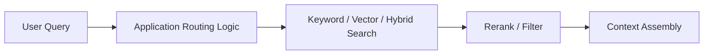
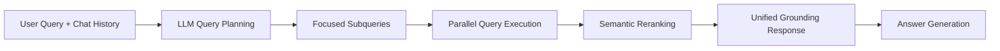

---
tags:
  - rag
  - retrieval
  - queryrouting
type: note
status: evergreen
source: "Microsoft Learn - Retrieval-augmented generation in Azure AI Search · Microsoft Learn - Agentic retrieval in Azure AI Search"
parent_note: "[[02 AI Systems/RAG/RAG - MOC|RAG - MOC]]"
created: "2026-04-18"
updated: "2026-04-18"
---

# RAG - Query Routing and Retrieval Strategy

## Summary

query routing คือการตัดสินว่า request หนึ่งควรใช้ retrieval path แบบไหนก่อนส่งต่อไปยัง context assembly หรือ answer generation

ใน core RAG แบบง่าย ระบบมักใช้ path เดียว เช่น vector search top-k  
ใน advanced RAG ระบบต้องเลือกหรือผสมหลาย retrieval strategies ตามลักษณะคำถาม, source, latency budget, security boundary, และความต้องการ citation

---

## Query Routing แก้ปัญหาอะไร

Microsoft Learn อธิบาย challenge ของ RAG ว่า query จากผู้ใช้มักซับซ้อน, เป็น conversational, ใช้คำไม่ตรงกับเอกสาร, มี assumed context, และต้องดึงข้อมูลจากหลาย source ภายใต้ token / latency / security constraints

ดังนั้น query routing ต้องตอบคำถามก่อน retrieve ว่า:

1. ต้อง retrieve หรือไม่
2. retrieve จาก source ไหน
3. ใช้ lexical, vector, hybrid, graph, structured query, หรือหลาย path พร้อมกัน
4. ต้องใช้ conversation history หรือไม่
5. ต้องใช้ metadata / permission filter หรือไม่
6. ต้อง rerank หรือ synthesize grounding data ก่อนส่งต่อไหม

---

## Routing Inputs

| Input | ใช้ตัดสินใจเรื่อง |
|---|---|
| user query | intent, exact terms, semantic need |
| chat history | context ของคำถามต่อเนื่อง |
| source catalog | source ไหนมีข้อมูลที่เกี่ยวข้อง |
| metadata | product, date, region, owner, document type |
| permission context | user เห็น source ไหนได้บ้าง |
| latency budget | เลือก single-shot หรือ multi-query |
| answer requirement | citation, freshness, structured answer |

---

## Retrieval Strategy Types

| Strategy | เหมาะเมื่อ | ความเสี่ยง |
|---|---|---|
| No retrieval | คำถามตอบจาก context ปัจจุบันได้ | อาจ hallucinate ถ้าประเมินผิด |
| Keyword / lexical | มี exact identifiers, policy names, product codes | miss semantic paraphrases |
| Vector / semantic | query ใช้ภาษาต่างจากเอกสารหรือถามเชิงความหมาย | exact term อาจหลุด |
| Hybrid | ต้องการทั้ง semantic recall และ exact precision | tuning / score fusion ซับซ้อนขึ้น |
| Metadata-filtered retrieval | ต้องจำกัดตาม source, date, tenant, permission | filter แคบเกินจน no recall |
| Multi-source retrieval | enterprise content อยู่หลายระบบ | merge / dedup / permission ยาก |
| Agentic multi-query retrieval | query ซับซ้อน มีหลาย asks หรือหลาย constraints | latency / cost / trace complexity |

---

## Classic vs Agentic Routing

### Classic RAG

classic RAG มักให้ application เป็นคนเลือก query path:

เหมาะเมื่อ:
- use case ค่อนข้าง predictable
- ต้องการ low latency
- ต้องการควบคุม query pipeline เองละเอียด
- ไม่ต้องการ LLM query planning ใน retrieval layer

### Agentic Retrieval

Microsoft Learn อธิบาย agentic retrieval ว่าให้ LLM วิเคราะห์ chat thread เพื่อระบุ information need แล้วแตก complex query เป็น focused subqueries ก่อนส่งไปยัง knowledge sources

เหมาะเมื่อ:
- query เป็น complex / conversational
- ต้องการ highest relevance และ structured response
- ต้องการ citations และ query details
- client เป็น chatbot หรือ agent

---

## Routing Rules

- ถ้า query มี exact identifiers ให้ lexical หรือ hybrid เป็น default
- ถ้า query เป็น semantic question ให้ vector หรือ hybrid เป็น default
- ถ้า query มีหลาย constraints ให้พิจารณา query decomposition
- ถ้า query อ้างถึง previous turns ให้ใช้ chat history ใน routing
- ถ้า source มี access control ให้ filter / security trimming ต้องมาก่อน generation
- ถ้า latency budget ต่ำ ให้หลีกเลี่ยง agentic multi-query ยกเว้นจำเป็น
- ถ้าต้องการ citation สูง ให้ preserve source references ตั้งแต่ retrieval

---

## Failure Modes

### 1. Wrong Route

เลือก vector search ทั้งที่ query ต้อง exact match หรือเลือก keyword search ทั้งที่ผู้ใช้ถามด้วย paraphrase

### 2. Over-Routing

ใช้หลาย retrieval paths เกินจำเป็น ทำให้ latency และ cost สูงขึ้นโดย quality ไม่ดีขึ้น

### 3. Under-Routing

ใช้ single retrieval path ทั้งที่ query ต้องหลาย source หรือหลาย subqueries

### 4. Missing Permission Boundary

route ไป source ถูก แต่ไม่ได้ apply permission / metadata filter ก่อน retrieve

### 5. Lost Trace

ไม่มี log ว่า route ไป source ไหน ด้วย query อะไร และเอา result ไหนเข้า context

---

## Design Implications

- routing เป็น policy layer ก่อน retrieval ไม่ใช่แค่ prompt trick
- advanced RAG ต้องมี source catalog และ retrieval strategy catalog
- agentic RAG ต้องเก็บ query plan / activity trace เพื่อ debug
- retrieval evaluation ต้อง slice ตาม strategy เช่น vector-only, hybrid, metadata-filtered, multi-query

---

## ความสัมพันธ์กับโน้ตอื่น

- [[02 AI Systems/RAG/Core/01 - Retrieval Basics]]
- [[02 AI Systems/RAG/Core/04 - Query Transformation]]
- [[02 AI Systems/RAG/Retrieval/RAG - Hybrid Retrieval]]
- [[02 AI Systems/RAG/Retrieval/RAG - Multi-Source Retrieval]]
- [[02 AI Systems/RAG/Retrieval/RAG - Metadata Filtering and Permission-Aware Retrieval]]
- [[02 AI Systems/RAG/Retrieval/RAG - Hierarchical and Parent-Child Retrieval]]
- [[02 AI Systems/RAG/Core/RAG - Agentic RAG]]
- [[02 AI Systems/RAG/Core/Agentic RAG - Planning and Retrieval Loop]]
- [[02 AI Systems/RAG/Evaluation/08 - Evaluation]]
- [[06 Engineering/RAG/Decision - Choose a Retrieval Strategy]]

---

## Official References

- Microsoft Learn - Retrieval-augmented generation in Azure AI Search: https://learn.microsoft.com/en-us/azure/search/retrieval-augmented-generation-overview
- Microsoft Learn - Agentic retrieval in Azure AI Search: https://learn.microsoft.com/en-us/azure/search/agentic-retrieval-overview
