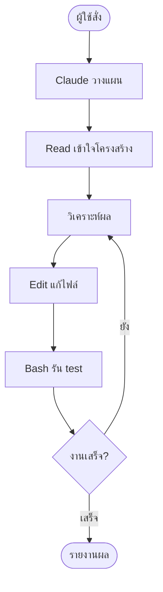

---
tags:
  - claude-code
  - basics
  - cli
type: note
status: draft
created: "2026-04-09"
source: "https://code.claude.com/docs/en/overview"
parent_note: "[[Claude Code - Multi-Agent MOC]]"
---

# Claude Code คืออะไร?

Claude Code คือ **CLI tool** จาก Anthropic สำหรับ **Agentic Coding**

- ทำงานผ่าน Terminal โดยตรง ไม่ต้องใช้ IDE
- ควบคุมได้เต็มรูปแบบผ่านไฟล์ config
- รองรับการทำงานแบบ Autonomous และ Non-interactive

ถ้าต้องการกรอบคิด agent ทั่วไปให้ดู `AI Agent Fundamentals`
ถ้าต้องการกรอบตัดสินใจว่าเมื่อไรควรใช้ agent หรือ multi-agent ให้ดู `05 Use Cases`

---

## คำสั่งพื้นฐาน

```bash
claude                    # เปิด interactive mode
claude -p "ทำสิ่งนี้"     # สั่งงานโดยไม่ต้องโต้ตอบ (non-interactive)
claude -r                 # ต่อ session เดิม (--resume)
claude -c                 # ต่อจาก message ล่าสุด (--continue)
```

---

## CLI vs Chat ต่างกันอย่างไร?

| | Chat (claude.ai) | Claude Code (CLI) |
|---|---|---|
| **รูปแบบ** | โต้ตอบทีละ message | สั่งงาน → AI ทำงานหลายขั้นเอง |
| **เข้าถึงไฟล์** | ไม่ได้ (ต้อง upload เอง) | ได้โดยตรง — อ่าน/เขียน/แก้ไขไฟล์ใน workspace ตามสิทธิ์ |
| **รันโค้ด** | ไม่ได้ | ได้ — รัน bash, test, build จริง |
| **รู้จักโปรเจกต์** | ไม่รู้ | อ่าน codebase ของโปรเจกต์ได้จากไฟล์และ context ที่มี |
| **automation** | ไม่ได้ | ได้ — รันแบบ non-interactive ใน CI/CD |

> Chat = **ปรึกษาที่ปรึกษา** ที่ให้คำแนะนำ แต่ตัวเองต้องลงมือทำ
> CLI = **จ้างวิศวกร** มานั่งที่เครื่องเราแล้วทำงานให้จริงๆ

---

## Tools ที่ Claude Code มี

```
Read    → อ่านไฟล์จริงในโปรเจกต์
Write   → สร้างไฟล์ใหม่
Edit    → แก้ไขไฟล์ที่มีอยู่
Bash    → รันคำสั่ง terminal (npm install, git, pytest ฯลฯ)
Grep    → ค้นหา pattern ทั้ง codebase
Glob    → ค้นหาไฟล์ตาม pattern
```

---

## Agentic Loop



ทั้งหมดนี้เกิดขึ้น **โดยไม่ต้องให้คนมานั่งสั่งทุก step**

---

## พื้นฐานทฤษฎีที่เกี่ยวข้อง

- [[02 AI Systems/AI Agent Fundamentals/01 - AI Agent คืออะไร|AI Agent คืออะไร]] — Claude Code คือ implementation จริงของ Agent: Brain (Claude LLM) + Body (Tools)
- [[02 AI Systems/AI Agent Fundamentals/05 - วงจร Perceive-Think-Act-Check|PTAC Loop]] — Agentic Loop ข้างบนคือ Perceive→Think→Act→Check ที่ทำงานจริง
- [[02 AI Systems/AI Agent Fundamentals/14 - Tools: การออกแบบและทำงาน|Tools: การออกแบบและทำงาน]] — Read/Write/Edit/Bash/Grep/Glob คือ Tools ตามนิยามนี้
