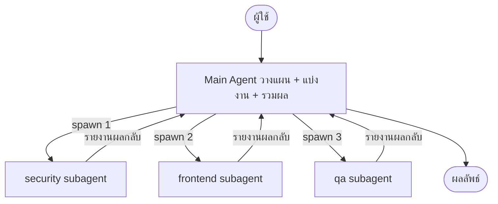
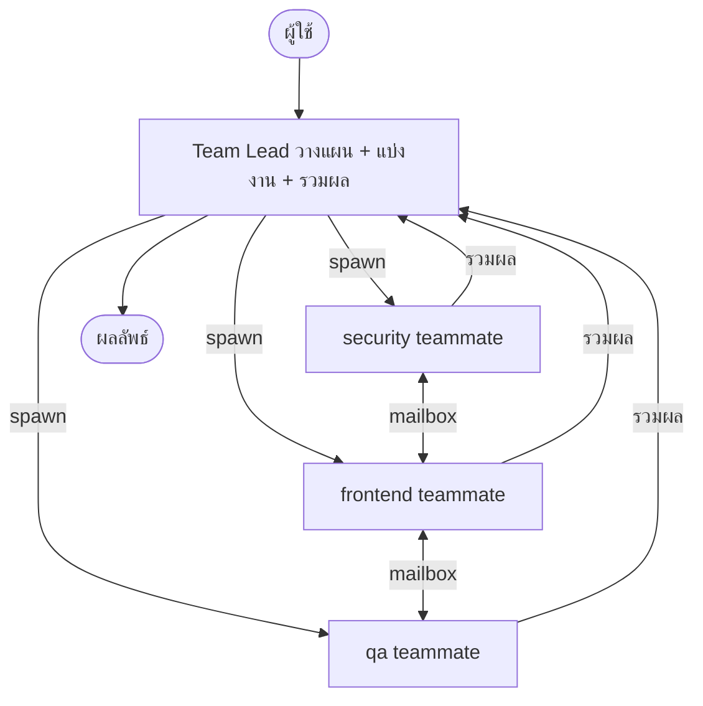

---
tags:
  - claude-code
  - architecture
  - multi-agent
  - pattern
type: note
status: draft
created: "2026-04-09"
source: "https://code.claude.com/docs/en/sub-agents"
parent_note: "[[Claude Code - Multi-Agent MOC]]"
---

# Orchestrator Pattern

**Orchestrator Pattern** คือแนวคิดการออกแบบ — มีตัวหนึ่งทำหน้าที่วางแผน แบ่งงาน และรวมผล โดยไม่ลงมือทำงานหลักเอง

ใน Claude Code implement ได้ **2 แบบ**:

---

## แบบที่ 1 — Subagents (session เดียว, ทีละตัว)

- **Orchestrator เรียกว่า:** Main Agent
- **Worker เรียกว่า:** Subagent
- **Worker คุยกันได้ไหม:** ❌ (รายงานกลับ main เท่านั้น)

---

## แบบที่ 2 — Agent Teams (session แยก, parallel)

- **Orchestrator เรียกว่า:** Team Lead
- **Worker เรียกว่า:** Teammate
- **Worker คุยกันได้ไหม:** ✅ ผ่าน mailbox

---

## เปรียบเทียบ 2 แบบ

| | Subagents | Agent Teams |
|---|---|---|
| **Orchestrator** | Main Agent | Team Lead |
| **Worker** | Subagent | Teammate |
| **Worker คุยกันได้** | ❌ | ✅ ผ่าน mailbox |
| **Parallelism** | ✅ main agent สั่ง parallel ได้ | ✅ ทำงานพร้อมกัน self-coordinate |
| **เหมาะกับ** | งาน workflow ชัดเจน หรือ focused ที่ต้องการแค่ผลลัพธ์ | งานซับซ้อนที่ agents ต้อง collaborate |

---

## ข้อดีของ Pattern นี้

- แต่ละ agent โฟกัสเฉพาะงานตัวเอง ไม่ปะปนกัน
- ทำงาน parallel ได้ (Agent Teams)
- debug ง่ายกว่า เพราะรู้ว่าส่วนไหนมีปัญหา

---

## ดูเพิ่มเติม
- [[04 - 1 Session vs Subagents vs Agent Teams]]
- [[15 - สร้าง Subagent ด้วย agents]]

## พื้นฐานทฤษฎีที่เกี่ยวข้อง

- [[02 AI Systems/AI Agent Fundamentals/04 - สถาปัตยกรรม Agent: Model + Tools + Orchestration|Orchestration Component]] — Orchestrator Pattern คือการ implement Orchestration component ใน Agent equation (Model + Tools + **Orchestration**)
- [[02 AI Systems/AI Agent Fundamentals/07 - รูปแบบ Agent Architectures|Multi-Agent Workflows]] — Pattern นี้ตรงกับ Multi-Agent Workflows ใน Agent Architectures
