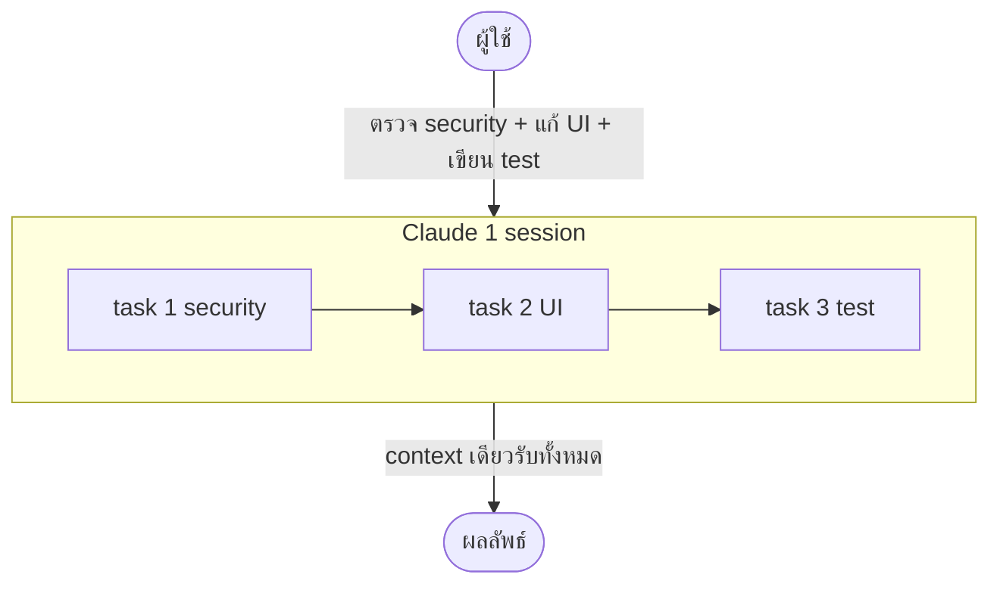
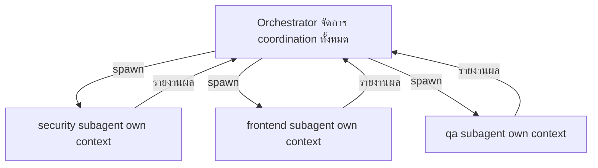
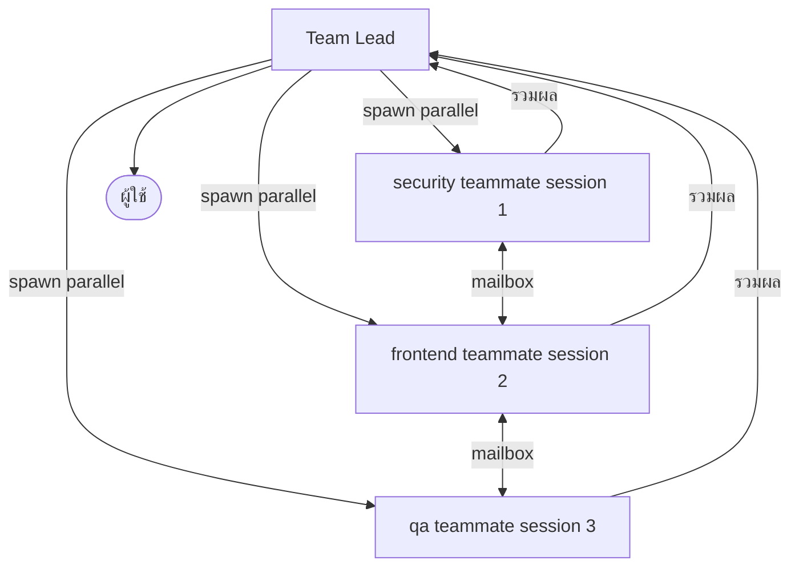
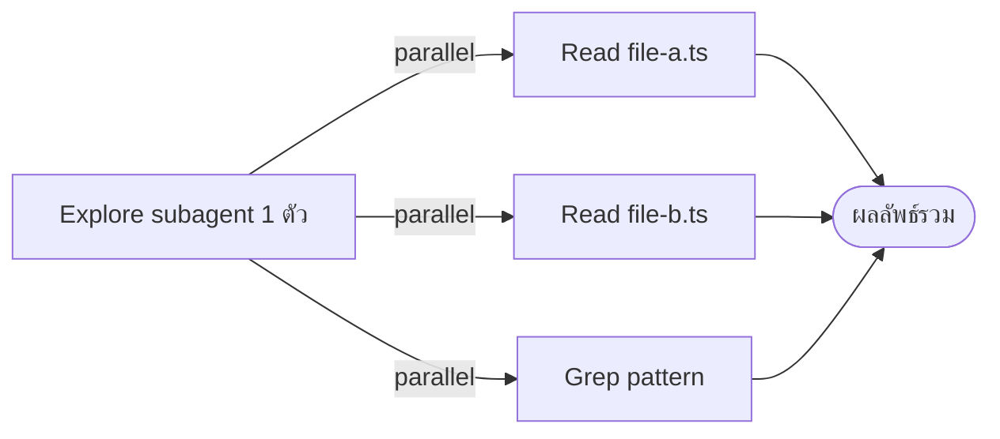

---
tags:
  - claude-code
  - architecture
  - multi-agent
  - context-window
  - version-sensitive
type: note
status: evergreen
created: "2026-04-09"
source: "https://code.claude.com/docs/en/sub-agents"
parent_note: "[[Claude Code - Multi-Agent MOC]]"
---

# 1 Session vs Subagents vs Agent Teams

**Context Window = โต๊ะทำงานของ AI** — ยิ่งข้อมูลเยอะ โต๊ะยิ่งแคบ งานยิ่งพัง
ขนาด context window ของแต่ละ session ขึ้นกับ model และการตั้งค่าของ Claude Code

---

## 🔴 แบบที่ 1: 1 Session (ไม่มี Agent)

Claude ทำทุกอย่างเองใน session เดียว — context window เดียวรับภาระทั้งหมด



**ปัญหา:** context ล้น → AI ลืมงานต้นๆ → ผลลัพธ์ผิดพลาด, ไม่มี parallel

เหมาะกับ: งานง่าย ไฟล์น้อย

---

## 🟡 แบบที่ 2: 1 Session + หลาย Subagents

Orchestrator สั่ง Subagent โดย main agent เป็นคนจัดการ coordination ทั้งหมด แต่ละ Subagent มี context window ของตัวเอง



**ข้อดีหลัก:** แต่ละ subagent มี context ของตัวเอง — ไม่ปะปนกัน งานไม่พันกัน และผลลัพธ์ที่ส่งกลับ main conversation มักสั้นกว่าการทำทุกอย่างใน session เดียว

**ข้อจำกัดหลัก:** Subagent **คุยกันโดยตรงไม่ได้** — ต้องรายงานกลับ main agent เท่านั้น main agent เป็นคน coordinate ทั้งหมด

> ℹ️ **หมายเหตุ:** main agent สามารถ spawn subagents หลายตัวพร้อมกันได้ แต่ subagents เองไม่สื่อสารกันโดยตรง ต่างจาก Agent Teams ที่ Teammates คุยกันได้โดยตรง

### Context เมื่อ Subagent เสร็จงาน

> "The subagent does that work in **its own context** and **returns only the summary**." — official docs

- **Subagent ทำงานใน context ของตัวเอง** — log, ผลลัพธ์ระหว่างทาง, ไฟล์ที่อ่าน ทั้งหมดอยู่ใน context ของ subagent ไม่ท่วม main context
- **เมื่อเสร็จ ส่งแค่ผลสรุปกลับ** — verbose output ถูก discard อยู่ใน subagent context เท่านั้น
- **แต่ละ invocation = fresh context ใหม่** — subagent ไม่จำ session ก่อนหน้าโดยอัตโนมัติ

> ⚠️ **Warning (official):** "When subagents complete, their results return to your main conversation. Running many subagents that each return **detailed results** can consume significant context." — ถ้า subagent ส่งผลละเอียดมากก็ยังกิน main context ได้

เหมาะกับ: งานมี workflow ชัดเจน A→B→C หรืองาน focused ที่ต้องการแค่ผลลัพธ์

---

## 🟢 แบบที่ 3: Agent Teams (parallel + session แยก) — Experimental

Teammates แต่ละตัวรันเป็น **Claude Code instance แยก** ทำงาน **พร้อมกัน** และคุยกันได้ผ่าน mailbox



> ⚠️ ต้องเปิดใช้ก่อน: `CLAUDE_CODE_EXPERIMENTAL_AGENT_TEAMS=1`

เหมาะกับ: งานใหญ่ หลาย domain เร่งด่วน

---

## 💡 Parallel Tool Calls (ภายใน subagent เดียว)

สิ่งที่เห็นว่า "อ่านหลายไฟล์พร้อมกัน" — ไม่ใช่หลาย agent แต่เป็น **subagent ตัวเดียวที่เรียก tools หลายตัวพร้อมกัน** ภายใน 1 turn



นี่คือ **tool-level parallelism** ≠ spawning หลาย subagents พร้อมกัน

---

## เปรียบเทียบทั้ง 3 รูปแบบ

| | 1 Session | Subagents | Agent Teams |
|---|---|---|---|
| **Context** | 1 window รับทุกอย่าง | แยก window ต่อ agent | แยก window + session แยก |
| **Parallelism** | ไม่มี | ✅ main agent สั่ง parallel ได้ | ✅ ทำงานพร้อมกัน self-coordinate |
| **Agents คุยกัน** | — | ❌ รายงานกลับ main เท่านั้น | ✅ คุยกันได้โดยตรง (mailbox) |
| **Coordination** | main จัดการทั้งหมด | main จัดการทั้งหมด | **self-coordinate ผ่าน shared task list** |
| **Token cost** | ต่ำ | ต่ำกว่า Agent Teams | สูง (scale ตามจำนวน teammate) |
| **Context ล้น** | เสี่ยงสูง | ต่ำ | ต่ำมาก |
| **เปิดใช้** | ทำได้เลย | ทำได้เลย | ต้องตั้งค่า env var |
| **เหมาะกับ** | งานง่าย ไฟล์น้อย | งาน focused ต้องการแค่ผลลัพธ์ | งานซับซ้อนที่ agents ต้อง collaborate |

---

## นิยามบทบาทครั้งเดียว ใช้ได้ทั้งสองระบบ

ไฟล์ `.md` ของ Subagent สามารถนำมาใช้เป็น Teammate ใน Agent Teams ได้โดยตรง — ไม่ต้องเขียนซ้ำ

```
.claude/agents/security-reviewer.md  ← นิยาม "บทบาท" ครั้งเดียว
```

> **สรุป:** เลือก Subagents เมื่อต้องการ **context สะอาดในราคาประหยัด** / เลือก Agent Teams เมื่อต้องการ **ความเร็ว parallel** และให้ agents คุยกันได้ — แต่ token สูงกว่ามาก

---

## พื้นฐานทฤษฎีที่เกี่ยวข้อง

- [[02 AI Systems/AI Agent Fundamentals/01 - AI Agent คืออะไร|Spectrum of Agency]] — 1 Session / Subagents / Agent Teams ตรงกับ spectrum: Simple Processor → Multi-step Agent → Multi-Agent
- [[02 AI Systems/AI Agent Fundamentals/08 - Workflow vs AI Agent|Workflow vs AI Agent]] — Sequential Subagents = Workflow pattern / Dynamic Agent Teams = Agent pattern
- [[05 Use Cases/Use Cases - Move from Single to Multi-Agent]] — decision path ว่างานแบบไหนควรขยับจาก single-agent ไป multi-agent
