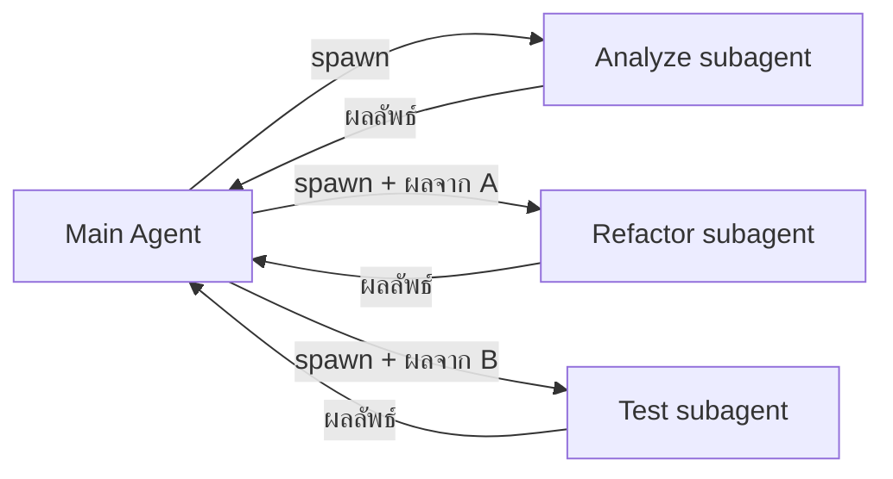
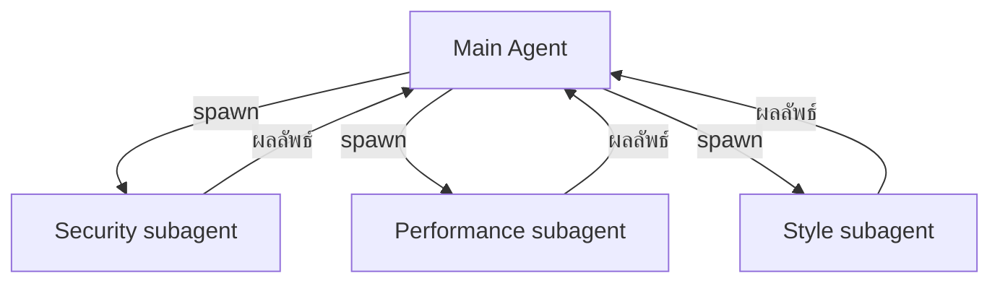
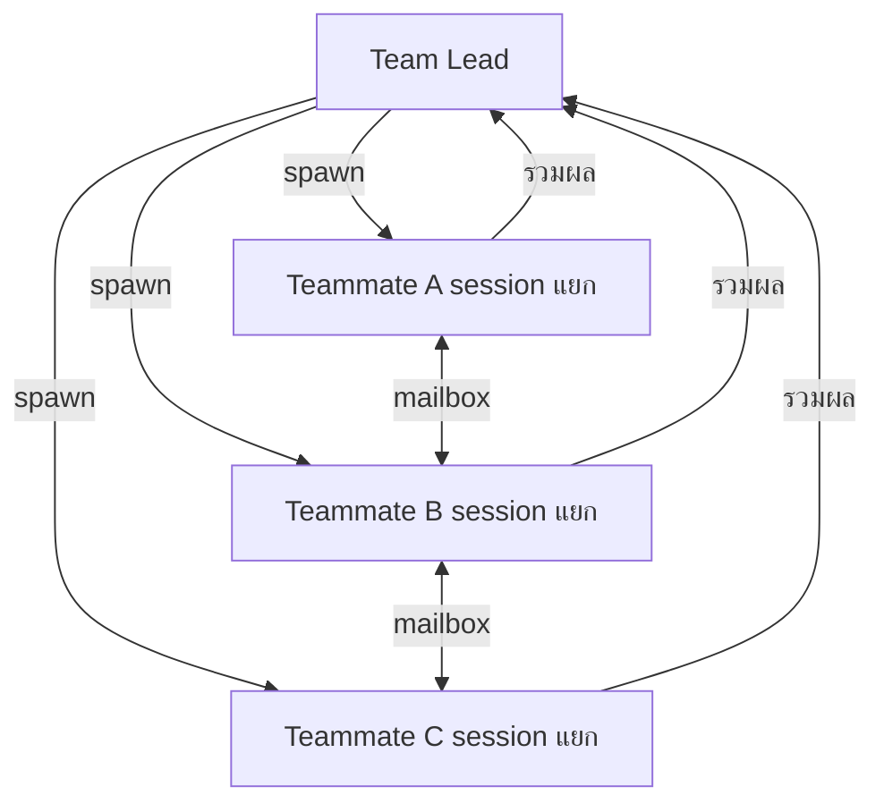
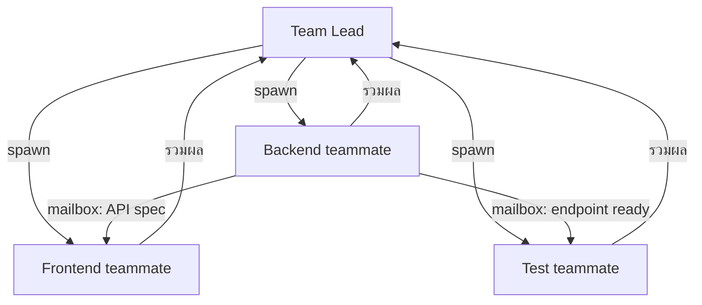

---
tags:
  - claude-code
  - multi-agent
  - patterns
  - use-cases
type: note
status: draft
created: "2026-04-09"
source: "https://code.claude.com/docs/en/agent-teams"
parent_note: "[[Claude Code - Multi-Agent MOC]]"
---

# รูปแบบการใช้งาน Multi-Agent

> ℹ️ Anthropic ไม่ได้ตั้งชื่อ pattern อย่างเป็นทางการ — แต่แนะนำ use cases เหล่านี้จาก official docs

---

## 1) งานที่ต้องการแค่ผลลัพธ์ (ไม่ต้องให้ agents คุยกัน) — ใช้ Subagents

Subagent แต่ละตัวรายงานกลับ main agent เท่านั้น ทุก handoff ผ่าน orchestrator เสมอ ไม่มีการส่งผลตรงระหว่าง subagents

**Sequential (มี dependencies):**

**Parallel (อิสระต่อกัน):**

เหมาะกับ: งาน focused ที่ agents ไม่จำเป็นต้องสื่อสารกันโดยตรง

---

## 2) งานสำรวจ Parallel — ใช้ Agent Teams

Team Lead ส่งงานให้ Teammates ทำพร้อมกัน — Teammates คุยกันได้โดยตรงผ่าน mailbox ไม่ต้องวนกลับ Lead

Use cases จาก official docs:
- **Parallel code review** — แต่ละ Teammate ตรวจคนละมุม (security / performance / test coverage)
- **Competing hypotheses** — debug คนละสมมติฐาน แล้ว debate กัน เพื่อหาต้นเหตุที่แท้จริง
- **New modules/features** — แต่ละ Teammate เป็นเจ้าของ feature ของตัวเอง ไม่ชนกัน

---

## 3) Cross-layer Coordination — ใช้ Agent Teams

**ปัญหา:** feature เดียวแต่ต้องแก้หลาย layer พร้อมกัน — ถ้าทำเองคนเดียว (1 session) ต้องทำทีละ layer ช้า

**วิธีแก้:** แต่ละ Teammate **เป็นเจ้าของ layer ของตัวเอง** ทำงานพร้อมกันได้ — และสื่อสารกันได้ผ่าน mailbox เพื่อ sync เรื่องที่ต้องตรงกัน เช่น รูปแบบ API

**ตัวอย่าง:** เพิ่มฟีเจอร์ "user profile photo upload"

- Frontend แก้ `/components`, `/pages` — ไม่แตะ backend
- Backend แก้ `/api`, `/server` — แจ้ง Frontend ว่า API spec เป็นยังไง
- Test เขียน test สำหรับ endpoint ที่ Backend ประกาศให้

> ℹ️ Official docs: "Cross-layer coordination: changes that span frontend, backend, and tests, **each owned by a different teammate**"

เหมาะกับ: งาน feature ขนาดกลาง-ใหญ่ที่ต้องเปลี่ยนแปลงข้าม layer พร้อมกัน และมีส่วนที่ต้อง sync กัน (เช่น API contract)

---

## พื้นฐานทฤษฎีที่เกี่ยวข้อง

- [[02 AI Systems/AI Agent Fundamentals/07 - รูปแบบ Agent Architectures|Multi-Agent Workflows]] — Sequential / Parallel / Cross-layer patterns ที่ใช้ใน Claude Code ตรงกับ Multi-Agent Workflows ในทฤษฎี
